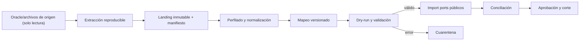
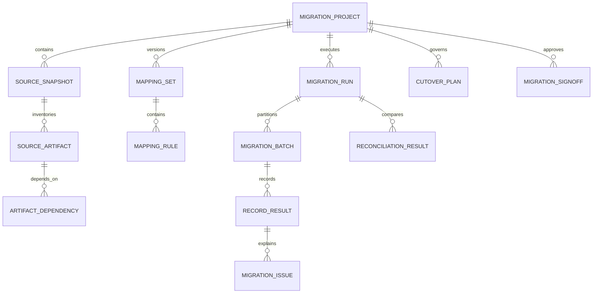

# ADR-0040 — Módulo técnico de migración de legados y perfil Oracle Forms/Reports

- Estado: Propuesto
- Fecha: 2026-08-11
- Decisión de producto: agregar al plan una capacidad reutilizable para migrar
  sistemas legados, con Oracle Forms & Reports como primer origen
- Épica: [Migración de legados](../backlog/epica-migracion-legados-oracle-forms-reports.md)
- Perfil de origen: [Oracle Forms & Reports](../knowledge-base/legacy-migration/oracle-forms-reports-source-profile.md)

## Contexto

Una parte importante de las implantaciones previstas no comienza desde cero:
reemplaza sistemas construidos sobre Oracle Forms, Oracle Reports, PL/SQL y una
base Oracle con años de datos. Tratar cada migración como scripts aislados crea
riesgos de pérdida, duplicados, escrituras directas a esquemas privados,
credenciales dispersas y resultados imposibles de reproducir.

Smart ERP ya exige caracterizar el legado antes de implementar comportamiento y
ADR-0003 prevé adaptadores de lectura o importaciones versionadas. Falta una
capacidad de producto que gobierne el relevamiento, las transformaciones, los
ensayos, la cuarentena, la conciliación y el corte sin convertir al kernel en un
ETL ni acoplar módulos funcionales a Oracle.

Oracle Forms/Reports agrega dos problemas diferentes:

1. recuperar conocimiento desde formularios, menús, bibliotecas PL/SQL y reportes;
2. trasladar datos conservando identidad, historia, saldos y trazabilidad.

Convertir artefactos a XML ayuda a inspeccionarlos, pero no convierte
automáticamente su lógica en dominio Jakarta ni demuestra equivalencia funcional.

## Decisión propuesta

### 1. Identidad y posición

Se planifica `legacy_migration` como **plugin técnico reutilizable y opcional**.

- No recibe un número dentro de los diecinueve plugins ERP funcionales y no
  desplaza `purchasing`, `sales` o los módulos posteriores.
- Eleva el catálogo global planificado de veintinueve a treinta plugins
  reutilizables.
- Se compone en perfiles de descubrimiento, ensayo y corte; no forma parte por
  defecto del runtime operativo permanente.
- Puede desactivarse o retirarse físicamente después de la aceptación. Sus tablas,
  manifiestos y evidencias no se borran automáticamente.
- Oracle Forms & Reports es el primer perfil de origen; el dominio central usa
  conceptos neutrales para admitir otros legados en el futuro.

`Técnico` es inicialmente una clasificación de producto. `PluginKind` aún sólo
admite `FUNCTIONAL` y `CUSTOMIZATION`; LM-00/LM-01 deberán decidir y versionar de
forma compatible `TECHNICAL` antes de crear el descriptor. El plugin no se
presentará como personalización.

### 2. Responsabilidad

`legacy_migration` será dueño de:

- proyectos de migración, alcance, empresas y responsables;
- inventario de fuentes, artefactos, versiones, checksums y dependencias;
- perfiles de datos, calidad, clasificación y riesgos;
- versiones inmutables de mapeos y transformaciones declarativas;
- planes de ejecución, dry-runs, ensayos, lotes y checkpoints;
- resultados por registro/lote, errores, cuarentena y reintentos;
- conciliaciones, métricas, umbrales y diferencias;
- aprobaciones, rechazos, evidencias y firma de aceptación;
- plan de corte, congelamiento, delta, rollback y cierre;
- auditoría, retención y eliminación controlada de material temporal.

No será dueño de clientes, proveedores, artículos, existencias, órdenes,
facturas, saldos contables ni otros datos operativos finales.

### 3. Topología de ejecución

La solución tendrá dos fronteras:

1. el plugin Jakarta administra metadatos, mapeos, estados, permisos, resultados,
   conciliación y UI;
2. un runner externo, reproducible y de vida acotada, inspecciona herramientas o
   bases de origen y genera paquetes de migración firmados/verificados.

El runner no se convierte en un servidor permanente ni se ejecuta dentro del WAR.
Sus fuentes pueden vivir en un módulo Maven o herramienta gobernada del proyecto,
pero sus runtimes, drivers y binarios validados se aprovisionan bajo `.tools/` o
en una imagen autorizada. No usa Java, Python, Oracle Client u otras toolchains
globales del equipo como sustituto.

Oracle Forms/Reports y drivers propietarios no se redistribuyen en el producto sin
licencia. El cliente aporta las herramientas compatibles o entrega exportaciones
portables. Origen, versión, licencia, checksum y resultado quedan en el manifiesto.

### 4. Perfil Oracle Forms & Reports

El primer perfil acepta, cuando estén autorizados:

- `.fmb`, `.mmb` y `.olb` convertidos a XML mediante `Forms2XML`;
- `.pll`, `.pld`, PL/SQL y logs de conversión/migración;
- `.rdf`/`.rex` convertidos a XML mediante `rwconverter`;
- inventario autorizado de esquemas, tablas, vistas, sinónimos, secuencias,
  constraints, triggers, paquetes, funciones, procedimientos y grants;
- exportaciones de datos con manifiesto o extracción Oracle de solo lectura;
- capturas, recorridos y especímenes de reportes para caracterización.

La aplicación no transpila PL/SQL a Java ni recrea automáticamente Forms como
JSF. Clasifica comportamiento, dependencias, reglas y accesos a datos para crear
requisitos, decisiones y pruebas. El reemplazo productivo se implementa en el
plugin funcional propietario.

### 5. Pipeline de datos

Reglas:

- la fuente es siempre de solo lectura;
- cada snapshot, paquete, archivo y lote conserva identidad y SHA-256;
- charset, NLS, zona horaria, escala, redondeo y corte temporal son explícitos;
- landing/raw es inmutable; todo mapeo nuevo crea otra versión;
- dry-run no modifica datos operativos;
- ejecutar/reanudar es idempotente por empresa, proyecto, snapshot, entidad y
  clave de origen;
- un registro inválido va a cuarentena con código, causa y tratamiento; no se
  corrige silenciosamente;
- la misma entrada y versión de mapeo producen el mismo resultado normalizado;
- ningún dato se considera migrado hasta conciliar y aceptar su resultado.

### 6. Frontera con plugins funcionales

`legacy_migration` no escribe tablas privadas ni importa entidades internas.

- Cada plugin funcional dueño de datos expone, cuando la migración lo requiere,
  comandos públicos tipados de importación o alta controlada.
- El contrato valida reglas vigentes, empresa, permisos técnicos, idempotencia,
  referencia de origen y versión.
- El plugin funcional conserva `sourceSystem`, `sourceRecordKey`, lote/checksum o
  referencia equivalente suficiente para deduplicar y auditar.
- `legacy_migration` puede depender opcionalmente de APIs públicas de destinos
  presentes; la ausencia de un destino deja el mapeo no ejecutable y visible.
- No se creará un DTO universal de negocio, EAV global ni `GenericImportService`
  dentro del kernel.
- Las referencias entre registros se resuelven por claves de origen e IDs públicos
  retornados, respetando el grafo de dependencias.

Los adaptadores por destino pertenecen al módulo técnico o a un módulo de
integración que depende de la API pública del destino. El plugin funcional no
depende de la implementación de migración y continúa operando cuando ésta se
retira.

### 7. Datos y persistencia

El esquema previsto es `plg_legacy_migration`. Conserva metadatos y evidencia, no
una copia operativa indefinida de toda la base Oracle.

Las entidades físicas, columnas, tipos y retención se deciden en la historia de
persistencia. Datos raw grandes o sensibles se mantienen en storage cifrado y
controlado, referenciado por URI opaca/checksum; nunca en Git ni logs. Los
resultados detallados pueden purgarse sólo mediante política, doble autorización,
respaldo de evidencia y alcance exacto.

### 8. Seguridad y privacidad

- usuario Oracle de mínimo privilegio y sólo lectura;
- no DDL, DML, desactivación de triggers ni cambios NLS en origen;
- secretos inyectados externamente, rotatorios y nunca persistidos en manifiestos;
- TLS/wallet cuando el origen lo exija;
- allowlist de esquemas, tablas, archivos, consultas y tamaños;
- escaneo de artefactos por credenciales/connect strings antes de conservarlos;
- cifrado en tránsito y reposo para paquetes y staging;
- clasificación de datos personales, financieros y sensibles;
- minimización, enmascarado de entornos no productivos y retención por proyecto;
- separación de permisos entre mapear, ejecutar, aprobar y cerrar;
- auditoría sin payloads completos ni datos personales innecesarios;
- corte y rollback nunca eliminan o modifican el origen.

### 9. Corte, delta y rollback

No se adopta dual-write por defecto.

1. inventario y perfilado;
2. ensayo completo reproducible;
3. conciliación y corrección de mapeos;
4. respaldo verificado del destino;
5. congelamiento funcional del origen o punto consistente aprobado;
6. carga base/delta con checkpoint;
7. conciliación final y aprobación;
8. habilitación de Smart ERP;
9. ventana de observación y cierre.

Rollback significa detener el corte, conservar evidencias y restaurar el destino
desde un respaldo probado o volver al origen todavía intacto según el plan. No
significa borrar masivamente registros mediante IDs calculados ni escribir datos
de vuelta a Oracle. Una estrategia de coexistencia o delta por SCN requiere una
decisión, capacidad de origen y pruebas específicas.

### 10. Interfaz

El plugin aportará pantallas Jakarta Faces/Material Design 3 responsive para:

- Proyectos;
- Fuentes y artefactos;
- Dependencias y cobertura Forms/Reports;
- Perfil de datos;
- Mapeos;
- Ensayos y ejecuciones;
- Cuarentena y errores;
- Conciliación;
- Corte y aprobaciones;
- Auditoría y retención.

No se mostrarán contraseñas, connect strings, payloads completos o datos sensibles
por defecto. Listas grandes se buscan/paginan en servidor y las exportaciones
requieren permiso y trazabilidad.

### 11. Posición respecto de la versión comercializable

El módulo no interrumpe la caracterización actual de `purchasing`. Su fundación se
planifica después de estabilizar los primeros contratos públicos de importación y
antes de aceptar una versión comercializable que prometa reemplazo de Oracle.

Una candidata ofrecida para migrar Oracle Forms & Reports debe demostrar:

- descubrimiento reproducible de artefactos;
- al menos un ensayo completo con datos ficticios/sanitizados;
- adaptadores para todos los módulos funcionales incluidos en esa oferta;
- cero diferencias críticas no aceptadas;
- idempotencia, reanudación, cuarentena y rollback;
- firma de aceptación y retención;
- pruebas de seguridad y rendimiento sobre volumen representativo.

Una edición greenfield puede omitir físicamente `legacy_migration`, pero no puede
publicitar capacidad de migración Oracle sin superar esos gates.

## Historias obligatorias propuestas

| Historia | Resultado |
|---|---|
| LM-00 | decisiones LM-D01 a LM-D12, licencias, threat model, retención, RACI, SLA de corte y criterio de aceptación |
| LM-01 | `PluginKind` si aplica, `legacy-migration-api`, dominio neutral, descriptor y perfil físico opcional |
| LM-02 | esquema privado, migraciones, repositorios, cifrado/referencias a storage y auditoría |
| LM-03 | runner e inventario Oracle Forms/Reports/PLSQL con manifiestos y grafo |
| LM-04 | extracción portable y conector Oracle read-only, perfilado y checkpoints |
| LM-05 | mapeos versionados, normalización, dry-run, cuarentena y reanudación |
| LM-06 | adaptadores tipados a plugins funcionales incluidos en la candidata |
| LM-07 | conciliación, métricas, umbrales, signoff, cutover y rollback |
| LM-08 | UI responsive, manuales, runbooks y demo de migración |
| LM-09 | matriz acumulada, volumen, seguridad, recuperación y gate comercializable |

## Decisiones que LM-00 debe confirmar

- **LM-D01:** primer alcance de versiones Oracle y formatos aceptados;
- **LM-D02:** paquete portable recomendado y condiciones del conector directo;
- **LM-D03:** clasificación `TECHNICAL` y compatibilidad de `PluginKind`;
- **LM-D04:** storage de raw/staging, cifrado, ubicación y límites;
- **LM-D05:** retención, legal hold y destrucción controlada;
- **LM-D06:** contratos de importación por plugin y procedencia mínima;
- **LM-D07:** reglas de identidad, deduplicación, merge y conflictos;
- **LM-D08:** estrategia base/delta, congelamiento y downtime;
- **LM-D09:** conciliaciones y umbrales por tipo de dato;
- **LM-D10:** rollback, respaldos y autoridad para el corte;
- **LM-D11:** datos personales, enmascarado y acceso de soporte;
- **LM-D12:** módulos incluidos en la primera demostración comercializable.

## Alternativas descartadas

### Scripts SQL directos por cliente

Se descartan como estrategia de producto porque escriben esquemas privados,
eluden invariantes, no son idempotentes por contrato y producen evidencia
inconsistente. Pueden existir utilidades de extracción controladas, nunca cargas
directas a tablas operativas.

### Transpilar Forms/PLSQL automáticamente a JSF/Java

Se descarta porque traslada UI, transacción, permisos y acoplamiento del legado sin
rediseñar dominio. El análisis puede asistir inventario y backlog, pero cada
capacidad se implementa con contratos y pruebas propias.

### Empaquetar Oracle Client y driver dentro del WAR

Se descarta por superficie, licencias, credenciales y dependencia permanente. El
runner externo o el paquete portable aíslan la extracción.

### Un staging EAV/JSON como fuente operativa

Se descarta. El raw puede conservarse temporalmente para reproducibilidad, pero
los datos finales ingresan por contratos tipados y el staging no reemplaza los
modelos de dominio.

### Mantener el plugin siempre activo

Se descarta por exposición innecesaria. Después del cierre se conserva evidencia,
pero se deshabilitan fuentes, credenciales, runners y menús operativos o se retira
el JAR mediante reconstrucción.

## Consecuencias

- Cada plugin funcional que prometa migración debe ofrecer un import contract y
  trazabilidad de procedencia antes de la candidata comercializable.
- La implantación necesita inventario, ensayos y reconciliación presupuestados,
  no sólo una ventana de carga final.
- Oracle Forms/Reports se convierte en una fuente inspeccionable y auditable, no
  en dependencia del runtime ERP.
- Las herramientas propietarias permanecen bajo control/licencia del cliente o de
  un entorno aprobado.
- El catálogo global planificado pasa a treinta reutilizables sin renumerar ERP
  1–19.
- Este ADR no crea código, driver, conexión, tabla ni permiso; LM-00 debe confirmar
  sus decisiones antes de implementación.

## Referencias

- [ADR-0002 — Arquitectura de plugins](0002-arquitectura-plugins.md)
- [ADR-0003 — Persistencia y migraciones](0003-persistencia-migraciones.md)
- [ADR-0011 — Roadmap de plugins](0011-roadmap-dependencias-plugins-productivos.md)
- [ADR-0012 — Composición física y migraciones](0012-composicion-unica-y-migraciones-de-plugins.md)
- [Perfil Oracle Forms & Reports](../knowledge-base/legacy-migration/oracle-forms-reports-source-profile.md)
- [Oracle Forms Migration Assistant](https://docs.oracle.com/en/middleware/developer-tools/forms/12.2.1.19/upgrade-forms/using-oracle-forms-migration-assistant.html)
- [Forms2XML](https://docs.oracle.com/en/database/oracle/application-express/20.1/aemig/Converting_FormModules_ObjectLibraries_MenuModules_to_XML.html)
- [`rwconverter`](https://docs.oracle.com/html/E24479_01/pbr_cla002.htm)
