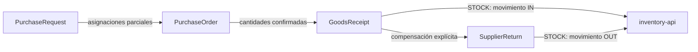

# ADR-0041 — Modelo de `purchasing` y contratos públicos

- Estado: Aceptado
- Fecha: 2026-08-11
- Historia: [J11-S9-02](../sprints/sprint-09/J11-S9-02-dominio-contratos-purchasing.md)
- Decisiones de producto: PU-D01 a PU-D10 aceptadas sin cambios

## Contexto

La caracterización de Compras encontró que el legado superpone solicitudes,
órdenes, comprobantes, pagos y recepción de stock. También modifica cantidades
confirmadas, mezcla estados financieros y mantiene relaciones JPA directas con
varios dominios. Copiar ese diseño volvería a introducir el acoplamiento que la
arquitectura de plugins busca eliminar.

El nuevo plugin necesita estabilizar su contrato y dominio antes de definir SQL,
JPA, aplicación o interfaz. Debe además ofrecer una frontera controlada para una
futura migración de solicitudes u órdenes abiertas, sin convertir esa frontera en
un importador genérico ni permitir escritura a tablas privadas.

## Decisión

### 1. Módulos y versión

Se crean dos módulos físicos:

- `purchasing-api@1.1.0`: contratos Java puros e identidades opacas;
- `purchasing@1.1.0`: descriptor CDI/SPI y dominio privado neutral.

La versión 1.1 fue adoptada por ADR-0043 antes de componer o validar el plugin:
agrega la moneda esperada necesaria para importar precios de solicitudes.

El descriptor es `FUNCTIONAL` y declara como requeridos los plugins 1.x
`business_partners`, `commercial_catalog`, `reference_data` e `inventory`. En
este corte publica capacidades, pero no permisos, menús, pantallas, migraciones o
composición física.

### 2. Propiedad y ciclos separados

`purchasing` posee cuatro agregados:

- la solicitud puede existir sin proveedor;
- la orden exige snapshot de proveedor y moneda;
- la recepción y la devolución son registros propios append-only;
- factura, deuda, pago, retención, costo y asiento permanecen fuera;
- cada agregado conserva empresa, identidad, versión y snapshot suficiente.

Estados:

- solicitud: `DRAFT → SUBMITTED → APPROVED/REJECTED`, con `CANCELLED` desde un
  estado no terminal;
- orden: `DRAFT → ISSUED → CLOSED`, con cancelación sólo antes de recibir;
- recepción: `DRAFT → CONFIRMED`;
- devolución: `DRAFT → CONFIRMED`.

Los estados de pago o factura no aparecen en estos ciclos.

### 3. Solicitud y aprobación

Una solicitud contiene una o más líneas de catálogo o libres, clasificadas
`STOCK`, `NON_STOCK` o `SERVICE`. `STOCK` siempre exige identidad de catálogo.
Puede conservar un precio esperado con su snapshot de moneda, pero no calcula
impuestos fiscales.

El solicitante puede editar y enviar su borrador. Una aprobación o rechazo exige
otro usuario; V1 no incorpora un motor configurable de workflow. Los rechazos y
cancelaciones conservan actor, instante y motivo.

### 4. Orden y cumplimiento

Una orden puede consolidar asignaciones parciales de varias solicitudes. Cada
asignación identifica solicitud, línea y cantidad. La cantidad no asignada se
considera compra directa y exige justificación.

La cantidad ordenada y el precio unitario no se reescriben después de emitir. Por
línea se acumulan de forma separada:

`pendiente = ordenado - recibido + devuelto - faltante_cerrado`

- no se admite sobre-recepción;
- una devolución no supera recibido menos devuelto;
- una devolución reabre el pendiente sin editar la recepción;
- cerrar faltantes exige cubrir exactamente todo pendiente y registrar motivo;
- versión esperada protege cada mutación contra concurrencia obsoleta.

### 5. Inventario

Las líneas `STOCK` de recepción exigen depósito y ubicación. Confirmarlas requiere
una referencia de movimiento de entrada ya validada por `InventoryMovements`.
Las devoluciones `STOCK` exigen la ubicación de origen y una referencia de salida.
Líneas `NON_STOCK` y `SERVICE` no generan movimientos.

J11-S9-04 implementa la frontera JTA que actualiza el agregado y llama inventario
de forma atómica e idempotente. Este ADR no autoriza importar clases internas ni
leer/escribir `plg_inventory`.

### 6. Contrato público de migración

`PurchasingImports` expone dos comandos:

- `importOpenRequest` para `DRAFT`, `SUBMITTED` o `APPROVED`;
- `importOpenOrder` para `DRAFT` o `ISSUED`.

Ambos reciben `CompanyId`, procedencia (`sourceSystem`, `sourceRecordKey` y
checksum opcional), claves de línea únicas y datos tipados. La implementación
futura debe deduplicar por empresa y procedencia. No se aceptan documentos
terminales, recepciones/devoluciones históricas, comprobantes, pagos o SQL directo.

`legacy_migration` podrá consumir esta API; `purchasing` nunca dependerá de la
implementación del migrador.

### 7. Fronteras técnicas

- `purchasing-api` sólo depende de Java y `CompanyId`;
- el dominio sólo depende de Java, kernel API y APIs públicas de sus cuatro
  predecesores;
- no usa Jakarta, `javax`, JPA, JDBC, Hibernate, JSF o PrimeFaces;
- no hay relaciones JPA, SQL, entidades o DTO internos entre plugins;
- no se agrega outbox hasta existir un productor y consumidor aprobados.

## Consecuencias

- J11-S9-03 puede diseñar persistencia desde snapshots y versiones explícitas.
- J11-S9-04 implementa permisos, auditoría, idempotencia y atomicidad JTA con
  inventario según ADR-0043.
- El adaptador de migración podrá cargar sólo documentos abiertos mediante API.
- La composición ejecutable sigue sin incluir `purchasing` hasta J11-S9-06.
- Las pruebas están escritas pero permanecen sin ejecutar hasta el gate acumulado
  autorizado; el corte no se declara verde.

## Alternativas descartadas

- copiar entidades/controladores del legado;
- incluir pago, factura o contabilidad como estados de orden;
- editar recepción u orden confirmada;
- permitir sobre-recepción configurable desde el primer corte;
- importar directamente tablas privadas;
- DTO universal o EAV para migración;
- eventos sin consumidor real.

## Referencias

- [Caracterización de Compras](../knowledge-base/purchasing/legacy-characterization.md)
- [Épica de Compras](../backlog/epica-compras.md)
- [ADR-0002 — Arquitectura de plugins](0002-arquitectura-plugins.md)
- [ADR-0023 — Modelo de inventario](0023-modelo-inventory-y-contratos-publicos.md)
- [ADR-0040 — Migración de legados](0040-modulo-tecnico-migracion-legados-oracle-forms-reports.md)
