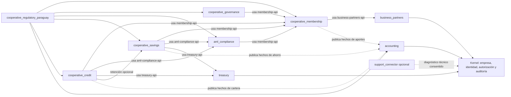

# Límites y dependencias de la familia cooperativa

- Estado: arquitectura planificada; sin módulos ejecutables
- Fecha: 2026-08-04
- ADR rector: [ADR-0037](../adr/0037-familia-cooperativa-ahorro-credito-paraguay.md)
- Historia de gobierno: [COOP-00](../backlog/COOP-00-gobierno-alcance-matriz-normativa.md)

## Objetivo

Hacer explícito el grafo futuro de la composición cooperativa y los flujos
monetarios sin convertir contratos públicos en accesos a tablas ni crear ciclos.

## Vista de composición

Las líneas continuas apuntan desde el consumidor hacia el contrato que usa. Las
líneas punteadas representan flujo de eventos o integración técnica y no una
dependencia runtime inversa: `accounting` consume hechos publicados sin que
membresía, ahorros o créditos importen su implementación.

## Dependencias de descriptor candidatas

| Plugin | Requeridas | Opcionales | Prohibidas |
|---|---|---|---|
| `cooperative_membership` | `business_partners` | puerto de liquidación de aportes | gobierno, ahorro, crédito, regulación |
| `cooperative_governance` | `cooperative_membership` | ninguna inicial | kernel-internal, ahorro, crédito |
| `aml_compliance` | `cooperative_membership` | proveedores mediante adaptadores | ahorro/credito internos, regulación-internal |
| `cooperative_savings` | membresía, LA/FT, tesorería | ninguna inicial | catálogo, cuentas por cobrar, contabilidad-internal |
| `cooperative_credit` | membresía, LA/FT, tesorería | API pública de ahorros para retenciones | ventas, cuentas por cobrar, contabilidad-internal |
| `cooperative_regulatory_paraguay` | membresía, gobierno, LA/FT, ahorros, créditos y API contable | tesorería si un reporte lo demuestra | tablas o entidades de cualquiera |

Los nombres de módulos API y rangos SemVer se congelarán en cada historia de
diseño. Una dependencia Maven técnica no reemplaza la dependencia funcional del
descriptor.

## Fronteras de datos

| Fuente de verdad | Identidad pública | Datos publicados mínimos |
|---|---|---|
| `business_partners` | `BusinessPartnerId` | tipo y referencia visible autorizada |
| `cooperative_membership` | `MemberId` | estado/vigencia y snapshot aprobado |
| `cooperative_governance` | `GovernanceActId` | resolución, fecha y estado de cumplimiento |
| `aml_compliance` | `ComplianceCaseId` | decisión, vigencia y restricciones tipadas |
| `cooperative_savings` | `SavingsAccountId` | referencia, estado y proyecciones autorizadas |
| `cooperative_credit` | `LoanId` | referencia, estado y proyecciones autorizadas |
| `treasury` | `SettlementId` | resultado de liquidación y conciliación |
| `accounting` | `AccountingEntryId` | referencia de asiento/período y proyección de reporte |
| regulación Paraguay | `RegulatorySubmissionId` | tipo, período, versión, checksum y estado |

No se publican entidades JPA, repositorios, nombres de tablas, DTO de UI ni
colecciones completas de movimientos.

## Flujo candidato de depósito

1. `cooperative_savings` valida empresa, socio, cuenta, estado, producto, límite,
   fecha valor, permiso e idempotencia.
2. Consulta una `DueDiligenceDecision` vigente y aplica restricciones tipadas.
3. Solicita a tesorería una liquidación con identidad/correlación estable.
4. En la misma transacción JTA, si el contrato final lo permite, o mediante saga
   visible, registra la entrada append-only del submayor.
5. Publica un hecho contable idempotente y una observación LA/FT mínima.
6. Cierre y conciliación prueban submayor contra liquidaciones y mayor.
7. Regulación consume una proyección inmutable; nunca recalcula el saldo privado.

Una falla parcial queda `PENDING_RECONCILIATION` o estado equivalente aprobado;
no se presenta como depósito confirmado ni se corrige editando el saldo.

## Flujo candidato de desembolso y cobranza

1. `cooperative_credit` valida solicitud aprobada, condiciones, firma/evidencia,
   decisión LA/FT, límites y clave idempotente.
2. Si existe garantía de ahorro, solicita una retención a la API pública de
   `cooperative_savings`; no actualiza su libro.
3. Solicita el desembolso a tesorería y registra el asiento del submayor de
   cartera con capital/condiciones versionados.
4. Pagos posteriores se imputan por una regla versionada a capital, interés,
   cargos y mora.
5. Cada efecto publica hechos contables y observaciones LA/FT idempotentes.
6. Regulación calcula clasificación/previsión desde snapshots y proyecciones
   aprobadas, no desde joins privados.

`accounts_receivable` no interviene. Una factura comercial y un préstamo pueden
pertenecer al mismo socio, pero conservan identidades, contratos y libros
distintos.

## Política paraguaya sin ciclo

`aml_compliance` posee el motor, las decisiones y los paquetes de política que
aplicó. `cooperative_regulatory_paraguay` puede registrar un paquete paraguayo a
través de una API pública y consumir después una proyección pública de resultados.
La dependencia es siempre del adaptador nacional hacia `aml-compliance-api`; el
motor neutral no importa el adaptador.

De forma equivalente, el adaptador nacional entrega mapeos/versiones al contrato
de configuración de `accounting` y consume proyecciones de reporte. No mantiene un
segundo plan de cuentas ni escribe el mayor.

## Perfiles físicos que deberán probarse

| Perfil | Contenido | Objetivo |
|---|---|---|
| `coop-governance-demo` | participantes + membresía + gobierno | administrar socios/órganos sin dinero |
| `coop-savings-pilot` | anterior + LA/FT + tesorería + ahorro + contabilidad | primer circuito de ahorro reconciliado |
| `coop-credit-pilot` | anterior + crédito | desembolso/cobranza con garantías opcionales |
| `coop-paraguay-complete` | familia completa + regulación Paraguay | reportes y artefactos reproducibles |
| `coop-paraguay-supported` | completo + `support_connector` | soporte técnico opcional sin datos financieros |

Son nombres conceptuales. No se agregan perfiles al POM hasta la historia de
composición correspondiente.

## Gates arquitectónicos

- grafo acíclico presente/ausente y rangos compatibles;
- `plugin-api` y todas las API públicas sin Jakarta;
- cero JPA, repositorios o SQL cruzados;
- balances derivados sólo de entradas append-only;
- idempotencia de extremo a extremo y estados de reconciliación visibles;
- contabilidad consume hechos; no dirige la operación;
- regulación consume proyecciones versionadas; no reescribe fuentes;
- ausencia/inactividad de un plugin elimina sus aportes sin borrar datos;
- seguridad negativa por empresa, actor, permiso, objeto y segregación;
- pruebas físicas base, parcial, completa y plugin retirado.
