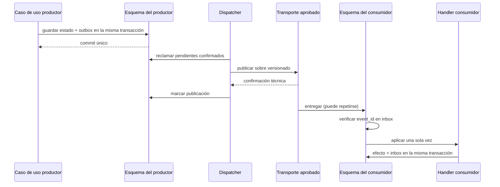

# Contrato operativo de eventos de integración y outbox

- Versión: 1
- Fecha: 2026-07-29
- Decisión: [ADR-0013](../adr/0013-eventos-integracion-outbox-por-plugin.md)
- Estado: contrato obligatorio; implementación diferida hasta el primer evento real

## Tres conceptos diferentes

| Concepto | Alcance | Persistencia/consumo |
|---|---|---|
| evento de dominio | interno del agregado/plugin | no es API pública ni se transporta automáticamente |
| evento de integración | hecho público entre plugins o hacia una integración | contrato versionado, outbox e idempotencia |
| evento de auditoría | evidencia de actor, operación, decisión y resultado | append-only; no dirige procesos de negocio |

## Sobre mínimo

| Campo | Regla |
|---|---|
| `event_id` | UUID único; clave de deduplicación, nunca se reutiliza |
| `event_type` | `<plugin>.<subject>.<past_fact>`, estable y documentado |
| `event_version` | SemVer; adiciones compatibles y cambios mayores explícitos |
| `producer_plugin_id` | `PluginId` físico propietario del contrato |
| `company_id` | UUID canónico; obligatorio para eventos ERP empresariales |
| `subject_type` | nombre público del sujeto o proceso |
| `subject_id` | identificador público opaco, no clave JPA expuesta |
| `subject_version` | entero monotónico para detectar duplicados, huecos y desorden |
| `occurred_at` | `Instant` UTC definido por el servidor |
| `correlation_id` | correlación técnica segura y acotada |
| `causation_event_id` | UUID opcional del evento que causó el hecho |
| `payload` | objeto tipado del `<plugin>-api`, mínimo y versionado |

Ejemplo conceptual, no un evento de negocio ya aprobado:

```json
{
  "event_id": "9e2a66f8-669d-4a25-a23d-27c179143785",
  "event_type": "producer.subject.fact_recorded",
  "event_version": "1.0.0",
  "producer_plugin_id": "producer",
  "company_id": "123e4567-e89b-42d3-a456-426614174000",
  "subject_type": "subject",
  "subject_id": "opaque-id",
  "subject_version": 1,
  "occurred_at": "2026-07-29T12:00:00Z",
  "correlation_id": "request-001",
  "causation_event_id": null,
  "payload": {}
}
```

El ejemplo sólo ilustra el sobre. No autoriza un tipo, tabla o payload genérico y
no debe copiarse como evento productivo.

## Flujo obligatorio



Una caída entre publicación y marca produce una nueva entrega. Ese duplicado es
normal; por eso el consumidor no puede depender de “exactly once”.

## Propiedad física mínima

La migración del productor crea su outbox en `plg_<producer>` con identidad,
metadatos, payload, estado, intentos, próxima ejecución, timestamps de creación y
publicación y último código de error. El consumidor persistente crea su inbox o
registro de deduplicación en `plg_<consumer>`.

Los nombres y tipos físicos se fijarán con el evento real, pero deben conservar:

- unicidad de `event_id`;
- checks para versión, estados, intentos y timestamps;
- índice de reclamación por estado/próximo intento/creación;
- índice de orden por sujeto cuando el caso lo exija;
- payload y errores fuera de logs;
- migraciones append-only e inmutables después de aplicarse.

## Checklist previo a implementar un evento

- [ ] productor, consumidor y necesidad asíncrona identificados;
- [ ] respuesta síncrona descartada con motivo;
- [ ] tipo en pasado y significado estable;
- [ ] payload público tipado y mínimo;
- [ ] compatibilidad y versión documentadas;
- [ ] escritura estado + outbox probada con commit y rollback;
- [ ] duplicado y concurrencia probados;
- [ ] orden requerido acotado por sujeto, no global;
- [ ] política de plugin inactivo/ausente y bootstrap definida;
- [ ] reintentos, backoff, cuarentena, replay y retención definidos;
- [ ] métricas, alertas y runbook de recuperación disponibles;
- [ ] transporte, versión, licencia y secretos aprobados;
- [ ] ninguna tabla, entidad o DTO privado cruza el límite;
- [ ] datos personales y sensibles minimizados;
- [ ] desactivación, retirada y recreación conservan datos pendientes.

## Estado del primer plugin

`business_partners` todavía no tiene casos de uso caracterizados ni consumidores
asíncronos aprobados. Por tanto, no crea outbox en su plantilla ni publica eventos
preventivos. Su Sprint deberá diseñar primero contratos de consulta/comando
síncronos estrictamente necesarios. Cuando aparezca un consumidor que necesite
propagación desacoplada, se abre la historia de materialización descrita por
ADR-0013 antes de implementar ese intercambio.
