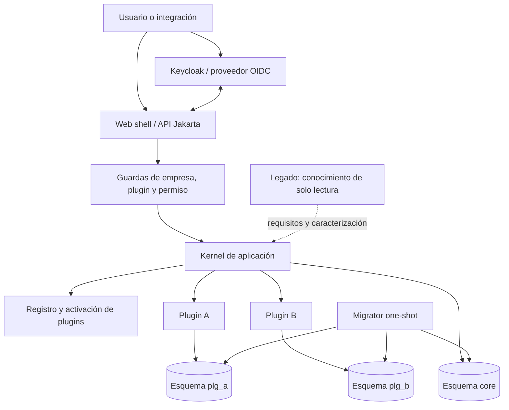
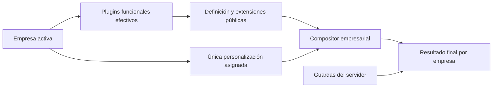

# Vista general de arquitectura

- Versión: 52
- Fecha: 2026-08-05
- Estado: J11-S8-C07 implementado y validado; publicaciones completas, unidad menor opcional, búsqueda paginada, contrato/renderer, ciclos empresariales, cuatro clases de definiciones de socios, revisión e historial append-only y asignación versionada de familias a artículos; gates técnicos, recongelación y PDF verdes; producto decidió `NO` crear instalador para este baseline; G7 independiente pendiente
- Historia: `J11-S1-07`, `J11-S2-01` a `J11-S2-08`, `J11-S3-00` a `J11-S3-08`, `J11-S4-00` a `J11-S4-08`, `J11-S5-01` a `J11-S5-04`, `J11-S6-01` a `J11-S6-07`, `J11-S7-01` a `J11-S7-07`, `J11-S8-01` a `J11-S8-08` y `J11-S8-C01` a `J11-S8-C07`; ADR-0009 a ADR-0039

## Objetivo

Definir la forma inicial de Smart ERP y los límites que deben permanecer ciertos mientras se construye el sistema.

**Smart ERP** es la marca vigente. Los identificadores técnicos que contienen
`logixone` permanecen estables por compatibilidad según ADR-0039.

## Principios

1. Monolito modular antes que distribución prematura.
2. Plugins físicamente componibles y lógicamente activables por empresa.
3. Contratos neutrales; Jakarta y WildFly permanecen en adaptadores.
4. Propiedad exclusiva de código y datos por dominio.
5. Infraestructura reproducible y promoción del mismo digest.
6. Seguridad y contexto empresarial verificados en el servidor.
7. Ninguna historia se declara terminada sin sus pruebas y evidencia; las excepciones de Sprint 3/4 solo permiten estados implementados pendientes hasta el gate acumulado correspondiente.
8. El legado aporta conocimiento, no dependencias de ejecución.
9. Cada empresa tiene una personalización propia, obligatoria y aplicada como última capa mediante contratos públicos.

## Vista de contenedores y componentes



El diagrama representa límites de propiedad. Que los esquemas compartan inicialmente una instancia PostgreSQL no autoriza acceso cruzado.

## Extensión aceptada para Sprint 2

La siguiente ampliación fue aceptada en ADR-0005; su implementación se realiza secuencialmente desde `J11-S2-02`:



- `PluginDescriptor` distingue `FUNCTIONAL` de `CUSTOMIZATION`.
- `core.company` conserva un `customization_plugin_id` obligatorio y único.
- una personalización nunca se activa por el flujo común ni se comparte entre empresas;
- todos los plugins funcionales se ordenan antes que la personalización asignada;
- un contrato neutral de pantalla declara identificadores, versión, slots, propiedades permitidas e invariantes;
- el overlay empresarial se aplica al final y no puede importar internos ni relajar guardas del servidor;
- una personalización empresarial ausente o incompatible pone en cuarentena solo a esa empresa;
- un catálogo físico inválido, base inaccesible o migración pendiente sí mantiene readiness global en `DOWN`.

El alta de una empresa requiere desplegar primero una imagen que contenga su JAR de personalización, porque ADR-0002 mantiene la composición física sin carga dinámica.

## Estructura Maven objetivo

```text
smart-erp/
├── pom.xml
├── .mvn/ y Maven Wrapper
├── platform-bom/
├── plugin-api/
├── tools/
│   └── plugin-scaffold/
├── kernel-api/
├── kernel-domain/
├── kernel-application/
├── kernel-infrastructure-jakarta/
├── web-shell/
├── migrator/
├── plugins/
│   ├── reference-data-api/
│   ├── reference-data/
│   ├── business-partners-api/
│   ├── business-partners/
│   ├── commercial-catalog-api/
│   ├── commercial-catalog/
│   ├── inventory-api/
│   ├── inventory/
│   ├── reference-plugin/
│   ├── reference-customization-a/
│   └── reference-customization-b/
├── distribution/
│   ├── logixone-plugin-set/
│   └── logixone-war/
├── tests/
│   ├── architecture-tests/
│   ├── integration-tests/
│   └── e2e-tests/
├── infra/
│   ├── docker/
│   └── compose/
└── docs/
```

La estructura de módulos y sus POM quedó materializada en `J11-S1-02`. `J11-S1-04` implementó contratos y validación; `J11-S1-05` agregó el registro de aplicación, el adaptador CDI y el plugin de referencia; `J11-S1-06` incorporó los endpoints semánticos de salud. `J11-S2-02` agregó el modelo neutral de empresa, activación y personalización; `J11-S2-04` materializó persistencia JPA/JTA; `J11-S2-05` conectó casos de uso transaccionales, auditoría y la guarda que consume contexto empresarial confiable; `J11-S2-06` incorporó la proyección inmutable de capacidades, permisos y menús efectivos; y `J11-S2-07` implementó definiciones, overlays y composición atómica de pantallas. La resolución del contexto por identidad y la UI se implementan en historias posteriores.

`kernel-api` contendrá contratos transversales neutrales que los plugins pueden consumir, por ejemplo contexto de empresa, autorización, auditoría y publicación de eventos. No expondrá implementaciones del kernel.

## Responsabilidades y dependencias

| Módulo | Responsabilidad | Puede depender de |
|---|---|---|
| `plugin-api` | SPI técnico, descriptor y contribuciones | Java estándar |
| `plugin-scaffold` | Generador reproducible de módulos neutrales | Java estándar y `plugin-api` |
| `kernel-api` | Puertos transversales públicos para plugins | Java estándar |
| `kernel-domain` | Empresas, activación, compatibilidad y reglas transversales | `plugin-api`, `kernel-api` |
| `kernel-application` | Casos de uso del kernel | APIs y dominio del kernel |
| `kernel-infrastructure-jakarta` | CDI, JPA, seguridad, transacciones y adaptadores WildFly | aplicación, APIs y Jakarta EE `provided` |
| `web-shell` | Navegación, endpoints y composición de UI | contratos de aplicación y Jakarta EE `provided` |
| `<plugin>-api` | Contratos empresariales públicos de un plugin | Java estándar y, si es indispensable, `kernel-api` |
| `<plugin>-impl` | Dominio, casos de uso y adaptadores propios | su API, `plugin-api`, `kernel-api`; Jakarta solo en adaptadores |
| `reference-data-api` | publicaciones, países y monedas públicos `1.1.0` | Java estándar y `CompanyId` |
| `reference-data` | procedencia, políticas empresariales y consulta normativa | su API, `plugin-api`, `kernel-api`; Jakarta sólo en adaptadores CDI/JPA/UI |
| `commercial-catalog-api` | referencias, conversión y cotización públicas `1.0.0` | Java estándar y `CompanyId` |
| `commercial-catalog` | descriptor y dominio privado de ítems/listas | su API, `plugin-api`, `kernel-api`; Jakarta solo en el descriptor CDI |
| `inventory-api` | disponibilidad, movimientos y reservas públicas `1.0.0` | Java estándar y `CompanyId` |
| `inventory` | dominio, aplicación, persistencia y handlers neutrales de depósitos, saldos, movimientos, reservas y conteos | su API, API pública de catálogo, `plugin-api`, `kernel-api`; Jakarta solo en adaptadores CDI/JTA/JPA/UI |
| `logixone-plugin-set` | Selección física única por perfil; sin lógica | plugins seleccionados |
| `migrator` | Descubrimiento y ejecución ordenada de migraciones | aplicación neutral del kernel, plugin set, Flyway y pgJDBC |
| `logixone-war` | Composición física web; no lógica de negocio | kernel, shell y plugin set |

Reglas negativas:

- El kernel no depende de `<plugin>-impl`.
- Un plugin no depende de la implementación de otro.
- Entidades JPA, repositorios y DTO internos no cruzan módulos.
- `plugin-api`, `kernel-api`, dominios y contratos empresariales no dependen de Jakarta.
- La distribución no contiene reglas empresariales.

### Contrato y catálogo de plugins implementados

- `PluginDefinition` es el SPI neutral que expone un `PluginDescriptor`; el adaptador CDI implementado depende de esta interfaz, no al revés.
- `PluginDescriptor` exige `PluginKind.FUNCTIONAL` o `PluginKind.CUSTOMIZATION`; el contrato semántico vigente es `PluginApiVersion.CURRENT = 0.4.3`.
- `PluginId` usa `snake_case` en minúsculas y deriva sin normalización el esquema `plg_<plugin_id>`.
- `SemanticVersion` aplica SemVer 2.0.0 y `VersionRange` representa intervalos `[mínimo inclusivo, máximo exclusivo)`.
- El descriptor copia defensivamente dependencias, capacidades, permisos, menús, migraciones, definiciones de pantalla y overlays.
- `PluginCatalogResolver` devuelve un orden topológico determinista o diagnósticos tipados por duplicados, ausencias, incompatibilidades, autorreferencias, contribuciones inválidas y ciclos.
- Una dependencia opcional ausente es válida; cuando está presente debe ser compatible y participa del orden.
- El catálogo rechaza dependencias de un plugin funcional hacia una personalización y dependencias entre personalizaciones; el orden global ubica todas las personalizaciones después de la topología funcional.
- Los perfiles Maven `with-reference-data`, `with-reference-plugin` y
  `with-screen-customization-plugins` viven únicamente en `logixone-plugin-set` y
  componen la fundación normativa o los fixtures para el
  WAR y el migrador al mismo tiempo. El build predeterminado no incorpora
  implementaciones de plugins.
- `PluginRegistry` conserva únicamente el catálogo completo validado y ofrece consulta por identidad sin depender de Jakarta.
- `CdiPluginCatalog`, dentro de infraestructura, descubre `Instance<PluginDefinition>` al inicializar `ApplicationScoped`; una distribución sin plugins produce un registro vacío válido.
- `ReferencePluginDefinition` es el bean de prueba `reference_plugin@1.0.0`; aporta
  capacidad, permiso, menú, pantalla neutral y una migración fixture sin lógica
  empresarial productiva.
- Cada JAR desplegable registra la misma `PluginDefinition` en CDI y en
  `META-INF/services`; el SPI de Java permite al migrador descubrirla sin iniciar
  Jakarta ni duplicar el descriptor.
- El arranque registra `event=plugin_catalog_initialized`, cantidad e identidades. Un catálogo inválido emite un evento de fallo sin secretos y detiene el bootstrap.

### Migraciones de plugins implementadas en J11-S5-01

- `MigrationPlan` valida el catálogo físico mediante `PluginRegistry` antes de
  construir el plan.
- `core` se ejecuta primero; después, los plugins siguen el orden topológico y los
  que no declaran migraciones no crean esquemas vacíos.
- Una contribución solo puede usar `PluginId.schemaName()`. Varias ubicaciones del
  mismo plugin comparten una instancia Flyway y una tabla
  `plg_<plugin_id>.flyway_schema_history`.
- La presencia física decide las migraciones. Activar o desactivar por empresa no
  crea, borra ni modifica tablas.
- Cada evento exitoso informa propietario, esquema, cantidad ejecutada y versión;
  no imprime URL, usuario, secreto ni SQL.
- La unidad, composición Maven y 12 escenarios PostgreSQL/Testcontainers están
  verdes. Compose verificó historial separado, idempotencia, health y recreación
  con el mismo volumen.
- Una distribución posterior con `plugin_count=0` migró únicamente `core` y
  conservó el esquema, historial y marcador del plugin físicamente retirado.

### Plantilla de plugins implementada en J11-S5-02

- `tools/plugin-scaffold` es una herramienta de build, no una dependencia de
  ejecución ni una capacidad del kernel.
- La misma entrada produce siete archivos UTF-8/LF deterministas: POM, descriptor,
  prueba, `beans.xml`, proveedor SPI, README y checklist contractual.
- El modo funcional nace vacío. El modo personalización exige plugin objetivo y
  rango de compatibilidad y declara una dependencia `REQUIRED`.
- El generador valida que el destino quede dentro del proyecto, rechaza
  identidades reservadas o inválidas y nunca sobrescribe una carpeta existente.
- La escritura usa staging y un movimiento final; un error no deja un módulo
  parcialmente visible.
- La herramienta no inventa persistencia, UI ni dominio y tampoco modifica POMs.
  La selección física continúa concentrada en `logixone-plugin-set`.
- Un módulo temporal generado compiló con Java 21 y fue incorporado a una
  composición real: WAR y migrador recibieron exactamente el mismo plugin. El
  corte temporal fue eliminado por el `clean verify` final.

### Modelo neutral multiempresa implementado

- `CompanyId` encapsula un UUID y solo acepta representación textual canónica en minúsculas; `CompanyContext` ofrece lectura obligatoria sin setter global ni dependencia de HTTP/CDI.
- `Company` conserva estado persistible `INACTIVE`/`ACTIVE`, personalización obligatoria y versión optimista; la disponibilidad operacional permanece derivada.
- `PluginActivationDecision` representa intención `ENABLED`/`DISABLED`. Una ausencia se interpreta como desactivada durante la resolución.
- `CompanyPluginResolver` cruza una sola empresa con el catálogo físico y produce una composición inmutable: funcionales efectivos primero y exclusivamente la personalización asignada al final.
- Una empresa inactiva o con personalización ausente, de categoría incorrecta, compartida o incompatible produce cero plugins efectivos. Las decisiones de otra empresa son ignoradas.
- `PluginActivationPolicy` exige dependencias requeridas deseadas al habilitar y rechaza deshabilitar si existe un dependiente funcional deseado o la personalización asignada lo requiere.
- `kernel-application` define puertos de empresa, activaciones y generación de identidad, comandos con versión esperada y una consulta explícita por `CompanyId`.
- El modelo no incluye JPA, SQL, JDBC, Jakarta, headers ni estado local de hilo. `J11-S2-03` agregó el esquema `core` V2 y `J11-S2-04` implementó sus adaptadores únicamente en infraestructura.

### Composición de contribuciones empresariales implementada

- `CompanyContributionService` consume `CompanyPluginQueryService`; no duplica reglas de activación, dependencias ni cuarentena.
- `CompanyContributions` expone una vista inmutable por empresa con plugins, capacidades, permisos, menús y diagnósticos en orden determinista.
- Solo una composición operativa aporta contribuciones. Funcionales efectivos aparecen primero y exactamente la personalización asignada aparece al final.
- Una empresa inactiva, inexistente o con personalización no operativa produce una vista vacía; un plugin físicamente ausente nunca se reconstruye desde una fila persistida.
- `PluginCatalogResolver` valida globalmente la unicidad de IDs de capacidad, permiso y menú antes de publicar el registro.
- La vista enumera permisos disponibles por plugin, no permisos concedidos a un usuario. Ocultar navegación nunca sustituye `PluginOperationGuard` ni autorización futura.

### Contrato y composición de pantallas implementados

- `ScreenDefinition` pertenece a un plugin funcional, conserva `ScreenId` y versión SemVer, y publica únicamente elementos, regiones, slots y operaciones autorizadas.
- `ScreenOverlay` pertenece a un plugin `CUSTOMIZATION`, exige un rango compatible del contrato objetivo y contiene cambios tipados, nunca EL, rutas, clases o beans.
- Las operaciones disponibles son `CHANGE_LABEL`, `CHANGE_HELP`, `HIDE`, `DISABLE`, `REQUIRE` y `REORDER`, más contenido propio de slot. No existen operaciones que muestren, habiliten o relajen un requisito estándar.
- El catálogo rechaza propietarios, categorías, duplicados y dependencias objetivo inválidos antes de publicar el registro.
- `CompanyScreenComposer` consume `CompanyContributions`: construye todas las pantallas funcionales y aplica al final los overlays de exactamente la personalización efectiva.
- Objetivo, versión, elemento, slot, operación, región, posición, capacidad, fragmento o conflicto inválidos rechazan el conjunto completo con diagnósticos estables y cero pantallas.
- `ComposedScreen` es inmutable y neutral. El adaptador JSF resuelve textos y fragmentos desde contratos públicos y aplica Material Design 3 dentro del shell, sin convertir componentes visuales en parte de `plugin-api`.
- `ScreenInteraction` agrega la frontera neutral de ejecución: request acotado de acción/inputs/selección y resultado con opciones, tabla, detalle, avisos y versión. No transporta XHTML, EL, beans, CSS, JavaScript ni autorización reutilizable.
- Cada postback vuelve a resolver ruta y pantalla autorizadas. Un único handler por `ScreenId` traduce acciones declaradas a casos de uso del plugin y devuelve el nuevo estado confirmado; ausencia, duplicidad o una acción desconocida cierran el acceso.
- `SELECT` y `DATA_TABLE` describen semántica, no una biblioteca. El shell elige render, tabla compacta, labels, foco, tokens y breakpoints.

### Esquema `core` V2 implementado

- `core.company` persiste UUID, estado, personalización obligatoria y exclusiva, versión optimista y marcas temporales.
- `core.company_plugin_activation` persiste la intención por clave empresa/plugin; desactivar conserva la fila.
- Las únicas referencias físicas son internas a `core`; no existe tabla ni clave foránea al catálogo físico de plugins.
- V1 y V2 son inmutables. Flyway valida sus checksums y el migrator one-shot es el único componente que aplica DDL.
- La aplicación del cierre de Sprint 2 exigía V2 en readiness sin mutar la base. La candidata de Sprint 3 elevó ese requisito a V3; un artefacto anterior puede ignorar tablas aditivas durante rollback, que nunca borra migraciones ni datos.

### Aplicación mínima y salud semántica

- `web-shell` activa Jakarta REST y expone `GET /health/live` y `GET /health/ready` bajo el contexto `/logixone`.
- Liveness depende únicamente de que el WAR pueda atender la solicitud; no consulta PostgreSQL.
- Readiness agrega checks ordenados de catálogo, configuración, conexión PostgreSQL y migraciones `core`.
- El modelo y el agregador viven en `kernel-application` sin Jakarta ni JDBC; los probes técnicos viven en `kernel-infrastructure-jakarta`.
- La aplicación consulta `core.flyway_schema_history` y `core.system_metadata`, pero nunca ejecuta migraciones; el baseline certificado de Sprint 3 requería V3 y el corte `J11-S4-08` validó V5 en runtime.
- Un reporte completo responde `200 UP`; cualquier check rojo responde `503 DOWN`. La respuesta pública no contiene valores de configuración ni diagnósticos internos.
- Compose usa readiness para su único health check. Liveness permanece disponible para operación y futuros orquestadores con probes separados.

### Certificación del Sprint 1

- `J11-S1-07` repitió desde limpio los gates Maven, Enforcer y ArchUnit y certificó 56 pruebas locales.
- Los 13 artefactos JAR/WAR del build predeterminado y el WAR con plugin produjeron SHA-256 idénticos en construcciones equivalentes.
- Las composiciones con y sin `reference-plugin` arrancaron en entornos Compose aislados y superaron REST Assured contra WildFly real.
- Se verificaron migración inicial, idempotencia, rechazo de checksum, persistencia y recuperación de PostgreSQL.
- Ese cierre de Sprint 1 certificó únicamente la fundación técnica; en ese momento todavía no estaban implementados identidad empresarial, autorización, activación, JPA ni UI.

### Certificación de J11-S2-02

- El build limpio terminó con 14 de 14 módulos y 83 pruebas verdes, incluidas 5 reglas ArchUnit.
- ArchUnit impide Jakarta, JDBC y PostgreSQL en `plugin-api`, `kernel-api`, dominio y aplicación.
- El WAR predeterminado contiene cero `reference-plugin`; el perfil `with-reference-plugin` contiene exactamente uno. Ambos conservan una sola copia de `plugin-api` y `kernel-api`.
- Esta certificación cubre únicamente contratos y reglas neutrales. No demuestra todavía migración V2, persistencia PostgreSQL, JTA, contexto runtime ni composición de pantallas.

### Certificación de J11-S2-03

- El build limpio terminó con 14 de 14 módulos, 85 pruebas y 5 reglas ArchUnit verdes.
- Siete escenarios Testcontainers demostraron instalación limpia, actualización V1→V2, convergencia, checksum, restricciones, desactivación y concurrencia sobre PostgreSQL 18.4 real.
- Compose demostró readiness 503 antes de V2 y recuperación 200 sin reinicio, instalación desde base vacía y rollback de la aplicación anterior sobre V2.
- La certificación congeló el esquema que `J11-S2-04` consume sin generación automática.

### Certificación de J11-S2-04

- `CompanyRepository` y `PluginActivationRepository` permanecen neutrales en aplicación; los adaptadores, entidades y `persistence.xml` pertenecen exclusivamente a `kernel-infrastructure-jakarta`.
- `logixone-core-pu` usa `java:/jdbc/LogixoneCoreDS`, JTA y Hibernate `validate`; Flyway sigue siendo el único propietario del DDL.
- WildFly administra pgJDBC, credenciales, pool y transacciones. El driver se instala como módulo del servidor y no aparece dentro del WAR.
- Se demostraron aislamiento por `CompanyId`, exclusividad de personalización, conflictos tipados, bloqueo optimista, idempotencia y rollback atómico.
- El gate limpio totalizó 99 pruebas con PostgreSQL real; cuatro pruebas adicionales dentro de WildFly certificaron salud y commit/rollback JTA.

### Certificación de J11-S2-05

- `CompanyAdministrationService` y `PluginActivationService` implementan resultados `CHANGED`/`UNCHANGED`/`REJECTED`, idempotencia, versiones esperadas y códigos neutrales sin Jakarta.
- `PluginOperationGuard` obtiene la empresa desde `CompanyContext`, consulta la composición efectiva y nunca ejecuta el callback de un plugin denegado.
- `TransactionalCompanyUseCases` delimita las cuatro mutaciones con JTA; `StructuredCompanyAudit` registra únicamente IDs y códigos técnicos. Ninguna clase publica REST administrativo.
- PostgreSQL real demostró uso de los repositorios, aislamiento entre empresas y rollback cuando la auditoría falla. WildFly repitió commit, rollback y resultados efectivos distintos para dos empresas.
- El gate limpio totalizó 111 pruebas con PostgreSQL real; seis pruebas runtime adicionales certificaron salud y los casos de uso dentro de WildFly. Ambas composiciones del WAR y la imagen OCI normal quedaron verificadas.

### Certificación de J11-S2-06

- Cinco pruebas nuevas de aplicación demostraron aislamiento de contribuciones, orden, inmutabilidad, dependencias, ausencia física y complementariedad con la guarda.
- La integración arquitectónica compuso el `ReferencePluginDefinition` real y confirmó que sus contribuciones preceden a la personalización empresarial.
- El gate limpio totalizó 118 pruebas con PostgreSQL real. Seis pruebas runtime sin omisiones verificaron salud, JTA y contribuciones diferentes para dos empresas dentro de WildFly.
- Los WAR base y con referencia arrancaron en composiciones independientes. Las imágenes certificadas fueron `sha256:3a33028306b06ee407e7fb2ead16e8cdcdf354215ed6f0ac4b04c12ae54b9e43` y `sha256:1fbd714689ea031b6a5d6986435e168c764cf03c81b1c208b4815c3efcc20606`.

### Certificación de J11-S2-07

- El gate limpio terminó con 16 de 16 módulos y 136 pruebas verdes sobre PostgreSQL real; el baseline normal contiene 122.
- Siete reglas ArchUnit preservan Java puro y prohíben dependencias de las personalizaciones A/B hacia la implementación funcional.
- Las variantes base, referencia y personalizaciones contienen exactamente 0, 1 y 3 plugins de referencia.
- Seis pruebas runtime dentro de WildFly/JTA demostraron salud, transacciones y pantallas A/B distintas para dos empresas sin filtración cruzada.
- Las imágenes certificadas fueron `sha256:4a92a109892e4f3d7c8cf06b2dde4d312545fe6e5dc021c2f8bf9b70a68602d0` y `sha256:caa1769e0ea7162957609ec6b25d519bbdfed815c8a00ea93cb5511d8add01e0`.

## Composición y arranque

1. Maven construye los módulos y la distribución seleccionada.
2. El WAR contiene kernel, shell y los JAR de plugins elegidos.
3. El migrador descubre descriptores de migración y valida el grafo.
4. El migrador aplica `core` y después plugins en orden topológico.
5. WildFly despliega el WAR.
6. El adaptador CDI descubre plugins presentes y registra sus descriptores.
7. El registro vuelve a validar identidad, compatibilidad y dependencias.
8. Readiness solo es correcto cuando configuración, datos, migraciones y registro son válidos.

La validación del migrador y la del runtime usan el mismo modelo de descriptor; no deben implementar reglas incompatibles por separado.

## Flujo de una operación

1. Resolver identidad y empresa activa.
2. Verificar que el plugin requerido está presente y activo para esa empresa.
3. Verificar el permiso por código en la capa de aplicación.
4. Ejecutar el caso de uso mediante un contrato público.
5. Persistir únicamente en el esquema propietario.
6. Registrar auditoría y publicar eventos después de confirmar la transacción cuando corresponda.

Ocultar un menú no sustituye ninguna de las verificaciones del servidor.

## Menú y UI

El compositor de aplicación entrega al shell únicamente menús y pantallas compuestas de plugins efectivos para la empresa. La navegación ya filtra permisos concedidos al usuario; el render de `ComposedScreen` corresponde a `J11-S3-07`. El shell no tiene includes estáticos por módulo. Jakarta Faces 4.1 es la tecnología de interfaz y Material Design 3 el sistema de diseño, pero los contratos de menú y pantalla no dependen de clases Faces, tokens CSS ni de una biblioteca visual.

Sprint 2 implementó los contratos neutrales de pantalla en `plugin-api`. El plugin propietario publica únicamente los elementos y slots extensibles; la personalización asignada aporta un overlay tipado y se aplica al final. El shell convierte ese resultado neutral a componentes JSF y roles visuales centralizados. Los plugins no aportan XHTML, CSS o JavaScript global.

## Extensión aceptada para Sprint 3

[ADR-0006](../adr/0006-identidad-oidc-membresia-autorizacion.md) resolvió la frontera de identidad. El modelo neutral, V3, adaptadores JPA/JTA, infraestructura OIDC, actor/sesión y UI de demo ya están implementados y sus gates técnicos G2-G6 quedaron verdes. La validación independiente y el cierre G7 continúan pendientes. Keycloak es un proveedor OIDC externo y WildFly protege el despliegue mediante `elytron-oidc-client`; el WAR no incorpora un adaptador Java propietario.

La cadena de confianza planificada es:

1. WildFly valida el protocolo y entrega un principal autenticado;
2. el adaptador del kernel obtiene `(issuer, subject)` y resuelve un usuario local activo;
3. la aplicación consulta membresías vigentes y selecciona únicamente una empresa autorizada;
4. cada operación vuelve a validar membresía, empresa operacional, plugin efectivo y permiso concedido;
5. auditoría registra el actor local y el contexto técnico sin tokens ni claims completos.

Keycloak conserva credenciales, login y sesión OIDC. `core` conservará desde V3 el usuario de aplicación, membresías, roles empresariales y concesiones. Correo, username y nombres visibles son atributos; no son claves de seguridad. Las empresas continúan siendo entidades del ERP dentro de un único realm inicial.

La empresa elegida se guarda como referencia en sesión del servidor. Un valor recibido mediante header, parámetro, formulario, JSON o cookie nunca es autoridad y siempre se contrasta con la membresía actual. Desactivar un plugin vuelve inefectivos sus permisos y menús sin borrar concesiones históricas.

El shell es server-side con Jakarta Faces 4.1. [ADR-0007](../adr/0007-material-design-responsive-sobre-jsf.md) fija Material Design 3 y responsive como baseline visual sin agregar una biblioteca. Cualquier dependencia visual adicional exige otro ADR con versión, licencia, compatibilidad JSF y justificación. Las pantallas consumen `ComposedScreen` y, cuando son interactivas, `ScreenInteraction`; no ejecutan XHTML, EL, beans, CSS o JavaScript arbitrarios aportados por plugins.

### Modelo neutral materializado en J11-S3-01

La primera parte de ADR-0006 ya existe como Java puro, aunque su validación automatizada está diferida:

- `kernel-api.security` publica `AppUserId`, actor autenticado y contexto autenticado de empresa sin claims del proveedor;
- `kernel-domain.security` modela `ExternalIdentity`, usuario, membresía, rol, asignación y concesión con estados cerrados y versiones no negativas;
- `CompanyAccessPolicy` ordena y deduplica membresías activas, selecciona automáticamente una sola empresa y exige elección cuando hay varias;
- `EffectivePermissionPolicy` valida el mismo usuario/empresa/rol y cruza concesiones con `ContributionId` disponibles en plugins efectivos;
- `kernel-application.security` define comandos, resultados, consultas, auditoría y bootstrap neutral; sus puertos ya tienen adaptadores JPA/JTA privados.

`ExternalIdentity` conserva issuer y subject exactos y canónicos. Ningún email, username o nombre visible interviene en igualdad. Los resultados exponen códigos estables que un adaptador público podrá reducir a una denegación genérica para evitar enumeración.

## Extensión aceptada para Sprint 4

[ADR-0009](../adr/0009-autoridad-administrativa-global-kernel.md) agrega una
autoridad global propia del kernel, separada de roles empresariales y de claims de
Keycloak. El objetivo es que una zona `/admin/*` futura pueda operar empresas,
plugins, personalizaciones y seguridad mediante casos de uso tipados, sin SQL
directo ni endpoints temporales.

`J11-S4-01` materializa la primera parte como Java puro:

- `kernel-api.security.SystemPermission` define el vocabulario global inicial;
- `kernel-domain.security.system` modela roles, estados, asignaciones y concesiones
  sin `CompanyId`;
- `EffectiveSystemPermissionPolicy` exige usuario y rol activos, valida todas las
  referencias e intersecta concesiones con permisos disponibles;
- `SystemAuthoritySafetyPolicy` valida un estado deseado completo y exige al menos
  un usuario activo con el permiso `kernel.system_administration.manage`;
- cualquier referencia ausente o duplicado incompatible falla cerrado.

`J11-S4-02` agrega la evolución estructural y el bootstrap neutral:

- V4 crea `core.system_role`, `core.system_role_permission` y
  `core.app_user_system_role`, sin `CompanyId` y con FKs restrictivas;
- readiness exige que Flyway haya aplicado V4, pero la aplicación nunca aplica DDL;
- `SystemAuthorityBootstrapService` prepara o verifica el primer usuario/rol global
  y exige `kernel.system_administration.manage`;
- el comando, repositorio, generadores, resultado y auditoría permanecen neutrales;
- `ConfiguredSystemAuthorityBootstrap` lee una declaración externa exacta, está
  deshabilitado por defecto y no expone HTTP o Faces;
- `J11-S4-03` implementa el puerto con entidades JPA privadas y un límite JTA;
- `JpaSystemAuthorityRepository` adquiere un `pg_advisory_xact_lock` fijo durante
  mutaciones globales para serializar el snapshot que protege al último administrador;
- `@Version` conserva concurrencia optimista de usuarios y roles globales;
- el bootstrap puede materializarse en una única transacción solo con su declaración
  opt-in exacta; sigue cerrado por defecto y sin endpoint.

V4/V5 y el código principal JPA/JTA compilan; PostgreSQL, concurrencia, rollback y
pruebas automatizadas permanecen pendientes conforme a la excepción de Sprint 4.
`J11-S4-04` agrega la primera frontera web administrativa:

- `SystemAuthorityAccessService` vuelve a resolver usuario y permisos globales por
  request desde la identidad OIDC validada;
- `SystemAuthorityAccessPort` expone autorización genérica o por permiso exacto sin
  revelar el código interno de denegación al navegador;
- `AdminAuthorizationFilter` protege `/admin/*` y `/faces/admin/*`, devuelve cuerpo
  genérico y headers `no-store` cuando falla;
- `AdminViewBean` es request-scoped, no usa JPA y proyecta solamente las áreas
  autorizadas;
- `/admin/index.xhtml` usa Jakarta Faces y Material Design 3 responsive, todavía
  sin mutaciones ni API pública.

La frontera compila, pero OIDC, revocación sin nueva sesión, Servlet y Playwright
permanecen pendientes; no se declara el corte validado en runtime.

`J11-S4-05` conecta empresas, catálogo y composición mediante puertos neutrales;
`J11-S4-06` agrega superficies separadas para seguridad empresarial y autoridad
global. `J11-S4-07` completa la candidata con `/admin/audit.xhtml`, filtros cerrados
y cabeceras defensivas uniformes. La pantalla consume `AuditQueryPort`; no conoce
JPA ni entidades. Las cinco rutas operativas y sus pruebas negativas permanecen
pendientes del gate acumulado `J11-S4-08`.

## Decisión para documentos comerciales y SIFEN

[ADR-0010](../adr/0010-modelo-canonico-documentos-referencia-sifen.md) establece el
diseño que deberá respetar el primer incremento de factura, nota de crédito, nota
de débito o remisión. El manual SIFEN v150 proporcionado se usa para reconocer
estructura, cardinalidades, datos condicionales y eventos; no se copia como modelo
de dominio ni se considera una especificación fiscal vigente.

El documento comercial tendrá una cabecera canónica y relacional, snapshots de
participantes, colecciones de ítems, ajustes, impuestos, pagos, cuotas, totales y
referencias, más extensiones 1:1 específicas por tipo. La remisión podrá agregar un
subagregado de transporte, ubicaciones, vehículos y transportistas. Estado
comercial, fiscal y logístico permanecerán separados.

Un adaptador fiscal versionado transformará el agregado al XSD SIFEN aplicable. El
XML generado y firmado, su hash, versión, CDC, envíos, respuestas y eventos se
conservarán como evidencia inmutable sin reemplazar la persistencia operacional.
Los documentos emitidos conservarán snapshots históricos y se corregirán mediante
documentos o eventos relacionados, no editando el pasado.

Estas capacidades pertenecerán a plugins funcionales y esquemas `plg_*`, no a
`core`. Antes de implementar o certificar será obligatorio verificar el manual,
XSD, catálogos y servicios oficiales vigentes y registrar versiones y checksums.
La decisión está planificada; no declara tablas ni integración SIFEN implementadas.

### Facturación masiva y lotes fiscales

[ADR-0031](../adr/0031-facturacion-masiva-en-documentos-comerciales.md) ubica la
preparación y ejecución masiva dentro de `commercial_documents`. El lote comercial
es un agregado persistente: congela candidatos, requiere aprobación, ejecuta cada
factura en una transacción corta y conserva resultado, idempotencia e intentos por
ítem. Una caída o repetición no puede duplicar documentos; la numeración se asigna
de forma atómica y nunca mediante `MAX + 1`.

Los dominios de origen entregan solicitudes con ID y versión mediante contratos
públicos. No se agregan relaciones JPA, SQL cruzado ni un plugin `bulk_billing`.
[ADR-0033](../adr/0033-dominio-facturacion-recurrente.md) confirma
`recurring_billing` como dominio independiente: calcula cargos desde planes,
suscripciones, prorrateos y consumo medido, y produce candidatos inmutables. No
posee el lote de emisión ni la factura.

El lote comercial no es el lote SIFEN. Después de emitir, el outbox publica la
proyección fiscal y `sifen` forma lotes técnicos independientes. La documentación
oficial verificada el 2026-08-02 mantiene el Manual Técnico 150, complementado por
notas hasta NT-027, y recomienda envíos asíncronos de hasta 50 DE del mismo RUC y
tipo, sujetos también al tamaño permitido. Emisión comercial, firma, transmisión y
aprobación fiscal conservan estados separados.

## Roadmap inicial de plugins productivos

[ADR-0011](../adr/0011-roadmap-dependencias-plugins-productivos.md) y
[ADR-0027](../adr/0027-terminal-punto-venta-y-ampliacion-roadmap.md), ampliados por
[ADR-0030](../adr/0030-familia-recursos-humanos-nomina-paraguay.md), con la
asignación interna de facturación masiva definida por
[ADR-0031](../adr/0031-facturacion-masiva-en-documentos-comerciales.md) y la
incorporación de estaciones definida por
[ADR-0032](../adr/0032-plugin-estaciones-servicio-combustible.md) y el dominio
recurrente de
[ADR-0033](../adr/0033-dominio-facturacion-recurrente.md), más la telemetría
vehicular de
[ADR-0034](../adr/0034-plugin-telemetria-vehicular.md), y la operación offline de
POS definida por
[ADR-0035](../adr/0035-operacion-offline-terminal-punto-venta.md), fijan la
secuencia productiva después del cierre del kernel. [ADR-0038](../adr/0038-plugin-datos-referencia-normativos.md)
agrega `reference_data` como fundación R0; la plataforma evolucionará con esa
fundación y diecinueve plugins ERP reutilizables en este orden de construcción:

R0. `reference_data`;

1. `business_partners`;
2. `commercial_catalog`;
3. `inventory`;
4. `purchasing`;
5. `sales`;
6. `logistics`;
7. `vehicle_telemetry`;
8. `commercial_documents`;
9. `recurring_billing`;
10. `sifen`;
11. `treasury`;
12. `point_of_sale`;
13. `fuel_station`;
14. `accounts_receivable`;
15. `accounts_payable`;
16. `accounting`;
17. `human_resources`;
18. `payroll`;
19. `payroll_paraguay`.

Cada empresa incorpora además un plugin `CUSTOMIZATION` propio, desarrollado y
compuesto después de los funcionales cuyos contratos modifica. Una distribución
con la fundación, los diecinueve ERP y `N` empresas podrá contener `20 + N` plugins
productivos, sin implicar que todos estén activos para cada empresa.

[ADR-0036](../adr/0036-operaciones-proveedor-soporte-lanzamientos-conector.md)
agrega tres plugins en perfiles de proveedor/cliente y
[ADR-0037](../adr/0037-familia-cooperativa-ahorro-credito-paraguay.md) agrega una
familia vertical de seis plugins. El catálogo futuro general contiene veintinueve
reutilizables, pero no existe una composición objetivo que los empaquete a todos.
La secuencia ERP 1–19 conserva su numeración.

El perfil cooperativo planificado separa:

1. `cooperative_membership` para socios y aportes;
2. `cooperative_governance` para asambleas y órganos;
3. `aml_compliance` para debida diligencia, riesgo, alertas y casos;
4. `cooperative_savings` para productos, cuentas y submayor de ahorros;
5. `cooperative_credit` para productos, aprobación y cartera;
6. `cooperative_regulatory_paraguay` para reglas y artefactos INCOOP/SEPRELAD.

La composición reutiliza `business_partners`, `treasury` y `accounting` mediante
contratos públicos. Un socio no se convierte en cliente; el ahorro no pertenece a
tesorería; el préstamo no pertenece a `accounts_receivable`; y el adaptador
paraguayo no posee asientos, saldos o casos fuente. Aportes, ahorros y créditos
usan libros append-only, reversos e idempotencia, y deben conciliar con tesorería
y contabilidad antes de producción.

Las reglas regulatorias conservan emisor, número, versión, vigencia y checksum. La
Resolución INCOOP N.º 22.668/2020, el plan de cuentas sectorial, la Resolución
SEPRELAD N.º 156/2020 y sus cambios orientan el backlog, pero no se hardcodean ni
constituyen certificación. COOP-00 deberá verificar nuevamente fuentes oficiales,
tipo/nivel de la cooperativa, estatuto, productos y seguridad antes de implementar.
No existen todavía módulos o composición ejecutable de esta familia.

El refinamiento [COOP-00](../backlog/COOP-00-gobierno-alcance-matriz-normativa.md)
define quince decisiones pendientes, registro normativo, trazabilidad, datos,
seguridad, conciliación, migración y gates G0–G5. El
[mapa detallado](cooperative-savings-credit-boundaries.md) fija la dirección
candidata de contratos y eventos. COOP-00 está definida pero no ejecutada: faltan
documentos y responsables de una cooperativa concreta.

La secuencia no sustituye el orden topológico de runtime ni obliga a declarar como
dependencia Maven a todos los predecesores. Cada plugin usa solamente contratos,
IDs o eventos públicos necesarios; no existen relaciones JPA, joins ni repositorios
cruzados. `commercial_documents` conserva también los lotes de generación
idempotentes; `recurring_billing` calcula cargos y le entrega candidatos por API
pública; SIFEN traduce documentos canónicos y forma sus propios lotes técnicos.
`vehicle_telemetry` usa únicamente el `VehicleId` público de `logistics` y posee
dispositivos, observaciones, posición, recorridos, geocercas, alertas y el ciclo
auditado `ACTIVE/PAUSED/STOPPED`; logística y documentos operan con el plugin
ausente. El primer alcance no inmoviliza ni apaga vehículos remotamente.
`point_of_sale` coordina catálogo,
inventario, ventas, documentos y tesorería sin duplicarlos. Su primera versión
productiva debe vender al menos en efectivo con una terminal aprovisionada y sin
Internet, conservar proyecciones acotadas y un diario local cifrado, y sincronizar
de forma idempotente al reconectar. La topología local compatible con Jakarta
Faces se decide en `POS-OFF-00`; una caché de navegador no constituye offline.
Contabilidad consume
hechos de los dominios y ningún funcional depende de contabilidad o de una
personalización. `fuel_station` posee tanques, surtidores, picos, lecturas,
turnos, recepciones, despachos y conciliación húmeda; publica movimientos a
`inventory` y entrega operaciones a POS mediante IDs y contratos públicos, sin
poseer precios maestros, stock contable, documentos, caja o deuda. La primera
versión no controla bombas ni válvulas a distancia. `human_resources` conserva
historia laboral, `payroll` consume su
contrato público y `payroll_paraguay` aísla reglas oficiales por versión; ninguno
accede a tablas privadas financieras.

Los gates técnicos de `J11-S4-08` y los habilitadores de composición, migraciones
`plg_*`, plantilla y eventos quedaron verdes o aceptados. Sprint 6 comienza por
caracterizar `business_partners`; el código no se adelanta a ese análisis. El
roadmap completo está detallado en la
[épica de plugins productivos](../backlog/epica-roadmap-plugins-productivos.md) y el
[plan de Sprint 6](../sprints/sprint-06/README.md).

### Fundación normativa `reference_data`

J11-S8-C03 materializa [ADR-0038](../adr/0038-plugin-datos-referencia-normativos.md)
en `reference-data-api@1.0.0` y `reference_data@1.0.0`; J11-S8-C07 evoluciona el
contrato público de forma aditiva a `reference-data-api@1.1.0`. La API Java pura publica
tipos de código, referencias y publicaciones por `CompanyId`; no expone JPA ni
Jakarta. La implementación posee `plg_reference_data` V1 con cinco tablas para
publicaciones, países, monedas y políticas por empresa. J11-S8-C06 agrega V2 con
una historia empresarial append-only; la ausencia de fila continúa significando
habilitado con versión efectiva cero y cada cambio avanza una versión bajo JTA.
V3 permite ausencia real para la unidad menor `N.A.` y V4 incorpora publicaciones
`FULL` corrientes con 248 países y 178 códigos únicos de moneda o fondo.

El seed histórico `PY/PYG/USD` conserva autoridad, URI, fecha, SHA-256, cantidad y
la marca `BOOTSTRAP_SUBSET`; no se reescribe al promover V4. La pantalla
`/reference-data` exige
`reference_data.policy.manage`: permite habilitar o inhabilitar códigos existentes,
consulta historia y procedencia, pero no crea códigos ni consulta Internet.
`business_partners`
y `commercial_catalog` requieren `reference_data` 1.x, consumen únicamente su API
y revalidan país/moneda dentro de la transacción. No hay FK, relación JPA, SQL ni
import interno cruzado. El servicio puro exige autorización empresarial confiable,
versión observada y código de la publicación corriente; registra resultado y
versiones mediante `TechnicalAudit` sin copiar nombres normativos al log. País y
moneda usan búsqueda bajo demanda; el filtro, el aislamiento empresarial y la
paginación máxima de 50 se ejecutan en servidor. El valor normativo `N.A.` se
expone como ausencia opcional, distinto de una unidad menor definida en cero.

### Frontera y persistencia de `business_partners`

`J11-S6-01` confirmó en el legado que una persona puede desempeñar simultáneamente
los roles cliente y proveedor. El plugin candidato será dueño del participante,
sus identificaciones, direcciones, canales, contactos nominales y estados de rol.
Usará una identidad opaca por empresa y publicará únicamente contratos de consulta
o referencia mínimos.

Crédito, saldos, listas de precio, condiciones de venta, vendedores, cobradores,
rutas, bancos, obligaciones, cuentas contables, documentos y artefactos SIFEN no
pertenecen a ese maestro. La caracterización también rechaza como patrones la
generación `MAX + 1`, el SQL concatenado, la baja física normal y la duplicación de
RUC, cédula, dirección o canales entre columnas y colecciones.

BP-D01 a BP-D10 fueron aceptadas sin cambios y ADR-0014 materializó la frontera en
dos módulos. `business-partners-api` publica versión `1.0.0`, ID UUID, tipo, estado,
roles, referencia mínima y `BusinessPartnerDirectory` por `CompanyId`. El módulo
`business-partners` conserva descriptor, agregado y detalles internos.

El agregado permite cero roles o cliente/proveedor coexistentes, estado
independiente, inactivación sin borrado, códigos normalizados, control optimista,
identificaciones con candidato de duplicado y primarios únicos por
categoría/finalidad. No exige correo universal, no fusiona duplicados y no usa una
identificación externa como clave.

ADR-0015 y `J11-S6-03` materializaron la persistencia sin contaminar el dominio. El
esquema `plg_business_partners` contiene raíz, roles, identificaciones, direcciones,
canales, contactos, canales de contacto y secuencias transaccionales. Todas las
filas están acotadas por empresa; las FKs son internas y compuestas, RUC/cédula no
son únicos y los códigos sí respetan su ámbito. No existe relación hacia `core`.

La unidad `logixone-business-partners-pu` usa el datasource JTA común, diez
entidades privadas, `@Version`, DDL deshabilitado y validación contra Flyway. El
repositorio no expone baja física y evita `MAX + 1` mediante una tabla de secuencia
actualizada atómicamente. Veinte pruebas unitarias y doce escenarios PostgreSQL
validaron idempotencia, restricciones, aislamiento, round-trip y concurrencia.

ADR-0016 y `J11-S6-04` agregaron aplicación transaccional, cuatro permisos,
autorización actual y auditoría técnica. ADR-0017 y `J11-S6-05` elevaron
`plugin-api` a 0.4.0 e incorporaron menú, pantalla `business_partners:directory`,
handler neutral y renderer JSF Material Design 3. Alta, búsqueda, detalle y rol
cliente quedaron verificados sobre PostgreSQL/OIDC con Playwright sin overflow en
375, 599, 600, 720, 839, 840 y 1280 px.

J11-S8-C02 amplía el mismo propietario sin cambiar sus límites. V2 agrega
`business_partner_definition` para `CHANNEL_KIND`; V3 agrega
`business_partner_definition_revision`, con backfill de la versión vigente y una
fila append-only por empresa, clase, código y versión. La aplicación permite alta,
ciclo activo/inactivo y revisión exclusiva del nombre visible con versión
optimista; **Historial** consulta DTO inmutable y aislado por empresa. El código
estable no cambia. V4 incorpora `IDENTIFICATION_TYPE`, `ADDRESS_TYPE` y
`ADDRESS_PURPOSE`, retroalimenta códigos existentes y agrega sus revisiones/datos
iniciales sin nuevas tablas. La ficha ofrece sólo valores activos y la aplicación
revalida empresa, clase y estado antes de persistir. La auditoría omite el nombre y
no existen relaciones JPA, FKs ni SQL hacia `core` u otro plugin.

J11-S8-C03 convierte `identification_country` en selector normativo. El handler
ofrece sólo países habilitados y la aplicación vuelve a resolver el código por
empresa antes de persistir; el valor no pertenece al maestro empresarial de tipos
de identificación.

La corrección visual de aceptación de `J11-S6-06` adoptó
[ADR-0018](../adr/0018-floorplan-erp-directorio-alta-ficha.md). El mismo
`ScreenInteraction` se proyecta ahora como tres modos shell-owned: directorio,
alta y ficha. La ficha usa resumen de lectura y pestañas por tarea; el directorio
usa tabla en expandido y lista adaptable en medio/compacto. Navegación, modo y
pestaña no agregan autoridad ni cambian el contrato neutral. IDs públicos, versión
optimista, slots y detalles transaccionales dejaron de formar parte de la vista
operativa, pero permanecen en la validación server-side y en la trazabilidad.

El WAR base continúa conteniendo cero JAR de plugins. El perfil explícito
`with-business-partners-demo` incorpora `business-partners`, su API pública y los
fixtures de referencia tanto al WAR como al migrador; `J11-S6-06` verificó también
la variante base limpia, idempotencia y conservación de datos. Las fuentes trazables son
[ADR-0014](../adr/0014-modelo-participante-comercial-y-contrato-publico.md),
[ADR-0015](../adr/0015-persistencia-privada-business-partners.md) y la
[ADR-0016](../adr/0016-autorizacion-y-auditoria-operaciones-plugin.md),
[ADR-0017](../adr/0017-interaccion-visual-neutral-de-plugins.md) y la
[ADR-0018](../adr/0018-floorplan-erp-directorio-alta-ficha.md) y la
[caracterización](../knowledge-base/business-partners/legacy-characterization.md).

CC-D01 a CC-D10 y [ADR-0019](../adr/0019-modelo-catalogo-comercial-y-contratos-publicos.md)
materializan `commercial_catalog` como otro plugin funcional, no como una carpeta
de `business_partners`. `commercial-catalog-api@1.0.0` separa directorio,
conversiones y cotizaciones por empresa. La implementación conserva un agregado
común de producto/servicio, identificadores, unidades, clasificación, perfil
tributario interno, variante, reemplazo y versión; listas y entradas fijan moneda,
modo tributario, vigencia y redondeo con `BigDecimal`.

J11-S7-03 agrega una migración Flyway V1 con veinte tablas exclusivamente en
`plg_commercial_catalog`, once entidades operativas y una unidad JPA independiente
con `validate` y DDL deshabilitado. Ítems, identificadores, unidades,
clasificaciones, variantes, perfiles y precios quedan acotados por `company_id`;
las vigencias ambiguas se serializan mediante advisory locks transaccionales y los
códigos futuros usan una secuencia atómica por empresa/ámbito. Repositorios y
snapshots reconstruyen agregados completos, conservan `@Version` y no publican
borrado físico.

J11-S8-C02 lleva `plg_commercial_catalog` hasta V4: revisiones append-only de
definiciones simples y familias, reemplazo seguro y claves de asignación dirigidas
a la revisión inmutable de la familia. El decimonoveno corte agrega un puerto de
lectura de asignación privado: dentro de la transacción toma `FOR SHARE` sobre la
familia de la empresa, carga sus atributos vigentes y permite a la aplicación
comprobar estado activo, versión exacta, obligatoriedad y tipo. El adaptador Faces
sólo transporta identidad/revisión y valores neutrales; no aporta autoridad ni
decide la estructura. No hay relaciones JPA ni SQL hacia otro plugin.

J11-S8-C03 convierte `price_currency` en selector normativo. J11-S8-C07 lo cambia
a `SEARCH_ON_DEMAND` sobre la publicación `FULL`: busca por código o nombre en el
servidor, devuelve hasta 50 resultados y el caso de uso rechaza una moneda ausente
o inhabilitada después de revalidar autorización y empresa.

El plugin aporta permisos, comandos, menús y pantallas neutrales, y forma parte de
la composición WAR/migrador `with-inventory-demo`; el shell continúa siendo dueño
del render JSF. Inventario, ventas, documentos y SIFEN no forman parte del plugin.
ArchUnit mantiene API, dominio y aplicación libres de frameworks y restringe JPA
a la infraestructura privada, sin alcanzar la implementación de
`business_partners`.

### Dominio neutral de `inventory`

IN-D01 a IN-D10 y
[ADR-0023](../adr/0023-modelo-inventory-y-contratos-publicos.md) crean
`inventory-api@1.0.0` y `inventory` como módulos separados. El descriptor exige
`commercial_catalog` en `[1.0.0,2.0.0)`; esta dependencia funcional no autoriza
acceso al dominio ni a las tablas del catálogo.

El API Java puro publica IDs opacos, clave y disponibilidad de stock, snapshot de
conversión, movimientos y reservas. El dominio crea `GENERAL` con cada depósito,
inscribe explícitamente solo productos activos, aplica lote/serie/vencimiento,
precisión 6/12 y cantidad unitaria por serie. El balance impide físico o disponible
negativo; el libro conserva movimientos inmutables, transferencias opuestas y
reversiones enlazadas; las reservas conservan remanente y ciclo; los conteos
bloquean su alcance y producen ajustes por diferencia.

J11-S8-03 agrega [ADR-0024](../adr/0024-persistencia-privada-inventory.md), la
migración V1 con nueve tablas exclusivamente en `plg_inventory`, nueve entidades
JPA y seis repositorios acotados por `CompanyId`. El esquema conserva snapshots de
catálogo y conversión sin FK externa, usa precisión 6/12, impide saldos imposibles,
deduplica fuentes, enlaza una única reversión y serializa conteos solapados con un
advisory lock transaccional. Snapshots internos reconstruyen todos los agregados y
`@Version` traduce escritores obsoletos a conflictos estables.

J11-S8-04 agrega la migración aditiva V2 y `stock_reservation_operation`: un recibo
inmutable por empresa y clave idempotente que impide repetir consumo, liberación o
expiración. El esquema pasa a diez tablas, diez entidades y siete repositorios.
V1 permanece inmutable y no se crean relaciones hacia `core` o catálogo.

La aplicación declara tres capacidades y siete permisos separados, resuelve
estructura, consultas, movimientos, reservas y conteos, y audita resultados sin
copiar cantidades ni datos privados. Los adaptadores CDI de los contratos públicos
exigen `CurrentCompanyAuthorization`, rechazan sustitución de empresa y delegan en
una fachada transaccional; si una mutación devuelve fallo, la frontera marca la
transacción JTA para rollback. Conversión y vigencia del artículo se consultan por
los contratos públicos de `commercial_catalog`, nunca por SQL o entidades ajenas.

J11-S8-05 agrega [ADR-0025](../adr/0025-recorridos-visuales-inventory.md),
proyecciones empresariales y handlers para `inventory:stock`,
`inventory:warehouses` e `inventory:counts`. El descriptor publica tres menús y
tres pantallas bajo `inventory.view`; las mutaciones revalidan los permisos
específicos y contabilizar un conteo exige `inventory.adjustments.post`. El shell
mantiene el único XHTML y representa regiones, campos, acciones y pestañas mediante
su floorplan Material Design 3 responsive.

J11-S8-06 agrega `with-inventory-demo` como perfil físico único para WAR y
migrador. Contiene `business_partners`, `commercial_catalog`, `inventory`, sus API
públicas y los tres fixtures de demo; el registro descubre seis descriptores. La
dependencia requerida del inventario se resuelve por descriptor y contrato público,
sin FK, JPQL, SQL ni relación JPA cruzada.

J11-S8-C03 amplía el mismo perfil con `reference_data` y su API: el registro pasa
a siete descriptores y los consumidores de país/moneda declaran dependencia
`REQUIRED` 1.x. La variante sin perfil conserva cero implementaciones y WAR y
migrador reciben exactamente la misma selección.

Las migraciones V1–V2 se ejecutan de forma idempotente sobre PostgreSQL 18.4 y la
composición conserva los volúmenes al recrear la aplicación. La candidata visual
activa plugins y permisos mediante administración, renueva la sesión para obtener
el snapshot de autoridad y recorre depósito, inscripción, movimiento, reserva,
disponibilidad y conteo contabilizado. Playwright verifica siete anchos y la
denegación de ruta con el plugin inactivo. Este corte todavía no contiene importes,
valoración, eventos, compras, ventas, documentos ni SIFEN.

J11-S8-07 repite los gates sobre la composición final, confirma 24 módulos y 369
pruebas normales, 24 escenarios ArchUnit, 50 escenarios PostgreSQL y 8 recorridos
visuales. La demo prueba además que catálogo no puede desactivarse mientras
inventario lo requiere y restaura ambos plugins en el orden válido. Los hashes de
WAR/migrador coinciden dentro de sus imágenes, dos migraciones sucesivas aplican
cero cambios y recrear sólo `app` conserva los nueve conteos registrados. El
baseline técnico queda congelado para J11-S8-08; esto no equivale al cierre formal
del Sprint ni autoriza producción.

## Datos y transacciones

- `core` y cada plugin tienen unidad de persistencia, esquema y migraciones propios.
- Una llamada síncrona documentada puede compartir una transacción JTA cuando use el mismo datasource, pero no obtiene acceso a entidades ajenas.
- Integraciones externas y propagación desacoplada usarán eventos conforme a
  [ADR-0013](../adr/0013-eventos-integracion-outbox-por-plugin.md): outbox en el
  esquema productor, inbox/deduplicación en el consumidor, commit atómico y
  entrega `at-least-once`. La infraestructura se materializa con el primer evento
  real, no preventivamente.
- No se diseñarán reportes cruzados con joins privados. Se usarán proyecciones, APIs o modelos de lectura explícitos.

`J11-S3-02` agregó la migración aditiva V3, validada sobre PostgreSQL real durante `J11-S3-08`. El esquema queda expresado físicamente así:

- `core.app_user` identifica de forma única `(issuer, subject)` y no contiene passwords ni tokens;
- `core.company_membership` usa PK `(app_user_id, company_id)` y FKs hacia usuario y empresa;
- `core.security_role` tiene identidad UUID global, código único por empresa y clave candidata `(company_id, role_id)`;
- `core.role_permission` referencia esa clave compuesta y guarda únicamente `ContributionId` público;
- `core.membership_role` referencia simultáneamente la membresía `(app_user_id, company_id)` y el rol `(company_id, role_id)`, por lo que PostgreSQL impide cruces empresariales;
- estados, versiones, timestamps e índices de consulta tienen restricciones explícitas.

V1 y V2 no cambiaron. El artefacto anterior puede ignorar las tablas V3 durante un rollback de aplicación; no se eliminan migración ni datos.

`J11-S4-02` añadió V4 sin modificar V1–V3. `core.system_role` conserva código global
único, estado y versión; `core.system_role_permission` relaciona el rol con el
vocabulario de permisos del kernel; `core.app_user_system_role` relaciona usuarios
locales y roles globales. Ninguna tabla contiene empresa. La validación PostgreSQL
y `J11-S4-03` los mapea mediante cinco clases JPA explícitas. La validación contra
PostgreSQL real se completará en `J11-S4-08`; un rollback de aplicación no elimina
V4 ni sus datos.

`TransactionalSystemAuthorityUseCases` delimita bootstrap, roles, asignaciones,
permisos y cambios de estado. Las operaciones que reducen autoridad cargan el
estado global completo después de adquirir el lock transaccional y aplican
`SystemAuthoritySafetyPolicy` antes de escribir. La resolución de permisos vuelve
a leer usuarios, roles, asignaciones y concesiones actuales; no confía en claims
globales ni en roles empresariales.

### Persistencia y transacciones de seguridad en J11-S3-03

`kernel-infrastructure-jakarta` mapea V3 con siete entidades y tres claves embebidas privadas. Se usan IDs y FKs escalares: no existen asociaciones JPA a entidades de plugins ni se exponen entidades fuera del adaptador. La unidad `logixone-core-pu` enumera explícitamente las clases, conserva cache desactivada y sigue con DDL `none` más `hibernate.hbm2ddl.auto=validate`.

Los adaptadores `JpaAppUserRepository`, `JpaCompanyMembershipRepository` y `JpaCompanyAuthorizationRepository` convierten cada fila al modelo neutral. Un conflicto optimista o de restricción se traduce a `SecurityPersistenceException` y `SecurityPersistenceCode`; ninguna excepción JPA, Hibernate, JDBC o PostgreSQL forma parte del puerto.

`TransactionalSecurityUseCases` aporta el límite JTA para altas, estados, roles, asignaciones, concesiones y bootstrap. Las operaciones idempotentes devuelven `UNCHANGED` sin mutar el estado. Usuario, membresía y rol usan versión optimista; una asignación valida primero que membresía y rol compartan empresa. `TransactionalSecurityQueries` vuelve a leer el estado actual en cada llamada, de modo que inactivar membresía o rol deja de aportar acceso sin esperar un nuevo login.

El bootstrap se expone únicamente como `SecurityBootstrapPort` interno y `ConfiguredSecurityBootstrap` lo alimenta desde configuración externa: no tiene recurso REST, bean Faces ni autoaprovisionamiento al autenticar. Compose inicia `app` después del migrador y el adaptador permanece deshabilitado por defecto. Compara empresa activa, personalización, identidad, membresía, rol, asignación y permisos declarados; una repetición idéntica es `UNCHANGED` y una existente incompatible aborta el despliegue. Issuer/subject y asignaciones reales no se versionan.

La auditoría técnica registra IDs locales, empresa, rol, permiso, operación, resultado, código, versiones e instante. No registra issuer, subject, claims, nombre visible, cookies, tokens ni credenciales. Un fallo del puerto de auditoría propaga excepción dentro del método JTA y fuerza rollback.

`J11-S4-07` materializa esa auditoría mediante V5 sin modificar V1–V4.
`core.audit_event` conserva un sobre técnico append-only sin claves foráneas hacia
recursos mutables. Un trigger rechaza `UPDATE` y `DELETE`; los eventos anteriores a
V5 no se reconstruyen desde logs. `JpaTechnicalAuditStore` normaliza empresa,
seguridad, acceso empresarial, autoridad global y acceso administrativo dentro de
sus transacciones, mientras `AuditQueryPort` expone una consulta neutral paginada y
con filtros cerrados. Readiness exige V5; PostgreSQL/JTA y la pantalla Faces se
validarán en `J11-S4-08`.

`J11-S6-04` agrega V6 sin modificar V1–V5. La nueva categoría
`PLUGIN_OPERATION` y los campos técnicos `resource_type`/`resource_id` permiten que
un plugin audite sus mutaciones mediante `TechnicalAudit`, pero la tabla sigue
perteneciendo al kernel. `CurrentCompanyAuthorization` entrega al adaptador del
plugin una prueba de una sola empresa, plugin, permiso y correlación después de la
revalidación actual. Readiness exige desde ese corte V6.

### Infraestructura OIDC materializada en J11-S3-04

Keycloak 26.7.0 está fijado a la imagen `linux/amd64` con digest ejecutable `sha256:26939e1318d6f008fc2ee6e10cec1cf8f1ba8a21846c1bc81b91ed0506bc2a7a`. Para desarrollo/demo usa `start-dev`, almacén `dev-file` y volumen `keycloak-data`; producción deberá sustituir esa persistencia por una base administrada, TLS y backup sin cambiar el contrato OIDC.

El realm `logixone` se importa declarativamente la primera vez. Declara un cliente confidencial con Authorization Code Flow, redirect/origin/logout externos, mapper de audience y tres identidades ficticias de demo sin contraseñas literales. Los secretos del cliente, autoridad inicial y usuarios de demo llegan por archivos ignorados; el entrypoint los carga solo al proceso. El modelo administrado de `elytron-oidc-client` de WildFly 41 no envía PKCE, por lo que el realm no exige `code_challenge`; se mantienen cliente confidencial, redirects exactos, RS256, audience, issuer/expiración y rotación de sesión. Como Keycloak omite realms existentes, recrear el contenedor conserva estado y cambiar el JSON no sobrescribe silenciosamente la instancia persistida.

La imagen WildFly registra `secure-deployment=logixone.war` mediante CLI. `provider-url`, cliente, secreto y post-logout son expresiones externas; `RS256`, audience, issuer/expiración del protocolo, hostname/certificado y rotación de sesión permanecen activos. `use-resource-role-mappings=false` evita convertir roles del token en autorización funcional. `autodetect-bearer-only=true` diferencia REST `401` de páginas redirigidas. El logout coordinado usa `logout-path` y `post-logout-redirect-uri`, capacidad que WildFly 41 clasifica como preview; [ADR-0008](../adr/0008-logout-oidc-estabilidad-preview-wildfly.md) exige `--stability=preview` tanto al configurar como al arrancar y un E2E que pruebe que la sesión del proveedor no se reutiliza.

`WEB-INF/web.xml` protege `/app/*`, `/admin/*` y `/api/*`; health queda fuera de esas restricciones. `OidcConfigurationReadinessCheck` solo inspecciona configuración local y nunca llama a Keycloak. Si provider, cliente, secreto o logout faltan, el entrypoint no inicia WildFly. El probe `/api/protected-probe` existe únicamente para la matriz OIDC diferida y no resuelve actor, empresa ni permisos.

### Contexto confiable y autorización materializados en J11-S3-05

`ValidatedOidcPrincipal` adapta únicamente el principal OIDC validado por el
contenedor al par neutral `(issuer, subject)`. El navegador no puede suministrar el
issuer, el actor local ni una empresa con autoridad. `TrustedCompanySession` conserva
solo `AppUserId`, `CompanyId` y una revisión; cualquier rol, permiso, menú, pantalla o
claim se calcula nuevamente.

`TrustedAccessService` resuelve cero, una o varias membresías y filtra las opciones
por empresas actualmente operacionales. Para una operación funcional revalida actor,
membresía, empresa, composición efectiva, plugin propietario y permiso vigente. Una
concesión histórica no sirve si el plugin fue desactivado, y una referencia de sesión
de otro actor falla cerrada.

`TransactionalTrustedAccess` aporta el límite JTA y `TrustedWebAccess` el límite web.
El primero consulta el estado presente; el segundo limpia la referencia al cambiar de
empresa o detectar revocación y transforma los diagnósticos internos en `401`/`403`
genéricos. `StructuredAccessAudit` registra IDs técnicos, operación, resultado, código
interno, instante y correlación generada por el servidor sin tokens, cookies ni claims.

`GET /api/company-context` es el primer recurso que exige contexto local actual y
devuelve `204` sin exponer identificadores. La guarda de plugin/permiso ya está lista
para los recursos y acciones de `J11-S3-06`; el probe anterior continúa siendo solo de
autenticación OIDC.

### Shell server-side materializado en J11-S3-06

El shell usa Jakarta Faces 4.1 provisto por WildFly y recursos propios del
`web-shell`; no agrega PrimeFaces ni otra biblioteca. `web.xml` registra Faces en
`*.xhtml`, estado de vista en servidor, cookies de sesión HTTP-only, welcome file y
mantiene `/app/*` bajo OIDC.

La aplicación neutral produce `TrustedNavigationView` por request a partir del
usuario, membresías, empresas operacionales, plugins efectivos y permisos presentes.
Cada menú conserva `PluginId`, `ContributionId`, ruta y permiso público. El adaptador
Faces sólo traduce claves de texto soportadas y no conoce clases o vistas internas de
plugins.

`/app/index.xhtml` presenta selección, sesión, empresa, logout, menú y estados seguros.
`/app/view.xhtml` es un único destino del shell: recibe una ruta pública, exige que
forme parte del menú actual y vuelve a ejecutar la guarda plugin/permiso. No incluye
XHTML declarado por un plugin. Las vistas y el CSS viven en
`META-INF/resources`, por lo que se incorporan al WAR mediante el JAR modular.

La adenda [ADR-0007](../adr/0007-material-design-responsive-sobre-jsf.md) establece
Material Design 3 como sistema visual sobre JSF. `shell.css` declara tokens
`--md-sys-*` para colores, formas, elevación y estados, y conserva la presentación
bajo propiedad del shell. Los rangos responsive obligatorios son compacto
`0–599px`, medio `600–839px` y expandido desde `840px`. `J11-S3-08` verificó por
Playwright los viewports representativos `375px`, `720px` y `1280px`, navegación,
logout, variantes A/B y ausencia de overflow horizontal en la candidata.

La etiqueta empresarial es técnica porque el modelo vigente no tiene nombre
comercial. El shell no simula facturación, ventas, inventario ni métricas de negocio.

### Frontera administrativa materializada en J11-S4-04

`/admin/index.xhtml` es una landing global separada del workspace empresarial. El
constraint OIDC autentica primero; el filtro revalida que exista al menos un permiso
global efectivo y el bean muestra solo áreas concedidas. No usa `CompanyId`, sesión
empresarial ni roles de Keycloak.

`TrustedAdminWebAccess` es request-scoped. Reutiliza dentro del mismo request el
contexto obtenido por el filtro, pero no lo guarda en sesión; la siguiente petición
consulta nuevamente `core`. Para una pantalla o comando específico expone
`require(SystemPermission)`, que vuelve a resolver y auditar el permiso exacto. Una
tarjeta visible nunca sustituye esta guarda.

Las denegaciones por identidad ausente, usuario inactivo, permiso ausente o contexto
inconsistente comparten un cuerpo genérico. Los diagnósticos quedan solo en
`event=system_authority_access`, con correlación del servidor y `AppUserId` cuando
existe, nunca issuer, subject, token o claim.

### Renderer neutral y personalización A/B materializados en J11-S3-07

`ScreenElementType` declara en `plugin-api` los roles neutrales `DISPLAY_TEXT`,
`TEXT_INPUT` y `ACTION`. `ComposedScreenElement` conserva ese tipo después del
overlay. No contiene tecnología JSF ni permite una clase de componente, markup o
código ejecutable.

`TrustedAccessService.screen` vuelve a autorizar plugin/permiso, recompone la empresa
y busca el `ScreenId` exacto. `TrustedScreenAccess` no devuelve pantallas parciales:
plugin propietario distinto, composición inválida o pantalla ausente producen una
denegación cerrada. La auditoría `RESOLVE_SCREEN` agrega el ID público de pantalla.

`ShellScreenRegistry` es el registro cerrado del adaptador. Para el primer corte
conoce `/reference`, `reference_plugin:dashboard`, sus regiones, el slot y los dos
fragmentos A/B. Traduce textos y crea modelos JSF request-scoped; una contribución sin
renderer se rechaza. `view.xhtml` sólo itera esos modelos y no importa implementaciones
de plugins.

La empresa A ve el campo `summary` renombrado, reordenado y obligatorio más el
fragmento `tax_notice`. La empresa B no recibe `summary`, ve `refresh` deshabilitado y
el fragmento `company_notice`. Material 3 y los tres rangos responsive pertenecen al
shell. `J11-S3-08` comprobó ambas variantes en runtime y Playwright sin estado visual
residual entre empresas.

## Configuración y despliegue

El artefacto desplegable es una imagen OCI inmutable. Se construye una vez, se prueba y se promueve por digest. El entorno aporta configuración y secretos externos. La topología lógica conserva migrador, aplicación y PostgreSQL; el proveedor OIDC permanece externo aunque en demo lo materialice el mismo Compose.

`infra/compose/compose.yaml` materializa esa topología: PostgreSQL saludable habilita el migrador one-shot; su terminación exitosa y Keycloak saludable habilitan `app`. `backend` conecta PostgreSQL/migrator/app, `identity` conecta Keycloak/app y `edge` publica ambos HTTP solamente en loopback. PostgreSQL 18 persiste en `postgres-data` y Keycloak demo en `keycloak-data`; cuatro secretos entran por archivos. Los tags locales de aplicación/migrator son una facilidad de desarrollo y deben sustituirse por referencias `repositorio@sha256:digest` al promover imágenes.

El migrador usa Flyway mediante Java API y ejecuta como contenedor no privilegiado
separado. Descubre el mismo conjunto físico de `PluginDefinition` que el WAR,
valida el catálogo, migra `core` primero y después cada plugin en orden topológico.
Cada propietario mantiene su propio `flyway_schema_history`. El plugin de referencia
aporta una tabla fixture técnica en `plg_reference_plugin`; demuestra el mecanismo,
pero no representa persistencia de un dominio ERP.

## Instalador Windows derivado

`installer/windows/` no es un módulo Maven ni un plugin. Es una herramienta de
distribución que consume una pareja inmutable de imágenes y la misma composición
Compose ya validada. El manifiesto declara compatibilidad, adquisición, licencias,
hashes, puertos, rutas y política `PRESERVE_VOLUMES`; la interfaz no puede ocultar
acciones adicionales.

El preflight de solo lectura antecede a consentimiento y UAC. La huella SHA-256 del
plan vincula lo aceptado con lo ejecutado. La elevación se posterga hasta una
operación privilegiada real; una máquina bloqueada no se modifica. `current` es
derivado y contiene una sola edición, mientras fuente, manifiesto, pruebas y
evidencia permanecen.

La edición Sprint 8 es `INTERNAL_UNSIGNED`. Instalación y reparación local quedaron
verificadas con health y conservación de datos, pero firma Authenticode y matriz de
VM son gates obligatorios antes de distribución externa.

ADR-0029 exige preguntar al responsable de producto en cada cierre si se generará
un instalador nuevo. Con respuesta `SÍ`, esta herramienta y su matriz constituyen el
último gate técnico. Con `NO`, `current` permanece intacto y se declara ajeno al
nuevo baseline; no puede distribuirse como instalador de ese Sprint.

## Gobierno de selectores y datos administrables

ADR-0028 clasifica cada selector como estado cerrado, catálogo empresarial,
referencia operativa, catálogo normativo o composición/despliegue. Desde
`plugin-api` 0.4.1 el handler declara `SelectorSourceDefinition` por campo. El
shell valida el campo, verifica que la ruta pertenezca al menú actual y reautoriza
el permiso del plugin propietario antes de exponer **Administrar** o **Agregar o
administrar**. Estados, permisos y códigos normativos no admiten altas arbitrarias.

La auditoría actual contabiliza 18 selectores nativos y 71 declarados por plugins.
El vigésimo corte J11-S8-C02 cubre contractualmente los 89: los plugins conservan
`SelectorSourceDefinition` y el kernel/shell publica
`PlatformSelectorSourceDefinition`, ambos mediante `SelectorSourceMetadata` de
`plugin-api` 0.4.2. J11-S8-C07 eleva el contrato compatible a 0.4.3 con búsqueda
bajo demanda y tablas paginadas de hasta 50 elementos. El componente Faces del shell muestra el origen en los 18
controles nativos y sólo entrega una ruta administrativa cuando la autoridad
global actual contiene el permiso declarado. Los cortes posteriores agregaron
inactivación/reactivación con
versión, empresa y auditoría a unidades, categorías, marcas y etiquetas. La
ida/vuelta de selectores renderizados por plugins usa un token opaco de un uso y
un contexto de sesión efímero ligado a usuario, empresa y revisión; el borrador se
filtra/normaliza en servidor, viaja por POST y nunca expone valores de negocio en
la URL. Al volver se reautoriza el origen y se reejecuta el handler para refrescar
opciones. El duodécimo corte extendió el patrón a los 11 usos nativos
administrables mediante whitelist de origen/destino/inputs, UUID canónico,
continuidad explícita en postbacks y restauración específica; los otros siete usos
son cerrados o de despliegue. El vigésimo corte gobierna también tipos de
identificación, tipos/propósitos de dirección y tipos de canal mediante la misma
raíz privada V4 de `business_partners`; país y moneda usan ahora la publicación
completa y búsqueda paginada; sus gates técnicos y la recongelación están verdes. El detalle está en el
[inventario de selectores](inventario-selectores-y-datos-administrables.md).

## Decisiones diferidas sin bloqueo

| Decisión | Historia límite |
|---|---|
| Versiones exactas de plugins Maven y librerías de prueba | `J11-S1-02` |
| Major de PostgreSQL, driver JDBC y digests de imágenes | `J11-S1-03` |
| Biblioteca visual adicional a JSF + CSS propio | Antes de incorporarla, mediante ADR |
| Topología Keycloak productiva, backup y alta disponibilidad | Antes del primer despliegue productivo |
| Transporte y materialización física del outbox | Primera historia con productor, consumidor y evento reales; contrato rector en ADR-0013 |
| Plugin propietario, versión SIFEN, XSD y catálogos aplicables | Antes de implementar el primer documento comercial |
| Propietario compartido de países y monedas normativos | Antes de implementar la remediación SEL-06 o un consumidor nuevo |

Estas decisiones no autorizan valores implícitos. Deben documentarse y probarse en la historia indicada.

## ADR relacionados

- [ADR-0001 — Baseline de plataforma](../adr/0001-baseline-plataforma.md)
- [ADR-0002 — Arquitectura de plugins](../adr/0002-arquitectura-plugins.md)
- [ADR-0003 — Persistencia y migraciones](../adr/0003-persistencia-migraciones.md)
- [ADR-0013 — Eventos de integración y outbox por plugin](../adr/0013-eventos-integracion-outbox-por-plugin.md)
- [Contrato operativo de eventos y outbox](integration-events-outbox.md)
- [ADR-0004 — Docker, IaC y promoción por digest](../adr/0004-docker-iac-promocion-digest.md)
- [ADR-0005 — Contexto empresarial, activación y personalización obligatoria](../adr/0005-contexto-empresarial-activacion-personalizacion.md)
- [ADR-0026 — Bootstrapper Windows nativo](../adr/0026-instalador-windows-bootstrapper-nativo.md)
- [ADR-0028 — Gobierno de selectores y datos administrables](../adr/0028-gobierno-de-selectores-y-datos-administrables.md)
- [ADR-0029 — Confirmación del instalador por Sprint](../adr/0029-confirmacion-instalador-por-cierre-sprint.md)
- [ADR-0006 — Identidad OIDC, membresía empresarial y autorización](../adr/0006-identidad-oidc-membresia-autorizacion.md)
- [ADR-0007 — Material Design 3 y pantallas responsive sobre Jakarta Faces](../adr/0007-material-design-responsive-sobre-jsf.md)
- [ADR-0008 — Logout OIDC y estabilidad preview de WildFly](../adr/0008-logout-oidc-estabilidad-preview-wildfly.md)
- [ADR-0009 — Autoridad administrativa global y panel operativo](../adr/0009-autoridad-administrativa-global-kernel.md)
- [ADR-0010 — Modelo canónico de documentos y SIFEN como referencia estructural](../adr/0010-modelo-canonico-documentos-referencia-sifen.md)
- [ADR-0011 — Roadmap y dirección de dependencias de plugins productivos](../adr/0011-roadmap-dependencias-plugins-productivos.md)
- [ADR-0034 — Plugin de telemetría vehicular y seguimiento GPS](../adr/0034-plugin-telemetria-vehicular.md)
- [ADR-0036 — Operaciones del proveedor, soporte y conector seguro](../adr/0036-operaciones-proveedor-soporte-lanzamientos-conector.md)
- [ADR-0037 — Familia para cooperativas de ahorro y crédito](../adr/0037-familia-cooperativa-ahorro-credito-paraguay.md)
- [ADR-0012 — Composición física única y migraciones de plugins](../adr/0012-composicion-unica-y-migraciones-de-plugins.md)
- [ADR-0014 — Modelo de participante comercial y contrato público](../adr/0014-modelo-participante-comercial-y-contrato-publico.md)
- [ADR-0015 — Persistencia privada de participantes comerciales](../adr/0015-persistencia-privada-business-partners.md)
