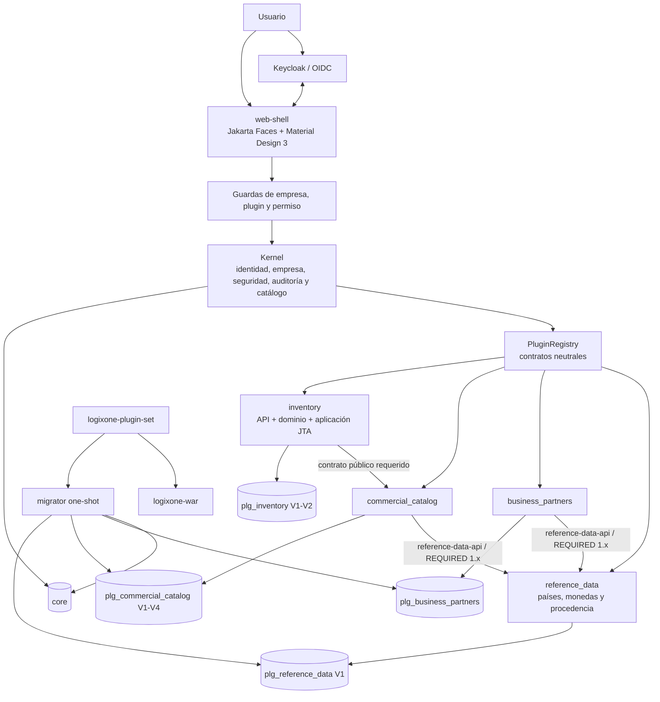
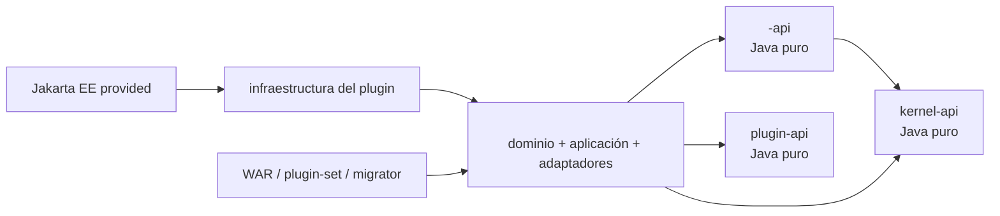

# Manual técnico para desarrolladores de Logixone

- Edición: 0.1-rc37
- Fecha: 2026-08-05
- Baseline: Java 21, Jakarta EE 11, WildFly 41; J11-S8-C03 agrega la fundación
  `reference_data`, su API 1.0.0, V1 privada, trazabilidad `PY/PYG/USD` y consumo
  desde socios/catálogo; exige Docker/Playwright, recongelación y decisión de
  producto sobre un instalador nuevo
- Audiencia: desarrolladores, revisores, arquitectos e implementadores técnicos
- Estado: inicial; G7 independiente y autorización de producción pendientes

## 1. Propósito

Este manual explica cómo entender y extender Logixone sin romper sus límites de
plugins. `AGENTS.md` contiene reglas obligatorias, los ADR explican decisiones y
los documentos de Sprint conservan criterios y evidencia. Este manual conecta esas
fuentes en un recorrido práctico; no las reemplaza.

## 2. Modelo mental del sistema

Logixone es un monolito modular desplegado como un WAR. Los plugins son JAR
seleccionados durante el build, descubiertos por CDI en WildFly y por
`ServiceLoader` en el migrador. La activación por empresa ocurre en runtime, pero
agregar o retirar físicamente un JAR exige reconstruir y redesplegar.



La instancia PostgreSQL es compartida, no la propiedad. Ningún plugin puede leer,
escribir o mapear las tablas privadas de otro.

## 3. Mapa del reactor

| Ruta/módulo | Responsabilidad |
|---|---|
| `platform-bom/` | versiones de dependencias centralizadas |
| `plugin-api/` | SPI Java puro: descriptor, dependencias, menú, migración y pantallas |
| `kernel-api/` | contratos transversales públicos Java puros |
| `kernel-domain/` | reglas del kernel sin infraestructura |
| `kernel-application/` | casos de uso y puertos del kernel |
| `kernel-infrastructure-jakarta/` | CDI, JPA/JTA, OIDC, persistencia y adaptadores |
| `web-shell/` | Jakarta Faces, endpoints, navegación, composición y tema |
| `plugins/<plugin>-api/` | contrato empresarial público y versionado del plugin |
| `plugins/<plugin>/` | dominio, aplicación, infraestructura, descriptor y migraciones privadas |
| `distribution/logixone-plugin-set/` | selección física única por perfil Maven |
| `distribution/logixone-war/` | ensamblado web sin lógica empresarial |
| `migrator/` | Flyway one-shot para `core` y plugins seleccionados |
| `tools/plugin-scaffold/` | generador determinista de esqueletos de plugin |
| `tests/architecture-tests/` | límites ArchUnit |
| `tests/integration-tests/` | runtime, OIDC, health y pruebas de integración |
| `tests/e2e-tests/` | Playwright y recorridos de interfaz |
| `infra/` | Dockerfiles, Compose, Keycloak y configuración reproducible |
| `docs/` | ADR, conocimiento, backlog, Sprints, guías, manuales y evidencia |

`target/`, `.tools/`, `tmp/` y artefactos de ejecución no son fuentes.

## 4. Preparar el entorno

Use uno de los recorridos mantenidos:

- [Visual Studio Code](../runbooks/levantar-logixone-visual-studio-code.md);
- [IntelliJ IDEA Ultimate](../runbooks/levantar-logixone-intellij-idea-ultimate.md).

En Windows, el inicio mínimo de una terminal es:

```powershell
.\mvnw.cmd --version
```

El Wrapper de Windows selecciona el JDK 21.0.11 y su distribución Maven validados
bajo `.tools`, incluso si el entorno global apunta a Java 8. Las dependencias y
descargas del proyecto permanecen bajo `.tools/`. Use siempre el Wrapper y no
prepare `JAVA_HOME`, `PATH` o `MAVEN_USER_HOME` manualmente antes de cada build.

## 5. Dependencias permitidas



Reglas negativas:

- el kernel no depende de implementaciones de plugins;
- un plugin no importa implementación, DTO interno, bean, repositorio o entidad de
  otro plugin;
- no hay relaciones JPA entre plugins;
- `plugin-api`, `kernel-api`, API pública y dominio no dependen de Jakarta;
- la distribución no contiene reglas de negocio;
- contabilidad, personalización o UI no pueden dirigir el dominio operativo;
- no se introduce `javax.*`.

Si una operación necesita respuesta inmediata, publique un puerto público pequeño.
Si propaga un hecho confirmado, use un evento versionado conforme a ADR-0013. No
cree un módulo “common” para ocultar una dependencia circular.

## 6. Anatomía de un plugin funcional

La forma vigente puede observarse en `commercial-catalog`:

```text
plugins/<plugin>/
├── pom.xml
├── README.md
├── docs/plugin-contract.md
└── src/
    ├── main/
    │   ├── java/.../<plugin>/
    │   │   ├── domain/
    │   │   ├── application/
    │   │   │   ├── command/
    │   │   │   └── port/
    │   │   ├── infrastructure/
    │   │   │   ├── application/
    │   │   │   ├── persistence/
    │   │   │   └── ui/
    │   │   ├── <Plugin>PluginDefinition.java
    │   │   └── <Plugin>ScreenContract.java
    │   └── resources/
    │       ├── META-INF/beans.xml
    │       ├── META-INF/persistence.xml
    │       ├── META-INF/services/py.com.logixone.plugin.api.PluginDefinition
    │       └── db/migration/<plugin>/V...sql
    └── test/
        ├── java/
        └── resources/
```

Cuando el dominio debe ser consumido por otros plugins, cree además
`plugins/<plugin>-api/`. Esa API expone IDs, referencias, solicitudes, resultados y
puertos estables; no expone agregados, entidades JPA ni detalles de tablas.

## 7. Crear el esqueleto

Antes del código deben existir caracterización, decisiones aceptadas, límites,
casos de uso y criterios de aceptación. Luego use el generador de
`tools/plugin-scaffold` conforme a su README. El scaffold:

- valida identificador y destino;
- produce archivos deterministas;
- registra CDI y `ServiceLoader`;
- no modifica el reactor ni el plugin set;
- no inventa dominio, UI ni persistencia;
- no sobrescribe una carpeta existente.

Después agregue explícitamente los módulos al POM padre y la selección al perfil
correspondiente de `distribution/logixone-plugin-set`.

## 8. Diseñar el descriptor

Cada `PluginDefinition` publica un `PluginDescriptor` con:

- `PluginId` en `snake_case`;
- `PluginKind.FUNCTIONAL` o `CUSTOMIZATION`;
- versión semántica del plugin;
- rango compatible de `plugin-api`;
- nombre visible;
- dependencias `REQUIRED` u `OPTIONAL` con rango;
- capacidades y permisos públicos;
- contribuciones de menú;
- migraciones propias;
- definiciones de pantalla u overlays.

El registro rechaza duplicados, ciclos, dependencias ausentes requeridas,
autorreferencias, rangos incompatibles y contribuciones inválidas. Una dependencia
Maven no reemplaza la dependencia funcional del descriptor, y el orden del roadmap
no implica automáticamente una dependencia.

La misma definición debe ser descubrible por CDI y mediante el archivo
`META-INF/services`. No duplique la metadata en un segundo manifiesto.

## 9. Dominio y aplicación

- Modele invariantes en tipos y agregados neutrales.
- Mantenga comandos y consultas explícitos.
- Defina puertos en aplicación y adaptadores en infraestructura.
- Pase `CompanyId` o un contexto empresarial autorizado; no use una variable
  global ni confíe en un identificador enviado por el cliente.
- Devuelva resultados tipados para rechazo, conflicto, ausencia o concurrencia.
- Aplique autorización en el servicio/caso de uso, no sólo en la UI.
- Emita auditoría con empresa, actor, plugin, operación y resultado, sin secretos.

Las operaciones modificadoras usan transacción JTA y versión optimista. Si cambia
el registro mientras un usuario lo edita, rechace el comando y obligue a releer;
no sobrescriba silenciosamente.

## 10. Persistencia y migraciones

Cada plugin persistente posee:

- esquema `plg_<plugin_id>`;
- unidad JPA propia;
- entidades y repositorios privados;
- ubicación Flyway declarada por el descriptor;
- `flyway_schema_history` propia;
- migraciones aplicadas inmutables y con checksum.

Reglas:

1. cree una nueva migración versionada para cada evolución;
2. no modifique una migración ya aplicada;
3. no use actualización automática de Hibernate;
4. no lea esquemas privados ajenos;
5. no borre datos al desactivar o retirar un plugin;
6. pruebe migración vacía, repetición, checksum, restricciones y conservación;
7. documente respaldo y recuperación para cambios destructivos.

Para documentos comerciales, modele un dominio canónico separado de SIFEN,
snapshots históricos y artefactos fiscales inmutables según ADR-0010. El manual
SIFEN orienta estructura y cardinalidad; no se copia como modelo interno.

La facturación masiva también pertenece a `commercial_documents`. Modele un
`InvoiceGenerationRun` persistente y sus ítems; no ejecute miles de facturas desde
el bean de vista. Cada ítem necesita clave idempotente, snapshot aprobado,
transacción corta, resultado y reanudación. La numeración debe ser atómica y queda
prohibido `MAX + 1`. El plugin de origen entrega IDs/versiones mediante API pública
y no se convierte en dependencia privada del documento.

No confunda ese lote con el de `sifen`: la emisión comercial publica una proyección
por outbox y el adaptador fiscal agrupa DE firmados según los límites oficiales,
con protocolo, consulta y estado propios. Consulte
[ADR-0031](../adr/0031-facturacion-masiva-en-documentos-comerciales.md) y la
[épica](../backlog/epica-facturacion-masiva.md).

## 11. Seguridad

Una operación funcional requiere simultáneamente:

1. identidad OIDC confiable;
2. usuario local activo;
3. empresa activa seleccionada desde una membresía vigente;
4. plugin físicamente presente, compatible y activo para la empresa;
5. dependencias efectivas;
6. permiso empresarial vigente;
7. revalidación del servidor en la operación actual.

Los permisos pertenecen al descriptor del plugin. La administración concede
permisos a roles empresariales y asigna roles a membresías. Las autoridades
globales del kernel se administran aparte. Un menú oculto no autoriza ni deniega
por sí solo.

No registre tokens, contraseñas, cookies, contenido de secretos ni datos personales
innecesarios. Los mensajes de denegación hacia el usuario deben ser genéricos; el
detalle técnico seguro queda en auditoría/log.

## 12. UI Jakarta Faces y Material Design 3

- Jakarta Faces 4.1 es obligatorio; no cree una SPA.
- El shell es dueño de layout, tema, tokens y renderer.
- El plugin publica contratos neutrales de pantalla y handlers autorizados.
- No inyecte XHTML, EL, CSS o JavaScript arbitrarios desde un plugin.
- Diseñe desde la historia para compacto `0–599`, medio `600–839` y expandido
  `840+`.
- En compacto, use lista/tarjeta u otro patrón explícito cuando una tabla no pueda
  refluir.
- Añada labels, orden semántico, teclado, foco visible, mensajes comprensibles,
  contraste y `prefers-reduced-motion`.
- Verifique estados normal, vacío, validación, conflicto, denegación y error.

Un plugin aporta menú por `MenuContribution`; el shell lo ordena y filtra. Agregar
otro plugin fusiona contribuciones, no archivos XHTML.

## 13. Personalización empresarial

Cada empresa debe tener exactamente un plugin `CUSTOMIZATION` propio. Se compone
al final y sólo puede modificar contratos públicos compatibles mediante
`ScreenId`, elementos, operaciones y slots permitidos.

No puede:

- relajar autorización;
- acceder a entidades o tablas ajenas;
- importar beans o XHTML internos;
- agregar CSS/JavaScript global;
- compartirse como la misma personalización entre empresas distintas;
- sustituir reglas centrales del dominio.

Si falta un punto de extensión, versione el contrato propietario. No atraviese el
límite del plugin para resolverlo rápidamente.

## 14. Composición física y despliegue

`distribution/logixone-plugin-set` es la única lista física. Un perfil incorpora el
mismo conjunto al WAR y al migrador:

```text
perfil Maven
    └── logixone-plugin-set
          ├── logixone-war -> WEB-INF/lib
          └── migrator -> ServiceLoader + Flyway
```

El build predeterminado no contiene implementaciones de plugins. J11-S8-C03 usa
`with-inventory-demo` para incluir cuatro productivos, sus APIs y tres fixtures. El
registro descubre siete descriptores; las APIs públicas no son plugins. Consulte la
[historia de composición](../sprints/sprint-08/J11-S8-06-integracion-composicion-inventory.md).

Aplicación y migrador se construyen como dos imágenes multi-stage con el mismo
perfil y se promueven como una pareja de digests. Migrator termina antes de que
Compose habilite `app`.

## 15. Flujo de implementación recomendado

1. caracterizar comportamiento y vocabulario sin copiar el legado;
2. registrar decisiones que afecten arquitectura, seguridad o datos;
3. aprobar casos, invariantes, contratos y dependencias;
4. crear API/dominio neutral y sus unitarias;
5. agregar migración y adaptadores con PostgreSQL/Testcontainers;
6. implementar aplicación, autorización, concurrencia y auditoría;
7. implementar UI JSF responsive y pruebas del handler;
8. agregar el plugin al perfil físico;
9. validar WAR/migrador, Compose, salud, seguridad y Playwright;
10. actualizar documentación, manuales, demo, topología y evidencia.

Después de cada cambio de código ejecute inmediatamente la prueba más pequeña que
lo demuestra. No continúe con una prueba relevante fallando.

### 15.1 Flujo Git por Sprint

El repositorio usa un GitFlow liviano dirigido por Sprint:

```text
story/* | fix/* | chore/* -> sprint/NN-descripcion -> main -> tag sprint-NN
hotfix/* -------------------------------------------> main -> Sprint activo
```

| Rama | Origen | Destino | Duración |
|---|---|---|---|
| `main` | baseline aceptado | no aplica | permanente |
| `sprint/NN-descripcion` | `main` después del cierre anterior | `main` | un Sprint |
| `story/<id>-descripcion` | Sprint activo | Sprint activo | una historia |
| `fix/<id>-descripcion` | Sprint activo | Sprint activo | una corrección |
| `chore/<id>-descripcion` | Sprint activo | Sprint activo | una tarea técnica |
| `hotfix/<id>-descripcion` | tag productivo o `main` | `main` y Sprint activo | un incidente |

No existe `develop`: con un solo Sprint autorizado, la rama `sprint/*` ya es la
línea de integración. Tampoco se mantiene `release/*`; los candidatos se fijan con
tags inmutables `sprint-NN-rc.N`. Las historias usan squash merge hacia el Sprint
y el cierre usa merge commit hacia `main`. `main` sólo recibe cierres o hotfixes
mediante Pull Request.

El PR de una historia documenta la prueba mínima, `mvn verify` y los gates
adicionales aplicables. El PR de cierre exige la matriz integral, demo, seguridad,
topología, manuales, PDF, validación independiente y decisión del instalador. La
rama del Sprint se elimina después de crear el tag anotado `sprint-NN`; `vX.Y.Z`
se reserva para una versión de producto aprobada.

La adopción inicial está planificada en
[J11-S8-C04](../sprints/sprint-08/J11-S8-C04-gobierno-git-ramas.md). Hasta cerrar
Sprint 8, `main` conserva excepcionalmente el importe inicial de un Sprint todavía
abierto y no debe interpretarse como un release formal.

## 16. Comandos de prueba

Prueba del módulo:

```powershell
.\mvnw.cmd -B -pl plugins/<plugin> -am test
```

Verificación completa sin implementaciones:

```powershell
.\mvnw.cmd -B clean verify
```

Verificación del perfil actual:

```powershell
.\mvnw.cmd -B -Pwith-inventory-demo clean verify
```

PostgreSQL focalizado cuando el plugin declare el perfil de integración:

```powershell
.\mvnw.cmd -B -Pwith-inventory-demo `
  -pl migrator,plugins/<plugin> -am verify `
  "-Dlogixone.postgres.integration=true"
```

Si afecta arquitectura, ejecute ArchUnit y variantes presente/ausente. Si afecta
persistencia o despliegue, valide imágenes, Compose, migración repetida, health y
recreación conservando volúmenes. Si afecta UI, Playwright debe cubrir los tres
rangos y los límites responsive.

## 17. Docker y operación local

- Use las imágenes base fijadas por digest.
- Mantenga configuración fuera de la imagen.
- Monte secretos como archivos externos.
- Ejecute migraciones antes de la aplicación.
- Compruebe `/health/live` y `/health/ready`.
- Use `docker compose ... down` sin `--volumes` para detener conservando datos.
- No edite manualmente el historial de Flyway ni tablas privadas para ocultar un
  fallo.

Los procedimientos exactos están en [runbooks](../runbooks/README.md).

## 18. Documentación que acompaña un cambio

| Si cambia... | Actualice... |
|---|---|
| decisión arquitectónica | `docs/adr/` |
| conocimiento extraído del legado | `docs/knowledge-base/` |
| alcance, criterios o estado | `docs/backlog/` y `docs/sprints/` |
| onboarding por empresa | `docs/implementation-guide/` |
| recorrido visible o mensaje | `docs/user-guide/` |
| arquitectura, contrato, build, migración o prueba | `docs/developer-guide/` |
| montaje/operación | `docs/runbooks/` |
| composición al cierre | `estructura-plugins-y-dependencias.md` del Sprint |

Cada Sprint termina además con demo visual real, retrospectiva, siguiente trabajo,
PDF de estructura del repositorio y evidencia reproducible. Un documento derivado
no sustituye las fuentes Markdown ni el código.

## 19. Revisión de un plugin

- [ ] identidad, clase y versión correctas;
- [ ] dependencias públicas mínimas, acíclicas y declaradas;
- [ ] API y dominio sin Jakarta;
- [ ] cero imports internos de otros plugins;
- [ ] cero JPA o SQL cruzado;
- [ ] esquema, migraciones y checksum propios;
- [ ] autorización y empresa revalidadas en aplicación;
- [ ] auditoría sin secretos;
- [ ] menú, pantallas y permisos publicados por contrato;
- [ ] responsive y accesibilidad verificados;
- [ ] CDI y `ServiceLoader` registran la misma definición;
- [ ] WAR y migrador usan el mismo perfil;
- [ ] variante ausente construye y datos sobreviven a retirada;
- [ ] pruebas, manuales, topología y evidencia actualizados.

## 20. Diagnóstico de límites frecuentes

### El plugin no aparece

Revise POM padre, perfil del plugin set, proveedor `META-INF/services`, CDI,
compatibilidad de `plugin-api` y logs de inicialización. No lo agregue directamente
al WAR y al migrador por separado.

### El menú no aparece

Revise presencia, descriptor válido, activación empresarial, dependencia, permiso
y empresa activa. No agregue el enlace manualmente al template del shell.

### Flyway no descubre la migración

Revise `MigrationContribution`, esquema derivado del `PluginId`, ubicación de
classpath y registro por `ServiceLoader`. No copie SQL al migrator.

### Un plugin necesita datos de otro

Detenga el acceso directo. Defina el dato mínimo requerido, el propietario y si la
interacción debe ser síncrona, referencia estable, snapshot o evento. Versione un
contrato público y agregue pruebas de compatibilidad.

## 21. Instalador Windows de cierre

En cada cierre, después de los demás gates, se pregunta a producto si se creará un
instalador Windows. Con `SÍ`, el último gate se ejecuta después de congelar el
baseline. Con `NO`, `current` no se toca y se documenta como perteneciente a otro
baseline. El instalador debe derivarse de manifiestos versionados y no puede
contener versiones, URLs o acciones ocultas solo en código de interfaz.

La implementación separa:

1. diagnóstico de solo lectura y reporte de compatibilidad;
2. plan declarativo de componentes, licencias, hashes y acciones;
3. UI de consentimiento, UAC mínimo, progreso y recuperación;
4. adaptadores de instalación/reutilización de prerrequisitos;
5. montaje del proyecto, migrator, Compose y health;
6. actualización, reparación y preservación de datos;
7. construcción y publicación acotada de `current`; firma y matriz de VM siguen
   como gates externos.

El código está en `installer/windows/`. `Installer.Core.cs` contiene modelo,
sondeo y evaluación; `Installer.Plan.cs` genera acciones y huella; la ejecución y
las operaciones Windows viven en archivos separados; `Installer.Form.cs` y
`Installer.Program.cs` exponen Windows Forms y CLI. El manifiesto es la fuente de
versiones, requisitos, licencia, descarga, hashes, puertos, rutas y digests.

Prueba mínima y promoción de la candidata:

```powershell
powershell -ExecutionPolicy Bypass -File installer\windows\scripts\build-bootstrapper.ps1 -Test
powershell -ExecutionPolicy Bypass -File installer\windows\scripts\build-installer.ps1
```

La promoción exige que las imágenes locales coincidan con los digests congelados.
Construye en temporal y sólo sustituye los ocho derivados declarados en `current`.
`bin`, `build` y `current` no son fuente ni se versionan. La fuente, el manifiesto,
las pruebas y la evidencia permanecen.

El reemplazo por Sprint solo afecta al artefacto generado `current`. Nunca borra
fuentes, pruebas, manifiestos o releases publicados. Cualquier tecnología de
empaquetado, requisito mínimo, perfil, firma o actualización debe aprobarse en un
ADR antes de crear el ejecutable.

J11-S8-08 produjo `0.8.0-internal.1`, validó instalación y dos reparaciones sobre
el ambiente local y conservó secretos, volúmenes y datos. El canal
`INTERNAL_UNSIGNED` no es entregable a una empresa: faltan la matriz independiente
y Authenticode. El recorrido manual continúa siendo la alternativa canónica para
desarrolladores. Consulte la
[épica](../backlog/epica-instalador-windows-reproducible.md) y la
[metodología](../runbooks/metodologia-instalador-windows-cierre-sprint.md), además
de [ADR-0026](../adr/0026-instalador-windows-bootstrapper-nativo.md).

## 22. Estado del baseline

El baseline J11-S8-07 fue reabierto por la corrección J11-S8-C01. El último corte
congelado incluía:

- `business_partners@1.0.0` con esquema V1–V4 y cuatro permisos;
- `commercial_catalog@1.0.0` con esquema V1–V4 y cuatro permisos;
- `inventory@1.0.0` con esquema V1–V2 y siete permisos;
- `reference_plugin` y dos personalizaciones como fixtures;
- `plugin-api` compatible en el rango `[0.4.0,0.5.0)`;
- perfil `with-inventory-demo` común a WAR y migrador;
- demo oficial responsive de inventario y gate integral verdes;
- digests de aplicación y migrador ahora obsoletos para promoción;
- instalador Windows interno con preflight, plan, consentimiento, reparación y
  health; `NotSigned` y matriz externa pendientes;
- G7 independiente pendiente, por lo que no se promueve a producción.

J11-S8-C01 incorpora una tercera capacidad, menú y pantalla de
`commercial_catalog`: `/catalog/tax-profiles`, protegida por
`commercial_catalog.definitions.manage`. El handler consulta y registra mediante
casos de uso JTA reales, conserva el perfil como definición interna versionada y
no introduce tasas, XML, XSD ni códigos SIFEN. La candidata y su demo responsive
están validadas; la recongelación documental y la regeneración del instalador
permanecen pendientes.

J11-S8-C02 incorpora la cuarta y quinta capacidad, menú y pantalla
`commercial_catalog:definitions` en `/catalog/definitions`, también protegida por
`commercial_catalog.definitions.manage`. El handler autorizado consulta y registra
unidades, categorías, marcas y etiquetas mediante los casos de uso existentes. Sus cinco
selectores consumidores declaran ahora la fuente y la ruta propietarias. El sexto
corte agrega a esas cuatro definiciones el cambio `ACTIVE`/`INACTIVE` con versión
esperada, empresa autenticada, repositorio JPA propio y auditoría en la misma
transacción; ese corte no agregó edición de nombres/estructura, reemplazo ni retorno con
borrador. El Playwright focal de directorio, altas, ciclo de unidad, consumidores
y seguridad negativa quedó verde en 375, 720 y 1280 px. La quinta pantalla
`commercial_catalog:variant_families`, en `/catalog/variant-families`, administra
familias mediante un borrador acotado de 1 a 8 atributos ordenados. El plugin
entrega sólo valores neutrales; el shell renderiza `DISPLAY_TEXT`, formulario y
layout responsive. El séptimo corte extiende `ACTIVE`/`INACTIVE` al perfil
tributario: el maestro avanza versión y el repositorio copia la revisión vigente a
una nueva revisión, sin borrado físico ni migración. Aplicación, JPA,
PostgreSQL/Testcontainers, renderer y Playwright quedaron verdes. Los cortes
decimotercero y decimocuarto completan respectivamente el ciclo de tipos de canal
y familias de variantes. Para familias, el comando exige versión esperada, el
repositorio limita por empresa e identidad, incrementa versión y recarga los
atributos ordenados; la auditoría registra sólo identidad, versiones y resultado.
El decimonoveno corte conecta ese modelo con la pestaña neutral **Variantes** de
Artículos y servicios. El comando recibe identidad y versión de familia más un
mapa de valores sin tipos confiados por el cliente. Dentro del límite JTA, el
repositorio bloquea la familia vigente por empresa, la aplicación exige estado
activo y versión exacta, rechaza atributos desconocidos o requeridos ausentes y
normaliza cada valor según la definición. La asignación persiste la revisión
exacta; una revisión posterior no reinterpreta el historial.

El decimoquinto corte agrega la revisión explícita del nombre visible de
`CHANNEL_KIND`. V3 crea un historial append-only con backfill de V2; el repositorio
escribe una revisión por versión y la consulta autorizada devuelve un DTO
inmutable, aislado por empresa y ordenado desde la versión más reciente. El código
estable no cambia y la auditoría no registra el nombre.

El vigésimo corte reutiliza ese agregado para `IDENTIFICATION_TYPE`,
`ADDRESS_TYPE` y `ADDRESS_PURPOSE`. V4 amplía restricciones, retroalimenta
códigos ya persistidos y crea sus revisiones iniciales sin agregar tablas. Los
consumidores ofrecen sólo opciones activas y la aplicación resuelve de nuevo
empresa, clase y estado antes de persistir; el país normativo permanece fuera de
este maestro empresarial. J11-S8-C03 concreta ese límite en `reference_data`:
`business_partners` usa exclusivamente `reference-data-api`, ofrece países
habilitados y vuelve a resolver `CompanyId`/código en la transacción antes del
insert. `commercial_catalog` aplica el mismo patrón a la moneda de la lista de
precios. Ninguno consulta las tablas `plg_reference_data`.

El decimosexto corte agrega `ReviseSimpleDefinition` y
`simpleDefinitionHistory` para unidad, categoría, marca y etiqueta. V2 crea una
tabla privada por tipo y retroalimenta sólo el estado vigente demostrable desde
V1. Revisar permite nombre y, según el tipo, escala decimal o categoría superior;
el código y la identidad permanecen inmutables. Las transiciones reales de estado
también agregan revisión. La raíz conserva concurrencia optimista y el servicio
audita identidad y versiones, nunca el nombre empresarial.

El decimoséptimo corte agrega `ReplaceSimpleDefinition`. El comando crea una
identidad sucesora del mismo tipo y empresa, inactiva la anterior y registra el
vínculo en la misma transacción. V3 incorpora cuatro FK privadas de misma empresa,
checks de autorrelación/estado e índices; no toca tablas de otro plugin. La
identidad anterior conserva sus revisiones y referencias, queda inmutable y no
puede reactivarse ni reemplazarse otra vez. Las operaciones futuras sólo ofrecen
la sucesora activa.

El decimoctavo corte agrega `ReviseVariantFamily` y
`variantFamilyHistory`. V4 crea las tablas privadas append-only
`variant_family_revision` y `variant_attribute_revision`, retroalimenta el estado
V3 y agrega `variant_family_version` a asignaciones de artículos y atributos. El
comando reemplaza de forma atómica el nombre y la estructura completa de 1 a 8
atributos sin cambiar empresa, identidad o código; exige versión esperada y
audita sólo identidad/versiones. Cada asignación queda vinculada a una revisión
inmutable para evitar cambios de significado retroactivos.

El octavo corte agrega `ReviseTaxProfile` como operación explícita. La aplicación
mantiene código, nombre e identidad, cambia sólo tratamiento, descripción y
vigencia, exige versión esperada y audita sin contenido tributario. JPA desactiva
la revisión vigente e inserta la siguiente dentro de la misma transacción; no hay
migración nueva. El handler conserva selección y borrador ante validación fallida.
Aplicación, PostgreSQL, renderer, `mvnw.cmd verify`, imagen, health y Playwright en
1280/720/375 px quedaron verdes.

El noveno corte agrega `taxProfileHistory` al puerto de aplicación y al repositorio
privado. La consulta exige el mismo permiso de administración, filtra por empresa
e identidad, ordena por versión descendente y devuelve un DTO inmutable sin
entidades JPA. El handler publica una tabla neutral de solo lectura; el shell la
renderiza como tabla en expandido y tarjetas en medio/compacto. No se agregó
migración ni cambió `plugin-api`. PostgreSQL/Testcontainers, reactor, ArchUnit,
imagen, health y Playwright quedaron verdes.

El quinto corte de J11-S8-C02 incorpora además
`business_partners:definitions` en `/business-partners/definitions`, protegido por
`business_partners.manage`. La migración privada V2 introduce el agregado
`BusinessPartnerDefinition` con clave `(company, kind, code)`, estado y versión.
El repositorio y el caso de uso no salen del plugin; la ficha de socios consume
`CHANNEL_KIND`, `IDENTIFICATION_TYPE`, `ADDRESS_TYPE` y `ADDRESS_PURPOSE` activos
por código. V3 conserva sus revisiones append-only y V4 amplía las clases con
backfill y datos iniciales. El shell sigue siendo dueño de XHTML,
Material Design 3 y responsive, mientras el plugin aporta contrato, valores y
acciones neutrales.

`inventory` fue el tercer plugin productivo. J11-S8-01 caracterizó depósitos, ubicaciones,
existencias, movimientos, reservas y conteos y los separó de catálogo, compras,
ventas, logística, costos y contabilidad. Producto confirmó IN-D01 a IN-D10 sin
cambios el 2026-07-31. J11-S8-02 creó `inventory-api@1.0.0`, el módulo funcional y
su dependencia requerida de `commercial_catalog` 1.x. J11-S8-03 agregó ADR-0024,
V1 privada con nueve tablas, unidad JPA en modo `validate`, snapshots y seis
repositorios empresariales. J11-S8-04 incorporó V2, un séptimo repositorio para
recibos idempotentes de reserva, diez entidades, tres capacidades y siete permisos.
J11-S8-05 incorporó tres directorios empresariales, contratos de pantalla y
handlers para existencias, depósitos y conteos. El descriptor publica las rutas
`/inventory`, `/inventory/warehouses` y `/inventory/counts`, siempre protegidas por
`inventory.view`.

La fuente vigente para desarrollarlo es la
[caracterización de inventario](../knowledge-base/inventory/legacy-characterization.md).
El dominio exige depósito/ubicación, crea `GENERAL`, inscribe solo productos
activos, conserva la conversión y protege movimientos, saldos, reservas y conteos.
V1 separa depósito/ubicación, inscripción local, saldo, libro de movimientos,
reservas y conteos; V2 agrega el recibo inmutable de operaciones de reserva. Los
adaptadores no crean FK ni asociación JPA hacia catálogo: conservan IDs y snapshots.
Cantidades/factores usan `NUMERIC(30,6/12)`, los movimientos son append-only y los
conteos solapados se serializan en PostgreSQL.

La aplicación revalida la empresa y el permiso exacto antes de I/O, contrasta
productos y conversiones mediante `commercial-catalog-api`, registra auditoría
técnica y marca rollback JTA ante mutaciones fallidas. Los contratos CDI públicos
son `InventoryAvailability`, `InventoryMovements` e `InventoryReservations`. Los
handlers de pantalla permanecen en la infraestructura del plugin, convierten texto
a tipos de dominio, revalidan empresa/permiso/recurso/versión y devuelven respuestas
neutrales. El shell conserva el renderer y XHTML únicos; el plugin no inyecta UI
arbitraria. J11-S8-06 compuso WAR/migrador con el perfil único, validó imágenes,
migraciones idempotentes, OIDC, administración de permisos y el recorrido
Playwright completo. J11-S8-07 repitió el gate integral, verificó la dependencia
`inventory -> commercial_catalog`, congeló el baseline y dejó abierta la demo real.
J11-S8-08 creó y probó internamente el instalador sin recomponer esos artefactos.
Esa edición quedó obsoleta al reabrirse el baseline. J11-S8-C01 y los gates
afectados ya quedaron verdes. El Sprint permanece abierto hasta resolver el gate
de selectores acordado, recongelar fotografía/PDF, preguntar si se creará un nuevo
instalador y completar los gates derivados de esa respuesta, además de G7.

## 23. Roadmap vigente y familias futuras

ADR-0027, ADR-0030, ADR-0032, ADR-0033 y ADR-0034 ampliaron el roadmap a
diecinueve plugins ERP reutilizables, más una personalización obligatoria
y distinta por empresa. `vehicle_telemetry` ocupa el orden 7;
`recurring_billing` el 9; `point_of_sale` el 12; `fuel_station` el 13; y
`human_resources`, `payroll` y `payroll_paraguay` los órdenes 17 a 19. Una
distribución completa para una empresa tendrá veinte plugins productivos; una
distribución que atienda `N` empresas podrá contener `19 + N`, sin activar
necesariamente todos los reutilizables en cada empresa.

[ADR-0036](../adr/0036-operaciones-proveedor-soporte-lanzamientos-conector.md)
agrega fuera de esa secuencia `customer_support`, `release_management` y
`support_connector`, por lo que el catálogo futuro general contiene veintidós
plugins reutilizables. No forman una distribución única: los dos primeros se
componen en la instancia central del proveedor y el conector técnico se agrega
opcionalmente al ERP del cliente. La secuencia de dominio 1–19 no se renumera.

`customer_support` requiere `business-partners-api` y puede consumir la API de
releases sin que `release_management` dependa de soporte. `support_connector`
vive en otra distribución: no declara una dependencia runtime requerida del
plugin central, sino que usa un contrato público Java puro y HTTPS saliente,
versionado, autenticado e idempotente. Debe funcionar sin red y prohíbe listeners
administrativos, shell, SQL, scripts, carga de JAR, control remoto y
autoactualización. Su estado mínimo privado es identidad, consentimiento, cola y
auditoría en `plg_support_connector`.

La etiqueta técnica todavía no es un valor ejecutable: el baseline de
`PluginKind` sólo ofrece `FUNCTIONAL` y `CUSTOMIZATION`. SC-00 deberá decidir una
evolución compatible a `TECHNICAL`, revisar consumidores exhaustivos y versionar
`plugin-api`; no se clasificará el conector como personalización para evitar esa
decisión.

La implementación futura comienza por identidad del portal, SLA, threat model,
clasificación de datos, consentimiento, retención y fuente de verdad de releases.
Las épicas canónicas son [soporte](../backlog/epica-soporte-clientes-erp.md),
[releases](../backlog/epica-gestion-lanzamientos-erp.md) y
[conector seguro](../backlog/epica-conector-soporte-seguro.md). No hay módulos,
migraciones o composición ejecutable de esta familia en el baseline actual.

[ADR-0037](../adr/0037-familia-cooperativa-ahorro-credito-paraguay.md)
agrega otra familia separada con seis plugins: `cooperative_membership`,
`cooperative_governance`, `aml_compliance`, `cooperative_savings`,
`cooperative_credit` y `cooperative_regulatory_paraguay`. El catálogo global
futuro pasó a veintiocho reutilizables en ese corte, sin renumerar ERP 1–19 ni crear una
distribución con todos ellos.

[ADR-0038](../adr/0038-plugin-datos-referencia-normativos.md) agrega después
`reference_data` como fundación R0 y eleva el catálogo global a veintinueve. A
diferencia de las familias futuras, su primer corte sí está en el reactor: API
pura, descriptor funcional, V1 privada, pantalla autorizada y consumo desde socios
y catálogo. La publicación mundial completa continúa planificada.

El perfil cooperativo reutilizará `business-partners-api`, `treasury-api` y
`accounting-api` cuando sus contratos estén estables. La frontera esencial para
quien desarrolle la familia es:

- membresía referencia un participante, pero posee admisión, estado y aportes;
- ahorros posee la obligación individual y tesorería sólo su liquidación;
- crédito posee el préstamo y no usa cuentas por cobrar comerciales;
- LA/FT publica una decisión mínima y recibe observaciones tipadas, sin leer
  saldos;
- gobierno conserva snapshots de padrón y actos, no identidades del kernel;
- regulación Paraguay consume proyecciones inmutables y no posee el mayor.

Aportes, ahorros y cartera requieren entradas append-only, reversos explícitos,
decimal exacto, reglas con vigencia, idempotencia y conciliación. No se permite
modificar un saldo derivado ni corregir historia financiera mediante `UPDATE` o
`DELETE`. Toda comunicación cruza APIs Java puras, puertos o eventos públicos; no
hay JPA o SQL entre esquemas.

La primera historia futura será COOP-00: tipo/nivel, estatuto, productos, fuentes
oficiales y checksums, matriz LA/FT, plan de cuentas, privacidad, segregación,
migración y pruebas de reconciliación. No se generan módulos antes de ese gate y
un build verde no se presenta como certificación o autorización para captar
ahorros. Consulte la
[épica cooperativa](../backlog/epica-cooperativa-ahorro-credito-paraguay.md).

El refinamiento [COOP-00](../backlog/COOP-00-gobierno-alcance-matriz-normativa.md)
agrega COOP-D01–D15, gates G0–G5 y la matriz
requisito–fuente–plugin–dato–regla–permiso–prueba. El
[grafo detallado](../architecture/cooperative-savings-credit-boundaries.md)
establece dependencias candidatas y flujos de depósito/crédito. Ambos documentos
son diseño: no existen IDs Java, módulos API, eventos o perfiles con esos nombres
hasta que una historia los implemente y pruebe.

`vehicle_telemetry` será un dominio planificado e independiente. `logistics`
conservará `VehicleId`, clasificación, conductor, ruta, viaje y despacho;
telemetría poseerá dispositivos, asignaciones, observaciones, última posición,
recorridos, geocercas, alertas y el ciclo `ACTIVE/PAUSED/STOPPED`. Los proveedores
GPS se aislarán en adaptadores versionados. El primer alcance no inmoviliza, apaga
ni controla físicamente un vehículo y no borra historia al pausar o detener.

Consulte [ADR-0034](../adr/0034-plugin-telemetria-vehicular.md), la
[caracterización](../knowledge-base/vehicle-telemetry/legacy-characterization.md)
y la [épica](../backlog/epica-telemetria-vehicular.md). Su implementación no
comienza durante Sprint 8 ni antes de completar `purchasing`, `sales` y
`logistics` con un contrato público estable de vehículo.

El POS es una capacidad planificada, no un módulo presente en el reactor actual.
Será dueño de terminales, sesiones operativas, carrito y coordinación idempotente
del checkout. Catálogo, inventario, ventas, documentos comerciales y tesorería
continuarán siendo dueños de precios e impuestos, stock, venta, comprobante y
dinero. La integración se realizará exclusivamente mediante contratos públicos;
no se autorizan asociaciones JPA, SQL cruzado ni DTO internos.

ADR-0035 sustituye la decisión online inicial: la primera versión productiva debe
confirmar al menos ventas en efectivo sin Internet desde una terminal previamente
aprovisionada. Debe usar almacenamiento local cifrado, diario append-only,
identidad estable e idempotencia de extremo a extremo, y mostrar pendientes y
conflictos al sincronizar. `POS-OFF-00` decidirá la topología local compatible con
Jakarta Faces; caché o `localStorage` del navegador no cumplen el requisito.
Teclado, tacto y lector de código de barras tipo teclado siguen siendo obligatorios.
SIFEN continúa como adaptador fiscal separado por país y no una dependencia
directa del terminal.

Consulte [ADR-0027](../adr/0027-terminal-punto-venta-y-ampliacion-roadmap.md),
[ADR-0035](../adr/0035-operacion-offline-terminal-punto-venta.md) y la
[épica de POS](../backlog/epica-terminal-punto-venta.md). Su implementación no se
inicia antes de cerrar Sprint 8 y completar, en orden, los plugins 4 a 11.

`recurring_billing` será un dominio planificado e independiente. Poseerá versiones
de planes, suscripciones, ciclos, cambios prorrateados, consumo facturable,
correcciones, cargos y corridas de cálculo. Dependerá de la API genérica de
`commercial_documents` y publicará candidatos inmutables; no poseerá factura,
numeración, XML/CDC, cobro o deuda. Documentos seguirá pudiendo facturar otros
orígenes cuando el plugin recurrente esté ausente o inactivo.

Consulte [ADR-0033](../adr/0033-dominio-facturacion-recurrente.md), el
[análisis](../knowledge-base/commercial-documents/recurring-billing-domain-analysis.md)
y la [épica](../backlog/epica-facturacion-recurrente.md). Su implementación no
comienza antes de cerrar Sprint 8 y completar los plugins 4 a 8.

`fuel_station` también está planificado y todavía no forma parte del reactor.
Poseerá estaciones, tanques, surtidores, picos, turnos, lecturas totalizadoras,
recepciones, despachos y conciliación de inventario húmedo. Usará contratos de
catálogo e inventario y podrá entregar un despacho a POS, pero no poseerá producto,
precio maestro, stock contable, factura, CDC, caja o deuda. La primera versión
captura o importa datos; no controla bombas, válvulas o precios remotamente. Cada
protocolo de fabricante será un adaptador técnico versionado y cualquier comando
de salida requerirá otro ADR de seguridad.

Consulte [ADR-0032](../adr/0032-plugin-estaciones-servicio-combustible.md), la
[caracterización](../knowledge-base/fuel-station/legacy-characterization.md) y la
[épica](../backlog/epica-estaciones-servicio-combustible.md). Su implementación no
comienza antes de completar los órdenes 4 a 12.

La familia de personas también está planificada, no presente en el reactor.
`human_resources` será dueño de legajo, relación laboral, organización, ausencias
y tiempo; `payroll` separará conceptos, períodos y liquidaciones; y
`payroll_paraguay` aislará reglas y artefactos IPS/MTESS versionados. Empleado,
participante comercial y usuario no comparten entidad. Pagos y asientos continúan
en tesorería/contabilidad y se integran por contratos o eventos.

Consulte [ADR-0030](../adr/0030-familia-recursos-humanos-nomina-paraguay.md), la
[caracterización](../knowledge-base/human-resources/legacy-characterization.md) y la
[épica](../backlog/epica-recursos-humanos-nomina-paraguay.md). El primer incremento
futuro será `human_resources` sin nómina, después de completar los plugins 4 a 16.

La emisión masiva continúa dentro del orden 8, `commercial_documents`.
`recurring_billing` agrega el dominio que calcula cargos, pero no un segundo
propietario de la factura. La corrida de cargos, el lote comercial y el lote SIFEN
tienen identidades, estados e idempotencia separados.

## 24. Selectores y datos administrables

Todo `ScreenElementType.SELECT` debe declarar una fuente gobernada. ADR-0028 separa
estados cerrados, catálogos empresariales, referencias operativas, catálogos
normativos y opciones de composición. Sólo los catálogos/referencias administrables
ofrecen `Administrar` o `Agregar`; estados, permisos y códigos oficiales no aceptan
altas arbitrarias.

Desde `plugin-api` 0.4.1, cada `ScreenInteraction.Handler` puede publicar un mapa
`ScreenElementId -> SelectorSourceDefinition`. La definición exige identidad,
propietario, clase, versión, política de vacío/inactivos y carga; si la fuente es
administrable exige además ruta, permiso y capacidades. Cerrados y composición no
pueden declarar administración en runtime. El método predeterminado vacío mantiene
compatibilidad binaria mientras se completa la migración.

El shell rechaza metadatos asociados a un elemento que no sea `SELECT`. Para una
fuente administrable también exige que la ruta ya esté en el menú autorizado y
revalida `ownerPluginId + managementPermission` en servidor; sólo entonces copia
la ruta al modelo JSF. El destino vuelve a ejecutar su guarda normal. No agregue
XHTML, EL, CSS ni JavaScript desde el plugin.

`plugin-api` 0.4.2 agrega `SelectorSourceMetadata` y
`PlatformSelectorSourceDefinition` de forma compatible para los controles
renderizados directamente por kernel/shell. `SelectorSourceOwner` distingue
`PLATFORM` de `PLUGIN`; no se crea un `PluginId("kernel")` ficticio. El catálogo
`NativeSelectorSourceCatalog` declara los 18 usos nativos y el componente Faces
`logixone:selectorSource` muestra origen/clase y filtra la ruta con la autoridad
global vigente.

El undécimo corte implementa el retorno para el renderer genérico de plugins. El
enlace hace un POST inmediato y un recurso JS propiedad del shell serializa sólo
controles con `data-screen-input`; `SelectorReturnDraft` vuelve a limitar y filtrar
IDs/valores contra `ShellScreenView.safeDraftInputIds()`. El handler propietario
normaliza el borrador antes de que `SelectorReturnContextStore` lo conserve con
un token UUID opaco, TTL de diez minutos, máximo cuatro contextos y consumo único.
El contexto es serializable, queda ligado a usuario, empresa y revisión de sesión,
y se limpia al cambiar empresa o cerrar sesión.

Al volver, el shell revalida token, destino y binding, restaura modo/pestaña/recurso,
reejecuta el handler para refrescar las opciones y consume el contexto. Los inputs
de negocio nunca se colocan en query strings, `localStorage` ni `sessionStorage`.
El plugin dueño sigue aplicando autorización, auditoría, migraciones e historial;
los consumidores usan IDs y contratos públicos.

El duodécimo corte aplica la misma política a los formularios nativos sin hacerlos
depender del contrato de plugins. `NativeSelectorReturnPlan` enumera exactamente
los 11 usos administrables y fija origen, destino e inputs recuperables. El enlace
captura en fase temprana para respetar CSP, envía el borrador por POST y expone sólo
un UUID canónico. El store de sesión limita cantidad, TTL y consumo, liga el
contexto al usuario y revisión de sesión y se limpia en cambio de empresa/logout.
Los postbacks del destino conservan explícitamente `selectorContext`; al volver,
cada bean aplica únicamente su restauración tipada. Los siete usos cerrados o de
despliegue continúan sin acción de alta.

Las definiciones simples de `commercial_catalog` ya permiten revisar, consultar
historial, inactivar, reactivar y reemplazar sin borrado físico. Los comandos exigen versión vigente y el repositorio limita cada
lectura y actualización por empresa e identidad; un conflicto obsoleto o un ID de
otra empresa se rechaza de forma estable. Los perfiles ya admiten revisión
explícita de contenido y vigencia y consulta visual de su historial. Un reemplazo
crea otra identidad: nunca reescribe las referencias existentes ni convierte una
revisión en reemplazo. Las
familias ya admiten ciclo versionado, revisión completa e historial estructural
sin perder versiones anteriores. Su asignación visual a artículos ofrece sólo
familias activas y vuelve a comprobar empresa, estado, revisión y estructura en la
aplicación antes de persistir la revisión histórica exacta.
`business_partners` aplica el mismo límite versionado a sus cuatro clases:
inactivar conserva fila y referencias, las excluye de altas nuevas y reactivar
exige la versión vigente. La revisión cambia sólo el nombre visible y conserva
empresa/clase/código; **Historial** expone las versiones append-only de V3/V4 sin
permitir modificarlas.

El inventario vigente cuenta 18 selectores nativos y 73 de plugins. El corte actual
declara 91/91: inventario 27/27, catálogo 36/36, socios 10/10 y shell/kernel 18/18. Los veintiún
selectores agregados por J11-S8-C02 pertenecen a las pantallas de definiciones,
familias de variantes y definiciones de socios. Los 18 nativos usan propietario de
plataforma y un renderer común; cerrados/despliegue explican su origen sin ofrecer
altas, y los administrables sólo exponen la ruta con permiso global. Consulte la
[auditoría detallada](../architecture/inventario-selectores-y-datos-administrables.md)
y la [épica de remediación](../backlog/epica-gobierno-selectores-datos-administrables.md).
País y moneda pertenecen a `reference_data`; el corte inicial sólo contiene
`PY/PYG/USD` y muestra `BOOTSTRAP_SUBSET`. No se inicia `purchasing` mientras
falten la publicación completa y la estrategia comprobada de listas grandes.

## 25. Referencias internas

- [AGENTS.md](../../AGENTS.md)
- [Índice de ADR](../adr/README.md)
- [Vista general de arquitectura](../architecture/overview.md)
- [Estrategia de pruebas](../architecture/test-strategy.md)
- [Guía de implementación](../implementation-guide/README.md)
- [Manual de usuario](../user-guide/README.md)
- [Demo de definiciones de socios J11-S8-C02](../runbooks/demo-definiciones-socios-j11-s8-c02.md)
- [Composición candidata J11-S8-06](../sprints/sprint-08/J11-S8-06-integracion-composicion-inventory.md)
- [Topología de Sprint 7](../sprints/sprint-07/estructura-plugins-y-dependencias.md)
- [ADR-0028 — Gobierno de selectores](../adr/0028-gobierno-de-selectores-y-datos-administrables.md)
- [ADR-0038 — Datos de referencia normativos](../adr/0038-plugin-datos-referencia-normativos.md)
- [ADR-0029 — Confirmación del instalador](../adr/0029-confirmacion-instalador-por-cierre-sprint.md)
- [ADR-0030 — Recursos humanos, nómina y Paraguay](../adr/0030-familia-recursos-humanos-nomina-paraguay.md)
- [ADR-0031 — Facturación masiva en documentos comerciales](../adr/0031-facturacion-masiva-en-documentos-comerciales.md)
- [ADR-0036 — Operaciones del proveedor, soporte y conector seguro](../adr/0036-operaciones-proveedor-soporte-lanzamientos-conector.md)
- [ADR-0037 — Familia para cooperativas de ahorro y crédito](../adr/0037-familia-cooperativa-ahorro-credito-paraguay.md)
- [COOP-00 — Gobierno, alcance y matriz normativa](../backlog/COOP-00-gobierno-alcance-matriz-normativa.md)
