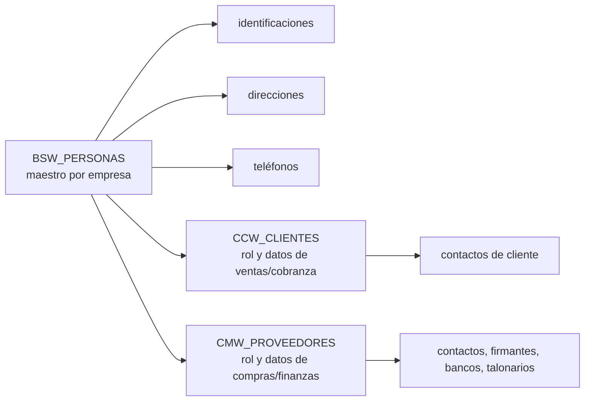

# Caracterización del legado para `business_partners`

- Estado: Caracterización aceptada; BP-D01 a BP-D10 confirmadas por producto
- Fecha: 2026-07-29
- Historia: [J11-S6-01](../../sprints/sprint-06/J11-S6-01-caracterizacion-business-partners.md)
- Fuente: `C:\cosme\multienvios\miaterra` en modo de solo lectura
- Confianza: alta para estructura y flujos observados; media para intención de negocio no documentada

## Propósito

Convertir el comportamiento relacionado con personas, clientes y proveedores del
sistema legado en requisitos neutrales para el primer plugin productivo. Este
documento no aprueba entidades, tablas, DTO, endpoints ni pantallas. Tampoco
certifica reglas tributarias o calidad de los datos existentes.

El análisis sigue una regla deliberada: una clase, columna o control visual del
legado es evidencia, no un contrato que deba copiarse.

## Alcance inspeccionado

Se revisaron, sin modificarlos, los siguientes grupos de fuentes:

| Grupo | Fuentes representativas | Información obtenida |
|---|---|---|
| persona maestra | `BswPersonas`, `BswPersonasJuridicas` | identidad interna, persona física/jurídica, nombres, datos de contacto y mezcla con otros dominios |
| colecciones de persona | `BswIdentPersonas`, `BswDirecPersonas`, `BswTelefPersonas` | múltiples documentos, direcciones y teléfonos asociados |
| rol cliente | `CcwClientes`, `CcwContactosClientes`, `CcwTipoCliente` | código y estado propios, contactos y numerosas relaciones de ventas/cobranzas |
| rol proveedor | `CcwProveedores`, `CmwContactosProveedor` | código y estado propios, contactos y relaciones de compras, bancos, contabilidad y logística |
| aplicación | `BswPersonasControlador`, `CcwClientesControlador`, `CcwProveedoresControlador` y EJB asociados | altas, modificaciones, creación rápida, validaciones y bajas físicas |
| interfaz | `BswPersonas.xhtml`, `CcwClientes.xhtml`, `CcwProveedores.xhtml` y fragmentos incluidos | operaciones visibles, campos obligatorios, filtros y autorización de pantalla |
| búsqueda | `SelectorPersonaService` | aislamiento por empresa y búsqueda por código, nombre, cédula o RUC |
| seguridad | `ConsultaPermisosControlador`, `ConsultaPermisosVentasControlador` y constantes de forma | permiso de acceso asociado a `BSPERFIS`, `CCCLIENT` y `CCWPROVE`, más permisos de insertar/borrar heredados |

Rutas relevantes bajo el proyecto legado:

```text
fuente/tag/src/main/java/py/com/ping/administracionBase/jpa/
fuente/tag/src/main/java/py/com/ping/administracionBase/cdi/
fuente/tag/src/main/java/py/com/ping/administracionBase/service/
fuente/tag/src/main/java/py/com/ping/cuentaCobrar/jpa/
fuente/tag/src/main/java/py/com/ping/cuentaCobrar/cdi/
fuente/tag/src/main/webapp/administracionBase/
fuente/tag/src/main/webapp/cuentasCobrar/
fuente/tag/src/main/webapp/controlStock/
```

## Glosario neutral propuesto

| Término nuevo | Significado | Términos observados en el legado |
|---|---|---|
| participante comercial | persona u organización que puede intervenir en relaciones comerciales | persona, cliente, proveedor, tercero |
| persona natural | ser humano identificado como participante | persona física |
| organización | entidad jurídica u organización comercial | persona jurídica, razón social, nombre comercial |
| rol comercial | condición de cliente o proveedor que un participante desempeña para una empresa | cliente, proveedor, banderas `cliente`/`proveedor` |
| identificación | documento o identificador externo de una persona u organización | cédula, RUC, tipo de documentación, identificación |
| canal de contacto | medio electrónico o telefónico para comunicarse | teléfono, celular, correo, WhatsApp, web |
| dirección | ubicación postal o física con finalidad declarada | dirección, domicilio, dirección de entrega |
| contacto nominal | persona de referencia dentro de una organización | contacto cliente, contacto proveedor, firmante |
| estado | disponibilidad actual sin destruir historia | activo, inactivo, bloqueado |

“Cliente” y “proveedor” no son dos personas distintas: son roles que pueden
coexistir sobre el mismo participante dentro de una empresa.

## Modelo observado



La separación física entre persona, cliente y proveedor es valiosa. El problema es
que las entidades de rol acumularon datos de otros dominios, mientras la persona
también conserva campos duplicados o transitorios de ventas.

## Comportamiento observado

### Persona maestra

- La persona pertenece a una empresa y posee un identificador interno y un código
  legible.
- Distingue persona física de jurídica, aunque los campos específicos aparecen
  dispersos entre `BswPersonas` y `BswPersonasJuridicas`.
- Una persona puede mantener varias identificaciones, direcciones y teléfonos.
- También existen columnas directas de RUC, cédula, dirección, teléfono y correo;
  por tanto hay representaciones duplicadas del mismo concepto.
- El formulario exige código y nombre. Su controlador exige además un correo
  principal con formato válido, aun cuando esa obligatoriedad no aparece clara en
  el modelo ni en todos los flujos rápidos.
- Al crear una persona con las banderas cliente o proveedor, el controlador crea
  el rol correspondiente usando inicialmente el mismo código.
- Al modificar, el controlador crea un rol faltante cuando la bandera está activa,
  pero no implementa la operación inversa al desmarcarla.
- La verificación de documento duplicado contiene un `TODO` y devuelve siempre
  falso. No existe evidencia suficiente para heredar una regla de unicidad.

### Búsqueda y selección

- El selector limita siempre por la empresa de la sesión.
- Busca coincidencia parcial, sin distinguir mayúsculas, por nombre, código de
  persona, cédula o RUC.
- Ordena por nombre y limita el autocompletado a 15 resultados.
- La etiqueta preferida combina código y nombre; el documento mostrado prioriza
  RUC y luego cédula.
- No se observó una búsqueda tipada por identificaciones múltiples; consulta las
  columnas directas, otra razón para no perpetuar ambas representaciones.

### Rol cliente

- Tiene código y estado propios por empresa y referencia una persona obligatoria.
- Los estados observados son activo, inactivo, bloqueado y bloqueado por crédito.
- El alta puede actualizar en la misma operación las identificaciones, teléfonos y
  direcciones de la persona.
- El EJB puede generar un código con `MAX(código numérico) + 1`. Esa estrategia no
  es segura ante concurrencia y presupone códigos numéricos.
- El rol mezcla vendedor, cobrador, condición de venta, límite y saldo de crédito,
  moneda, listas de precios, ruta/visita, cuentas contables y autorización de
  pedidos. Esos datos no pertenecen al maestro neutral.
- La pantalla lista código, nombre, vendedor, cobrador, condición de venta, tipo y
  estado; permite alta, edición y baja física según permisos.

### Rol proveedor

- Tiene código y estado propios por empresa y referencia una persona obligatoria.
- Contiene moneda, plazo, exención, cuentas contables, bancos, talonarios,
  certificaciones, firmantes y especializaciones logísticas.
- El controlador valida código y persona, y comprueba duplicidad de código mediante
  SQL nativo construido por concatenación. Ese mecanismo no debe reproducirse.
- La pantalla lista código, nombre, moneda, cuotas y estado; permite alta, edición
  y baja física.
- Algunos campos de contactos se reutilizan con significados incompatibles —por
  ejemplo, columnas llamadas DUNS, nacionalidad o código postal se muestran como
  dirección, correo o teléfono—. Son deuda técnica, no semántica del dominio.

### Seguridad observada

- Las páginas de persona y proveedor verifican permisos de consulta antes de
  renderizar el formulario.
- Los controladores usan identificadores de forma (`BSPERFIS`, `CCCLIENT`,
  `CCWPROVE`) y capacidades heredadas de insertar y borrar.
- Ocultar o renderizar controles es el patrón visible. La nueva solución debe
  aplicar autorización en el caso de uso del servidor, además de filtrar la UI.
- Los códigos concretos del legado sirven para reconocer las operaciones, no para
  convertirse en permisos públicos del plugin nuevo.

### Baja, historia y concurrencia

- Persona, cliente y proveedor disponen de baja física en controladores/EJB.
- No se encontró una política uniforme de archivo ni una explicación de cómo
  preservar referencias históricas.
- El manejo de errores depende en varios puntos de excepciones SQL y mensajes
  genéricos.
- No se observó un mecanismo consistente de versión optimista para estas entidades.

El modelo nuevo no debe asumir que la baja física es un requisito. Los documentos
y movimientos futuros necesitarán conservar referencias y snapshots aunque el
participante deje de operar.

## Matriz de separación de responsabilidades

| Dato o regla observada | Destino propuesto | Tratamiento |
|---|---|---|
| identidad interna, empresa, tipo de participante, nombre visible | `business_partners` | conservar de forma neutral |
| nombre legal y nombre comercial | `business_partners` | conservar, con reglas distintas por tipo |
| códigos de participante/cliente/proveedor | decisión de producto | definir estrategia antes del esquema |
| identificaciones, dígito verificador y vigencia | `business_partners` | colección normalizada; reglas fiscales versionables |
| correos, teléfonos, WhatsApp y web | `business_partners` | canales tipados, múltiples y con finalidad |
| direcciones y dirección predeterminada | `business_partners` | colección tipada; catálogo geográfico aún por decidir |
| contactos nominales y cargo | `business_partners` inicialmente | hijo liviano o vínculo entre participantes por decidir |
| rol cliente/proveedor y estado operativo | `business_partners` | roles separados sobre un mismo participante |
| límite, saldo y bloqueo por crédito | `accounts_receivable` o política de ventas | excluir del maestro |
| vendedor, cobrador, ruta y horario de visita | `sales`/`accounts_receivable`/`logistics` | excluir del maestro |
| condiciones de venta y listas de precio | `commercial_catalog`/`sales` | excluir del maestro |
| moneda, plazo, cuotas y obligaciones | `purchasing`/`accounts_payable` | excluir del maestro |
| cuentas contables | `accounting` | excluir del maestro |
| bancos y cuentas bancarias del proveedor | `treasury` o integración de pagos | excluir del maestro inicial |
| talonarios, documentos y certificaciones | plugin propietario futuro | excluir hasta caracterizar el proceso real |
| aseguradora, transportista, combustible, despachante | `logistics`/`purchasing` | capacidades o clasificaciones de esos dominios |
| datos para factura/remisión | `commercial_documents` | consumir ID y guardar snapshot histórico |
| XML, CDC, firma y respuestas fiscales | `sifen` | nunca forman parte del maestro |
| IP, sesión y usuario de auditoría embebidos | kernel de auditoría | no duplicar como campos de negocio |
| columnas con nombre y uso incompatibles | ninguno | corregir semántica; no migrar mecánicamente |

## Casos de uso neutrales candidatos

Los siguientes casos de uso expresan comportamiento, no interfaces Java ni rutas:

| ID | Caso de uso | Resultado esperado |
|---|---|---|
| BP-UC-01 | buscar participantes | resultados paginados de la empresa actual por código, nombre, identificación, rol y estado |
| BP-UC-02 | consultar detalle | maestro, roles, identificaciones, direcciones y contactos autorizados |
| BP-UC-03 | registrar participante | persona natural u organización con identidad técnica opaca y datos mínimos válidos |
| BP-UC-04 | modificar datos generales | actualización con versión esperada y conflicto explícito ante concurrencia |
| BP-UC-05 | administrar identificaciones | agregar, corregir o vencer documentos sin perder trazabilidad |
| BP-UC-06 | administrar direcciones y canales | múltiples valores tipados y un predeterminado por finalidad compatible |
| BP-UC-07 | administrar contactos nominales | contactos ordenados y con medios propios, sin reutilizar columnas ambiguas |
| BP-UC-08 | asignar o cambiar rol | cliente, proveedor o ambos con estado independiente y código según política aceptada |
| BP-UC-09 | inactivar/reactivar | impedir uso nuevo cuando corresponda sin borrar historia ni romper consumidores |
| BP-UC-10 | resolver referencia pública | entregar una vista pública mínima por `PartnerId`, nunca una entidad o tabla privada |
| BP-UC-11 | advertir posible duplicado | presentar coincidencias candidatas para revisión humana antes del alta o una futura fusión |

Una fusión automática de participantes no forma parte de Sprint 6. Requiere reglas
de supervivencia, referencias externas, auditoría y recuperación específicas.

## Actores y permisos candidatos

| Actor lógico | Necesidad | Permiso público candidato |
|---|---|---|
| consultor comercial/operativo | buscar y ver participantes | `business_partners.view` |
| gestor de maestros | crear y editar datos generales | `business_partners.manage` |
| gestor de roles | activar/inactivar cliente o proveedor | `business_partners.roles.manage` |
| responsable autorizado | inactivar/reactivar el participante completo | `business_partners.lifecycle.manage` |

Los nombres son propuestas para `J11-S6-02`. Cualquier comando deberá combinar
empresa confiable, plugin efectivo y permiso en el servidor. No habrá endpoints
funcionales cuando el plugin esté inactivo para la empresa.

## Restricciones arquitectónicas ya obligatorias

Estas reglas no esperan una nueva decisión de producto:

1. Todo dato se opera bajo `CompanyId` obtenido del contexto confiable; un ID de la
   solicitud no puede cambiar la empresa efectiva.
2. La identidad técnica del participante será opaca. RUC, cédula y códigos
   comerciales no serán claves primarias ni referencias entre plugins.
3. `business_partners` será dueño exclusivo de sus tablas y migraciones en
   `plg_business_partners`.
4. Otros plugins usarán IDs y contratos públicos; no habrá relaciones JPA, joins,
   repositorios, DTO internos o acceso a tablas privadas.
5. Los documentos comerciales conservarán snapshots históricos. Modificar el
   maestro no reescribirá una factura, nota o remisión emitida.
6. Autorización, validación de entrada, auditoría y aislamiento empresarial se
   aplicarán en el servidor, no solo en JSF.
7. Las pantallas serán Jakarta Faces 4.1, Material Design 3, responsive y
   personalizables solo mediante contratos y slots publicados.

## Invariantes de negocio propuestas

Requieren aceptación antes del diseño físico:

1. El código legible es único dentro de una empresa y de su ámbito aceptado; nunca
   se genera con `MAX + 1`.
2. Un participante puede existir sin rol comercial para permitir contactos,
   prospectos o una asignación posterior.
3. Un participante puede tener simultáneamente roles cliente y proveedor.
4. La persona natural exige nombre visible; la organización exige nombre legal o
   nombre visible según la política aceptada.
5. Cada identificación se normaliza conservando también el valor presentado. La
   aplicación advierte duplicados y la base protege solo la unicidad aprobada.
6. Puede existir como máximo un valor predeterminado activo por participante,
   categoría y finalidad para direcciones o canales de contacto.
7. El estado del participante y el estado de cada rol son independientes. Un rol
   inactivo no destruye el maestro ni el otro rol.
8. No existe baja física desde los casos de uso normales. Inactivar conserva datos,
   auditoría y referencias; una purga requerirá un procedimiento excepcional.
9. Toda modificación usa versión esperada; una edición concurrente produce un
   conflicto recuperable, no una sobrescritura silenciosa.
10. La asignación o inactivación de roles genera auditoría; un evento de integración
    solo se agregará cuando exista un consumidor real identificado.

## Decisiones pendientes

> Estado de decisión: BP-D01 a BP-D10 fueron confirmadas sin cambios por el
> responsable de producto el 2026-07-29. La tabla se conserva como registro de la
> recomendación aceptada y su impacto.

| ID | Pregunta | Recomendación inicial | Impacto |
|---|---|---|---|
| BP-D01 | ¿Puede existir un participante sin rol cliente/proveedor? | sí | agregado y flujo de alta |
| BP-D02 | ¿Se conserva un código general y códigos separados por rol? | código general obligatorio y código de rol opcional cuando el proceso lo necesite | claves candidatas, UI y contratos |
| BP-D03 | ¿Quién asigna los códigos y qué formato admiten? | manual o secuencia transaccional configurable; texto normalizado, nunca `MAX + 1` | concurrencia y migración |
| BP-D04 | ¿Qué unicidad tienen RUC/cédula? | advertir duplicado por empresa; restricción fuerte solo tras perfilar datos y reglas oficiales | datos y altas |
| BP-D05 | ¿El correo principal es obligatorio? | no para todo participante; exigirlo únicamente en procesos que realmente lo necesiten | validación y carga inicial |
| BP-D06 | ¿Un contacto nominal es un hijo liviano o otro participante relacionado? | hijo liviano en el primer corte, con migración futura explícita si necesita identidad comercial propia | modelo y UX |
| BP-D07 | ¿Cómo representar país, departamento y ciudad sin un catálogo dueño? | códigos ISO donde existan más texto histórico; no crear un módulo compartido genérico sin ADR | datos y contratos futuros |
| BP-D08 | ¿Qué estados iniciales se necesitan? | participante `ACTIVE/INACTIVE`; rol `ACTIVE/INACTIVE`; bloqueos de crédito quedan fuera | máquina de estados |
| BP-D09 | ¿Se permite baja física operativa? | no; inactivar y auditar | retención y referencias |
| BP-D10 | ¿Sprint 6 migra datos del legado o consulta DNIT? | no; ambos son proyectos posteriores con perfilado, respaldo e integración propios | alcance y calendario |

Las decisiones BP-D01 a BP-D10 alteran datos, compatibilidad, comportamiento o
alcance. Su aceptación autoriza `J11-S6-02` a convertirlas en dominio y contratos
neutrales; no autoriza todavía persistencia, migraciones, JPA o UI.

## Riesgos de migración futura

- códigos de persona, cliente y proveedor pueden coincidir o divergir;
- RUC/cédula están duplicados entre columnas directas y colecciones;
- pueden existir documentos repetidos porque la validación estaba incompleta;
- correos fueron obligatorios solo en determinados controladores;
- desmarcar un rol no realizaba la operación inversa;
- bajas físicas y claves foráneas pueden haber dejado poblaciones distintas;
- contactos de proveedor usan columnas con nombres semánticamente incorrectos;
- datos de otros dominios deberán migrarse a sus plugins propietarios, no perderse
  ni almacenarse provisionalmente en `business_partners`.

Antes de una migración real se necesitarán perfilado por empresa, conteos, reglas
de precedencia, informe de conflictos, respaldo, ensayo reversible y aceptación
del negocio. Esa migración no pertenece a Sprint 6.

## Conclusión

El comportamiento útil del legado sostiene un agregado neutral de participante con
roles cliente/proveedor coexistentes, identificaciones, direcciones y contactos.
No sostiene copiar `BswPersonas`, `CcwClientes` o `CcwProveedores`: las tres mezclan
responsabilidades, duplican datos o conservan decisiones técnicas inseguras.

La caracterización aceptada permite pasar a `J11-S6-02` para dominio y contratos
públicos. El esquema, las migraciones, JPA y la UI permanecen reservados para las
historias posteriores del Sprint.
