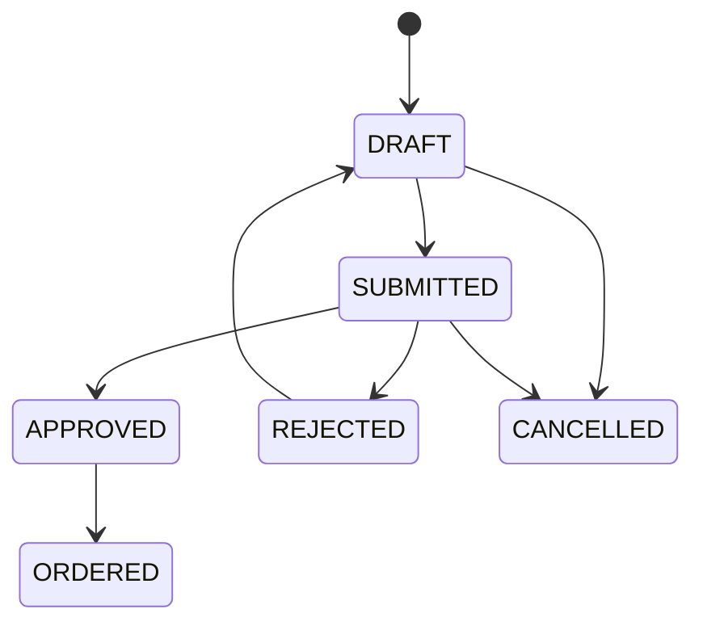
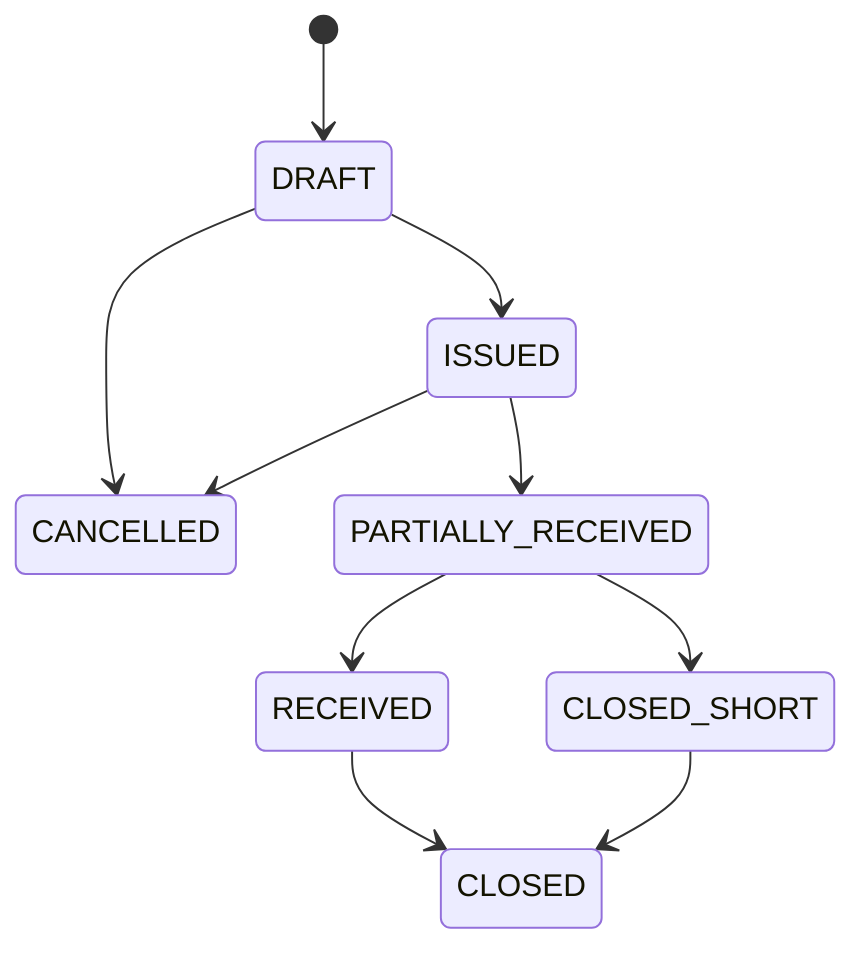

# Caracterización del legado para `purchasing`

- Fecha de inspección: 2026-08-11
- Proyecto observado: `C:\cosme\mega\miaterra\fuente\tag`
- Revisión observada: `7fa64a7313940527a1b16856fbbccbad38f7c916`
- Fecha de la revisión: 2026-08-10T20:47:41-03:00
- Modo de trabajo: solo lectura
- Base de datos consultada: no
- Estado: caracterización documental completa; PU-D01 a PU-D10 aceptadas sin cambios por producto el 2026-08-11
- Alcance futuro: cuarto plugin productivo de Smart ERP

## Propósito

Transformar el comportamiento útil de solicitudes, órdenes y recepciones de
compras del legado en lenguaje, casos de uso, invariantes y decisiones neutrales.
Este documento no aprueba entidades, tablas, contratos Java ni pantallas y no
autoriza copiar código `javax.*`, SQL, controladores o XHTML.

El legado mezcla en una misma familia funcional:

1. solicitud interna de bienes o servicios;
2. selección de proveedor y orden de compra;
3. factura o comprobante de compra;
4. autorización, provisión contable, retenciones y pago;
5. recepción y actualización de stock/costos;
6. rendiciones, anticipos, taller, importaciones y otros dominios.

`purchasing` será candidato a poseer los dos primeros grupos y la conformidad de
recepción/devolución. Los comprobantes fiscales, cuentas por pagar, pagos,
retenciones, asientos y valoración monetaria pertenecen a plugins posteriores.
Inventario conserva el libro de cantidades y recibe comandos mediante su contrato
público.

## Fuentes contrastadas

Las rutas pertenecen al proyecto legado actualizado y se consultaron sin
modificarlas:

| Área | Fuente principal | Evidencia observada |
|---|---|---|
| menú y permisos | `WEB-INF/menuTesoreria.xhtml`, `WEB-INF/menuStock.xhtml`, `ConsultaPermisosVentasControlador` y `ApplicationConstant` | “Solicitud Compra”, “Compras V2”, “Orden de Compra” y “Rec.Stock Pendientes” aparecen en menús distintos y usan permisos por forma |
| solicitud simple | `TswSolicitudCompra.xhtml`, `TswSolicitudCompraControlador.java`, `TswSolicitudCompra.java` y `TswSolicitudCompraDet.java` | proveedor obligatorio, usuario, estado, aprobador, fecha de aprobación y detalle con descripción, cantidad, precio y total |
| orden/solicitud operativa | `StwCOOrdenCompra.xhtml`, `StwCOOrdenCompraControlador.java`, `StwOrdenCompra.java`, `StwOrdenCompraDet.java` y sus componentes | número generado, solicitante, revisor, proveedor, moneda, sucursal, fecha estimada, detalle previsto/final, totales y estado |
| historial de orden | `StwOrdenCompraHistorico.java` y `StwOrdenCompraHistoricoCarga.java` | cambios de estado/clasificación conservan fecha y usuario, pero dependen de entidades internas compartidas |
| estados | `EstadoSolicitud.java`, campos `estado` y lógica de controladores | códigos de una letra mezclan registrado, confirmado, anticipo pagado, pago total, recibido y anulado |
| tipo de compra | `TipoCompra.java` | enumera local e importación dentro de la misma entidad |
| comprobante de compra | `TswCOComprasV2.xhtml`, `TswComprasControlador.java` y `docs/tesoreria/TswCOComprasV2.md` | documento, proveedor, moneda, artículos, IVA, cuotas, cuentas, tickets y otras relaciones; es más amplio que una orden de compra |
| vínculo orden/comprobante | `TswComprobanteOrdenCompra.java` y relaciones de `StwOrdenCompra` | relación JPA directa entre la orden de stock y el comprobante de tesorería |
| proceso financiero | `TswProcesoCompra.java`, `TswPasosCompras.java` y `ProProcesoCompraEJB.java` | autorización, asiento, pago, retención, caja, cuota y orden de pago conviven en el proceso denominado compra |
| recepción | `StwCOComprasPendientes.xhtml`, `StwCOComprasPendientesControlador.java` y `docs/controlStock/StwCOComprasPendientes.md` | la recepción parte del comprobante de compra, normaliza cantidades y confirma entrada de stock |
| artículo y unidad | `StwOrdenCompraDet.java`, `TswSolicitudCompraDet.java` y selectores XHTML | JPA directo a artículo/categoría y cantidades previstas/finales con precio unitario |
| proveedor | relaciones a `CcwProveedores`, selectores y alta rápida de Compras V2 | selección y alta se realizan desde pantallas de compra, con acoplamiento a persona, proveedor y cuenta bancaria |

No se consultó la base de datos local. Los nombres de tablas y relaciones fueron
inferidos de JPA y documentación versionada; no se verificaron triggers, índices,
restricciones reales ni datos históricos. Esa revisión deberá hacerse en modo de
solo lectura antes de diseñar una migración de datos.

## Lenguaje neutral

| Término legado | Término candidato | Interpretación |
|---|---|---|
| solicitud compra / pedido producto | solicitud de compra | necesidad interna todavía no comprometida con un proveedor |
| orden compra | orden de compra | compromiso emitido a un proveedor con cantidades, precios y condiciones esperadas |
| detalle previsto | línea ordenada | cantidad y precio acordados en la orden |
| detalle final | cantidad recibida acumulada | resultado de una o más recepciones, nunca edición silenciosa de lo ordenado |
| compras V2 | comprobante de proveedor | documento fiscal/comercial recibido; queda fuera del primer corte de `purchasing` |
| recepción stock pendiente | recepción de compra | conformidad de cantidades contra una orden y comando idempotente hacia inventario |
| devolución | devolución a proveedor | salida posterior, trazable y vinculada a una recepción/línea de orden |
| proveedor | socio comercial con rol proveedor | referencia resuelta desde `business_partners` |
| artículo | concepto de catálogo | referencia resuelta desde `commercial_catalog` |
| sucursal/deposito | destino de entrega | depósito y ubicación resueltos desde `inventory` cuando la línea maneja stock |
| estado de una letra | ciclo de vida explícito | enum estable con transiciones autorizadas y registro de actor/fecha |
| precio/costo | precio esperado de compra | valor de la orden; no es todavía costo de inventario ni asiento contable |
| proceso compra | proceso financiero posterior | cuentas por pagar, pago, retención y asiento fuera de `purchasing` |

## Comportamiento observado y requisito neutral

| ID | Observación del legado | Requisito neutral candidato | Tratamiento |
|---|---|---|---|
| PU-O01 | menús de Tesorería y Stock comparten el concepto compra | un plugin `purchasing` con límites propios, menús por tarea y permisos de capacidad | separar |
| PU-O02 | existen dos modelos de solicitud/orden parcialmente superpuestos | solicitud y orden son agregados distintos con identidad y ciclo propios | corregir |
| PU-O03 | una solicitud simple exige proveedor | permitir necesidad interna sin proveedor; el proveedor es obligatorio al emitir una orden | ampliar; PU-D01 |
| PU-O04 | el detalle acepta descripción y, en otro flujo, artículo | permitir línea de catálogo o descripción libre con clase de cumplimiento explícita | conservar y endurecer; PU-D02 |
| PU-O05 | número visible usa `MAX + 1` | secuencia transaccional por empresa/tipo y UUID separado para identidad/idempotencia | corregir |
| PU-O06 | estados de una letra mezclan compra, pago y recepción | ciclos independientes para solicitud, orden, recepción y devolución | corregir; PU-D03 |
| PU-O07 | anticipo y pago total son estados de la orden | pagos pertenecen a tesorería/cuentas por pagar; `purchasing` sólo expone referencia pública futura | excluir |
| PU-O08 | precio total se recalcula como cantidad por precio | conservar cálculo determinista, moneda y precisión; totales derivan de líneas vigentes | conservar; PU-D05 |
| PU-O09 | orden conserva cantidad prevista y final en la misma fila | recepciones append-only acumulan cumplimiento sin reescribir la cantidad ordenada | corregir; PU-D06 |
| PU-O10 | recepción parte del comprobante fiscal, no de la orden | recibir contra orden emitida; el comprobante podrá asociarse después por ID público | corregir |
| PU-O11 | recepción actualiza stock y maestro de costos/precios | `purchasing` confirma recepción; `inventory` registra cantidades; costo/precio/contabilidad quedan fuera | separar |
| PU-O12 | proveedor, persona y cuenta bancaria se navegan por JPA | resolver proveedor por `BusinessPartnerDirectory`; cuentas/pagos no forman parte de la orden V1 | corregir |
| PU-O13 | artículo, categoría y unidad se navegan por JPA | resolver ítem y conversión por contratos públicos del catálogo y guardar snapshot | corregir |
| PU-O14 | moneda es entidad JPA interna | resolver código/escala/publicación mediante `reference-data-api` | corregir |
| PU-O15 | la orden puede relacionarse directamente con comprobantes, rendiciones, liquidaciones, taller, ventas e importación | usar referencias neutrales y contratos; no JPA, DTO ni SQL cruzados | corregir |
| PU-O16 | existe historial de estado, pero el agregado sigue siendo editable | conservar eventos/historia append-only y limitar edición por estado/versión | endurecer |
| PU-O17 | el flujo distingue compra local e importación | V1 cubre compra local; importación se difiere hasta modelar embarque, gastos y nacionalización | acotar; PU-D01 |
| PU-O18 | la UI permite clonar solicitudes | clonar crea borrador nuevo sin copiar estado, aprobaciones, recepciones ni vínculos externos | conservar |
| PU-O19 | la selección de artículos y proveedores puede crecer mucho | búsqueda paginada en servidor; no cargar catálogos completos en el navegador | corregir |
| PU-O20 | la autorización se deriva de forma/pantalla y pasos financieros | permisos por capacidad y revalidación en aplicación, empresa y plugin activo | corregir |
| PU-O21 | no se encontró un flujo claro de devolución a proveedor en las fuentes revisadas | modelar devolución explícita y compensatoria, sin borrar recepción ni movimiento | requisito nuevo; PU-D07 |
| PU-O22 | no se encontró tolerancia formal de sobre-recepción | prohibir sobre-recepción en V1; cierre corto requiere acción explícita | endurecer; PU-D06 |
| PU-O23 | cambios de estado y cálculos carecen de una clave idempotente común | todo comando mutable externo lleva `commandId`/clave idempotente y versión esperada | corregir; PU-D09 |
| PU-O24 | comprobante, retención, asiento y pago están dentro del “proceso compra” | exponer puntos de integración futuros, pero no poseer deuda, asiento, retención ni pago | separar |
| PU-O25 | formularios mezclan gran cantidad de datos y pestañas de otros módulos | crear recorridos pequeños: solicitudes, órdenes, recepciones y devoluciones | corregir |

## Deudas que no deben heredarse

- Una misma entidad actúa como solicitud, orden, anticipo, rendición y referencia
  de comprobante.
- Estados de pago y recepción modifican el ciclo de una orden de compra.
- Relaciones JPA atraviesan stock, tesorería, contabilidad, ventas, taller,
  agricultura e importaciones.
- El número operativo se genera con `MAX + 1`.
- Cantidad prevista y final pueden modificarse en la misma línea sin una recepción
  inmutable que explique la diferencia.
- La recepción depende de una factura pendiente, no de una orden emitida.
- La actualización de costo, porcentaje y precio del artículo ocurre junto con la
  entrada física.
- La solicitud simple exige proveedor aunque una necesidad interna todavía pueda
  no tenerlo.
- Un selector puede cargar listas completas y navegar objetos de otros módulos.
- Los permisos se expresan por forma y los pasos de compra incluyen acciones
  financieras ajenas.
- No se observó una devolución a proveedor completa, idempotente y trazable.
- No existe política contractual visible para sobre-recepción, cierre corto,
  concurrencia o reintentos.

## Frontera candidata del plugin

`purchasing` sería propietario de:

- solicitudes de compra y líneas;
- envío, aprobación, rechazo, cancelación y clonación segura de solicitudes;
- órdenes de compra locales y líneas;
- emisión, cancelación y cierre de órdenes;
- asignación parcial de líneas aprobadas a una o más órdenes;
- recepciones parciales/finales contra orden;
- devoluciones a proveedor contra cantidades recibidas no devueltas;
- snapshots históricos de proveedor, ítem, unidad, moneda, precio y condiciones;
- secuencias visibles, versión optimista, idempotencia y auditoría funcional;
- consultas y comandos públicos mínimos para consumidores autorizados.

Quedan fuera:

| Responsabilidad | Propietario |
|---|---|
| identidad y rol del proveedor | `business_partners` por API pública |
| ítem, tipo, nombre, unidad y conversiones | `commercial_catalog` por API pública |
| moneda y escala oficial | `reference_data` por API pública |
| depósito, ubicación y libro de cantidades | `inventory` por API pública |
| factura/nota del proveedor y su representación fiscal | `commercial_documents` futuro |
| deuda, vencimientos, retenciones y pago | cuentas por pagar/`treasury` futuros |
| costo promedio, FIFO y valoración | `costing` futuro |
| asientos y períodos | `accounting` futuro |
| importación, embarque, nacionalización y gastos asociados | alcance futuro específico |
| transporte, ruta y entrega externa | `logistics` futuro |

No existirán relaciones JPA, SQL directo ni claves foráneas hacia esquemas de
otros plugins.

## Ciclos de vida candidatos

La solicitud conserva cada decisión de aprobación/rechazo. `ORDERED` significa
que toda su cantidad aprobada fue asignada o cerrada explícitamente; una línea
puede alimentar varias órdenes.

Una orden emitida no se reescribe. Las correcciones comerciales posteriores se
modelan mediante cancelación permitida, cierre corto o una orden nueva. Una
recepción confirmada se corrige con devolución o reversión autorizada del efecto,
nunca borrándola.

## Casos de uso neutrales candidatos

| ID | Caso de uso | Resultado esperado |
|---|---|---|
| PU-UC-01 | crear solicitud | borrador empresarial con solicitante, necesidad y al menos una línea válida |
| PU-UC-02 | editar/clonar borrador | cambia sólo un borrador; clon crea identidad e historia nuevas |
| PU-UC-03 | enviar solicitud | versión congelada pasa a revisión con actor y fecha |
| PU-UC-04 | aprobar o rechazar | decisión autorizada, motivo de rechazo y registro append-only |
| PU-UC-05 | cancelar solicitud | impide nuevas órdenes sin borrar datos ni asignaciones existentes |
| PU-UC-06 | buscar proveedor | página de socios activos con rol `SUPPLIER`, aislada por empresa |
| PU-UC-07 | crear orden desde solicitud | asigna cantidades aprobadas sin superar el saldo de cada línea |
| PU-UC-08 | crear orden directa | borrador con justificación y permiso específico |
| PU-UC-09 | emitir orden | congela proveedor, moneda, líneas, precios, condiciones y número visible |
| PU-UC-10 | consultar/descargar orden | vista histórica reproducible sin consultar datos actuales para reemplazar snapshots |
| PU-UC-11 | cancelar orden | sólo si sus recepciones confirmadas permiten la transición; conserva causa |
| PU-UC-12 | registrar recepción | borrador contra líneas abiertas y destino válido de inventario |
| PU-UC-13 | confirmar recepción | registra recepción e inventario idempotentemente en una frontera transaccional |
| PU-UC-14 | recibir parcialmente | acumula cantidades sin alterar la cantidad ordenada |
| PU-UC-15 | cerrar faltante | cierra saldo no recibido con motivo y permiso reforzado |
| PU-UC-16 | registrar devolución | cantidad no supera lo recibido menos devoluciones previas |
| PU-UC-17 | confirmar devolución | conserva devolución y registra salida idempotente en inventario |
| PU-UC-18 | consultar cumplimiento | ordenado, recibido, devuelto, pendiente y cerrado por línea |
| PU-UC-19 | resolver reintento | devuelve el resultado previo sin duplicar orden, recepción o movimiento |
| PU-UC-20 | inactivar dependencia externa | impide nuevas operaciones, pero conserva historia y correcciones autorizadas |

## Invariantes candidatas

| ID | Invariante |
|---|---|
| PU-I01 | toda entidad y consulta operativa pertenece a una empresa no nula |
| PU-I02 | identidad técnica y número visible son distintos; el número es único por empresa/tipo |
| PU-I03 | una solicitud enviada posee al menos una línea positiva y una justificación no vacía |
| PU-I04 | una solicitud puede no tener proveedor; una orden emitida tiene exactamente uno activo con rol proveedor |
| PU-I05 | una línea tiene descripción histórica y, opcionalmente, ID público de catálogo |
| PU-I06 | cantidades son positivas, usan escala acordada y no se redondean silenciosamente |
| PU-I07 | el precio no puede ser negativo y usa la escala de la moneda resuelta |
| PU-I08 | el total de orden es la suma reproducible de sus líneas y ajustes explícitos permitidos |
| PU-I09 | una línea aprobada no se asigna a órdenes por encima de su cantidad aprobada |
| PU-I10 | una orden emitida no permite reemplazar proveedor, moneda, unidad, cantidad ni precio |
| PU-I11 | cada transición de estado valida estado previo, versión, empresa, permiso y plugin activo |
| PU-I12 | aprobador y solicitante pueden coincidir sólo si una política futura lo autoriza; V1 exige separación |
| PU-I13 | una recepción confirmada referencia una orden emitida y líneas abiertas de la misma empresa |
| PU-I14 | recibido acumulado no supera ordenado en V1 |
| PU-I15 | una devolución no supera recibido confirmado menos devuelto confirmado |
| PU-I16 | líneas `STOCK` requieren ítem inventariable, depósito y ubicación válidos |
| PU-I17 | líneas `NON_STOCK` o `SERVICE` no crean movimientos de inventario |
| PU-I18 | confirmación de recepción/devolución y comando de inventario no dejan estados parciales visibles |
| PU-I19 | todo comando mutable tiene clave idempotente única por empresa y fuente |
| PU-I20 | una recepción, devolución o decisión confirmada no se edita ni se elimina |
| PU-I21 | una corrección conserva original, causa, actor, fecha y vínculo compensatorio |
| PU-I22 | snapshots históricos no se reescriben cuando proveedor, ítem, unidad o moneda cambian |
| PU-I23 | búsquedas externas son paginadas y revalidan la selección al confirmar |
| PU-I24 | contratos públicos no exponen entidades, tablas, DTO internos ni detalles JPA |
| PU-I25 | la factura, deuda, pago, retención, costo y asiento no son estados internos de la orden |
| PU-I26 | desactivar el plugin impide endpoints, menús y comandos sin borrar tablas ni datos |

## Snapshots históricos candidatos

| Agregado | Datos mínimos a conservar |
|---|---|
| solicitud | solicitante, fecha necesaria, centro/justificación textual, descripción, cantidad, unidad presentada, ítem/versión opcional |
| orden | proveedor ID/código/nombre/versión, moneda/código/escala/publicación, fecha, condiciones, dirección/instrucción textual aprobada, líneas y totales |
| línea de orden | ítem ID/código/nombre/tipo/versión opcional, descripción final, clase `STOCK`/`NON_STOCK`/`SERVICE`, unidad presentada/base, factor, cantidad, precio y total |
| recepción | orden/línea, cantidad presentada/base, destino, lote/serie/vencimiento cuando aplique, actor, fecha y referencia de movimiento |
| devolución | recepción/línea origen, cantidad, causa, destino/origen de inventario, actor, fecha y referencia de movimiento |

El contrato público actual de `business_partners` sólo expone ID, código, nombre,
tipo, estado, roles y versión. RUC, dirección y contacto no deben obtenerse por SQL
o JPA; se incorporarán al snapshot únicamente después de extender de forma
versionada el contrato propietario o mediante datos explícitos validados que no
suplanten la fuente maestra.

## Dependencias y contratos candidatos

| Dependencia | Uso permitido |
|---|---|
| `business-partners-api` | buscar y revalidar proveedor activo con rol `SUPPLIER`; capturar snapshot público |
| `commercial-catalog-api` | buscar/revalidar ítem, tipo, alcance, unidad base y conversión; capturar snapshot |
| `reference-data-api` | validar moneda habilitada, escala/unidad menor y publicación |
| `inventory-api` | consultar destino/disponibilidad cuando aplique y contabilizar `RECEIPT` o `ISSUE` idempotente |
| kernel/plugin API | empresa confiable, identidad, autorización, auditoría, activación y contribuciones técnicas |

`purchasing-api` debería comenzar como Java puro y exponer sólo IDs, estados y
proyecciones pequeñas. No se agregará outbox hasta existir un productor y
consumidor reales aprobados. La integración síncrona con inventario puede usar la
frontera pública `InventoryMovements`; la historia de dominio deberá verificar si
el contrato actual necesita un motivo, referencia o consulta adicional sin
romper compatibilidad.

## Decisiones para confirmación de producto

### PU-D01 - Alcance inicial y proveedor en la solicitud

Alternativas:

1. copiar el flujo legado y exigir proveedor desde la solicitud;
2. permitir solicitud sin proveedor y exigirlo al emitir la orden;
3. incluir además importaciones, anticipos, rendiciones y pagos.

**Recomendación:** alternativa 2. El primer corte cubre compra local. Una necesidad
interna puede ser neutral al proveedor; la orden emitida requiere un proveedor
activo. Importación y finanzas se difieren.

Estado: **aceptada sin cambios el 2026-08-11**.

### PU-D02 - Tipos de línea

Alternativas:

1. aceptar sólo productos existentes en catálogo;
2. aceptar sólo descripción libre;
3. aceptar catálogo o descripción libre, clasificando cumplimiento como `STOCK`,
   `NON_STOCK` o `SERVICE`.

**Recomendación:** alternativa 3. Una línea `STOCK` exige producto inventariable;
las demás conservan descripción/unidad y no afectan inventario.

Estado: **aceptada sin cambios el 2026-08-11**.

### PU-D03 - Aprobación y ciclos

Alternativas:

1. un solo estado editable;
2. copiar códigos de una letra y pasos financieros;
3. ciclos separados, una aprobación explícita de solicitud y permiso reforzado
   para emitir/cerrar órdenes.

**Recomendación:** alternativa 3. V1 exige separación solicitante/aprobador y no
implementa un motor configurable de workflow.

Estado: **aceptada sin cambios el 2026-08-11**.

### PU-D04 - Relación solicitud/orden

Alternativas:

1. una solicitud produce exactamente una orden;
2. copiar líneas libremente sin saldo;
3. asignación por cantidad: una solicitud puede alimentar varias órdenes y una
   orden puede consolidar líneas aprobadas compatibles.

**Recomendación:** alternativa 3, con vínculo append-only y saldo ordenable por
línea. La orden directa requiere justificación y permiso específico.

Estado: **aceptada sin cambios el 2026-08-11**.

### PU-D05 - Moneda, precio e impuestos

Alternativas:

1. trabajar sólo en moneda base;
2. guardar montos sin publicación ni escala;
3. moneda por orden validada en `reference_data`, importes con su escala y precios
   esperados; impuestos fiscales y tipo de cambio contable fuera de V1.

**Recomendación:** alternativa 3. La orden no es una factura fiscal. Puede
conservar un texto/estimación comercial de impuesto, pero el cálculo fiscal
canónico pertenece al documento del proveedor futuro.

Estado: **aceptada sin cambios el 2026-08-11**.

### PU-D06 - Recepción y tolerancias

Alternativas:

1. editar cantidad final en la orden;
2. permitir recepciones append-only parciales con sobre-recepción configurable;
3. permitir recepciones append-only parciales, prohibir sobre-recepción en V1 y
   cerrar faltantes explícitamente.

**Recomendación:** alternativa 3. Confirmar una línea `STOCK` y su movimiento de
inventario forma una única frontera transaccional e idempotente.

Estado: **aceptada sin cambios el 2026-08-11**.

### PU-D07 - Devolución a proveedor

Alternativas:

1. borrar o reducir la recepción;
2. registrar sólo una salida manual de inventario;
3. devolución propia, vinculada a recepción/línea y movimiento compensatorio.

**Recomendación:** alternativa 3. No puede exceder el neto recibido y conserva
causa, actor, fecha y referencia de inventario. La nota de crédito fiscal es otro
documento futuro.

Estado: **aceptada sin cambios el 2026-08-11**.

### PU-D08 - Snapshots históricos

Alternativas:

1. mostrar siempre datos actuales de maestros;
2. copiar entidades completas;
3. guardar IDs públicos y snapshots mínimos de proveedor, ítem, unidad y moneda.

**Recomendación:** alternativa 3. No se leerán tablas privadas para completar RUC,
dirección o contacto; cualquier ampliación nace en el contrato propietario.

Estado: **aceptada sin cambios el 2026-08-11**.

### PU-D09 - Correcciones, concurrencia e idempotencia

Alternativas:

1. permitir editar/eliminar registros confirmados;
2. usar sólo versión optimista;
3. versión esperada más clave idempotente, historia append-only y operaciones
   compensatorias.

**Recomendación:** alternativa 3. Los reintentos devuelven el mismo resultado y
las transiciones inválidas fallan sin efectos parciales.

Estado: **aceptada sin cambios el 2026-08-11**.

### PU-D10 - Contratos y eventos

Alternativas:

1. importar entidades de otros plugins;
2. duplicar catálogos y saldos dentro de compras;
3. APIs Java puras, IDs/proyecciones neutrales y llamada pública síncrona a
   inventario; eventos sólo con consumidor real.

**Recomendación:** alternativa 3. Dependencias requeridas iniciales:
`business_partners`, `commercial_catalog`, `reference_data` e `inventory`. No hay
JPA ni SQL cruzado.

Estado: **aceptada sin cambios el 2026-08-11**.

## Matriz de pruebas acumuladas propuesta

Por decisión de producto del 2026-08-11, estas pruebas no se ejecutarán por cada
historia y deben quedar pendientes hasta la candidata comercializable:

| Nivel | Cobertura mínima pendiente |
|---|---|
| dominio | estados, cantidades, dinero, asignaciones, recepciones, devoluciones e idempotencia |
| contratos | compatibilidad de `purchasing-api` y consumidores de APIs públicas |
| arquitectura | Java puro en API/dominio y ausencia de imports/JPA/SQL cruzados |
| PostgreSQL | aislamiento por empresa, restricciones, concurrencia, secuencias, migración e idempotencia |
| JTA | orden/recepción/devolución e inventario sin confirmaciones parciales |
| seguridad | plugin inactivo, empresa ajena, permiso ausente, versión obsoleta y selección manipulada |
| composición | WAR/migrador con plugin presente/ausente y dependencias rechazadas si faltan |
| Docker | migraciones reales/idempotentes, health, persistencia y recreación |
| interfaz | 375/720/1280 px, teclado, foco, estados vacío/error y ausencia de overflow |
| regresión | `mvn verify`, ArchUnit, OIDC, kernel, socios, catálogo, referencia e inventario |

## Preguntas de datos pendientes antes de migrar

- Cardinalidad y calidad real de `stw_orden_compra`, `stw_orden_compra_det`,
  `tsw_solicitud_compra` y sus historiales.
- Significado efectivo de cada código de estado por empresa y flujo.
- Órdenes con proveedor, moneda, unidad o ítem nulos/inactivos.
- Diferencias entre cantidad prevista, final, comprobada y recibida.
- Duplicados producidos por numeración `MAX + 1`.
- Relaciones múltiples entre orden y comprobantes.
- Recepciones parciales, anulaciones y devoluciones representadas indirectamente.
- Triggers, vistas, funciones o integraciones no visibles en JPA.
- Datos de importación, anticipos y rendiciones que no deben ingresar a V1.

La inspección de esos datos requiere autorización separada para consultar una base
local de solo lectura. Ninguna migración se diseña por inferencia de código.

## Resultado

El legado confirma la necesidad de separar solicitud, orden, recepción,
comprobante fiscal y proceso financiero. Producto aceptó PU-D01 a PU-D10 sin
cambios el 2026-08-11, por lo que Smart ERP puede iniciar `purchasing-api` y el
dominio neutral en J11-S9-02. Tablas, migraciones y pantallas pertenecen a
historias posteriores.
