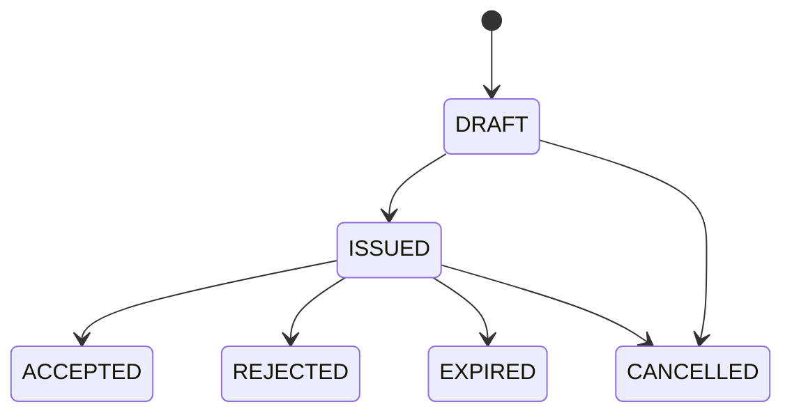
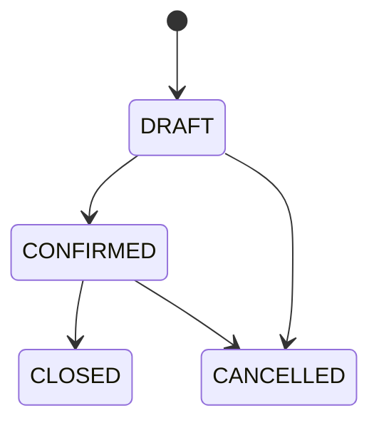

# Caracterización del legado para `sales`

- Fecha de inspección: 2026-08-20
- Proyecto observado: `C:\cosme\mega\miaterra\fuente\tag`
- Revisión: `ca5bdd74395182f69a9f876be7eb72f9ded0b2a7` (2026-08-13T14:31:44-03:00)
- Método: código y PostgreSQL 16.9 local en solo lectura
- Estado: SA-D01 a SA-D10 aceptadas sin cambios el 2026-08-20
- Alcance futuro: quinto plugin ERP de Smart ERP

## Propósito

Transformar presupuestos, pedidos, precios y compromisos del legado en requisitos
neutrales. No autoriza copiar código, tablas, controladores o XHTML ni adelantar
facturación, cobros, cuentas por cobrar, entrega, transporte o punto de venta.

## Fuentes contrastadas

| Área | Fuentes | Evidencia |
|---|---|---|
| menú y pantallas | `WEB-INF/menuVentas.xhtml`, `VtwMovPresupuesto2.xhtml`, `VtwPedidosGuiasV2.xhtml` | presupuesto, preventa, pedido y guía comparten navegación |
| aplicación | `VtwCOPresupuestoControlador`, `VtwPedidosGuiasControlador`, `PresupuestoService` | precio, descuento, stock, condición, anulación, clonación, factura, cobro y remisión conviven |
| modelo | `VtwPresupuestosCabecera/Detalle`, `VtwPedidosCabecera/Detalle` | dos modelos superpuestos y numerosas relaciones directas |
| UI V2 | `ventas/PreventaV2/` | cliente, lista, condición, artículos, cantidades, descuentos y totales |
| precios | `docs/ventas/VtwPedidosGuiasV2.md` y `CU-001-lista-precio-facturacion-v2.md` | lista por cliente/empresa y recálculo al cambiarla |
| destino | APIs de Socios, Catálogo, Referencia e Inventario | cliente, precio versionado, moneda, disponibilidad y reserva ya tienen contratos públicos |

## Evidencia de base local

La consulta usó una transacción `READ ONLY`, columnas específicas, agregados y
cinco registros recientes. No ejecutó escrituras, DDL, migraciones, funciones con
efecto ni volcados. Clientes, usuarios, IDs internos e importes se protegieron.

| Objeto | Filas |
|---|---:|
| `public.vtw_presupuestos_cabecera` | 0 |
| `public.vtw_presupuestos_detalle` | 0 |
| `public.vtw_pedidos_cabecera` | 1.021 |
| `public.vtw_pedidos_detalle` | 2.637 |

El modelo activo concentra la preventa en `vtw_pedidos_*`. Los estados observados
fueron `F` (543), nulo (399), `A` (73) y `P` (6). `PED-001-431` conserva moneda y
condición, no lista de precios, y una línea con cantidad 1 y facturada 0.
`PED-001-420` tiene cantidad 1, facturada 1 y estado `F`.

La cabecera posee 21 claves foráneas. Las cuatro tablas tienen triggers genéricos
`tbl_atributos_*`; el detalle también tiene
`vtw_actualiza_agw_solicitud_productor`, un cruce agrícola que no se trasladará.
Docker estaba detenido y aún no existe un esquema destino `sales` que comparar.

## Lenguaje neutral

| Legado | Smart ERP | Tratamiento |
|---|---|---|
| presupuesto / preventa | presupuesto de venta | oferta con vigencia; no reserva stock |
| pedido / guía | pedido de venta | compromiso confirmado |
| cliente | socio con rol `CLIENT` | referencia pública y snapshot |
| artículo / servicio | ítem de catálogo | referencia, tipo, unidad y versión públicas |
| lista / precio fijo | cotización de precio | decisión versionada y snapshot |
| condición de venta | condición comercial | catálogo empresarial de Ventas; no crea deuda |
| existencia | disponibilidad | consulta exacta a Inventario |
| bloqueo implícito | reserva de stock | contrato idempotente vinculado al pedido |
| cantidad facturada | consumo posterior | hecho de otro plugin, no factura dentro de Ventas |
| estado nulo/letra | ciclo explícito | enum cerrado y transición autorizada |

## Hallazgos y requisitos

| ID | Observación | Requisito neutral |
|---|---|---|
| SA-O01 | las tablas históricas de presupuesto están vacías | crear `SalesQuote`, no portar ambos modelos |
| SA-O02 | la preventa activa vive en pedidos | separar presupuesto y pedido |
| SA-O03 | pedido, factura, cobro, guía y transporte comparten entidad | limitar `sales` al compromiso |
| SA-O04 | 399 pedidos tienen estado nulo | estado explícito desde el alta |
| SA-O05 | `F` y cantidad facturada forman parte del pedido | facturación será consumidor posterior |
| SA-O06 | cambiar lista recalcula líneas | usar `CatalogPricing` y congelar versión/precio |
| SA-O07 | precio/descuento se editan con permisos heredados | permiso y motivo específicos |
| SA-O08 | se consulta stock sin reserva durable | presupuesto consulta; pedido confirmado reserva |
| SA-O09 | la cabecera tiene 21 FKs | IDs y APIs públicas, sin JPA/SQL cruzado |
| SA-O10 | entrega, guía y remisión viven en pedido | diferir logística |
| SA-O11 | anticipos, recibos y pagos aparecen en el controlador | diferir finanzas |
| SA-O12 | un trigger cruza hacia agricultura | reemplazar por contratos/eventos del propietario |
| SA-O13 | desanular vuelve el estado a nulo | cancelar o reemplazar con historia |
| SA-O14 | la clonación copia una entidad extensa | clonar sólo un borrador seguro |
| SA-O15 | numeración usa servicios compartidos | secuencia empresarial separada del UUID |
| SA-O16 | la descripción libre complementa un artículo | V1 exige ítem; descripción es snapshot |
| SA-O17 | impuesto se edita en UI | conservar modo tributario cotizado por Catálogo |
| SA-O18 | lista/condición pueden faltar | condición requerida al emitir; lista según política |
| SA-O19 | no hay versión/idempotencia común visible | versión esperada e idempotencia en mutaciones |
| SA-O20 | informes leen tablas directamente | consultas públicas mínimas |

## Frontera aceptada

`sales` poseerá presupuestos, pedidos, líneas, vínculo de origen, condiciones
comerciales, snapshots, importes, excepciones autorizadas, referencias de reserva,
numeración, versión, idempotencia, auditoría e historia.

Quedan fuera factura, nota, remisión, SIFEN, cobro, deuda, cuota, crédito,
anticipo, preparación, despacho, transporte, entrega, POS, caja, turno, mesa,
delivery, producción, agricultura, taller, comisión, asiento, ingreso y costo.

## Ciclos aceptados

Aceptar crea una sola vez un pedido distinto y conserva el vínculo de origen.

Confirmar reserva todas las líneas de stock en una unidad lógica; cancelar libera
el remanente. Cerrar no afirma factura, cobro o entrega.

## Casos de uso candidatos

| ID | Caso | Resultado |
|---|---|---|
| SA-UC-01 | crear/cotizar presupuesto | borrador con cliente, vigencia, precio y líneas |
| SA-UC-02 | emitir/aceptar/rechazar/vencer | transición auditada; aceptación idempotente |
| SA-UC-03 | crear pedido directo | borrador sin presupuesto de origen |
| SA-UC-04 | confirmar pedido | validación y reservas atómicas |
| SA-UC-05 | cancelar/cerrar pedido | compensación o cierre sin borrar historia |
| SA-UC-06 | clonar documento | borrador nuevo y seguro |
| SA-UC-07 | administrar condiciones | alta, consulta e inactivación histórica |
| SA-UC-08 | consultar compromisos | filtros por cliente, estado, fecha e ítem |
| SA-UC-09 | consumir contrato público | snapshots e IDs, nunca entidades internas |

## Invariantes

1. Un presupuesto no reserva stock.
2. Un pedido confirma todas sus reservas o ninguna.
3. Servicios/no inventariables no reservan.
4. Un presupuesto aceptado origina como máximo un pedido.
5. Un pedido puede ser directo.
6. Sólo borradores admiten edición estructural.
7. Cliente, ítem, moneda y condición se revalidan al emitir/confirmar.
8. Los snapshots no cambian con los maestros.
9. Cantidades positivas; precio/descuento no negativos.
10. Una excepción exige permiso y motivo.
11. Cancelar no borra documento, línea, historia o reserva.
12. Los reintentos son idempotentes.
13. Empresa, permiso, plugin y versión se revalidan en servidor.
14. No se leen/escriben tablas privadas externas.
15. Cerrar no equivale a facturar, cobrar, despachar o entregar.

## Decisiones aceptadas

| ID | Decisión |
|---|---|
| SA-D01 | presupuesto y pedido separados; pedido directo o derivado |
| SA-D02 | ciclos explícitos sin estado nulo |
| SA-D03 | reserva al confirmar y liberación al cancelar |
| SA-D04 | catálogo y snapshots de precio, impuesto y unidad |
| SA-D05 | cliente activo y snapshot comercial |
| SA-D06 | condición administrable sin deuda/cobro |
| SA-D07 | excepción de precio/descuento con permiso y motivo |
| SA-D08 | UUID, número, versión, idempotencia e historia |
| SA-D09 | presupuestos, pedidos, compromisos y condiciones |
| SA-D10 | sólo APIs públicas y consumidores desacoplados |

## Matriz futura y resultado

Se probarán concurrencia de stock, rollback multilínea, idempotencia, snapshots,
maestros inactivos, seguridad negativa, empresa cruzada, composición presente y
ausente, PostgreSQL/JPA/JTA/ArchUnit/Compose/OIDC y Playwright en 375/720/1280.

SA-D01 a SA-D10 fueron aceptadas el 2026-08-20. Esto habilita planificar API y
dominio; no implementa tablas ni runtime. Código y base legados no se modificaron.
