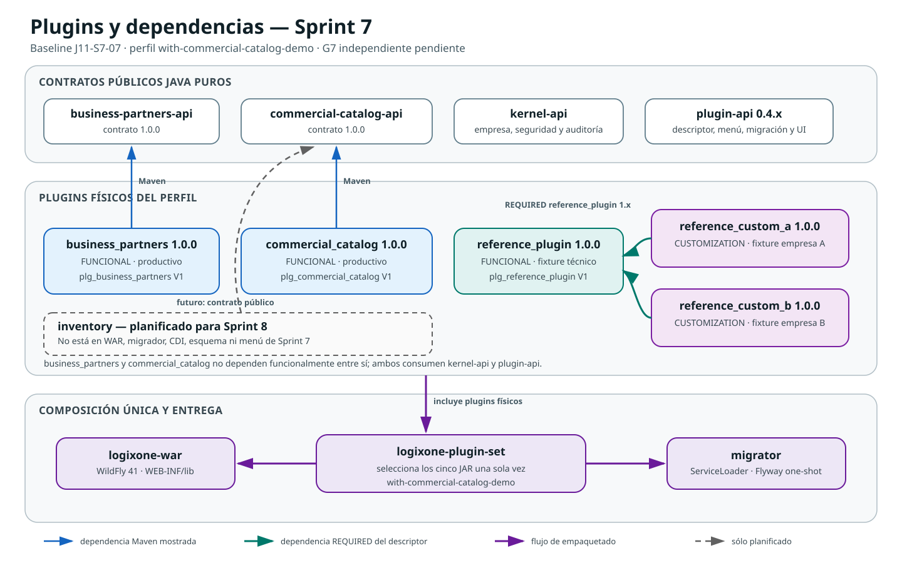
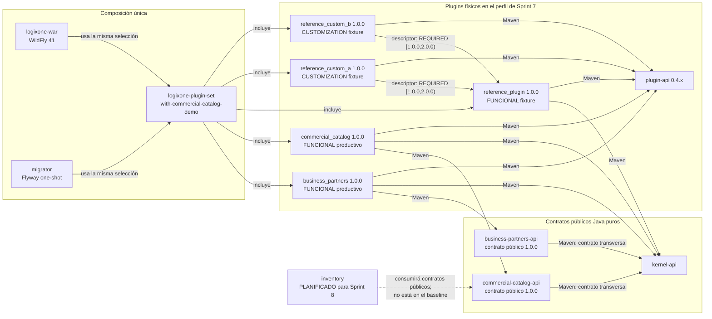

# Estructura de plugins y dependencias — Sprint 7

- Fotografía del baseline: `J11-S7-07`
- Fecha: 2026-07-31
- Estado del Sprint: G0–G6 verdes; G7 independiente pendiente
- Perfil demostrado: `with-commercial-catalog-demo`
- Fuente de verdad: POM del reactor, descriptores `PluginDefinition`, migraciones y
  selección física de `distribution/logixone-plugin-set`

## Propósito y alcance

Esta fotografía explica qué plugins existen físicamente en la candidata de Sprint
7, cómo se relacionan y cuáles son sólo contratos o trabajo futuro. No sustituye
los descriptores ejecutables ni convierte el roadmap en dependencias ya
implementadas.

Los plugins funcionales productivos terminados son `business_partners` y
`commercial_catalog`. `reference_plugin` y las dos personalizaciones `reference_*`
son fixtures técnicos usados para comprobar composición y aislamiento por empresa;
no cuentan como plugins productivos.

## Gráfico de dependencias y composición

La flecha sale del módulo que depende y apunta hacia aquello que consume. Una línea
continua representa el baseline actual; la línea discontinua representa solamente
el siguiente trabajo planificado.

El SVG anterior es la vista portable revisable sin extensiones. El siguiente
bloque Mermaid conserva la fuente lógica editable y más detallada.

### Lectura textual equivalente

1. `business_partners` consume su API pública, `kernel-api` y `plugin-api`; no
   declara dependencia funcional de otro plugin.
2. `commercial_catalog` consume su API pública, `kernel-api` y `plugin-api`; no
   depende de `business_partners` ni importa su implementación.
3. `reference_custom_a` y `reference_custom_b` declaran en su descriptor una
   dependencia `REQUIRED` de `reference_plugin` compatible con versiones 1.x.
4. `logixone-plugin-set` selecciona físicamente los cinco JAR del perfil. Tanto el
   WAR como el migrador consumen esa misma selección, por lo que no pueden divergir
   silenciosamente.
5. `inventory` sigue planificado. No está en el WAR, el migrador, el catálogo CDI,
   la base de datos ni el menú de este corte.

## Inventario efectivo

| Plugin | Clase | Versión | API pública | Esquema propio | Menús/rutas | Permisos | Dependencias de plugin declaradas |
|---|---|---:|---|---|---|---|---|
| `business_partners` | Funcional productivo | 1.0.0 | `business-partners-api` 1.0.0 | `plg_business_partners` V1 | Socios comerciales, `/business-partners` | `view`, `manage`, `roles.manage`, `lifecycle.manage` | ninguna |
| `commercial_catalog` | Funcional productivo | 1.0.0 | `commercial-catalog-api` 1.0.0 | `plg_commercial_catalog` V1 | Artículos y servicios, `/catalog`; Listas de precios, `/catalog/price-lists` | `view`, `items.manage`, `prices.manage`, `definitions.manage` | ninguna |
| `reference_plugin` | Funcional fixture | 1.0.0 | no separada | `plg_reference_plugin` V1 | Panel de referencia, `/reference` | `reference.dashboard.view` | ninguna |
| `reference_custom_a` | Personalización fixture | 1.0.0 | contratos neutrales de `plugin-api` | no persiste | overlay A de `reference_plugin:dashboard` | no aporta | `reference_plugin` requerido, 1.x |
| `reference_custom_b` | Personalización fixture | 1.0.0 | contratos neutrales de `plugin-api` | no persiste | overlay B de `reference_plugin:dashboard` | no aporta | `reference_plugin` requerido, 1.x |

Los sufijos de permiso de la tabla se leen con su prefijo completo. Por ejemplo,
`view` en `commercial_catalog` significa `commercial_catalog.view`.

## Perfiles de composición física

| Perfil Maven | JAR de plugins seleccionados | Uso |
|---|---|---|
| sin perfil | ninguno | prueba de que el kernel y la distribución base no dependen de implementaciones |
| `with-reference-plugin` | `reference_plugin` | fixture mínimo de descubrimiento |
| `with-screen-customization-plugins` | referencia + personalizaciones A/B | composición y aislamiento de overlays |
| `with-business-partners-demo` | anteriores + `business_partners` | candidata visual de Sprint 6 |
| `with-commercial-catalog-demo` | anteriores + `business_partners` + `commercial_catalog` | candidata y demo de Sprint 7 |

Agregar o retirar físicamente un plugin exige reconstruir WAR e imagen. Tener el
JAR presente no lo habilita automáticamente: el kernel filtra activación, empresa,
permiso y personalización en runtime.

## Fronteras de datos y código

- Cada plugin persistente es dueño de `plg_<plugin_id>`, su unidad JPA y sus
  migraciones.
- No existe relación JPA, `JOIN`, repositorio ni acceso SQL entre
  `plg_business_partners` y `plg_commercial_catalog`.
- Los intercambios futuros usan IDs, contratos públicos o eventos versionados.
- Una personalización puede modificar una pantalla ajena sólo mediante
  `ScreenId`, elementos, slots y operaciones públicas; no importa XHTML, beans,
  entidades ni CSS/JavaScript del plugin objetivo.
- Desactivar o retirar un plugin no borra su esquema ni sus datos.

## Cambios respecto de Sprint 6

- se agregó el plugin productivo `commercial_catalog` y su API Java pura;
- se agregó `plg_commercial_catalog` V1, con propiedad privada del catálogo;
- el plugin set pasó de cuatro a cinco plugins en la candidata completa;
- el shell fusiona un menú de Socios con dos menús de Catálogo por contribuciones
  públicas autorizadas;
- WAR y migrador incorporaron el perfil `with-commercial-catalog-demo`;
- no se agregó una dependencia entre `business_partners` y `commercial_catalog`;
- el siguiente plugin es `inventory`, todavía fuera del baseline.

## Riesgos y revisión para el próximo cierre

1. `inventory` debe depender sólo de contratos públicos realmente necesarios y no
   de entidades del catálogo.
2. Si necesita hechos asíncronos, el primer productor/consumidor real debe aplicar
   ADR-0013; no se crea un outbox preventivo compartido.
3. La fotografía de Sprint 8 deberá demostrar las variantes con y sin inventario,
   actualizar el gráfico y explicar cualquier nueva dependencia declarada.
4. Una futura personalización empresarial real será distinta por empresa y
   obligatoria; los fixtures A/B no son una implementación entregable a clientes.

## Trazabilidad

- [ADR-0002 — Arquitectura de plugins](../../adr/0002-arquitectura-plugins.md)
- [ADR-0005 — Activación y personalización por empresa](../../adr/0005-contexto-empresarial-activacion-personalizacion.md)
- [ADR-0011 — Roadmap de plugins](../../adr/0011-roadmap-dependencias-plugins-productivos.md)
- [ADR-0012 — Composición única y migraciones](../../adr/0012-composicion-unica-y-migraciones-de-plugins.md)
- [Demo de cierre de Sprint 7](../../runbooks/demo-cierre-sprint-07.md)
- [Evidencia J11-S7-07](../../evidence/J11-S7-07-validacion-demo-cierre.md)
