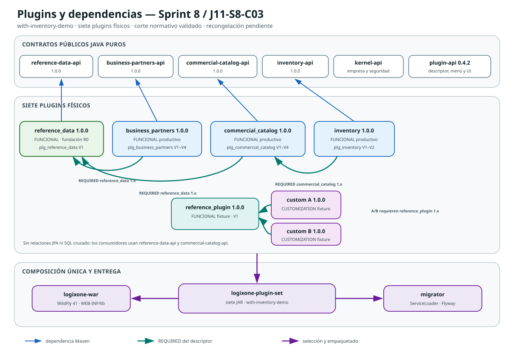
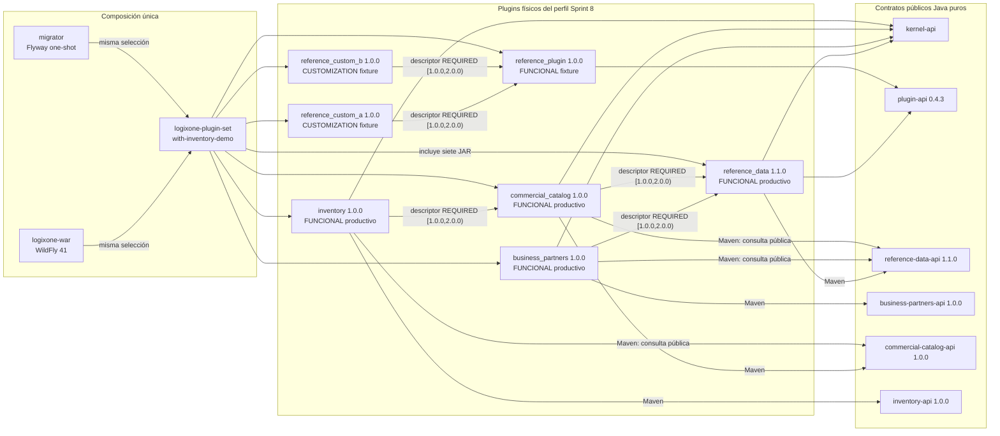

# Estructura de plugins y dependencias — Sprint 8

- Fotografía del baseline candidato: `J11-S8-C07`, publicaciones completas
- Fecha: 2026-08-05
- Estado: fotografía técnica recongelada desde código real; PDF verificado; instalador `NO`; G7 pendiente
- Perfil demostrado: `with-inventory-demo`
- Fuente de verdad: POM, `PluginDefinition`, migraciones y selección física de
  `distribution/logixone-plugin-set`

## Propósito y alcance

Esta fotografía distingue plugins productivos, fixtures, APIs y dependencias
funcionales reales. No confunde una dependencia Maven con una dependencia de
plugin declarada ni muestra como terminado lo que sólo pertenece al roadmap.

Los plugins productivos del corte son `reference_data`, `business_partners`,
`commercial_catalog` e `inventory`. `reference_plugin` y las personalizaciones
A/B son fixtures técnicos.

## Gráfico de dependencias y composición

La flecha sale del consumidor y apunta a la dependencia. Azul significa dependencia
Maven hacia un contrato público; verde significa `REQUIRED` en el descriptor;
morado significa selección o empaquetado físico.

### Lectura textual equivalente

1. `reference_data` consume su API, `kernel-api` y `plugin-api`; posee países,
   monedas, procedencia y políticas por empresa.
2. `business_partners` consume su API y `reference-data-api`; su descriptor exige
   `reference_data` 1.x para validar países.
3. `commercial_catalog` consume su API y `reference-data-api`; su descriptor exige
   `reference_data` 1.x para validar monedas. Continúa independiente de socios.
4. `inventory` consume `inventory-api`, `kernel-api`, `plugin-api` y la API pública
   de catálogo. Su descriptor exige `commercial_catalog` 1.x.
5. Las dependencias anteriores no autorizan importar entidades, repositorios, DTO
   internos ni tablas privadas de catálogo.
6. `reference_custom_a` y `reference_custom_b` exigen `reference_plugin` 1.x y
   aplican overlays neutrales; no persisten ni aportan permisos.
7. `logixone-plugin-set` selecciona los siete JAR una sola vez. WAR y migrador
   consumen esa misma selección.

## Inventario efectivo

| Plugin | Clase/propietario | Versión | Contrato público | Esquema/migraciones | Menús/rutas | Permisos | Dependencias de plugin |
|---|---|---:|---|---|---|---|---|
| `reference_data` | Funcional productivo compartido | 1.1.0 | `reference-data-api` 1.1.0 | `plg_reference_data` V1–V4, 6 tablas | Datos de referencia, `/reference-data` | `view`, `policy.manage` | ninguna |
| `business_partners` | Funcional productivo | 1.0.0 | `business-partners-api` 1.0.0; consume `reference-data-api` | `plg_business_partners` V1–V4, 10 tablas | Socios comerciales, `/business-partners`; Definiciones de socios, `/business-partners/definitions` | `view`, `manage`, `roles.manage`, `lifecycle.manage` | `reference_data` requerido, `[1.0.0,2.0.0)` |
| `commercial_catalog` | Funcional productivo | 1.0.0 | `commercial-catalog-api` 1.0.0; consume `reference-data-api` | `plg_commercial_catalog` V1–V4, 26 tablas | Artículos y servicios, `/catalog`; Listas de precios, `/catalog/price-lists`; Perfiles tributarios, `/catalog/tax-profiles`; Definiciones, `/catalog/definitions`; Variantes, `/catalog/variants` | `view`, `items.manage`, `prices.manage`, `definitions.manage` | `reference_data` requerido, `[1.0.0,2.0.0)` |
| `inventory` | Funcional productivo | 1.0.0 | `inventory-api` 1.0.0 | `plg_inventory` V1–V2, 10 tablas | Existencias, `/inventory`; Depósitos, `/inventory/warehouses`; Conteos físicos, `/inventory/counts` | `view`, `storage.manage`, `items.manage`, `movements.post`, `reservations.manage`, `counts.manage`, `adjustments.post` | `commercial_catalog` requerido, `[1.0.0,2.0.0)` |
| `reference_plugin` | Funcional fixture | 1.0.0 | contratos neutrales existentes | `plg_reference_plugin` V1 | Panel de demostración, `/reference` | `reference.dashboard.view` | ninguna |
| `reference_custom_a` | Personalización fixture | 1.0.0 | `plugin-api` | no persiste | overlay A | no aporta | `reference_plugin` requerido, 1.x |
| `reference_custom_b` | Personalización fixture | 1.0.0 | `plugin-api` | no persiste | overlay B | no aporta | `reference_plugin` requerido, 1.x |

Los nombres abreviados de permisos de la tabla se interpretan con el prefijo del
plugin. Por ejemplo, `inventory.view` es el nombre completo del primer permiso de
inventario.

## Perfiles de composición física

| Perfil Maven | JAR seleccionados | Uso |
|---|---|---|
| sin perfil | ninguno | prueba de independencia del kernel |
| `with-reference-data` | datos de referencia | fundación normativa aislada |
| `with-reference-plugin` | referencia | descubrimiento mínimo |
| `with-screen-customization-plugins` | referencia + A/B | overlays y aislamiento |
| `with-business-partners-demo` | datos normativos + fixture A/B + socios | candidata Sprint 6 actualizada por C07 |
| `with-commercial-catalog-demo` | datos normativos + fixture A/B + socios + catálogo | candidata Sprint 7 actualizada por C07 |
| `with-inventory-demo` | datos normativos + fixture A/B + socios + catálogo + inventario | candidata técnica Sprint 8 actualizada por J11-S8-C07 |

Agregar o retirar físicamente un plugin exige rebuild/redeploy. La presencia del
JAR no lo activa automáticamente: el kernel filtra empresa, compatibilidad,
dependencias, activación y permiso en cada operación.

## Fronteras de datos y código

- Cada plugin persistente es dueño de su esquema `plg_*`, unidad JPA y migraciones.
- No existen relaciones JPA ni accesos SQL entre esquemas privados de plugins.
- Socios y catálogo resuelven países/monedas sólo mediante `reference-data-api`.
- Inventario referencia artículos por identificadores y consulta únicamente el
  contrato público del catálogo.
- Desactivar o retirar un plugin no elimina sus tablas ni datos.
- Una personalización empresarial real será distinta y obligatoria por empresa;
  sólo puede modificar pantallas mediante contratos, slots y operaciones neutrales.

## Cambios respecto de Sprint 7

- se agregaron `inventory-api` e `inventory`;
- se agregó el esquema `plg_inventory` V1–V2 con diez tablas;
- apareció la primera dependencia funcional entre plugins productivos:
  `inventory` requiere `commercial_catalog` 1.x;
- el perfil completo pasó de cinco a seis plugins físicos;
- el menú fusionado pasó de cuatro a siete funciones visibles en la empresa A;
- WAR y migrador incorporaron `with-inventory-demo`;
- una desactivación incompatible se rechaza antes de cambiar el estado;
- el instalador Windows se implementó después de congelar esta topología y no
  agregó ni cambió dependencias de plugins.

## Corrección J11-S8-C01 posterior a J11-S8-07

- la topología, los seis plugins físicos y las dependencias no cambiaron;
- `commercial_catalog` agregó la capacidad y pantalla neutral de perfiles
  tributarios bajo el permiso existente `definitions.manage`;
- el menú fusionado de la empresa A pasó de siete a ocho funciones visibles;
- el esquema permanece en V1 y conserva veinte tablas; no se agregó una migración;
- la imagen y el instalador anteriores quedaron obsoletos hasta recongelar y
  regenerar los artefactos derivados.

## Corrección J11-S8-C02 en ejecución

- la topología, los seis plugins físicos y las dependencias funcionales no cambian;
- `plugin-api` pasa a 0.4.2 con metadatos neutrales y aditivos de fuente y
  propietario de plataforma;
- `business_partners` llega a V4 y diez tablas con definiciones empresariales e
  historial append-only para tipos de canal, identificación y tipo/propósito de
  dirección;
- `commercial_catalog` llega a V4 y veintiséis tablas: cuatro historiales
  append-only privados y cuatro vínculos opcionales de reemplazo para unidades,
  categorías, marcas y etiquetas, más cabecera/atributos versionados de familias
  de variantes; las asignaciones existentes conservan la versión original;
- los 89 selectores actuales tienen fuente, clase y propietario: 18 nativos y 71
  aportados por plugins;
- esta fotografía representa el vigésimo corte ejecutable validado, pero no
  el cierre:
  siguen pendientes las capacidades y gates declarados en la historia C02.

## Corrección J11-S8-C03 validada

- se agregan `reference-data-api` y `reference_data` como fundación funcional R0;
- el perfil completo pasa de seis a siete plugins físicos;
- aparecen dos dependencias funcionales nuevas: `business_partners` y
  `commercial_catalog` requieren `reference_data` 1.x;
- `plg_reference_data` V1 posee cinco tablas privadas y publicaciones con
  procedencia, hash y completitud explícita;
- el subconjunto inicial ofrece `PY`, `PYG` y `USD`; no se presenta como catálogo
  mundial completo;
- país y moneda se convierten en selectores normativos y elevan el inventario a
  18 nativos y 73 aportados por plugins, 91/91 gobernados;
- WAR y migrador incluyen exactamente la misma selección; la variante sin perfil
  conserva cero implementaciones;
- PostgreSQL, arquitectura, módulos, Docker/Compose, health/OIDC y Playwright
  responsive están verdes; faltan publicación completa, recongelación, PDF e
  instalador.

## Correcciones J11-S8-C04 a J11-S8-C07

- C04 adopta gobierno Git por Sprint; no cambia módulos ni dependencias físicas;
- C05 cambia la marca visible a Smart ERP y conserva identificadores técnicos
  `logixone` compatibles; tampoco modifica la topología;
- C06 agrega V2, una sexta tabla privada, políticas optimistas, historia append-only
  y el permiso `reference_data.policy.manage`;
- C07 eleva `plugin-api` a 0.4.3 y `reference-data-api`/`reference_data` a 1.1.0,
  agrega V3–V4, publica 248 países y 178 códigos únicos de moneda o fondo y usa
  búsqueda paginada máxima 50;
- las dependencias funcionales continúan en el rango 1.x y la selección física
  conserva exactamente siete JAR;
- `clean verify` quedó verde en 26/26 módulos, 498 pruebas y 28 ArchUnit;
- PostgreSQL/Testcontainers, migrator/Compose, health, OIDC, JTA aislado y
  Playwright quedaron verdes; la demo dejó 30 capturas responsive;
- la aplicación `j11-s8-c07-reference-data` quedó en
  `sha256:52cf22451dc7ff89192a9b88d89e97b26b0e45f508654d67c52b6fd38b83d9fd`
  y el migrador en
  `sha256:1b598fb140659a04501a5890c2279c80545cf0115eba0711ef37a30cfdf19c77`.

## Riesgos y continuidad

1. El instalador interno consume digests anteriores a J11-S8-C01 y quedó obsoleto.
   Producto decidió `NO` regenerarlo: `current` permanece intacto y no representa
   C07. Un instalador nuevo se evaluará con una versión comercializable útil para
   al menos un tipo de negocio.
2. Una futura valoración de inventario pertenece a contabilidad/costos, no debe
   agregarse como efecto secundario de este plugin.
3. Compras y ventas usarán contratos públicos y snapshots; no crearán relaciones
   JPA hacia inventario o catálogo.
4. Los fixtures A/B no sustituyen el plugin de personalización real de una empresa.
5. Las publicaciones `FULL` no sustituyen revisión de licencia, vigencia ni
   certificación, aunque sus gates técnicos estén verdes.
6. La siguiente fotografía debe reflejar el baseline realmente cerrado, no sólo lo
   planificado.

## Trazabilidad

- [ADR-0002 — Arquitectura de plugins](../../adr/0002-arquitectura-plugins.md)
- [ADR-0005 — Activación y personalización](../../adr/0005-contexto-empresarial-activacion-personalizacion.md)
- [ADR-0011 — Roadmap de plugins](../../adr/0011-roadmap-dependencias-plugins-productivos.md)
- [ADR-0012 — Composición única](../../adr/0012-composicion-unica-y-migraciones-de-plugins.md)
- [ADR-0023 — Modelo y contratos de inventario](../../adr/0023-modelo-inventory-y-contratos-publicos.md)
- [ADR-0024 — Persistencia privada](../../adr/0024-persistencia-privada-inventory.md)
- [ADR-0025 — Recorridos visuales](../../adr/0025-recorridos-visuales-inventory.md)
- [ADR-0038 — Datos de referencia normativos](../../adr/0038-plugin-datos-referencia-normativos.md)
- [Historia J11-S8-C03](J11-S8-C03-datos-referencia-normativos.md)
- [Demo oficial de Sprint 8](../../runbooks/demo-cierre-sprint-08.md)
- [Evidencia J11-S8-07](../../evidence/J11-S8-07-validacion-demo-cierre.md)
- [ADR-0026 — Bootstrapper Windows nativo](../../adr/0026-instalador-windows-bootstrapper-nativo.md)
- [Evidencia J11-S8-08](../../evidence/J11-S8-08-instalador-windows-cierre.md)

## Revisión posterior de J11-S8-08

Se compararon POM, descriptores y migraciones después de incorporar el instalador.
La fotografía sigue siendo válida: `installer/windows/` es una herramienta de
distribución, no un plugin, no aporta menús/permisos/esquemas y no altera el camino
vigente de los siete plugins físicos hacia WAR o migrador.
