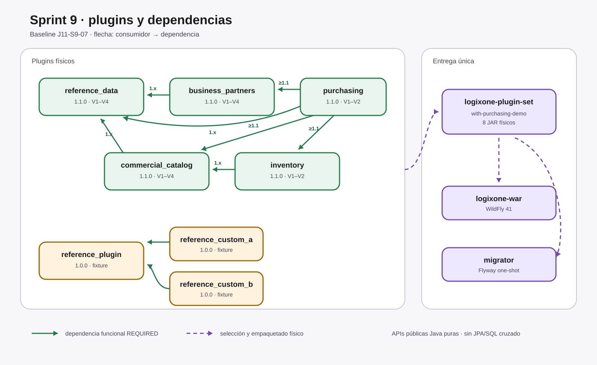
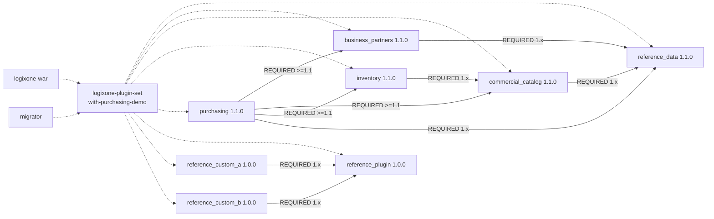

# Estructura de plugins y dependencias — Sprint 9

- Fotografía del baseline candidato: J11-S9-07
- Fecha: 2026-08-13
- Estado: fotografía técnica congelada; instalador interno J11-S9-08 creado; G7 y matriz Windows externa pendientes
- Perfil demostrado: `with-purchasing-demo`
- Fuente: POM, `PluginDefinition`, migraciones y
  `distribution/logixone-plugin-set`

## Alcance

Esta fotografía distingue contratos, plugins productivos, fixtures y composición
física real. No representa como implementados los módulos del roadmap posterior.
Los productivos son `reference_data`, `business_partners`,
`commercial_catalog`, `inventory` y `purchasing`. Los tres `reference_*` son
fixtures técnicos.

## Gráfico

La flecha continua sale del consumidor y apunta a una dependencia funcional
`REQUIRED`; la flecha discontinua representa selección física hacia WAR y
migrador. La alternativa textual y tabular aparece inmediatamente después.

### Lectura textual equivalente

1. Socios y Catálogo requieren Datos de referencia 1.x.
2. Inventario requiere Catálogo 1.x.
3. Compras requiere Socios, Catálogo e Inventario desde 1.1.0, y Datos de
   referencia desde 1.0.0; todos los rangos terminan antes de 2.0.0.
4. Las personalizaciones A/B requieren el plugin fixture de referencia 1.x.
5. El conjunto físico selecciona ocho JAR. WAR y migrador consumen exactamente
   esa selección.
6. Las dependencias Maven hacia APIs públicas no autorizan acceder a entidades,
   DTO internos, repositorios ni tablas privadas.

## Inventario efectivo

| Plugin | Clase | Versión | Contrato público | Esquema/migraciones | Menús | Permisos | Dependencias declaradas |
|---|---|---:|---|---|---:|---:|---|
| `reference_data` | funcional productivo compartido | 1.1.0 | `reference-data-api` 1.1.0 | `plg_reference_data` V1–V4, 6 tablas | 1 | 2 | ninguna |
| `business_partners` | funcional productivo | 1.1.0 | `business-partners-api` 1.1.0 | `plg_business_partners` V1–V4, 10 tablas | 2 | 4 | `reference_data` 1.x |
| `commercial_catalog` | funcional productivo | 1.1.0 | `commercial-catalog-api` 1.1.0 | `plg_commercial_catalog` V1–V4, 26 tablas | 5 | 4 | `reference_data` 1.x |
| `inventory` | funcional productivo | 1.1.0 | `inventory-api` 1.1.0 | `plg_inventory` V1–V2, 10 tablas | 3 | 7 | `commercial_catalog` 1.x |
| `purchasing` | funcional productivo | 1.1.0 | `purchasing-api` 1.1.0 | `plg_purchasing` V1–V2, 11 tablas | 5 | 12 | socios, catálogo e inventario >=1.1; referencia >=1.0; todos <2.0 |
| `reference_plugin` | funcional fixture | 1.0.0 | `plugin-api` | `plg_reference_plugin` V1 | 1 | 1 | ninguna |
| `reference_custom_a` | personalización fixture | 1.0.0 | `plugin-api` | no persiste | overlay | 0 | `reference_plugin` 1.x |
| `reference_custom_b` | personalización fixture | 1.0.0 | `plugin-api` | no persiste | overlay | 0 | `reference_plugin` 1.x |

`plugin-api` permanece Java puro en 0.4.3. El kernel aporta empresa, identidad,
autorización, auditoría, activación y composición, pero no es un plugin funcional.

## Composición física

| Perfil Maven | Selección | Uso |
|---|---|---|
| sin perfil | cero implementaciones | independencia del kernel |
| `with-reference-data` | datos normativos | fundación aislada |
| `with-reference-plugin` | fixture de referencia | descubrimiento mínimo |
| `with-screen-customization-plugins` | referencia + A/B | overlays técnicos |
| `with-business-partners-demo` | anteriores + socios | composición Sprint 6 |
| `with-commercial-catalog-demo` | anteriores + catálogo | composición Sprint 7 |
| `with-inventory-demo` | anteriores + inventario | composición Sprint 8 |
| `with-purchasing-demo` | anteriores + compras | candidata Sprint 9; 8 JAR |

Agregar o retirar un JAR exige reconstruir y redesplegar. La presencia física no
activa automáticamente una función: el kernel revalida empresa, compatibilidad,
dependencias, activación y permiso.

## Fronteras de datos y código

- cada plugin persistente es dueño de su esquema `plg_*`, unidad JPA y migraciones;
- no existen relaciones JPA ni consultas SQL entre esquemas privados de plugins;
- Socios y Catálogo consultan Datos de referencia mediante su API;
- Inventario consulta Catálogo mediante `commercial-catalog-api`;
- Compras resuelve proveedor, artículo, moneda, unidad y destino mediante APIs y
  conserva snapshots; nunca usa claves foráneas cruzadas;
- recepción y devolución invocan el contrato público idempotente de Inventario;
- desactivar o retirar un plugin no elimina tablas ni datos.

## Cambios respecto de Sprint 8

- se agregaron `purchasing-api` y `purchasing` 1.1.0;
- el perfil completo pasó de siete a ocho JAR físicos;
- se agregó `plg_purchasing` V1–V2 con once tablas;
- Compras declaró cuatro dependencias funcionales requeridas;
- el menú fusionado incorporó Solicitudes, Órdenes, Recepciones, Devoluciones y
  Seguimiento;
- se agregaron doce permisos de Compras y cinco capacidades públicas;
- WAR y migrador incorporaron el mismo perfil `with-purchasing-demo`;
- no se agregaron relaciones JPA ni accesos SQL cruzados.

## Riesgos y continuidad

1. Factura, deuda, pago, retención, costo y asiento continúan fuera de Compras.
2. La migración Oracle y BPM son consumidores opcionales futuros de contratos;
   `purchasing` no depende de sus implementaciones.
3. Los floorplans de Sprint 10 pueden reorganizar la captura, pero no deben cambiar
   contratos, estados ni propietarios de datos sin una decisión específica.
4. G7 independiente, Authenticode y la matriz externa de J11-S9-08 impiden
   declarar Sprint 9 cerrado o comercializable.

## Trazabilidad

- [ADR-0002 — Arquitectura de plugins](../../adr/0002-arquitectura-plugins.md)
- [ADR-0011 — Roadmap productivo](../../adr/0011-roadmap-dependencias-plugins-productivos.md)
- [ADR-0012 — Composición única](../../adr/0012-composicion-unica-y-migraciones-de-plugins.md)
- [J11-S9-02 — Dominio y contratos](J11-S9-02-dominio-contratos-purchasing.md)
- [J11-S9-03 — Persistencia](J11-S9-03-persistencia-purchasing.md)
- [J11-S9-07 — Cierre técnico](J11-S9-07-validacion-demo-cierre.md)
- [Evidencia de cierre](../../evidence/J11-S9-07-validacion-demo-cierre.md)
