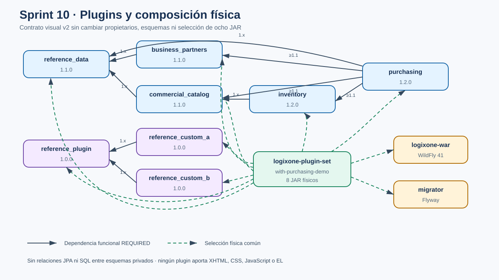
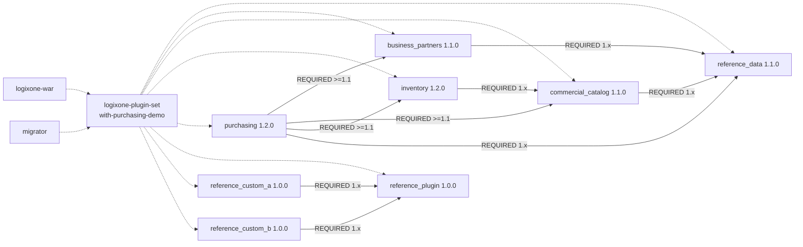

# Estructura de plugins y dependencias — Sprint 10

- Fotografía del baseline candidato: J11-S10-06
- Fecha: 2026-08-20
- Estado: candidata técnica; validación independiente y decisión J11-S10-07 pendientes
- Perfil demostrado: `with-purchasing-demo`
- Fuente: POM, `PluginDefinition`, contratos públicos, migraciones y
  `distribution/logixone-plugin-set`

## Alcance

La composición física no agrega ni retira plugins respecto de Sprint 9. Sprint 10
evoluciona contratos visuales y renderers: `plugin-api` llega a 0.4.5 e
`inventory` y `purchasing` a 1.2.0. Los cinco plugins productivos y los tres
fixtures continúan siendo los únicos JAR seleccionados por el perfil completo.

## Gráfico

La flecha continua sale del consumidor y apunta a una dependencia funcional
`REQUIRED`; la discontinua representa selección física hacia WAR y migrador.

### Lectura textual equivalente

1. Socios y Catálogo requieren Datos de referencia 1.x.
2. Inventario requiere Catálogo 1.x.
3. Compras requiere Socios, Catálogo e Inventario desde 1.1.0 y Datos de
   referencia desde 1.0.0; todos los rangos terminan antes de 2.0.0.
4. Las personalizaciones A/B requieren el fixture de referencia 1.x.
5. El conjunto físico selecciona ocho JAR; WAR y migrador consumen esa misma
   selección.
6. Una dependencia Maven hacia una API pública no autoriza importar entidades,
   DTO internos, repositorios ni tablas privadas.

## Inventario efectivo

| Plugin | Clase | Versión | Contrato público | Esquema/migraciones | Menús | Permisos | Dependencias declaradas |
|---|---|---:|---|---|---:|---:|---|
| `reference_data` | funcional productivo compartido | 1.1.0 | `reference-data-api` 1.1.0 | `plg_reference_data` V1–V4, 6 tablas | 1 | 2 | ninguna |
| `business_partners` | funcional productivo | 1.1.0 | `business-partners-api` 1.1.0 | `plg_business_partners` V1–V4, 10 tablas | 2 | 4 | `reference_data` 1.x |
| `commercial_catalog` | funcional productivo | 1.1.0 | `commercial-catalog-api` 1.1.0 | `plg_commercial_catalog` V1–V4, 26 tablas | 5 | 4 | `reference_data` 1.x |
| `inventory` | funcional productivo | 1.2.0 | `inventory-api` 1.2.0 | `plg_inventory` V1–V2, 10 tablas | 3 | 7 | `commercial_catalog` 1.x |
| `purchasing` | funcional productivo | 1.2.0 | `purchasing-api` 1.2.0 | `plg_purchasing` V1–V2, 11 tablas | 5 | 12 | socios, catálogo e inventario >=1.1; referencia >=1.0; todos <2.0 |
| `reference_plugin` | funcional fixture | 1.0.0 | `plugin-api` | `plg_reference_plugin` V1 | 1 | 1 | ninguna |
| `reference_custom_a` | personalización fixture | 1.0.0 | `plugin-api` | no persiste | overlay | 0 | `reference_plugin` 1.x |
| `reference_custom_b` | personalización fixture | 1.0.0 | `plugin-api` | no persiste | overlay | 0 | `reference_plugin` 1.x |

`plugin-api` permanece Java puro en 0.4.5. El kernel aporta capacidades
transversales, pero no es un plugin funcional.

## Composición física

| Perfil Maven | Selección | Uso |
|---|---|---|
| sin perfil | cero implementaciones | independencia del kernel |
| `with-reference-data` | datos normativos | fundación aislada |
| `with-reference-plugin` | fixture de referencia | descubrimiento mínimo |
| `with-screen-customization-plugins` | referencia + A/B | overlays técnicos |
| `with-business-partners-demo` | anteriores + socios | composición Sprint 6 |
| `with-commercial-catalog-demo` | anteriores + catálogo | composición Sprint 7 |
| `with-inventory-demo` | anteriores + inventario | composición Sprint 8 |
| `with-purchasing-demo` | anteriores + compras | candidata Sprint 10; 8 JAR |

La presencia física no activa por sí sola una función. El kernel revalida empresa,
compatibilidad, dependencias, activación y permiso. Agregar o retirar un JAR
requiere reconstruir y redesplegar.

## Fronteras de datos y código

- cada plugin persistente es dueño de su esquema `plg_*`, unidad JPA y migraciones;
- no existen relaciones JPA ni consultas SQL entre esquemas privados;
- Socios y Catálogo consultan Datos de referencia mediante su API;
- Inventario consulta Catálogo mediante `commercial-catalog-api`;
- Compras usa APIs públicas para proveedor, artículo, moneda, unidad, destino y
  movimientos, conservando snapshots e idempotencia;
- ningún plugin aporta XHTML, CSS, JavaScript o EL al shell;
- desactivar o retirar un plugin no elimina tablas ni datos.

## Cambios respecto de Sprint 9

- `plugin-api` evoluciona de 0.4.3 a 0.4.5 con contratos v2 compatibles;
- `inventory-api`/`inventory` pasan de 1.1.0 a 1.2.0;
- `purchasing-api`/`purchasing` pasan de 1.1.0 a 1.2.0;
- el shell incorpora cinco floorplans cerrados y conserva contratos v1;
- Inventario adopta una operación guiada y Compras una bandeja, editor,
  operaciones guiadas y consulta;
- no cambian perfiles, JAR físicos, tablas, migraciones ni dependencias
  funcionales;
- no se agregan relaciones JPA ni accesos SQL cruzados.

## Riesgos y continuidad

1. La compatibilidad v1/v2 debe mantenerse hasta una decisión de retirada.
2. Los tokens técnicos permanecen ocultos pero siempre se revalidan en servidor.
3. Los floorplans futuros no pueden convertirse en XHTML aportado por plugins.
4. La validación independiente, Authenticode y la matriz Windows externa siguen
   pendientes.
5. J11-S10-07 debe decidir si se crea un instalador para este baseline; el
   instalador de Sprint 9 no lo representa.

## Trazabilidad

- [ADR-0002 — Arquitectura de plugins](../../adr/0002-arquitectura-plugins.md)
- [ADR-0011 — Roadmap productivo](../../adr/0011-roadmap-dependencias-plugins-productivos.md)
- [ADR-0012 — Composición única](../../adr/0012-composicion-unica-y-migraciones-de-plugins.md)
- [ADR-0047 — Floorplans operativos](../../adr/0047-floorplans-operativos-transaccionales.md)
- [J11-S10-06 — Cierre técnico](J11-S10-06-validacion-demo-cierre.md)
- [Evidencia de cierre](../../evidence/J11-S10-06-validacion-demo-cierre.md)
