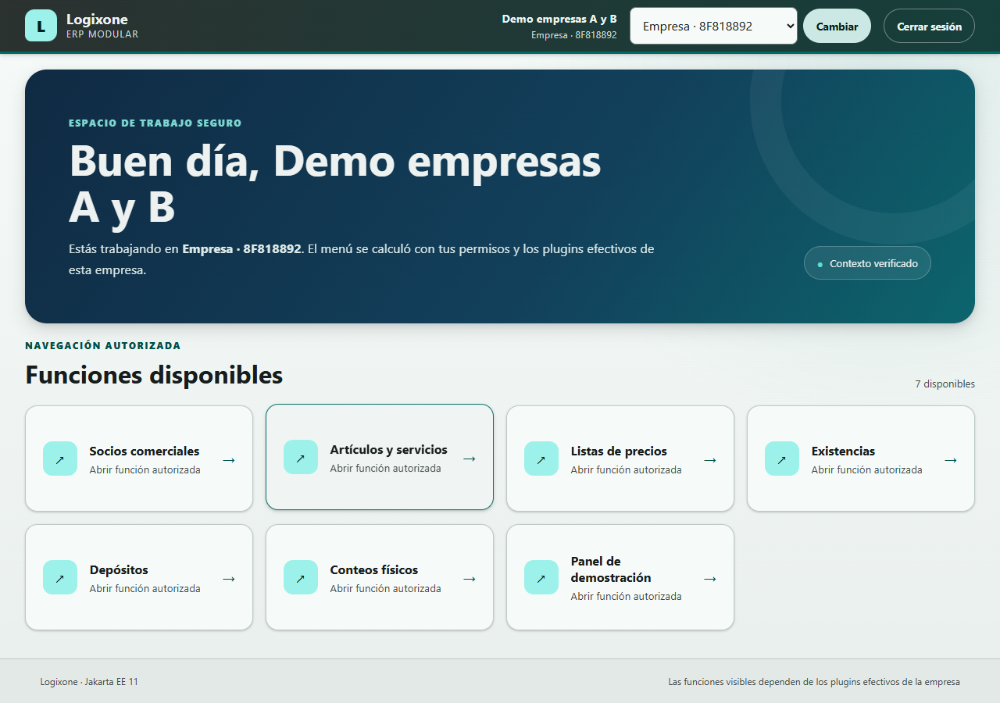
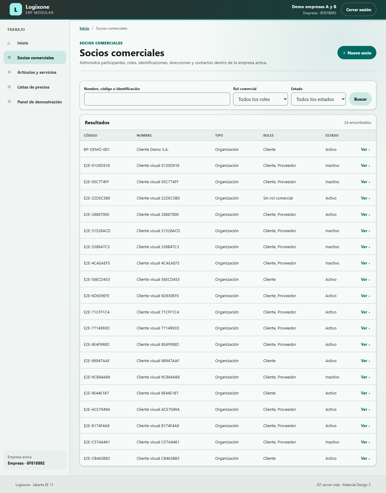
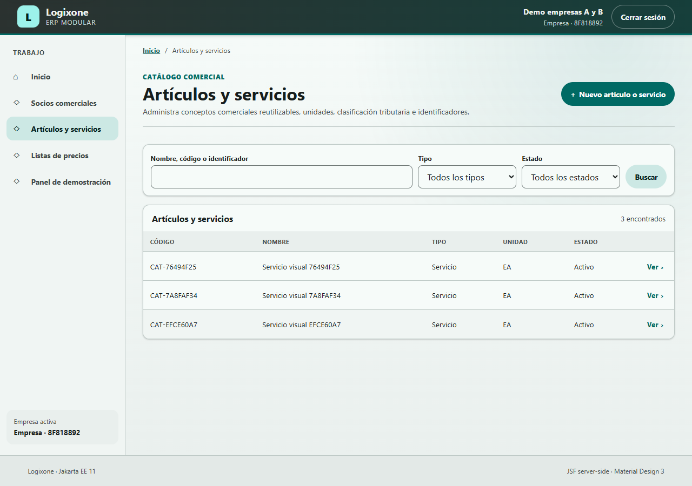
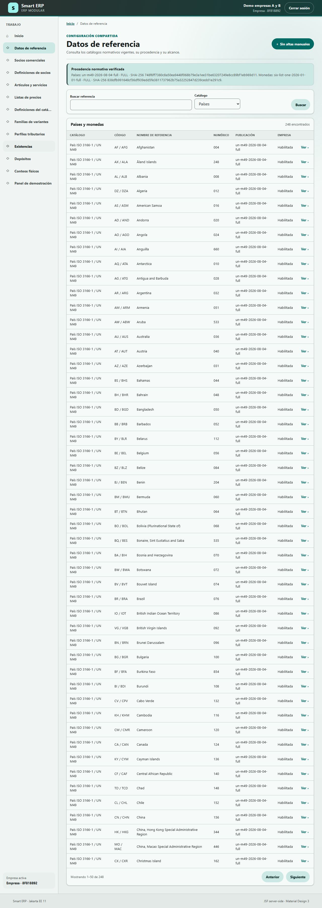
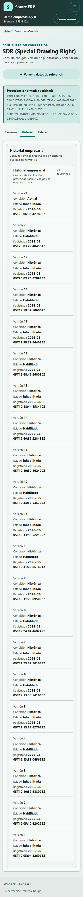
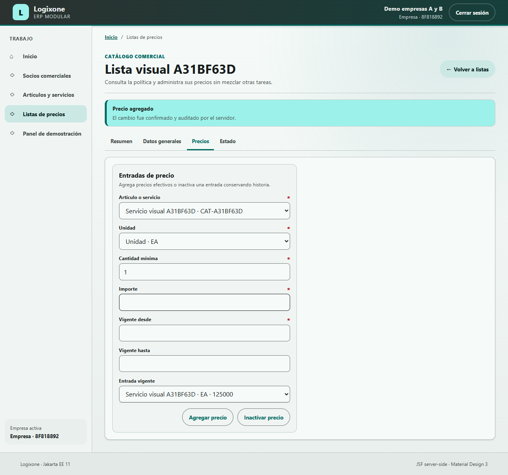

# Manual de usuario de Smart ERP

- Edición: 0.1-rc28
- Fecha: 2026-08-05
- Baseline: J11-S8-C07 implementa publicaciones completas, búsqueda paginada y unidad menor opcional para datos de referencia; J11-S8-C06 mantiene la habilitación empresarial versionada; J11-S8-C02 mantiene familias de variantes y definiciones de socios,
  ciclo activo/inactivo de definiciones simples/perfiles/tipos de canal/familias y revisión explícita
  e historial visible tributarios, revisión/historial visible y reemplazo seguro de definiciones simples,
  revisión de nombre e historial visible de definiciones de socios, revisión estructural/historial visible de familias y asignación versionada de familias a artículos, gobierno de 91/91 selectores y retorno seguro de selectores de plugins y de los 11 usos nativos administrables implementados; C06/C07 quedó ejecutada y revisada en 375, 720 y 1280 px; la demo final
  `J11-S8-07` y el instalador interno `0.8.0-internal.1` pertenecen a un baseline
  anterior; el PDF del corte está verificado y producto decidió `NO` crear un
  instalador hasta disponer de una versión comercializable útil para un negocio
- Idioma: español
- Estado: manual inicial; producto no autorizado aún para producción
- Audiencia: operadores, responsables de maestros comerciales y administradores
  autorizados

## 1. Qué permite hacer esta edición

Smart ERP es un ERP modular. La candidata actual permite:

- iniciar y cerrar sesión mediante el proveedor de identidad;
- trabajar con una o varias empresas autorizadas;
- consultar y buscar países, monedas, procedencia y alcance de publicaciones normativas;
- administrar socios comerciales y registrar, revisar, consultar el historial e
  inactivar/reactivar los tipos de canal propios de cada empresa;
- administrar artículos, servicios, unidades, categorías, marcas y etiquetas,
  incluida su inactivación/reactivación, además de perfiles tributarios internos,
  listas de precios y precios; la edición y los demás ciclos todavía tienen
  limitaciones descritas en este manual;
- administrar depósitos y ubicaciones, inscribir productos, consultar existencias,
  contabilizar movimientos, gestionar reservas y ejecutar conteos físicos;
- activar plugins y administrar permisos desde pantallas restringidas;
- conservar separados los datos y accesos de cada empresa.

La candidata desplegable permite demostrar inventario con datos ficticios, pero
todavía no permite compras, ventas, logística, costos, valoración, facturas, notas
de crédito, remisiones, SIFEN, tesorería ni contabilidad. No registre datos reales
con fines fiscales o productivos en el ambiente de demostración.

## 2. Cómo se diseñó este manual

La estructura fue analizada contra referencias internacionales vigentes. Se adopta
su orientación, pero no se declara certificación ni conformidad auditada.

| Referencia | Criterio aplicado en este manual |
|---|---|
| ISO/IEC/IEEE 26514:2022 | información diseñada a partir de necesidades de usuarios, con estructura, contenido, formato, versión y mantenimiento explícitos |
| IEC/IEEE 82079-1:2019 | audiencia, prerrequisitos, secuencias de acción, resultados esperados, advertencias y recuperación |
| ISO 24495-1:2023 | lenguaje claro, contenido localizable, comprensible y utilizable |
| ISO 9241-210:2019 | revisión continua con usuarios y contexto real de uso |
| WCAG 2.2 | contenido perceptible, operable, comprensible y robusto; alternativas textuales y pasos que no dependen sólo del color |

Por ello cada tarea responde, cuando corresponde, cinco preguntas: qué consigue,
qué permiso necesita, qué pasos ejecuta, qué debe observar y cómo se recupera.

## 3. Convenciones

- **Nombre entre comillas:** texto visible en la interfaz.
- `identificador`: permiso o nombre técnico que puede ayudar a soporte.
- **Requerido:** el sistema no permite continuar sin el dato.
- **Inactivar:** conserva el registro y su historia, pero impide su uso operativo.
- **Eliminar:** no forma parte de los recorridos maestros actuales.

Los estados nunca deben interpretarse sólo por el color: lea también su texto. No
use los botones **Atrás** o **Actualizar** del navegador mientras un formulario se
está enviando.

## 4. Antes de comenzar

Necesita:

1. la URL entregada por el implementador;
2. una cuenta activa en el proveedor de identidad;
3. membresía activa en al menos una empresa;
4. un rol empresarial con los permisos de su trabajo;
5. un navegador vigente con JavaScript y cookies habilitados para autenticación.

Para la demo local, la URL inicial es:

```text
http://localhost:18080/logixone/faces/app/index.xhtml
```

El usuario ficticio es `demo.empresas.ab`. Su contraseña se consulta localmente en
el archivo de secreto; nunca debe copiarse a este manual, un chat o una captura.

La marca visible vigente es **Smart ERP**. Por compatibilidad, la URL conserva el
contexto técnico `/logixone`, y el instalador interno del baseline anterior aún
conserva `Logixone` en su nombre de archivo y en algunos textos. Esos
identificadores no cambian en este rebranding seguro.

### 4.1 Montar la demo con el instalador interno

Este recorrido corresponde a un implementador o evaluador autorizado, no al
operador cotidiano. El ejecutable actual está sin firma y no debe enviarse a una
empresa.

1. Ejecute `Logixone-Setup-0.8.0-internal.1.exe` desde
   `installer/windows/current/`.
2. Lea el resultado del diagnóstico. Si dice `BLOQUEADA`, no continúe: aplique la
   recuperación indicada sin desactivar UAC, antivirus, firewall o políticas.
3. Si es compatible o compatible con advertencias, pulse **Revisar plan**.
4. Compruebe componentes, versiones, licencias, descargas, rutas, puertos, UAC y
   reinicios propuestos.
5. Marque el consentimiento sólo si entiende y acepta el plan completo.
6. Pulse **Instalar Logixone** y siga el progreso. Es el texto legado del
   instalador interno anterior; no cambia la identidad de Smart ERP. No abra ni
   copie los secretos.
7. Espere migración, liveness y readiness `UP` antes de abrir la URL inicial.

**Resultado esperado:** verá la confirmación de instalación/reparación y el acceso
a Smart ERP. Una reparación reutiliza secretos y volúmenes existentes; no debe
vaciar los datos de la demo.

**Si falla:** conserve el log indicado, anote la fase y el mensaje, y contacte al
implementador. Un hash incorrecto, UAC rechazado o health fallido no deben
presentarse como éxito. No use `docker compose down --volumes` para recuperarse.

## 5. Iniciar sesión y elegir empresa

### Objetivo

Entrar al espacio de trabajo con el contexto empresarial correcto.

### Pasos

1. Abra la URL inicial.
2. El sistema lo redirigirá al proveedor de identidad.
3. Escriba su usuario y contraseña.
4. Si tiene una sola membresía, el sistema seleccionará esa empresa.
5. Si tiene varias, elija la empresa indicada para su tarea.
6. Compruebe el nombre de la empresa visible antes de registrar o modificar datos.

### Resultado esperado

Verá el espacio de trabajo y sólo los menús aportados por plugins activos para esa
empresa y permitidos por su rol.



### Si no puede continuar

- **Cuenta no reconocida:** solicite al administrador que compruebe el vínculo con
  su identidad externa.
- **Sin empresas:** necesita una membresía activa; no intente cambiar la URL.
- **Empresa incorrecta:** cambie el selector antes de operar.
- **Menú ausente:** puede faltar activación, dependencia o permiso. No es suficiente
  que el plugin exista en el servidor.

## 6. Entender el espacio de trabajo

El shell fusiona en un único menú las contribuciones autorizadas de todos los
plugins. En esta edición puede mostrar:

- **Socios comerciales**;
- **Definiciones de socios**, con `business_partners.manage`;
- **Artículos y servicios**;
- **Definiciones del catálogo** y **Perfiles tributarios**, con el permiso de
  definiciones;
- **Listas de precios**;
- **Datos de referencia**, con `reference_data.policy.manage`;
- **Existencias**, **Depósitos** y **Conteos**, cuando `inventory` esté activo y el
  usuario tenga `inventory.view`;
- un panel técnico de referencia en ambientes de desarrollo;
- administración, sólo para autoridades autorizadas.

Cambiar de empresa vuelve a calcular el menú. Un plugin desactivado deja de aportar
opciones, tareas y rutas funcionales para esa empresa; sus datos no se borran.

## 7. Socios comerciales

### 7.1 Buscar y abrir un socio

**Permiso:** `business_partners.view`.

1. Abra **Socios comerciales**.
2. Escriba nombre, código o identificación en la búsqueda.
3. Ajuste rol o estado si necesita reducir resultados.
4. Pulse **Buscar**.
5. Seleccione la fila o acción de apertura del socio.

Verá un directorio en pantalla expandida y una presentación adaptada en ancho
compacto. Un resultado vacío no significa error: quite filtros y vuelva a buscar.



### 7.2 Registrar un socio

**Permiso:** `business_partners.manage`.

1. Desde el directorio pulse **Nuevo socio comercial**.
2. Elija si es organización o persona cuando la pantalla lo solicite.
3. Ingrese el nombre visible requerido.
4. Complete razón social y nombre comercial sólo cuando correspondan.
5. Deje vacío el código si desea usar la secuencia automática.
6. Revise el resumen y pulse **Registrar**.
7. Confirme que el sistema abre la ficha creada.

Si el código ya existe, use otro o permita la asignación automática. No agregue un
sufijo repetidamente sin comprobar primero si el socio ya fue creado.

### 7.3 Completar la ficha

La ficha separa tareas mediante pestañas. Abra sólo la que necesita:

- **Resumen/datos generales:** nombre visible, razón social, nombre comercial y
  código;
- **Identificaciones:** tipo, país y número presentado;
- **Direcciones:** ubicación y localidad;
- **Contacto:** canales y personas de contacto;
- **Roles y estado:** cliente, proveedor y ciclo de vida.

Para cada alta:

1. abra la pestaña;
2. complete los campos requeridos;
3. revise que el dato pertenece al socio y empresa visibles;
4. pulse la acción de guardar o agregar;
5. espere el mensaje de confirmación y el dato actualizado.

El país se elige de la publicación habilitada para la empresa. Escriba código o
nombre, pulse **Buscar** y seleccione uno de los resultados; el servidor muestra
como máximo 50 por página. Si falta un país, no escriba otro código ni use SQL:
revise su habilitación en **Datos de referencia** y comunique la incidencia.

### 7.4 Administrar definiciones de socios

**Permiso:** `business_partners.manage`.

La pantalla administra cuatro clases de la empresa: tipos de identificación,
tipos de dirección, propósitos de dirección y tipos de canal. Una definición es
el significado reutilizable, no el dato del socio: **Carné de socio** es un tipo
de identificación y el número presentado pertenece a una ficha concreta.

1. Abra **Definiciones de socios** desde el menú lateral.
2. Busque por código, nombre o estado para evitar duplicados.
3. Pulse **Nueva definición** y elija su clase.
4. Ingrese un código estable en minúsculas, sin espacios, por ejemplo `telegram`.
5. Ingrese el nombre comprensible que verán los usuarios.
6. Pulse **Registrar definición** y espere la confirmación.
7. Para cambiar el nombre que ven los usuarios, abra **Nueva revisión**, ingrese el
   nombre nuevo y pulse **Guardar revisión**. El código no cambia.
8. Abra **Historial** y compruebe que la versión actual y las anteriores aparecen
   en orden desde la más reciente. El historial es de solo lectura.
9. Para dejar de ofrecerlo en operaciones nuevas, abra **Estado**, pulse
   **Inactivar definición** y espere la confirmación.
10. Abra **Resumen** y compruebe que el valor permanece visible como **Inactivo**.
11. Para volver a usarlo, abra **Estado**, pulse **Reactivar definición** y confirme que
   **Resumen** vuelve a mostrar **Activo**.
12. Abra **Socios comerciales**, seleccione un socio y vaya a **Identificaciones**,
   **Direcciones** o **Contacto** según la clase creada.
13. Compruebe que el valor activo aparece en el selector correspondiente con el
   nombre vigente y úselo al agregar el dato.

**Resultado esperado:** el tipo queda disponible sólo dentro de la empresa activa.
Otra empresa puede mantener un catálogo distinto y utilizar el mismo código sin
mezclar datos. Un código duplicado dentro de la misma empresa se rechaza sin
sobrescribir el registro existente.

**Límite actual:** esta edición permite consultar, registrar, revisar el nombre,
leer el historial, inactivar y reactivar definiciones. No permite cambiar el
código o la clase ni eliminar definiciones o revisiones. Los valores históricos
no se eliminan y una definición inactiva no aparece en altas nuevas.
Si una empresa nueva no muestra valores iniciales, el administrador debe registrar
los que utilizará antes de agregar canales a sus socios.

### 7.5 Administrar roles y estado

**Permisos:** `business_partners.roles.manage` para cliente/proveedor y
`business_partners.lifecycle.manage` para inactivar/reactivar el participante.

Cliente y proveedor pueden coexistir y tener estados independientes. Inactivar un
participante preserva identidad, relaciones e historia. Antes de hacerlo, confirme
que seleccionó el registro correcto y que la operación es la solicitada por la
empresa.

## 8. Artículos y servicios

### 8.1 Buscar un concepto comercial

**Permiso:** `commercial_catalog.view`.

1. Abra **Artículos y servicios**.
2. Busque por código, nombre o identificador.
3. Filtre por tipo o estado cuando sea necesario.
4. Pulse **Buscar**.
5. Abra la ficha del resultado deseado.



### 8.2 Registrar un artículo o servicio

**Permiso:** `commercial_catalog.items.manage`.

1. Pulse **Nuevo artículo o servicio**.
2. Elija el tipo correcto; no use un artículo físico para representar un servicio.
3. Ingrese código y nombre visibles.
4. Seleccione la unidad base.
5. Marque los alcances comerciales permitidos por el negocio.
6. Revise los datos y pulse **Registrar**.
7. Confirme que la ficha corresponde al registro recién creado.

El catálogo describe conceptos comerciales; no muestra existencias ni reservas.
Consulte esas capacidades desde **Existencias** cuando `inventory` esté activo.

### 8.3 Administrar definiciones del catálogo

**Permiso:** `commercial_catalog.definitions.manage`.

Esta pantalla reúne las definiciones que alimentan unidades, categorías, marcas y
etiquetas sin convertirlas en listas fijas dentro de cada formulario.

1. Abra **Definiciones del catálogo** desde el menú lateral.
2. Use texto, tipo o estado para buscar una definición existente antes de crearla.
3. Pulse **Nueva definición**.
4. Seleccione **Unidad**, **Categoría**, **Marca** o **Etiqueta**.
5. Ingrese un código estable y un nombre comprensible.
6. Para una unidad, seleccione la cantidad de decimales permitidos.
7. Para una categoría, seleccione una categoría padre sólo si corresponde.
8. Pulse **Registrar definición** y espere la confirmación.

Para corregir el nombre o la estructura permitida sin perder la historia:

1. abra la definición y seleccione **Nueva revisión**;
2. modifique el nombre; para una unidad también puede cambiar los decimales y
   para una categoría puede cambiar o retirar la categoría superior;
3. pulse **Crear revisión** y espere la confirmación;
4. abra **Historial** para comparar la versión actual con las anteriores. El
   código y la identidad no cambian y el historial es de solo lectura.

Para retirar temporalmente una definición de operaciones nuevas:

1. ábrala desde el directorio y seleccione la pestaña **Estado**;
2. pulse **Inactivar** y confirme el mensaje del servidor;
3. búsquela con el filtro **Inactivos** cuando necesite consultarla;
4. vuelva a **Estado** y pulse **Reactivar** para ofrecerla nuevamente.

Para sustituir definitivamente una definición ya utilizada:

1. abra la definición vigente y revise su **Historial** antes de continuar;
2. seleccione **Reemplazar**;
3. ingrese un código nuevo y el nombre de la sucesora; complete decimales para
   una unidad o categoría superior para una categoría;
4. pulse **Reemplazar definición** y espere la confirmación;
5. compruebe el resumen de la sucesora;
6. busque la anterior con **Inactivos** y confirme **Reemplazada por**.

**Advertencia:** reemplazar no corrige ni migra registros anteriores. La
definición previa queda inactiva y no puede revisarse, reactivarse ni reemplazarse
otra vez. Artículos, listas u otros registros que ya la usaban continúan mostrando
su código histórico; seleccione la sucesora únicamente en operaciones nuevas.

**Resultado esperado:** la nueva definición aparece en el directorio y queda
disponible en los selectores compatibles de la misma empresa. Un código duplicado,
una escala inválida o una categoría padre no válida se rechazan sin sobrescribir
la definición existente.

**Límite actual:** esta edición permite consultar, registrar, revisar, consultar
el historial, inactivar, reactivar y reemplazar unidades, categorías, marcas y etiquetas. La
revisión conserva código e identidad; la inactivación conserva referencias
anteriores y ninguna operación es un borrado. El reemplazo crea otra identidad y
no cambia las referencias preexistentes. Desde formularios renderizados por plugins y desde
los selectores administrables del shell puede abrir el administrador contextual y
volver conservando el borrador seguro.

### 8.4 Administrar familias de variantes

**Permiso:** `commercial_catalog.definitions.manage`.

Una **familia de variantes** es una plantilla reutilizable que define las
características que pueden diferenciar las presentaciones de un mismo artículo.
La familia no es el artículo ni una variante vendible: establece qué datos deben
tener las variantes que se crearán posteriormente.

Por ejemplo, la familia **Calzado** puede declarar los atributos **Color** y
**Talla**. Un artículo base como *Zapatilla Runner* podrá usar esa familia y tener
variantes concretas como *Zapatilla Runner / Negro / 40* y *Zapatilla Runner /
Blanco / 42*. La familia define que Color y Talla existen y en qué orden se
capturan; cada variante concreta contendrá sus valores.

Para distinguir los conceptos:

- **familia de variantes:** plantilla compartida, por ejemplo *Calzado*;
- **atributo:** característica definida por la familia, por ejemplo *Color*;
- **valor del atributo:** dato concreto, por ejemplo *Negro*;
- **variante:** combinación concreta del artículo, por ejemplo *Negro / 40*.

Use una familia cuando varios artículos de la empresa deban seguir la misma
estructura. No cree una familia vacía, no use atributos improvisados en cada
producto y no la confunda con categorías, marcas, unidades o perfiles
tributarios.

1. Abra **Familias de variantes** desde el menú lateral.
2. Busque por código, nombre o estado para evitar duplicados.
3. Pulse **Nueva familia** e ingrese código y nombre.
4. Complete código y nombre del primer atributo.
5. Seleccione su tipo: **Texto**, **Número** o **Sí/No**.
6. Indique si es obligatorio y pulse **Agregar atributo**.
7. Repita hasta completar la familia y revise **Atributos preparados**. El orden
   mostrado será la posición persistida.
8. Si se equivocó, pulse **Retirar último**; esta acción no guarda la familia.
9. Pulse **Registrar familia** y confirme el detalle de todos los atributos.
10. Para cambiar el nombre o la estructura, abra **Nueva revisión**. El formulario
    copia los atributos vigentes; agregue o retire los necesarios y pulse
    **Crear revisión**. El código y la identidad no cambian.
11. Abra **Historial** para comparar, en solo lectura, el nombre, estado y lista
    ordenada de atributos de cada versión. La versión vigente aparece primero.
12. Para retirarla del uso administrativo, abra la familia, seleccione **Estado**
    y pulse **Inactivar familia**.
13. Vuelva al directorio, seleccione **Inactivas**, búsquela y abra **Resumen**.
    Confirme que su identidad y atributos continúan visibles.
14. Para recuperarla, abra **Estado** y pulse **Reactivar familia**.

**Resultado esperado:** la familia se registra con entre 1 y 8 atributos únicos y
ordenados. También puede registrar directamente cuando el primer atributo está
completo, sin pulsar antes **Agregar atributo**. Un atributo repetido, parcial o
con separadores reservados se rechaza sin crear una familia incompleta. Revisar,
inactivar o reactivar no borra versiones anteriores ni reordena sus atributos.
Las asignaciones persistentes conservan la versión de familia que tenían cuando
fueron creadas; una revisión no cambia su significado retroactivamente.

Para asignar una familia a un artículo:

1. Abra **Artículos y servicios** y seleccione un artículo.
2. Abra la pestaña **Variantes**.
3. Seleccione una familia activa. Puede usar **Administrar** para abrir el maestro
   y volver con el borrador seguro.
4. Pulse **Mostrar atributos** y revise códigos, tipos y obligatoriedad.
5. Ingrese los valores con el formato `CODIGO=valor; OTRO=valor`, por ejemplo
   `COLOR=Azul; NUMERO=42`.
6. Pulse **Asignar variante** y confirme el resumen. El sistema normaliza números
   y valores Sí/No y conserva la revisión exacta de la familia.

Si la familia fue revisada o inactivada mientras el formulario estaba abierto,
la operación se rechaza y debe elegir la versión vigente. Los atributos no
declarados, obligatorios ausentes o valores del tipo incorrecto tampoco se guardan.
Las asignaciones anteriores siguen visibles con su revisión histórica aunque esa
familia ya no se ofrezca para una nueva operación.

**Límite actual:** registrar o asignar una familia no crea variantes vendibles,
códigos SKU, existencias ni precios. Esta edición conserva una combinación de
valores por artículo; la multiplicación de presentaciones comerciales pertenece a
un corte funcional posterior.

### 8.5 Administrar perfiles tributarios

**Permiso:** `commercial_catalog.definitions.manage`.

Un perfil tributario es una definición interna reutilizable. No equivale por sí
solo a una tasa oficial ni a una configuración SIFEN.

1. Abra **Perfiles tributarios** desde el menú lateral.
2. Revise los perfiles existentes, su tratamiento interno, vigencia y estado.
3. Para agregar uno, pulse **Nuevo perfil**.
4. Ingrese un código estable y un nombre comprensible para los selectores.
5. Indique el tratamiento interno, por ejemplo `TAXED_STANDARD`,
   `TAXED_REDUCED` o `EXEMPT`, conforme a la política definida por la empresa.
6. Describa el uso previsto sin copiar códigos o reglas fiscales externas.
7. Ingrese **Vigente desde** como instante ISO-8601; **Vigente hasta** es opcional
   y debe ser posterior.
8. Pulse **Registrar perfil** y espere la confirmación.
9. Abra **Artículos y servicios**, seleccione el concepto y asígnele el perfil en
   la pestaña **Impuestos**.
10. Para cambiar tratamiento, descripción o vigencia, vuelva al perfil, abra
    **Nueva revisión**, modifique los datos y pulse **Crear revisión**. El código,
    nombre e identidad permanecen sin cambios.
11. Espere **Revisión tributaria creada** y compruebe la versión y los datos
    vigentes en el detalle.
12. Abra **Historial** y compruebe que la revisión vigente aparece primero y las
    anteriores se identifican como históricas, con su tratamiento, descripción y
    vigencia originales.
13. Abra la pestaña **Estado** y pulse **Inactivar** cuando ya no
    deba ofrecerse en operaciones nuevas.
14. Confirme el mensaje, vuelva al directorio y use el filtro **Inactivos** para
    comprobar que el perfil y sus referencias históricas siguen consultables.
15. Abra nuevamente **Estado** y pulse **Reactivar** para ofrecerlo otra vez.

**Resultado esperado:** el perfil aparece en el directorio y en los selectores de
artículos de la misma empresa. Si el código ya existe o la vigencia es inválida,
el sistema rechaza el alta sin borrar ni sobrescribir otro perfil.

**Resultado del ciclo:** inactivar no borra el perfil ni reescribe artículos que ya
lo referencian; crea una nueva revisión y exige la versión vigente. Reactivar crea
otra revisión y vuelve a habilitarlo para operaciones nuevas.

**Resultado de la revisión:** los datos nuevos pasan a ser la versión vigente y
las referencias anteriores conservan la versión con la que fueron registradas. Si
otra persona modificó el perfil, el sistema solicita recargar antes de guardar. La
pestaña **Historial** permite comparar las revisiones, pero no modificarlas.

**Límite actual:** esta edición permite consultar, registrar, revisar contenido y
vigencia, consultar el historial, inactivar y reactivar. No permite cambiar código
o nombre desde esta operación. La
correspondencia con tasas y catálogos oficiales pertenece al futuro plugin fiscal.

### 8.6 Clasificar e identificar

**Permiso:** `commercial_catalog.definitions.manage` para administrar definiciones;
`commercial_catalog.items.manage` para aplicarlas a un artículo o servicio.

Desde la ficha:

1. abra la sección correspondiente;
2. seleccione una clasificación vigente o agregue un identificador;
3. evite duplicar el mismo tipo/valor;
4. guarde;
5. confirme el valor en la ficha y luego en la búsqueda.

Una unidad o clasificación inactiva no debe seleccionarse para operaciones nuevas.

**Límite actual:** unidades, categorías, marcas y etiquetas ya tienen consulta,
alta e inactivación/reactivación en **Definiciones del catálogo**, pero todavía no
edición ni reemplazo visual. El tipo de identificador se ingresa como código y aún
no consume un maestro administrable.
No solicite cambios directos en la base de datos: estas brechas están planificadas
antes del próximo plugin funcional.

### 8.7 Entender el botón Administrar de un selector

Los selectores de maestros ya pueden mostrar **Administrar** o **Agregar o
administrar** sólo si la pantalla propietaria está en su menú y el servidor
confirma el permiso del dato propietario. Estados como
Activo/Inactivo, tipos de movimiento o estados de conteo no permitirán inventar
opciones porque forman parte de reglas del sistema.

El corte actual lo habilita para referencias ya gobernadas, entre ellas depósitos,
ubicaciones, artículos, perfiles tributarios, unidades, categorías, marcas y etiquetas.

1. Complete los datos conocidos del formulario.
2. Pulse **Agregar o administrar** junto al selector.
3. En la banda **Administración contextual**, verifique a qué formulario volverá.
4. Registre o administre el valor con el permiso correspondiente.
5. Pulse **Volver a...** en la banda superior.
6. Compruebe el aviso **Opciones actualizadas**, revise el borrador recuperado y
   elija el valor nuevo antes de registrar la operación.

El borrador temporal caduca, se usa una sola vez y se descarta al cambiar de
empresa o cerrar sesión. Por seguridad sólo conserva los campos admitidos por la
pantalla; revise siempre el formulario al volver. No copie ni altere el token de la
URL. Si el contexto expiró, el sistema no restaura datos: vuelva a iniciar el
recorrido. Los formularios nativos de **Administración** aplican estas reglas a
empresas, usuarios, membresías y roles administrables; estados, permisos, filtros
y personalizaciones cerrados no ofrecen una alta contextual.

Los selectores de identificación, dirección y canal abren **Definiciones de
socios**; allí su clase puede registrarse, revisar su nombre, consultar su
historial, inactivarse o reactivarse.
Si una opción empresarial no existe y no hay una
ruta de administración visible, no use texto parecido ni pida SQL manual; registre
la brecha con soporte.

Los selectores propios del espacio de trabajo y de Administración también muestran
su origen. Empresas, usuarios y roles ofrecen una ruta sólo cuando la sesión posee
el permiso global correspondiente. Personalizaciones físicas, permisos disponibles
y filtros de Auditoría explican que provienen del despliegue o de reglas cerradas y
no muestran un botón para inventar opciones. La ausencia del botón no concede ni
deniega por sí sola: la pantalla de destino siempre revalida la autorización.

### 8.8 Administrar datos de referencia

**Permiso:** `reference_data.policy.manage`.

1. Abra **Datos de referencia**.
2. Compruebe la publicación de países y la de monedas.
3. Seleccione el catálogo, escriba parte del código o nombre y pulse **Buscar**.
4. Recorra **Anterior**/**Siguiente** si hay más resultados; cada página contiene
   como máximo 50 filas.
5. Revise código, nombre, número normativo, publicación y estado para la empresa.
6. Abra el código que desea administrar y revise **Estado empresarial** y
   **Versión**.
7. Use la pestaña **Estado** para **Inhabilitar referencia** o
   **Habilitar referencia**.
8. Abra **Historial** y confirme la nueva versión, el estado y la fecha.





**Resultado esperado:** la publicación corriente informa 248 países y 178 códigos
únicos de moneda o fondo, junto con procedencia y SHA-256. Guaraní (`PYG`) muestra
cero decimales y dólar estadounidense (`USD`) dos. Cuando SIX informa `N.A.`, la
pantalla muestra **N.A.**: significa que la unidad menor no aplica y no equivale a
cero. Cada cambio afecta sólo a la empresa activa y conserva una revisión; una
referencia sin cambio explícito está habilitada con versión cero.

La búsqueda sin coincidencias muestra un estado vacío: ajuste el texto o quite el
filtro; no escriba un código libre. La pantalla no ofrece **Agregar** porque un código normativo no se inventa desde
la interfaz. Inhabilitar afecta usos nuevos, no borra documentos ni referencias
históricas. Si informa conflicto de versión, vuelva al directorio, abra otra vez
el código y repita la decisión sobre la versión vigente. Si faltan datos o la
publicación no aparece, detenga el alta afectada y comuníquelo por soporte.

## 9. Listas de precios

### 9.1 Crear una lista

**Permiso:** `commercial_catalog.prices.manage`.

1. Abra **Listas de precios**.
2. Pulse **Nueva lista de precios**.
3. Ingrese código y nombre.
4. En moneda escriba código o nombre, pulse **Buscar**, recorra resultados si hace
   falta y seleccione una opción habilitada; luego elija política de impuestos,
   escala y redondeo.
5. Revise vigencia y estado.
6. Pulse **Registrar**.

El selector no carga las 178 opciones dentro del formulario: busca en servidor y
muestra hasta 50 por página. Si una moneda no aparece, compruebe el texto, la
publicación y su habilitación empresarial; no escriba un código libre.

### 9.2 Agregar un precio

1. Abra la lista.
2. Entre en la pestaña **Precios**.
3. Seleccione un artículo o servicio activo.
4. Ingrese importe y cantidad mínima cuando corresponda.
5. Confirme moneda y tratamiento de impuestos.
6. Pulse **Agregar precio**.
7. Compruebe que la entrada aparece en el listado.



Modificar una lista no debe reescribir documentos históricos futuros: los
documentos conservarán snapshots de los valores aplicados al emitirlos.

## 10. Administración autorizada

Estas tareas no pertenecen a un operador normal.

| Tarea | Permiso global requerido |
|---|---|
| empresas | `kernel.company.manage` |
| activación de plugins y personalización | `kernel.plugin.manage` |
| usuarios, membresías, roles y permisos | `kernel.security.manage` |
| auditoría | `kernel.audit.view` |
| autoridades globales | `kernel.system_administration.manage` |

### 10.1 Activar o desactivar un plugin

1. Abra administración y seleccione la empresa.
2. Abra la gestión de plugins.
3. Compruebe plugin, estado actual y versión de decisión.
4. Ejecute la acción solicitada.
5. Vuelva al espacio de trabajo y confirme el menú.
6. Si lo reactiva, confirme que los datos anteriores siguen presentes.

Para el perfil actual, habilite primero `reference_data`, luego
`business_partners`, después `commercial_catalog` y finalmente `inventory`. El
sistema rechazará un orden incompatible; no intente evitar la dependencia por
SQL. Para administrar disponibilidad y consultar procedencia desde la pantalla,
conceda además `reference_data.policy.manage`.

No use SQL directo. Una personalización empresarial es obligatoria y distinta por
empresa; cambiarla requiere un flujo autorizado y compatible.

### 10.2 Crear un usuario y darle acceso a una empresa

La cuenta se configura en dos sistemas. **Keycloak** conserva la identidad,
contraseña y autenticación; **Smart ERP** conserva el usuario local, sus empresas,
roles y permisos. El flujo es:

```text
Identidad Keycloak -> Usuario Smart ERP -> Membresía de empresa -> Rol -> Permisos
```

**Requisito:** quien realiza estas tareas necesita acceso administrativo a
Keycloak y el permiso global `kernel.security.manage` en Smart ERP. No comparta la
contraseña administrativa ni la copie al manual, los logs o una captura.

#### Paso A: crear la identidad que podrá iniciar sesión

1. Abra la consola administrativa local de Keycloak en
   `http://keycloak.localhost:8180/admin/`.
2. Inicie sesión con la cuenta administrativa configurada para el ambiente.
3. Seleccione el realm **logixone**. No cree al usuario operativo en el realm
   **master**.
4. Abra **Users**, pulse **Add user**, complete al menos el nombre de usuario,
   deje la cuenta habilitada y guarde.
5. Abra **Credentials**, establezca una contraseña inicial y decida si será
   temporal. Una contraseña temporal obliga al usuario a cambiarla al entrar.
6. Obtenga el identificador interno estable del usuario de Keycloak. Para un
   usuario local de este realm, ese identificador es el `sub` que Smart ERP espera
   como **Subject OIDC**.

Crear la identidad en Keycloak todavía no concede acceso a una empresa ni permisos
funcionales. Tampoco deben usarse roles de Keycloak para sustituir los roles
empresariales de Smart ERP.

#### Paso B: registrar y autorizar al usuario en Smart ERP

1. Entre en `Administración > Seguridad` o abra
   `/logixone/faces/admin/security.xhtml`.
2. En **Registrar usuario local**, pegue el **Subject OIDC**, escriba un nombre de
   presentación y pulse **Registrar usuario**. El emisor OIDC se completa desde la
   configuración confiable y no se escribe manualmente.
3. Busque el usuario en **Usuarios conocidos** y pulse **Activar**. El registro
   nace inactivo para evitar accesos incompletos.
4. En **Seleccionar empresa**, abra la empresa a la que podrá ingresar.
5. En **Registrar membresía**, seleccione el usuario, registre la membresía y
   actívela. Una membresía pertenece solamente a la empresa seleccionada.
6. Use un rol empresarial existente o registre uno nuevo. Si es nuevo, concédale
   los permisos necesarios y actívelo.
7. En **Asignar rol a membresía**, seleccione la membresía del usuario y el rol.
8. Pida al usuario que cierre cualquier sesión anterior e inicie sesión. Confirme
   que puede seleccionar la empresa y que sólo ve las funciones autorizadas.

Para autorizar al mismo usuario en otra empresa, conserve una sola identidad y un
solo usuario local; cree otra membresía y asígnele roles propios de esa empresa.
Smart ERP no crea ni cambia contraseñas, correo, MFA o recuperación de cuenta desde
la pantalla **Seguridad**: esas tareas continúan en el proveedor OIDC.

### 10.3 Ver y otorgar los permisos de un usuario

La pantalla actual muestra la autorización por relaciones, porque los permisos se
conceden a **roles** y no directamente a usuarios:

1. Abra `Administración > Seguridad` y seleccione la empresa que desea revisar.
2. En **Membresías**, localice al usuario y compruebe que la membresía está activa.
3. Anote sus **Roles asignados**. Si aparece **Sin roles asignados**, el usuario no
   recibe permisos funcionales en esa empresa.
4. En **Roles empresariales**, busque cada rol asignado y revise **Permisos
   concedidos**.
5. Los permisos efectivos del usuario son la unión de los permisos de todos sus
   roles activos, siempre que usuario, empresa y membresía también estén activos.
6. Un permiso marcado **no efectivo** está almacenado, pero actualmente no lo
   aporta la composición disponible de plugins de esa empresa y no autoriza la
   operación.
7. Para agregar uno, use **Conceder permiso funcional** sobre el rol adecuado. Para
   retirarlo, pulse **Revocar** en ese rol.
8. Haga que el usuario cierre sesión y vuelva a entrar; confirme el menú y pruebe
   la operación esperada.

**Límite actual:** todavía no existe una ficha que muestre en una sola lista el
resultado consolidado de permisos efectivos de un usuario. La revisión se hace
desde su membresía y los roles asignados. Las autoridades globales se consultan
por separado en **Autoridad global**; no pertenecen a una empresa y no conceden
permisos funcionales de plugins.

Ocultar un menú no constituye seguridad. El servidor vuelve a comprobar empresa,
plugin y permiso en cada operación.

### 10.4 Permisos de inventario

La demo oficial J11-S8-07 incorpora físicamente `inventory`. Las opciones aparecen
solamente cuando el plugin y su dependencia están presentes y compatibles,
`inventory` está activo para la empresa, el rol posee `inventory.view` y la sesión
fue renovada después de cualquier concesión:

| Permiso | Autoridad que representará |
|---|---|
| `inventory.view` | consultar depósitos, artículos, saldos y trazabilidad |
| `inventory.storage.manage` | administrar depósitos y ubicaciones |
| `inventory.items.manage` | inscribir, actualizar o inactivar artículos inventariables |
| `inventory.movements.post` | contabilizar entradas, salidas y transferencias |
| `inventory.reservations.manage` | reservar, consumir, liberar o expirar cantidades |
| `inventory.counts.manage` | preparar, iniciar, registrar y revisar conteos |
| `inventory.adjustments.post` | contabilizar ajustes, reversiones y cierre de conteos |

No conceda todos los permisos por comodidad. Separe consulta, operación cotidiana y
ajustes sensibles según la función del usuario. En especial, contabilizar un conteo
exige `inventory.adjustments.post`, además de la gestión normal del conteo.

## 11. Inventario

Estas tareas están disponibles en la demo oficial J11-S8-07. Use datos ficticios y
compruebe siempre la empresa, depósito, ubicación, producto y dimensiones antes de
confirmar una operación.

### 11.1 Crear un depósito y una ubicación

**Permisos:** `inventory.view` e `inventory.storage.manage`.

1. Abra **Depósitos** y pulse la acción de alta.
2. Ingrese código y nombre del depósito.
3. Registre el depósito y confirme que contiene la ubicación `GENERAL`.
4. Abra su ficha, agregue una ubicación adicional y confirme el resultado.

Si el código ya existe, busque y abra el depósito existente. Inactivar conserva su
identidad e historia; no elimina movimientos ni saldos.

### 11.2 Inscribir y consultar un artículo inventariable

**Permisos:** `inventory.view` e `inventory.items.manage` para la inscripción.

1. Abra **Existencias**.
2. Busque el producto activo del catálogo por su identificador público.
3. Inscríbalo para inventario con su unidad base y política de trazabilidad.
4. Seleccione depósito, ubicación, lote/serie/estado cuando correspondan.
5. Consulte físico, reservado y disponible.

Un servicio o concepto inactivo se rechaza. La disponibilidad es `físico -
reservado`; no cambie manualmente esos valores.

### 11.3 Contabilizar movimientos y reservas

**Permisos:** `inventory.movements.post` para entrada, salida o transferencia;
`inventory.reservations.manage` para reservar, consumir, liberar o expirar.

1. Abra la ficha de existencia correcta y revise empresa, depósito, ubicación y
   dimensiones.
2. Elija la operación y escriba cantidad, referencia e idempotencia cuando se
   soliciten.
3. Confirme y espere el mensaje de éxito.
4. Compruebe el nuevo saldo y la trazabilidad del movimiento o reserva.

No reenvíe una operación con una clave idempotente distinta para “corregir” una
demora. Primero consulte el resultado. Stock insuficiente, lote bloqueado o versión
desactualizada deben revisarse antes de repetir.

### 11.4 Ejecutar un conteo físico

**Permisos:** `inventory.counts.manage`; para contabilizar diferencias también
`inventory.adjustments.post`.

1. Abra **Conteos** y cree el alcance del conteo.
2. Agregue las líneas antes de iniciar.
3. Inicie el conteo y capture las cantidades observadas.
4. Revise las diferencias.
5. Una persona autorizada contabiliza o cancela el conteo.

El alcance se bloquea mientras el conteo está activo. Contabilizar genera ajustes
trazables; nunca sustituye el saldo silenciosamente. Si falta el permiso sensible,
solicite revisión del rol y no use una entrada/salida manual como atajo.

## 12. Uso responsive y accesible

- En teléfono o ancho compacto, abra la navegación colapsada y espere que filtros
  y acciones se apilen.
- En tablas, use la alternativa de tarjetas/listas cuando la pantalla la presente.
- Navegue con `Tab` y `Shift+Tab`; el foco debe permanecer visible.
- Los campos deben tener label; no deduzca su significado sólo por posición.
- Lea texto e icono de los estados; el color no es la única señal.
- Si redujo animaciones en el sistema operativo, la interfaz debe respetarlo.
- Si aparece desplazamiento horizontal en contenido normal, registre el ancho,
  pantalla y acción como incidente.

El baseline se verifica en 375, 720 y 1280 px, además de los límites 599/600 y
839/840 px. Una tabla de datos excepcional puede necesitar desplazamiento propio,
pero la página completa no debe perder acciones por desborde.

## 13. Mensajes frecuentes y recuperación

| Mensaje o situación | Significado | Acción segura |
|---|---|---|
| acceso denegado | falta empresa, activación o permiso | vuelva al inicio, confirme empresa y solicite revisión al administrador |
| cambio concurrente o versión desactualizada | otra operación modificó el registro | recargue la ficha, revise los cambios y repita conscientemente |
| valor requerido | falta un dato obligatorio | complete el campo indicado; no invente información |
| duplicado | código o identificador ya existe | busque el registro existente antes de crear otro |
| sin resultados | los filtros no encontraron coincidencias | quite filtros gradualmente y vuelva a buscar |
| servicio no disponible | readiness o una dependencia puede estar caída | no repita altas a ciegas; registre hora y comuníquese con soporte |
| permiso recién concedido pero menú ausente | la sesión conserva autoridades anteriores | cierre sesión, autentíquese nuevamente y vuelva a seleccionar la empresa |
| stock insuficiente o alcance bloqueado | la operación violaría disponibilidad o existe un conteo activo | revise saldo, reservas y conteos; no compense con SQL ni repita con otra clave |

Después de un error no use varias veces el botón de guardar. Primero verifique si
el registro ya aparece en la búsqueda.

## 14. Cerrar sesión

1. Termine o cancele cualquier formulario abierto.
2. Pulse **Cerrar sesión**.
3. Espere la finalización en Smart ERP y el proveedor de identidad.
4. En un equipo compartido, cierre todas las pestañas del navegador.

No deje una sesión empresarial abierta ni comparta credenciales.

## 15. Datos, privacidad y auditoría

- Registre sólo datos necesarios para la operación autorizada.
- No copie contraseñas, tokens o secretos en campos de negocio.
- Compruebe empresa y registro antes de guardar.
- Las operaciones sensibles generan auditoría técnica; no intente eludirla.
- La demo usa nombres y códigos ficticios. No use RUC, correos o teléfonos reales.

## 16. Solicitar ayuda

Al informar un incidente incluya:

- fecha y hora con zona horaria;
- empresa visible;
- pantalla y tarea;
- pasos previos;
- mensaje exacto, sin tokens ni datos personales innecesarios;
- resultado esperado y resultado observado;
- ancho aproximado o dispositivo si es visual.

No envíe contraseñas, cookies, encabezados de autorización, archivos de secretos ni
un volcado completo de variables. El implementador de cada empresa debe completar
antes de producción el canal de soporte, horario, prioridad y responsable. Esos
datos todavía no están definidos para esta candidata.

## 17. Glosario

| Término | Significado |
|---|---|
| empresa activa | empresa seleccionada para la operación actual |
| membresía | vínculo autorizado entre un usuario y una empresa |
| rol | conjunto empresarial al que se conceden permisos |
| plugin | módulo que aporta una capacidad funcional o de personalización |
| plugin activo | plugin físicamente presente y habilitado para la empresa |
| personalización | módulo exclusivo que adapta contratos de pantalla para una empresa |
| socio comercial | persona u organización que puede actuar como cliente o proveedor |
| definición de socio | tipo empresarial reutilizable para identificación, dirección, propósito o canal; conserva clase y código estables |
| concepto comercial | artículo o servicio reutilizable en procesos posteriores |
| depósito | almacén de una empresa que siempre contiene al menos la ubicación `GENERAL` |
| ubicación de stock | posición concreta dentro de un depósito; nunca se omite en una clave de inventario |
| físico / reservado / disponible | cantidad existente / comprometida / utilizable; disponible es físico menos reservado |
| inactivar | impedir uso nuevo conservando identidad e historia |
| readiness | confirmación de que el sistema y sus dependencias pueden atender tráfico |
| preflight | diagnóstico previo que no modifica la máquina ni solicita UAC |
| `INTERNAL_UNSIGNED` | instalador interno sin firma, no autorizado para entrega externa |

## 18. Control y revisión del manual

Antes de cerrar cada Sprint se debe comprobar:

- [ ] tareas nuevas o modificadas documentadas;
- [ ] nombres visibles y permisos coinciden con la aplicación;
- [ ] pasos ejecutados por una persona distinta del autor cuando corresponda;
- [ ] capturas actuales, ficticias y sin secretos;
- [ ] estados vacíos, error y recuperación explicados;
- [ ] recorrido usable en compacto, medio y expandido;
- [ ] lenguaje claro y glosario actualizado;
- [ ] limitaciones y soporte vigentes;
- [ ] versión, fecha y baseline actualizados.

## 19. Referencias

- [ISO/IEC/IEEE 26514:2022](https://www.iso.org/standard/77451.html)
- [IEC/IEEE 82079-1:2019](https://www.iso.org/standard/71620.html)
- [ISO 24495-1:2023](https://www.iso.org/standard/78907.html)
- [ISO 9241-210:2019](https://www.iso.org/standard/77520.html)
- [WCAG 2.2](https://www.w3.org/TR/WCAG22/)
- [Guion de demo de Sprint 7](../runbooks/demo-cierre-sprint-07.md)
- [Demo del instalador Windows interno de Sprint 8](../runbooks/demo-instalador-windows-sprint-08.md)
- [Demo de definiciones de socios J11-S8-C02](../runbooks/demo-definiciones-socios-j11-s8-c02.md)
- [Historia de datos de referencia J11-S8-C03](../sprints/sprint-08/J11-S8-C03-datos-referencia-normativos.md)
