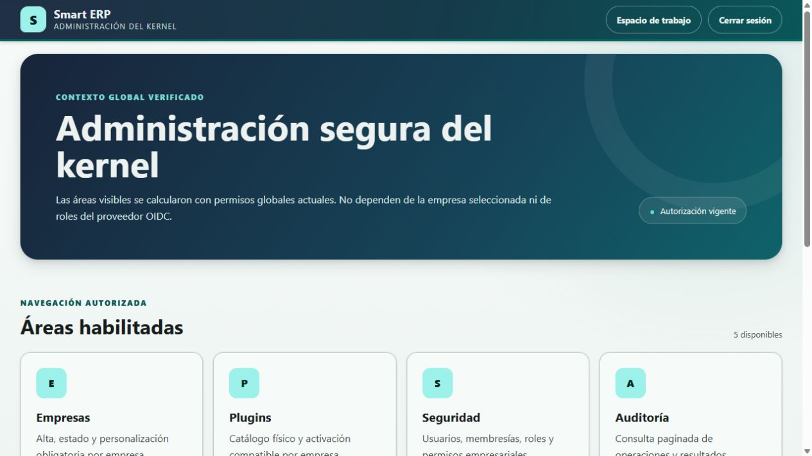
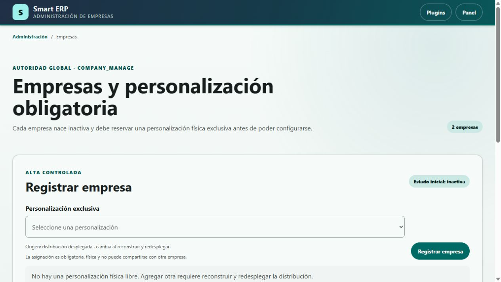
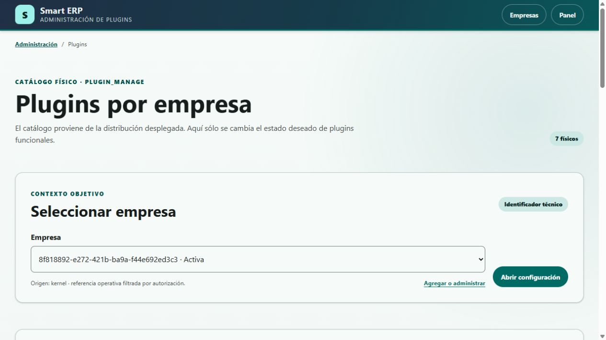
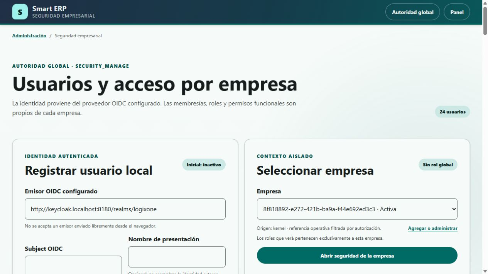
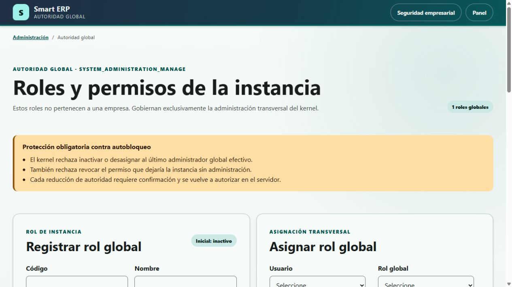
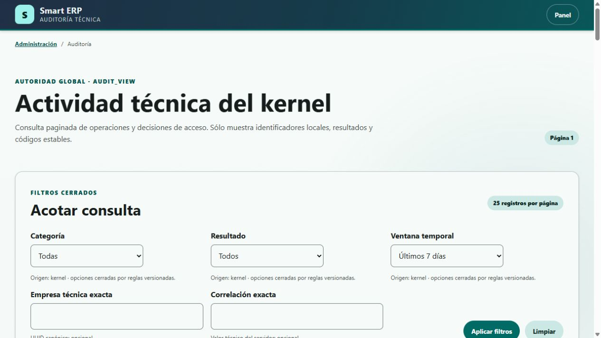

<article data-manual-version="2">
  
LogixOne · Manual de Administración del núcleo · edición 2026-08-11 · página 

  <header class="cover">
    
Manual operativo y de soporte

    <h1>Administración segura del núcleo del sistema</h1>
    
<strong>Kernel:</strong> núcleo transversal que controla empresas, identidad, seguridad, configuración, auditoría y disponibilidad de capacidades.

    
<strong>Nombre del módulo:</strong> Administración del kernel. <strong>Versión observada:</strong> baseline local del 11 de agosto de 2026. <strong>Audiencia:</strong> administradores de la instancia, responsables de seguridad, auditores y personal de soporte. <strong>Evidencia:</strong> seis pantallas reales de la aplicación y metadatos de la base local consultados sin modificar información. <strong>Regla de seguridad:</strong> use cuentas nominativas, una segunda ruta administrativa probada y el menor acceso necesario.

  </header>

  <section class="concepts">
    <h2>Conceptos necesarios para leer este manual</h2>
    
Las definiciones siguientes aparecen antes de las instrucciones, capturas y diagramas para que una persona nueva pueda interpretar el módulo sin leer el código.

    <h3>Interfaz, identidad y autorización</h3>
    <dl class="term-grid">
      <dt>Actor</dt><dd>Persona o proceso que intenta realizar una operación.</dd>
      <dt>Empresa</dt><dd>Frontera que separa configuración, acceso y operaciones de una organización dentro de la misma instalación.</dd>
      <dt>Plugin</dt><dd>Módulo incorporado físicamente al construir la aplicación. No se instala desde estas pantallas.</dd>
      <dt>Plugin funcional</dt><dd>Plugin que aporta una capacidad de negocio, por ejemplo catálogo o inventario.</dd>
      <dt>Personalización</dt><dd>Plugin exclusivo que adapta contribuciones de interfaz y composición para una empresa.</dd>
      <dt>Catálogo físico</dt><dd>Lista de plugins realmente incluidos en la distribución desplegada.</dd>
      <dt>Estado deseado</dt><dd>Decisión guardada de habilitar o deshabilitar un plugin para una empresa.</dd>
      <dt>Estado efectivo</dt><dd>Resultado real después de comprobar empresa activa, presencia física, tipo, compatibilidad y dependencias.</dd>
      <dt>Dependencia requerida</dt><dd>Plugin que debe estar efectivo antes de que otro pueda operar.</dd>
      <dt>Proveedor de identidad</dt><dd>Sistema externo que autentica a una persona. En esta demo se usa Keycloak.</dd>
      <dt>OIDC</dt><dd>OpenID Connect, protocolo usado para recibir una identidad autenticada desde el proveedor.</dd>
      <dt>Emisor OIDC o issuer</dt><dd>Dirección confiable que identifica al proveedor y al ámbito donde existe la cuenta.</dd>
      <dt>Subject OIDC</dt><dd>Identificador estable de la cuenta dentro del emisor; no es la contraseña ni necesariamente el nombre visible.</dd>
      <dt>Usuario local</dt><dd>Representación interna de una identidad externa. El sistema no guarda su contraseña OIDC.</dd>
      <dt>Membresía</dt><dd>Vínculo que permite a un usuario participar en una empresa determinada.</dd>
      <dt>Rol empresarial</dt><dd>Agrupación de permisos válida solamente dentro de una empresa.</dd>
      <dt>Rol global</dt><dd>Agrupación de permisos para administrar toda la instancia, sin pertenecer a una empresa.</dd>
      <dt>Permiso</dt><dd>Código cerrado que representa una capacidad autorizable, por ejemplo <code>kernel.audit.view</code>.</dd>
      <dt>Autoridad efectiva</dt><dd>Acceso que resulta de combinar usuario activo, asignaciones, rol activo y permiso concedido.</dd>
      <dt>Auditoría</dt><dd>Registro cronológico de operaciones y decisiones de acceso útil para investigación y soporte.</dd>
      <dt>Correlación</dt><dd>Identificador que reúne eventos producidos por una misma solicitud o recorrido.</dd>
      <dt>Versión de concurrencia</dt><dd>Número que cambia al modificar un registro y evita sobrescribir una actualización realizada por otra sesión.</dd>
      <dt>Inactivar</dt><dd>Impedir nuevas operaciones conservando configuración, relaciones, datos e historia.</dd>
      <dt>UUID</dt><dd>Identificador técnico de 36 caracteres que distingue empresas, usuarios, roles y eventos.</dd>
    </dl>
    <h3>Base de datos y leyenda de diagramas</h3>
    <dl class="term-grid">
      <dt>Base de datos</dt><dd>Conjunto organizado de información que la aplicación consulta o modifica.</dd>
      <dt>Esquema</dt><dd>Espacio lógico de la base que agrupa objetos. El núcleo usa el esquema <code>core</code>.</dd>
      <dt>Tabla</dt><dd>Estructura que guarda registros de un mismo tipo.</dd>
      <dt>Registro o fila</dt><dd>Conjunto completo de datos que representa una ocurrencia, por ejemplo una empresa.</dd>
      <dt>Columna o campo de base</dt><dd>Dato individual almacenado en una tabla, por ejemplo <code>status</code>.</dd>
      <dt>ID o identificador</dt><dd>Valor que distingue un registro de los demás.</dd>
      <dt>Restricción o constraint</dt><dd>Regla que la base obliga a cumplir.</dd>
      <dt>SQL</dt><dd>Lenguaje usado para consultar o modificar una base de datos.</dd>
      <dt>DML</dt><dd>Parte de SQL que opera registros mediante <code>SELECT</code>, <code>INSERT</code>, <code>UPDATE</code> y <code>DELETE</code>.</dd>
      <dt>Clave primaria o PK</dt><dd>Columna o conjunto de columnas que identifica de forma única cada registro.</dd>
      <dt>Clave foránea o FK</dt><dd>Columna que referencia la PK de otro registro y crea una relación.</dd>
      <dt>Clave única o UK</dt><dd>Restricción que impide repetir un valor o una combinación de valores.</dd>
      <dt>Nulo y no nulo o NN</dt><dd>Ausencia de valor y obligación de informar un valor, respectivamente.</dd>
      <dt>Relación y cardinalidad</dt><dd>Vínculo entre objetos y cantidad de registros que pueden asociarse, por ejemplo uno a muchos.</dd>
      <dt>Índice</dt><dd>Estructura que acelera búsquedas o ayuda a garantizar unicidad.</dd>
      <dt>Vista</dt><dd>Consulta guardada que se presenta como una fuente de datos.</dd>
      <dt>Vista materializada</dt><dd>Resultado almacenado de una consulta que requiere refresco.</dd>
      <dt>Trigger</dt><dd>Rutina que la base ejecuta automáticamente ante un evento.</dd>
      <dt>Función o procedimiento</dt><dd>Rutina de base invocada para calcular, validar o ejecutar una tarea.</dd>
      <dt>ABM o CRUD</dt><dd>Alta, consulta, modificación y baja de registros.</dd>
      <dt>C, R, U, D y EXT</dt><dd>Leyenda de los diagramas: crear, leer, modificar, eliminar y fuente externa al esquema.</dd>
    </dl>
    
<strong>Comprobación local:</strong> el 11 de agosto de 2026 se consultaron en modo de solo lectura tablas, columnas, tipos, nulabilidad, valores predeterminados, PK, FK, UK, restricciones, índices, vistas, vistas materializadas, secuencias, funciones y triggers del esquema <code>core</code>. No se consultaron filas funcionales ni se ejecutaron cambios.

  </section>

  <section class="toc">
    <h2>Cómo usar este manual</h2>
    
Cada capítulo comienza con una captura real, explica los datos y acciones, desarrolla un ejemplo ficticio, incluye un bosquejo orientativo y termina con el diagrama técnico que soporte puede usar para diagnosticar.

    <h3>Índice</h3>
    <table class="coverage-table"><thead><tr><th>N.º</th><th>Contenido</th><th>Página</th></tr></thead><tbody>
      <tr><td>1</td><td>Panel de administración</td><td>5</td></tr><tr><td>2</td><td>Empresas</td><td>8</td></tr><tr><td>3</td><td>Plugins por empresa</td><td>11</td></tr><tr><td>4</td><td>Seguridad empresarial</td><td>14</td></tr><tr><td>5</td><td>Roles y permisos globales</td><td>17</td></tr><tr><td>6</td><td>Auditoría</td><td>20</td></tr><tr><td>7</td><td>Errores frecuentes, seguridad, soporte y glosario</td><td>23</td></tr>
    </tbody></table>
    <h3>Permisos y alcance</h3>
    <table><thead><tr><th>Permiso global</th><th>Permite</th><th>No permite por sí solo</th></tr></thead><tbody>
      <tr><td><code>kernel.company.manage</code></td><td>Registrar, activar e inactivar empresas; reservar o reemplazar personalización.</td><td>Habilitar plugins o administrar usuarios.</td></tr>
      <tr><td><code>kernel.plugin.manage</code></td><td>Configurar plugins funcionales por empresa.</td><td>Reemplazar una personalización sin <code>kernel.company.manage</code>.</td></tr>
      <tr><td><code>kernel.security.manage</code></td><td>Administrar usuarios locales, membresías, roles y permisos empresariales.</td><td>Crear contraseñas, cuentas OIDC o roles globales.</td></tr>
      <tr><td><code>kernel.system_administration.manage</code></td><td>Administrar roles y permisos globales de toda la instancia.</td><td>Conceder acceso funcional dentro de una empresa.</td></tr>
      <tr><td><code>kernel.audit.view</code></td><td>Consultar el historial técnico paginado.</td><td>Editar, borrar o exportar eventos.</td></tr>
    </tbody></table>
    <h3>Orden recomendado de configuración</h3>
    <ol class="step-list"><li>Compruebe que existe una personalización física libre.</li><li>Registre la empresa, que nace inactiva.</li><li>Habilite primero los plugins requeridos y después sus dependientes.</li><li>Active la empresa cuando la composición sea operativa.</li><li>Registre usuarios, membresías y roles empresariales.</li><li>Conceda permisos mínimos, active los elementos necesarios y pruebe con otra sesión.</li><li>Conserve una segunda autoridad global antes de retirar accesos administrativos.</li><li>Use Auditoría para confirmar el resultado y reunir la correlación de soporte.</li></ol>
  </section>

  <section class="screen" data-screen="admin-home">
    
<h2>1. Panel de administración</h2>/faces/admin/index.xhtml

    
<strong>Objetivo:</strong> presentar solamente las áreas que el actor puede abrir según sus permisos globales vigentes.

<strong>Prerrequisito:</strong> sesión autenticada con al menos uno de los cinco permisos administrativos documentados.

    <h3>Términos de esta pantalla</h3><dl><dt><strong>Tarjeta administrativa</strong></dt><dd>Enlace visible hacia una capacidad autorizada. La ausencia de una tarjeta no se resuelve escribiendo la dirección manualmente porque el servidor vuelve a autorizar.</dd></dl>
    <h3>Captura real de la pantalla</h3><figure class="screen-capture"><figcaption>Demo local del 11 de agosto de 2026. La cuenta ficticia dispone de las cinco áreas. La captura no contiene la contraseña ni datos productivos.</figcaption></figure>
    <h3>Datos y acciones</h3>
    <table><thead><tr><th>Elemento</th><th>Qué informa</th><th>Qué puede hacer</th></tr></thead><tbody><tr><td>Autorización vigente</td><td>La autoridad fue resuelta para la solicitud actual.</td><td>No es un botón ni concede permisos nuevos.</td></tr><tr><td>Áreas habilitadas</td><td>Cantidad de tarjetas que la cuenta puede abrir.</td><td>Abrir Empresas, Plugins, Seguridad, Auditoría o Autoridad global.</td></tr><tr><td>Espacio de trabajo</td><td>Regreso al contexto empresarial.</td><td>Volver a la aplicación sin modificar autoridad.</td></tr><tr><td>Cerrar sesión</td><td>Finalización segura de la sesión.</td><td>Salir mediante el recorrido configurado.</td></tr></tbody></table>
    
<h3>Ejemplo: elegir el área correcta</h3><ol class="step-list"><li>Si una empresa no puede usar Inventario, abra <strong>Plugins</strong> y compruebe estado deseado, estado efectivo y dependencias.</li><li>Si una persona no ve Inventario dentro de una empresa, abra <strong>Seguridad</strong> y compruebe usuario, membresía, rol y permiso.</li><li>Si una persona no ve ni siquiera la tarjeta Plugins, abra <strong>Autoridad global</strong> desde una segunda cuenta autorizada y revise el rol global.</li><li>Después abra <strong>Auditoría</strong> para confirmar qué permiso se permitió o denegó.</li></ol>
<strong>Resultado esperado:</strong> el diagnóstico comienza en la capa correcta y evita modificar datos sin necesidad.

    <h3>Bosquejo orientativo de la pantalla</h3>
Representación estimada; la disposición puede variar según versión, resolución, permiso o estado.

┌ Smart ERP · Administración del kernel ────────────────────────────────┐
│                                  [Espacio de trabajo] [Cerrar sesión] │
├ Administración segura del núcleo · autorización vigente ────────────┤
│ [Empresas] [Plugins] [Seguridad] [Auditoría] [Autoridad global]      │
│ Solo aparecen las tarjetas permitidas para la cuenta.                │
└──────────────────────────────────────────────────────────────────────┘

    <h3>Diagrama de datos y tablas afectadas</h3>

      
<h4>core.app_user [R]</h4><ul><li><strong>PK</strong> app_user_id : uuid, NN</li><li><strong>UK</strong> issuer + subject : texto, NN</li><li>status : texto, NN</li></ul>
Resuelve la identidad local activa antes de construir autoridad.

      
<h4>core.app_user_system_role [R]</h4><ul><li><strong>PK/FK</strong> app_user_id : uuid, NN</li><li><strong>PK/FK</strong> system_role_id : uuid, NN</li><li>created_at : fecha y hora, NN</li></ul>

      
<h4>core.system_role [R]</h4><ul><li><strong>PK</strong> system_role_id : uuid, NN</li><li><strong>UK</strong> role_code : texto, NN</li><li>status : texto, NN</li><li>version : entero largo, NN</li></ul>

      
<h4>core.system_role_permission [R]</h4><ul><li><strong>PK/FK</strong> system_role_id : uuid, NN</li><li><strong>PK</strong> permission_id : texto, NN</li><li>created_at : fecha y hora, NN</li></ul>

      
<h4>core.audit_event [C]</h4><ul><li><strong>PK</strong> audit_event_id : uuid, NN</li><li>category, operation, outcome, actor_kind : texto, NN</li><li>actor_user_id, permission_id, screen_id, result_code : opcionales</li><li>correlation_id : texto opcional</li><li>occurred_at : fecha y hora, NN</li></ul>

      
<h4>Contexto autenticado [EXT]</h4><ul><li>issuer + subject recibidos mediante OIDC</li><li>permisos efectivos calculados por servicios del kernel</li></ul>
La pantalla no consulta contraseñas ni roles del proveedor.

    
<ul class="relation-list"><li><code>app_user (1) &lt;- app_user_system_role (N) -&gt; system_role (1)</code>.</li><li><code>system_role (1) &lt;- system_role_permission (N)</code>.</li><li><code>audit_event.actor_user_id</code> conserva un identificador lógico sin FK para preservar la historia.</li><li>La inserción del evento no dispara el trigger de protección, que actúa solamente ante UPDATE o DELETE.</li></ul>

  </section>

  <section class="screen" data-screen="companies">
    
<h2>2. Empresas</h2>/faces/admin/companies.xhtml

    
<strong>Objetivo:</strong> registrar la frontera empresarial, reservar su personalización exclusiva y administrar su estado sin borrar datos.

<strong>Permiso:</strong> <code>kernel.company.manage</code>. El enlace Configurar plugins se muestra solamente si también existe <code>kernel.plugin.manage</code>.

    <h3>Términos de esta pantalla</h3><dl><dt><strong>Alta controlada</strong></dt><dd>Creación que aplica reglas en el servidor y genera el UUID; la pantalla no permite escribir el identificador.</dd><dt><strong>Personalización exclusiva</strong></dt><dd>Personalización física que solo puede reservar una empresa. Su UK impide duplicarla.</dd></dl>
    <h3>Captura real de la pantalla</h3><figure class="screen-capture"><figcaption>La demo muestra dos empresas y ninguna personalización libre. El estado deshabilitado es correcto: una nueva personalización requiere reconstruir y redesplegar.</figcaption></figure>
    <h3>Datos y acciones</h3><table><thead><tr><th>Dato o acción</th><th>Formato y origen</th><th>Regla y efecto</th></tr></thead><tbody><tr><td>Personalización exclusiva</td><td>Selector obligatorio obtenido del catálogo físico.</td><td>Solo muestra personalizaciones libres; no admite texto libre.</td></tr><tr><td>Registrar empresa</td><td>Acción de alta; el UUID se genera automáticamente.</td><td>Crea la empresa inactiva y reserva la personalización. No habilita plugins funcionales.</td></tr><tr><td>Estado</td><td>Activa o inactiva.</td><td>Activar revalida composición. Inactivar conserva activaciones y datos.</td></tr><tr><td>Versión</td><td>Entero automático.</td><td>Si cambió en otra sesión, la operación se rechaza y debe recargarse.</td></tr><tr><td>Configurar plugins</td><td>Enlace con UUID de empresa.</td><td>Abre la configuración de esa empresa exacta.</td></tr><tr><td>Activar o Inactivar</td><td>Botón según estado actual.</td><td>Inactivar pide confirmación. No existe borrado desde esta pantalla.</td></tr></tbody></table>
    
<h3>Ejemplo: registrar una empresa ficticia</h3>
Suponga que la distribución incluye una personalización libre llamada <strong>Comercial Guaraní</strong>.
<ol class="step-list"><li>Seleccione Comercial Guaraní en Personalización exclusiva.</li><li>Pulse Registrar empresa.</li><li>Guarde el UUID generado en la ficha de implementación de la organización.</li><li>Abra Configurar plugins y prepare las capacidades requeridas.</li><li>Regrese y active la empresa únicamente cuando la composición figure operativa.</li></ol>
<strong>Resultado esperado:</strong> empresa inactiva al crearla, personalización reservada una sola vez y evento auditable. Si el selector está vacío como en la captura, no intente crearla con SQL.

    <h3>Bosquejo orientativo de la pantalla</h3>
Representación estimada; la disposición puede variar según versión, resolución, permiso o estado.

┌ Empresas y personalización obligatoria ───────────────────────────────┐
│ Personalización exclusiva [seleccione ▼] [Registrar empresa]         │
├ Empresas registradas ────────────────────────────────────────────────┤
│ UUID · Activa/Inactiva · personalización · versión                   │
│ [Configurar plugins] [Activar/Inactivar]                             │
└ Sin borrado ni SQL manual ───────────────────────────────────────────┘

    <h3>Diagrama de datos y tablas afectadas</h3>

      
<h4>core.company [C/R/U]</h4><ul><li><strong>PK</strong> company_id : uuid, NN, generado</li><li>status : varchar(16), NN, INACTIVE/ACTIVE</li><li><strong>UK</strong> customization_plugin_id : varchar(59), NN</li><li>version : bigint, NN, predeterminado 0</li><li>created_at, updated_at : fecha y hora, NN</li></ul>
La pantalla crea, lista y cambia estado. No elimina.

      
<h4>core.company_plugin_activation [R]</h4><ul><li><strong>PK/FK</strong> company_id : uuid, NN</li><li><strong>PK</strong> plugin_id : varchar(59), NN</li><li>desired_state : varchar(16), NN</li><li>version : bigint, NN</li><li>created_at, updated_at : fecha y hora, NN</li></ul>
Se consulta al revalidar la composición antes de activar.

      
<h4>Catálogo de plugins [EXT/R]</h4><ul><li>plugin_id, display_name, kind, version</li><li>dependencias y compatibilidad declaradas</li></ul>
Origen: descriptores físicos incluidos en la distribución.

      
<h4>core.audit_event [C]</h4><ul><li>audit_event_id, category, operation, outcome</li><li>actor_kind, actor_user_id, company_id</li><li>plugin_id, result_code</li><li>previous_version, resulting_version</li><li>correlation_id, occurred_at</li></ul>

    
<ul class="relation-list"><li><code>company (1) -&gt; company_plugin_activation (0..N)</code> por <code>company_id</code>, con FK y DELETE RESTRICT.</li><li>La UK <code>company_customization_plugin_id_uk</code> impide compartir personalización.</li><li>Las restricciones validan formato del plugin, estados cerrados, versión no negativa y fechas coherentes.</li><li>No existen triggers sobre <code>company</code> ni <code>company_plugin_activation</code> en la base local verificada.</li></ul>

  </section>

  <section class="screen" data-screen="plugins">
    
<h2>3. Plugins por empresa</h2>/faces/admin/plugins.xhtml?company=&lt;uuid&gt;

    
<strong>Objetivo:</strong> comparar catálogo físico, decisión empresarial y disponibilidad efectiva; habilitar o deshabilitar plugins funcionales y, con permiso adicional, reemplazar personalización.

<strong>Permisos:</strong> <code>kernel.plugin.manage</code>; reemplazar personalización exige además <code>kernel.company.manage</code>.

    <h3>Términos de esta pantalla</h3><dl><dt><strong>Composición operativa</strong></dt><dd>Estado donde empresa, personalización, plugins y dependencias cumplen todas las reglas necesarias para operar.</dd><dt><strong>Versión de decisión</strong></dt><dd>Versión del registro que guarda el estado deseado de un plugin para una empresa.</dd></dl>
    <h3>Captura real de la pantalla</h3><figure class="screen-capture"><figcaption>La captura muestra una empresa ficticia activa y siete plugins físicos. El selector identifica de forma explícita la empresa que recibirá cualquier cambio.</figcaption></figure>
    <h3>Datos, acciones y diagnósticos</h3><table><thead><tr><th>Elemento</th><th>Qué significa</th><th>Uso correcto</th></tr></thead><tbody><tr><td>Empresa</td><td>UUID y estado de la empresa objetivo.</td><td>Seleccione y pulse Abrir configuración; cambiar el selector no modifica nada por sí solo.</td></tr><tr><td>Plugin, versión y tipo</td><td>Datos del descriptor físico.</td><td>Solo los plugins funcionales aceptan Habilitar o Deshabilitar.</td></tr><tr><td>Estado deseado</td><td>Decisión persistida de la empresa.</td><td>Cambia con Habilitar o Deshabilitar.</td></tr><tr><td>Estado efectivo</td><td>Capacidad realmente disponible.</td><td>Debe decir Disponible para operar antes de comunicar disponibilidad.</td></tr><tr><td>Diagnóstico</td><td>Bloqueo de empresa, presencia, tipo, dependencia o compatibilidad.</td><td>Resuelva la causa; no repita el mismo botón.</td></tr><tr><td>Nueva personalización</td><td>Personalización física libre distinta de la actual.</td><td>Reemplazar conserva datos, revalida exclusividad y puede cambiar la interfaz.</td></tr><tr><td>Catálogo físico desplegado</td><td>Lista de solo lectura con dependencias.</td><td>Agregar o retirar un plugin exige reconstruir y redesplegar.</td></tr></tbody></table>
    
<h3>Ejemplo: habilitar Inventario respetando dependencias</h3>
La demo declara <code>inventory</code> dependiente de <code>commercial_catalog</code>; este último y <code>business_partners</code> dependen de <code>reference_data</code>.
<ol class="step-list"><li>Seleccione la empresa exacta y confirme que está activa.</li><li>Compruebe que <code>reference_data</code> está habilitado y efectivo.</li><li>Habilite <code>commercial_catalog</code> y confirme Disponible para operar.</li><li>Habilite <code>inventory</code> y vuelva a comprobar estado efectivo.</li><li>Si necesita deshabilitar <code>commercial_catalog</code>, revise primero Inventario; el kernel puede rechazar dejar un dependiente activo.</li></ol>
<strong>Resultado esperado:</strong> los cuatro plugins que aparecen habilitados en la demo permanecen efectivos. Deshabilitar conserva tablas, migraciones y datos.

    <h3>Bosquejo orientativo de la pantalla</h3>
Representación estimada; la disposición puede variar según versión, resolución, permiso o estado.

┌ Plugins por empresa ──────────────────────────────────────────────────┐
│ Empresa [UUID · estado ▼] [Abrir configuración]                      │
├ Empresa seleccionada · personalización · diagnóstico ────────────────┤
│ Plugin funcional · versión · deseado · efectivo [Habilitar/Deshab.]  │
├ Reemplazar personalización [opción libre ▼] [Reemplazar]             │
├ Catálogo físico: plugin · tipo · versión · dependencias (solo lectura)│
└──────────────────────────────────────────────────────────────────────┘

    <h3>Diagrama de datos y tablas afectadas</h3>

      
<h4>core.company_plugin_activation [C/R/U]</h4><ul><li><strong>PK/FK</strong> company_id : uuid, NN</li><li><strong>PK</strong> plugin_id : varchar(59), NN</li><li>desired_state : varchar(16), NN</li><li>version : bigint, NN, control de concurrencia</li><li>created_at, updated_at : fecha y hora, NN</li></ul>

      
<h4>core.company [R/U]</h4><ul><li><strong>PK</strong> company_id : uuid, NN</li><li>status : varchar(16), NN</li><li><strong>UK</strong> customization_plugin_id : varchar(59), NN</li><li>version : bigint, NN</li><li>updated_at : fecha y hora, NN</li></ul>
U solamente al reemplazar personalización.

      
<h4>Descriptores físicos [EXT/R]</h4><ul><li>plugin_id, display_name, kind, version</li><li>dependencias requeridas y rangos compatibles</li><li>evidencia de migración presente</li></ul>
El estado efectivo se calcula; no es una columna.

      
<h4>core.audit_event [C]</h4><ul><li>audit_event_id, category, operation, outcome</li><li>actor_user_id, company_id, plugin_id</li><li>result_code, previous_version, resulting_version</li><li>correlation_id, occurred_at</li></ul>

    
<ul class="relation-list"><li><code>company (1) -&gt; company_plugin_activation (0..N)</code> mediante FK <code>company_id</code>.</li><li>El índice parcial <code>company_plugin_activation_enabled_idx</code> acelera decisiones ENABLED.</li><li>La personalización se valida contra catálogo externo y UK de <code>company.customization_plugin_id</code>.</li><li>No existen triggers sobre las tablas escritas por esta pantalla en la base local verificada.</li></ul>

  </section>

  <section class="screen" data-screen="business-security">
    
<h2>4. Seguridad empresarial</h2>/faces/admin/security.xhtml?company=&lt;uuid&gt;

    
<strong>Objetivo:</strong> registrar identidades confiables, vincularlas con una empresa y administrar roles y permisos funcionales sin gestionar contraseñas.

<strong>Permiso:</strong> <code>kernel.security.manage</code>. Todas las operaciones vuelven a validar empresa y autoridad en el servidor.

    <h3>Términos de esta pantalla</h3><dl><dt><strong>Emisor configurado</strong></dt><dd>Issuer confiable leído desde la configuración del servidor. El navegador lo muestra pero no puede cambiarlo.</dd><dt><strong>Permiso disponible</strong></dt><dd>Permiso aportado por el kernel o por un plugin que está efectivo para la empresa seleccionada.</dd></dl>
    <h3>Captura real de la pantalla</h3><figure class="screen-capture"><figcaption>La demo muestra 24 usuarios ficticios. El emisor OIDC es de solo lectura y la empresa seleccionada limita todos los roles y membresías mostrados debajo.</figcaption></figure>
    <h3>Datos y acciones</h3><table><thead><tr><th>Grupo</th><th>Datos</th><th>Regla funcional</th></tr></thead><tbody><tr><td>Usuario local</td><td>Emisor configurado, subject obligatorio, nombre opcional, estado y versión.</td><td>Emisor + subject son únicos. Nace inactivo y no contiene contraseña.</td></tr><tr><td>Empresa</td><td>Selector de UUID y estado.</td><td>Todo lo que sigue pertenece exclusivamente a esa empresa.</td></tr><tr><td>Membresía</td><td>Usuario, empresa, estado, versión y roles asignados.</td><td>Nace inactiva. Sin membresía activa no hay acceso empresarial.</td></tr><tr><td>Rol empresarial</td><td>Código único por empresa, nombre, estado, versión y permisos.</td><td>Nace inactivo; inactivar conserva asignaciones.</td></tr><tr><td>Asignar o Desasignar</td><td>Relación membresía - rol.</td><td>Desasignar elimina la relación, no el usuario ni el rol.</td></tr><tr><td>Conceder o Revocar</td><td>Relación rol - permiso.</td><td>Solo se ofrece un permiso disponible en la composición actual.</td></tr><tr><td>Activar o Inactivar</td><td>Cambio de usuario, membresía o rol con versión.</td><td>Una cuenta inactiva deja de aportar autoridad sin borrar historia.</td></tr></tbody></table>
    
<h3>Ejemplo: acceso de solo consulta al catálogo</h3>
Use datos ficticios: nombre <strong>Ana Compras Demo</strong>, subject <code>ana.compras.demo</code>, rol <code>catalog_reader</code> y permiso <code>commercial_catalog.view</code>.
<ol class="step-list"><li>Registre el usuario con el emisor mostrado; luego actívelo.</li><li>Seleccione la empresa y registre la membresía; luego actívela.</li><li>Registre el rol <code>catalog_reader</code> con nombre Lector de catálogo.</li><li>Conceda <code>commercial_catalog.view</code> al rol. Si no aparece, compruebe que Commercial catalog está efectivo.</li><li>Active el rol y asígnelo a la membresía de Ana.</li><li>Pruebe desde una sesión distinta: la cuenta debe consultar el catálogo, pero no debe administrar el kernel.</li></ol>
<strong>Resultado esperado:</strong> usuario, membresía y rol activos; permiso mínimo concedido; asignación auditable y aislada a una empresa.

    <h3>Bosquejo orientativo de la pantalla</h3>
Representación estimada; la disposición puede variar según versión, resolución, permiso o estado.

┌ Usuarios y acceso por empresa ───────────────────────────────────────┐
│ Registrar usuario: issuer (solo lectura) · subject · nombre [Registrar]│
│ Empresa [UUID ▼] [Abrir seguridad]                                   │
├ Usuarios conocidos · estado [Activar/Inactivar]                      │
├ Registrar membresía │ Registrar rol │ Asignar rol │ Conceder permiso │
├ Membresías: roles [Desasignar] · estado [Activar/Inactivar]          │
├ Roles: permisos [Revocar] · estado [Activar/Inactivar]               │
└──────────────────────────────────────────────────────────────────────┘

    <h3>Diagrama de datos y tablas afectadas</h3>

      
<h4>core.app_user [C/R/U]</h4><ul><li><strong>PK</strong> app_user_id : uuid, NN</li><li><strong>UK</strong> issuer + subject : varchar, NN</li><li>display_name : varchar(160), opcional</li><li>status : varchar(16), NN</li><li>version : bigint, NN</li><li>created_at, updated_at : fecha y hora, NN</li></ul>

      
<h4>core.company_membership [C/R/U]</h4><ul><li><strong>PK/FK</strong> app_user_id : uuid, NN</li><li><strong>PK/FK</strong> company_id : uuid, NN</li><li>status : varchar(16), NN</li><li>version : bigint, NN</li><li>created_at, updated_at : fecha y hora, NN</li></ul>

      
<h4>core.security_role [C/R/U]</h4><ul><li><strong>PK</strong> role_id : uuid, NN</li><li><strong>FK</strong> company_id : uuid, NN</li><li><strong>UK por empresa</strong> role_code : varchar(128), NN</li><li>display_name : varchar(160), NN</li><li>status : varchar(16), NN</li><li>version : bigint, NN</li><li>created_at, updated_at : fecha y hora, NN</li></ul>

      
<h4>core.membership_role [C/R/D]</h4><ul><li><strong>PK/FK</strong> app_user_id : uuid, NN</li><li><strong>PK/FK</strong> company_id : uuid, NN</li><li><strong>PK/FK</strong> role_id : uuid, NN</li><li>created_at : fecha y hora, NN</li></ul>

      
<h4>core.role_permission [C/R/D]</h4><ul><li><strong>PK/FK</strong> company_id : uuid, NN</li><li><strong>PK/FK</strong> role_id : uuid, NN</li><li><strong>PK</strong> permission_id : varchar(128), NN</li><li>created_at : fecha y hora, NN</li></ul>

      
<h4>core.company [R]</h4><ul><li><strong>PK</strong> company_id : uuid, NN</li><li>status : varchar(16), NN</li></ul>

      
<h4>Permisos efectivos [EXT/R]</h4><ul><li>permission_id aportado por kernel o plugins efectivos</li><li>plugin_id y empresa usados para resolver disponibilidad</li></ul>

      
<h4>core.audit_event [C]</h4><ul><li>audit_event_id, category, operation, outcome</li><li>actor_user_id, subject_user_id, company_id</li><li>role_id, permission_id, result_code</li><li>previous_version, resulting_version</li><li>correlation_id, occurred_at</li></ul>

    
<ul class="relation-list"><li><code>app_user (1) -&gt; company_membership (0..N) -&gt; company (1)</code>.</li><li><code>company (1) -&gt; security_role (0..N)</code>.</li><li><code>company_membership (N) &lt;- membership_role -&gt; security_role (N)</code> con FKs compuestas que impiden cruces de empresa.</li><li><code>security_role (1) -&gt; role_permission (0..N)</code> mediante <code>company_id + role_id</code>.</li><li>Los índices parciales favorecen usuarios y roles activos. No existen triggers sobre estas tablas en la base local verificada.</li></ul>

  </section>

  <section class="screen" data-screen="system-authority">
    
<h2>5. Roles y permisos globales</h2>/faces/admin/system-authority.xhtml

    
<strong>Objetivo:</strong> administrar quién puede operar toda la instancia sin mezclar esa autoridad con el acceso funcional de una empresa.

<strong>Permiso:</strong> <code>kernel.system_administration.manage</code>. Es la pantalla de mayor impacto y protege contra dejar la instancia sin un administrador efectivo.

    <h3>Términos de esta pantalla</h3><dl><dt><strong>Autobloqueo administrativo</strong></dt><dd>Situación donde se retira la última combinación activa de usuario, rol y permiso capaz de administrar la autoridad global.</dd><dt><strong>Separación de funciones</strong></dt><dd>Práctica de distribuir capacidades sensibles entre cuentas o roles diferentes.</dd></dl>
    <h3>Captura real de la pantalla</h3><figure class="screen-capture"><figcaption>La demo contiene un rol global. El aviso amarillo explica las tres protecciones que el servidor vuelve a comprobar antes de reducir autoridad.</figcaption></figure>
    <h3>Datos y acciones</h3><table><thead><tr><th>Elemento</th><th>Datos</th><th>Efecto</th></tr></thead><tbody><tr><td>Registrar rol global</td><td>Código único y nombre obligatorios.</td><td>Crea un rol inactivo sin empresa.</td></tr><tr><td>Asignar rol global</td><td>Usuario local y rol global existentes.</td><td>Crea la relación usuario - rol.</td></tr><tr><td>Conceder permiso global</td><td>Rol y permiso de la lista cerrada del kernel.</td><td>Crea la relación rol - permiso.</td></tr><tr><td>Activar o Inactivar</td><td>Estado y versión del rol.</td><td>Inactivar retira autoridad efectiva, sujeto a protección del último administrador.</td></tr><tr><td>Desasignar</td><td>Usuario y rol de una asignación existente.</td><td>Elimina la relación, no el usuario ni el rol.</td></tr><tr><td>Revocar</td><td>Rol y permiso concedido.</td><td>Elimina la concesión, salvo que cause autobloqueo.</td></tr></tbody></table>
    
<h3>Ejemplo: crear un rol de auditoría para soporte</h3>
Use un segundo usuario ficticio ya registrado y cree el rol <code>support_auditor</code> con nombre Auditor de soporte.
<ol class="step-list"><li>Registre el rol global; nacerá inactivo.</li><li>Conceda solamente <code>kernel.audit.view</code>.</li><li>Asigne el rol al segundo usuario y actívelo.</li><li>Pruebe desde otra sesión: debe abrir Panel y Auditoría, pero no Empresas, Plugins, Seguridad ni Autoridad global.</li><li>No retire la cuenta administradora original hasta verificar una segunda ruta con <code>kernel.system_administration.manage</code>.</li></ol>
<strong>Resultado esperado:</strong> soporte puede investigar eventos sin modificar configuración. La separación de funciones limita el impacto de la cuenta.

    <h3>Bosquejo orientativo de la pantalla</h3>
Representación estimada; la disposición puede variar según versión, resolución, permiso o estado.

┌ Roles y permisos de la instancia ────────────────────────────────────┐
│ Aviso: protección contra autobloqueo                                 │
│ Código · nombre [Registrar rol global]                               │
│ Usuario [▼] Rol [▼] [Asignar]                                       │
│ Rol [▼] Permiso global [▼] [Conceder]                               │
├ Rol · estado · versión · usuarios [Desasignar] · permisos [Revocar] │
│ [Activar/Inactivar]                                                  │
└──────────────────────────────────────────────────────────────────────┘

    <h3>Diagrama de datos y tablas afectadas</h3>

      
<h4>core.system_role [C/R/U]</h4><ul><li><strong>PK</strong> system_role_id : uuid, NN</li><li><strong>UK</strong> role_code : varchar(128), NN</li><li>display_name : varchar(160), NN</li><li>status : varchar(16), NN</li><li>version : bigint, NN</li><li>created_at, updated_at : fecha y hora, NN</li></ul>

      
<h4>core.app_user_system_role [C/R/D]</h4><ul><li><strong>PK/FK</strong> app_user_id : uuid, NN</li><li><strong>PK/FK</strong> system_role_id : uuid, NN</li><li>created_at : fecha y hora, NN</li></ul>

      
<h4>core.system_role_permission [C/R/D]</h4><ul><li><strong>PK/FK</strong> system_role_id : uuid, NN</li><li><strong>PK</strong> permission_id : varchar(128), NN</li><li>created_at : fecha y hora, NN</li></ul>

      
<h4>core.app_user [R]</h4><ul><li><strong>PK</strong> app_user_id : uuid, NN</li><li>display_name : varchar(160), opcional</li><li>status : varchar(16), NN</li></ul>

      
<h4>Permisos globales [EXT/R]</h4><ul><li>kernel.company.manage</li><li>kernel.plugin.manage</li><li>kernel.security.manage</li><li>kernel.audit.view</li><li>kernel.system_administration.manage</li></ul>

      
<h4>core.audit_event [C]</h4><ul><li>audit_event_id, category, operation, outcome</li><li>actor_user_id, subject_user_id, system_role_id</li><li>permission_id, result_code</li><li>previous_version, resulting_version</li><li>correlation_id, occurred_at</li></ul>

    
<ul class="relation-list"><li><code>app_user (N) &lt;- app_user_system_role -&gt; system_role (N)</code>.</li><li><code>system_role (1) -&gt; system_role_permission (0..N)</code>.</li><li>UK <code>system_role_code_uk</code> evita códigos duplicados.</li><li>Los índices de roles activos y de permisos aceleran la resolución de autoridad. No existen triggers sobre estas tablas en la base local verificada.</li></ul>

  </section>

  <section class="screen" data-screen="audit">
    
<h2>6. Auditoría</h2>/faces/admin/audit.xhtml

    
<strong>Objetivo:</strong> investigar operaciones y decisiones de acceso mediante filtros cerrados y paginación, sin modificar el historial.

<strong>Permiso:</strong> <code>kernel.audit.view</code>.

    <h3>Términos de esta pantalla</h3><dl><dt><strong>Ventana temporal</strong></dt><dd>Periodo cerrado que limita la consulta: 24 horas, 7 días, 30 días o todo desde la migración V5.</dd><dt><strong>Append-only</strong></dt><dd>Modelo donde se agregan eventos pero se rechaza modificar o borrar los ya registrados.</dd><dt><strong>Paginación</strong></dt><dd>División del resultado en bloques de 25 eventos, ordenados del más reciente al más antiguo.</dd></dl>
    <h3>Captura real de la pantalla</h3><figure class="screen-capture"><figcaption>La demo inicia con los últimos 7 días y 25 registros por página. Abrir las áreas administrativas también produce eventos de acceso permitidos.</figcaption></figure>
    <h3>Filtros, columnas y acciones</h3><table><thead><tr><th>Elemento</th><th>Valores o formato</th><th>Interpretación</th></tr></thead><tbody><tr><td>Categoría</td><td>Empresa y plugins, Seguridad empresarial, Acceso empresarial, Autoridad global, Acceso administrativo u Operación de plugin.</td><td>Separa el tipo de actividad investigada.</td></tr><tr><td>Resultado</td><td>Aplicado, Sin cambios, Rechazado, Permitido, Denegado o Requiere selección.</td><td>Distingue cambio confirmado, no operación y decisión de acceso.</td></tr><tr><td>Ventana temporal</td><td>24 horas, 7 días, 30 días o todo desde V5.</td><td>Comience por el periodo más corto que incluya el incidente.</td></tr><tr><td>Empresa técnica exacta</td><td>UUID canónico opcional.</td><td>No busca por nombre ni admite un UUID parcial.</td></tr><tr><td>Correlación exacta</td><td>Texto técnico canónico opcional.</td><td>Reúne todos los eventos de una solicitud o recorrido.</td></tr><tr><td>Evento</td><td>Fecha UTC, categoría, operación, resultado, actor y detalles disponibles.</td><td>Los campos opcionales solo aparecen cuando aplican.</td></tr><tr><td>Aplicar filtros</td><td>Reinicia en página 1.</td><td>Valida entradas antes de ejecutar la consulta.</td></tr><tr><td>Limpiar</td><td>Quita filtros y vuelve a valores predeterminados.</td><td>No borra eventos.</td></tr></tbody></table>
    
<h3>Ejemplo: investigar un plugin que no pudo habilitarse</h3><ol class="step-list"><li>Seleccione categoría Empresa y plugins.</li><li>Seleccione resultado Rechazado y ventana Últimas 24 horas.</li><li>Copie el UUID exacto de la empresa desde Empresas o Plugins.</li><li>Pulse Aplicar filtros y abra el evento correspondiente al momento del intento.</li><li>Lea operación, plugin, código, versión anterior, versión resultante y correlación.</li><li>Busque la misma correlación para ordenar los eventos relacionados; resuelva dependencia o conflicto antes de reintentar.</li></ol>
<strong>Resultado esperado:</strong> soporte distingue un intento rechazado de un cambio aplicado y puede escalar con empresa, hora, operación, código y correlación sin enviar secretos.

    <h3>Bosquejo orientativo de la pantalla</h3>
Representación estimada; la disposición puede variar según versión, resolución, permiso o estado.

┌ Actividad técnica del kernel ─────────────────────────────────────────┐
│ Categoría [▼] Resultado [▼] Ventana [▼]                             │
│ Empresa exacta [UUID] Correlación exacta [texto]                    │
│ [Aplicar filtros] [Limpiar]                                         │
├ Eventos: fecha UTC · operación · resultado · actor · detalles       │
│ [Página anterior]                 Página n              [Siguiente] │
└──────────────────────────────────────────────────────────────────────┘

    <h3>Diagrama de datos y tablas afectadas</h3>

      
<h4>core.audit_event [R]</h4><ul><li><strong>PK</strong> audit_event_id : uuid, NN</li><li>category : varchar(40), NN, filtro</li><li>operation : varchar(96), NN</li><li>outcome : varchar(32), NN, filtro</li><li>actor_kind : varchar(32), NN</li><li>actor_user_id, subject_user_id : uuid, opcionales</li><li>company_id : uuid, opcional, filtro</li><li>role_id, system_role_id : uuid, opcionales</li><li>plugin_id : varchar(128), opcional</li></ul>

      
<h4>core.audit_event [R] continuación</h4><ul><li>permission_id : varchar(160), opcional</li><li>screen_id : varchar(260), opcional</li><li>result_code : varchar(128), opcional</li><li>previous_version, resulting_version : bigint, opcionales</li><li>correlation_id : varchar(128), opcional, filtro</li><li>occurred_at : fecha y hora, NN, filtro y orden</li><li>resource_type : varchar(96), opcional</li><li>resource_id : varchar(160), opcional</li></ul>

      
<h4>Índices usados [R]</h4><ul><li>audit_event_occurred_idx</li><li>audit_event_category_outcome_idx</li><li>audit_event_company_idx</li><li>audit_event_actor_idx</li><li>audit_event_correlation_idx</li><li>audit_event_resource_idx</li></ul>
La consulta se ordena por <code>occurred_at DESC, audit_event_id DESC</code>.

      
<h4>Catálogos cerrados [EXT/R]</h4><ul><li>categorías y resultados definidos por el kernel</li><li>ventanas temporales cerradas</li><li>tamaño fijo: 25 eventos por página</li></ul>
La pantalla no crea categorías ni resultados.

    
<ul class="relation-list"><li>Los identificadores de actor, usuario, empresa, roles, plugin y recurso son referencias históricas lógicas; <code>audit_event</code> no declara FKs hacia esas tablas.</li><li>No existen vistas, vistas materializadas ni secuencias del esquema <code>core</code> en la base local verificada.</li></ul>
    
<h4>Trigger comprobado: audit_event_no_update_or_delete</h4><table><tbody><tr><th>Tabla</th><td><code>core.audit_event</code></td></tr><tr><th>Momento y evento</th><td>BEFORE UPDATE OR DELETE, por cada fila, sin condición WHEN.</td></tr><tr><th>Estado</th><td>Habilitado (<code>tgenabled = O</code>).</td></tr><tr><th>Llama</th><td><code>core.reject_audit_event_mutation()</code>, función PL/pgSQL.</td></tr><tr><th>Lee o modifica</th><td>No lee ni modifica otra tabla.</td></tr><tr><th>Error</th><td>Genera la excepción <code>core.audit_event is append-only</code>.</td></tr><tr><th>Efecto funcional</th><td>Bloquea cualquier modificación o borrado del evento. INSERT permanece permitido para servicios autorizados.</td></tr><tr><th>Evidencia</th><td>Migración core V5 y metadatos <code>pg_trigger</code>/<code>pg_proc</code> consultados el 11 de agosto de 2026.</td></tr></tbody></table>

  </section>

  <section class="screen-support">
    <h2>Errores frecuentes y recuperación</h2>
    <table><thead><tr><th>Mensaje o síntoma</th><th>Causa probable</th><th>Recuperación segura</th></tr></thead><tbody><tr><td>No aparece una tarjeta del panel.</td><td>La cuenta no posee el permiso global exacto.</td><td>No fuerce la URL. Pida a una segunda cuenta autorizada que revise rol, asignación, estado y permiso.</td></tr><tr><td>No hay personalización física libre.</td><td>Todas las personalizaciones desplegadas ya están reservadas.</td><td>Planifique una nueva personalización, reconstrucción y redespliegue. No cree la empresa con SQL.</td></tr><tr><td>El estado cambió en otra sesión.</td><td>Conflicto de versión de concurrencia.</td><td>Recargue, compare el estado actual y decida de nuevo. No repita a ciegas.</td></tr><tr><td>La composición no cumple dependencias.</td><td>Dependencia requerida no efectiva o dependiente activo.</td><td>Revise el catálogo físico y aplique el orden dependencia antes de dependiente.</td></tr><tr><td>El permiso ya no está disponible.</td><td>El plugin que lo aporta no está efectivo.</td><td>Compruebe empresa, plugin y dependencias antes de volver a conceder.</td></tr><tr><td>La operación dejaría la instancia sin administrador.</td><td>Protección del último administrador global.</td><td>Prepare y pruebe primero una segunda combinación efectiva de usuario, rol y permiso.</td></tr><tr><td>Consulta de auditoría no válida.</td><td>UUID, correlación, página o valor cerrado con formato incorrecto.</td><td>Limpie filtros y vuelva a completar valores exactos, sin espacios adicionales.</td></tr><tr><td>Sin eventos para los filtros.</td><td>Ventana corta, filtro exacto incorrecto o evento anterior a V5.</td><td>Amplíe la ventana, quite un filtro exacto y revise paginación; no significa ausencia total.</td></tr></tbody></table>
    <h2>Seguridad y accesibilidad</h2><ul><li>Use una cuenta nominativa y no comparta contraseña, token, cookie ni secreto OIDC.</li><li>Compruebe empresa, usuario y acción antes de confirmar una reducción de autoridad.</li><li>Pruebe cambios de permisos desde una segunda sesión para evitar confundir la sesión administradora con la cuenta objetivo.</li><li>Inactivar conserva información; no solicite borrado manual para ocultar un error.</li><li>La navegación por teclado comienza con Saltar al contenido y el foco visible debe permanecer reconocible.</li><li>En ancho compacto los formularios y tarjetas se apilan. No dependa solo del color: lea también las etiquetas Activa, Inactiva, Habilitado y Disponible para operar.</li><li>Si una animación resulta molesta, el tema debe respetar la preferencia de movimiento reducido del sistema.</li></ul>
    <h2>Información que soporte debe solicitar</h2><ol class="step-list"><li>Nombre visible y ruta de la pantalla.</li><li>Acción intentada y resultado exacto.</li><li>UUID de empresa cuando el caso sea empresarial.</li><li>ID local del usuario o rol afectado, nunca contraseña ni token.</li><li>Fecha y hora aproximada con zona horaria.</li><li>Categoría, operación, código y correlación de Auditoría.</li><li>Estado actual, versión visible y orden de acciones previas.</li><li>Captura sin datos sensibles cuando ayude a reproducir.</li></ol>
    <h2>Glosario de consulta rápida</h2><table><thead><tr><th>Término</th><th>Consulte</th></tr></thead><tbody><tr><td>Empresa, plugin, personalización, estado deseado y efectivo</td><td>Conceptos necesarios y capítulos 2 y 3.</td></tr><tr><td>OIDC, emisor, subject, usuario, membresía y rol empresarial</td><td>Conceptos necesarios y capítulo 4.</td></tr><tr><td>Rol global, permiso y autoridad efectiva</td><td>Conceptos necesarios y capítulos 1 y 5.</td></tr><tr><td>Auditoría, correlación, ventana y append-only</td><td>Conceptos necesarios y capítulo 6.</td></tr><tr><td>PK, FK, UK, NN, C, R, U, D y EXT</td><td>Conceptos de base de datos y diagramas de cada pantalla.</td></tr></tbody></table>
    
<strong>Alcance de la evidencia:</strong> se verificaron 13 tablas del esquema <code>core</code>, 88 columnas, restricciones, 34 índices, ausencia de vistas, vistas materializadas y secuencias, y un trigger activo de protección de auditoría. Las capturas provienen de una demo local con datos ficticios. No se ejecutaron altas, activaciones, inactivaciones, asignaciones, revocaciones ni escrituras directas en la base durante la elaboración del manual.

  </section>
</article>
