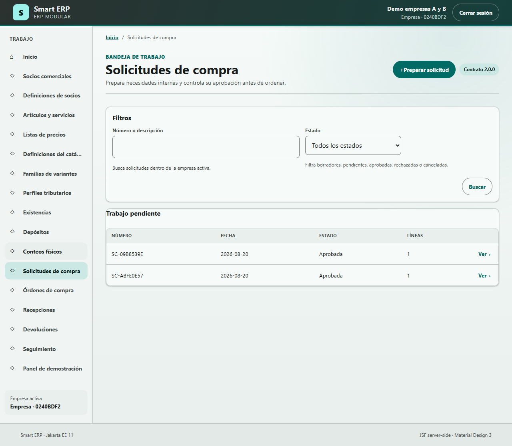
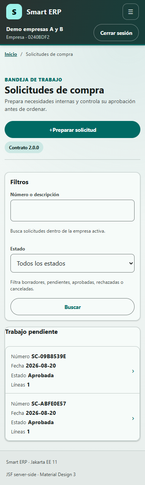
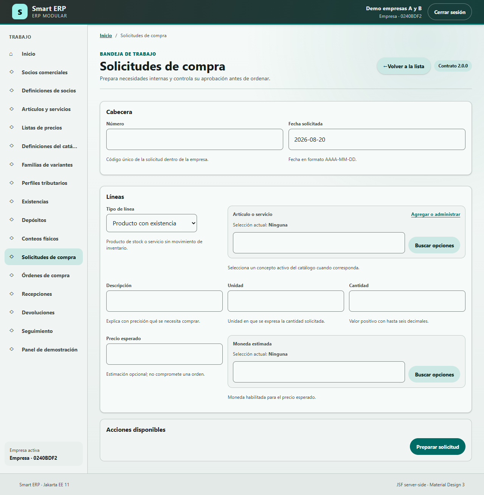
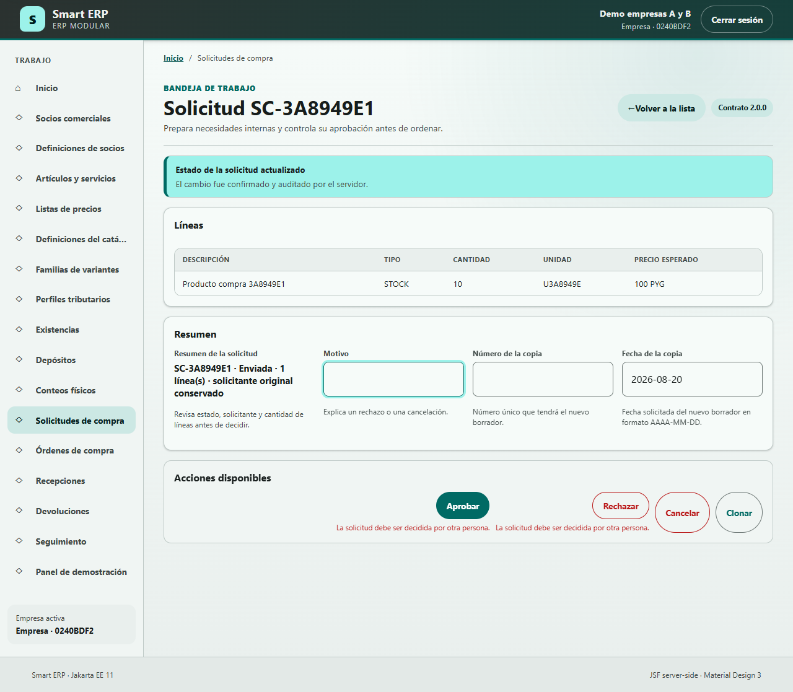

# Manual de usuario y soporte - Solicitudes de compra

**Smart ERP · Compras · versión 1.0 · 20 de agosto de 2026**

Este manual enseña a operar y diagnosticar la pantalla **Solicitudes de compra**.
Su alcance es una pantalla de menú con tres modos: lista, alta y detalle. No cubre
órdenes de compra, recepciones, devoluciones ni seguimiento, salvo cuando ayudan a
explicar el destino de una solicitud aprobada.

> Evidencia: código y migraciones del baseline local; prueba E2E del 20 de agosto
> de 2026; cuatro capturas reales de la aplicación con datos ficticios; y consultas
> `SELECT` ejecutadas dentro de transacciones `READ ONLY` sobre PostgreSQL 18.4.
> Se ocultaron dos identificadores internos de actores. No se consultaron ni
> publicaron contraseñas, tokens o datos productivos.

## Índice

1. Alcance, audiencia y acceso
2. Conceptos necesarios para leer este manual
3. Permisos y responsabilidades
4. Ubicación y modos de la pantalla
5. Lista y filtros
6. Alta de una solicitud
7. Detalle, líneas y cambios de estado
8. Diagnóstico para soporte
9. Bosquejo orientativo de la pantalla
10. Diagrama detallado de datos y triggers
11. Caso práctico simulado
12. Seguridad, escalamiento y glosario

## 1. Alcance, audiencia y acceso

La pantalla sirve para registrar una necesidad interna antes de comprometer una
compra con un proveedor. Está pensada para solicitantes, aprobadores y personal de
soporte. Cada operación queda limitada a la empresa activa de la sesión.

**Ejemplo verificado con datos reales**

- Caso observado: la base aislada contenía tres solicitudes y las tres pertenecían
  a la misma empresa ficticia mostrada por la prueba E2E.
- Resultado observado: la lista y cada consulta se resolvieron con el permiso
  `purchasing.view` y con contexto empresarial; la auditoría registró
  `company_scoped = true`.
- Origen técnico: `core.audit_event.company_id`, `plugin_id`, `permission_id`.
- Consulta: 20/08/2026. Los identificadores UUID de los actores fueron omitidos.

### Matriz de cobertura

| Nº | Pantalla | Ruta pública | Permisos | Vista y lógica | Persistencia | Estado |
|---:|---|---|---|---|---|---|
| 1 | Solicitudes de compra | `/faces/app/view.xhtml?route=%2Fpurchasing%2Frequests` | `purchasing.view`, `purchasing.requests.create`, `purchasing.requests.submit`, `purchasing.requests.approve` | `app/view.xhtml`, `PurchasingRequestScreenHandler`, `PurchasingRequestService` | `plg_purchasing.purchase_request`, `purchase_request_line`, `purchasing_operation`; `core.audit_event` | Relevada, redactada, diagramada y validada |

## 2. Conceptos necesarios para leer este manual

- **Plugin:** módulo funcional incorporado físicamente a Smart ERP. `purchasing`
  es el plugin propietario de Compras.
- **Empresa activa:** empresa seleccionada para la sesión; delimita los registros
  y permisos disponibles.
- **Permiso:** autorización que el servidor vuelve a comprobar antes de leer o
  modificar datos.
- **Solicitud de compra:** documento interno que expresa qué se necesita, cuánto
  y para qué fecha, antes de crear una orden a un proveedor.
- **Solicitante:** usuario que crea la solicitud y conserva la responsabilidad de
  editarla, enviarla o cancelarla mientras el estado lo permita.
- **Línea:** renglón de una solicitud que describe un producto con existencia, un
  producto sin existencia o un servicio, junto con unidad y cantidad.
- **Estado:** etapa controlada del documento: Borrador, Enviada, Aprobada,
  Rechazada o Cancelada.
- **Catálogo:** conjunto administrado de artículos, servicios, unidades y monedas
  que la pantalla consulta mediante contratos públicos.
- **Snapshot o copia histórica:** valores de descripción, unidad, moneda y otros
  datos guardados con la línea para que cambios futuros del catálogo no reescriban
  el documento.
- **Versión del documento:** número que aumenta con cada cambio y permite detectar
  que otra sesión modificó el registro antes de guardar.
- **Idempotencia:** protección que evita ejecutar dos veces la misma orden técnica
  cuando el navegador reintenta una acción.
- **Auditoría:** registro técnico inmutable de quién intentó una operación, con qué
  permiso, resultado y versión, sin guardar contraseñas.
- **Base de datos:** conjunto organizado de información que la aplicación consulta
  o modifica.
- **Esquema:** espacio lógico de la base de datos que agrupa objetos; las tablas
  privadas de Compras viven en `plg_purchasing` y la auditoría transversal en
  `core`.
- **Tabla:** estructura que guarda registros de un mismo tipo.
- **Registro o fila:** conjunto de datos que representa una ocurrencia, por ejemplo
  una solicitud.
- **Columna o campo de base:** dato individual almacenado en una tabla.
- **ID o identificador:** valor que distingue un registro de los demás.
- **Restricción o constraint:** regla que la base obliga a cumplir.
- **SQL:** lenguaje usado para consultar o modificar una base de datos.
- **DML:** parte de SQL que opera sobre filas mediante `SELECT`, `INSERT`, `UPDATE`
  y `DELETE`.
- **Clave primaria (PK):** columna o grupo de columnas que identifica una fila de
  forma única.
- **Clave foránea (FK):** columna que referencia la PK de otra fila.
- **Clave única (UK):** restricción que impide repetir un valor o combinación.
- **Nulo / no nulo (NN):** ausencia permitida de valor / obligación de informarlo.
- **Relación y cardinalidad:** vínculo entre objetos y cantidad de filas que pueden
  asociarse, por ejemplo una solicitud con una o muchas líneas.
- **Índice:** estructura que acelera búsquedas o garantiza unicidad.
- **Vista / vista materializada:** consulta guardada / resultado almacenado que
  requiere refresco. El esquema `plg_purchasing` verificado no posee ninguna.
- **Trigger:** rutina que la base ejecuta automáticamente ante un evento.
- **Función o procedimiento:** rutina de base invocada para validar, calcular o
  ejecutar una tarea.
- **ABM o CRUD:** alta, consulta, modificación y baja de registros.
- **C, R, U, D y EXT:** leyenda del diagrama: crear, leer, modificar, eliminar y
  consultar un sistema o servicio externo.

## 3. Permisos y responsabilidades

| Permiso | Habilita | Perfil operativo recomendado |
|---|---|---|
| `purchasing.view` | Ver menú, buscar y abrir solicitudes | Consulta y soporte |
| `purchasing.requests.create` | Crear, agregar líneas, clonar y cancelar una solicitud propia | Solicitante |
| `purchasing.requests.submit` | Enviar una solicitud propia a decisión | Solicitante |
| `purchasing.requests.approve` | Aprobar o rechazar una solicitud enviada por otra persona | Aprobador |

La interfaz puede ocultar una acción, pero la autorización efectiva siempre se
revalida en el servidor. El mismo usuario que solicitó no puede aprobar ni rechazar
su propio documento.

**Ejemplo verificado con datos reales**

- Caso observado: `SC-3A8949E1` fue creada y enviada por un actor y aprobada por
  otro; la comparación almacenada `requester_id <> decision_actor_id` resultó
  verdadera.
- Resultado observado: `core.audit_event` registró la aprobación con permiso
  `purchasing.requests.approve`, resultado `SUCCESS` y cambio de versión 1 a 2.
- Origen técnico: `purchase_request.requester_id`, `decision_actor_id` y
  `core.audit_event.permission_id`.
- Consulta: 20/08/2026. Se ocultaron los dos UUID de actores.

## 4. Ubicación y modos de la pantalla

Abrí **Trabajo > Solicitudes de compra**. La ruta usa el parámetro `mode`:

- `directory`: muestra filtros, resultados y **Preparar solicitud**;
- `create`: muestra el formulario de alta y **Volver a la lista**;
- `detail`: muestra la solicitud elegida, sus líneas y acciones válidas.

**Ejemplo verificado con datos reales**

- Caso observado: la prueba E2E abrió la lista, cambió a alta mediante
  **Preparar solicitud**, creó `SC-3A8949E1` y terminó en detalle.
- Resultado observado: lista y alta no aparecieron mezcladas; el detalle conservó
  el ID y la versión del recurso seleccionado.
- Origen técnico: contrato `PurchasingScreenContract.REQUESTS`, renderer del shell
  y registro final en `purchase_request`.
- Verificación: 20/08/2026, en 375, 720 y 1280 px.

## 5. Lista y filtros

### Términos de esta pantalla

- **Bandeja de trabajo:** lista de documentos disponibles para la empresa activa.
- **Filtro de texto:** búsqueda parcial por número de solicitud o descripción de
  una línea, sin distinguir mayúsculas de minúsculas.
- **Filtro de estado:** selector cerrado con Todos, Borrador, Enviada, Aprobada,
  Rechazada y Cancelada.

La lista muestra Número, Fecha, Estado, cantidad de Líneas y la acción **Ver**.
**Buscar** aplica el texto y el estado; **Preparar solicitud** abre el alta. En
pantallas compactas cada fila se convierte en una tarjeta para evitar
desplazamiento horizontal.

**Ejemplo verificado con datos reales**

- Datos iniciales: tres solicitudes reales de la base aislada, todas con fecha
  20/08/2026, estado Aprobada y una línea.
- Acción comprobada: consulta agrupada por estado equivalente al filtro de lista.
- Resultado observado: `APPROVED = 3`; buscar `SC-3A8949E1` identifica una sola
  solicitud y su línea contiene la descripción `Producto compra 3A8949E1`.
- Origen técnico: `purchase_request.request_number`, `requested_on`,
  `request_state`; `purchase_request_line.item_description_snapshot`.
- Consulta: 20/08/2026. Los valores son ficticios, pero proceden de filas reales.

### Captura real - lista expandida



### Captura real - lista compacta



## 6. Alta de una solicitud

### Datos de cabecera

| Dato visible | Formato y obligación | Origen y efecto |
|---|---|---|
| Número | Texto, obligatorio, máximo técnico 64 caracteres | Lo ingresa el solicitante; no se repite dentro de la empresa |
| Fecha solicitada | Fecha `AAAA-MM-DD`, obligatoria | Propone la fecha actual; queda como fecha histórica del documento |

Al pulsar **Preparar solicitud**, el servidor crea un Borrador con versión 0, el
usuario actual como solicitante y al menos una línea válida.

**Ejemplo verificado con datos reales**

- Datos iniciales: número `SC-3A8949E1`, fecha `2026-08-20` y una línea.
- Resultado observado: `purchasing_operation` registró
  `CREATE_PURCHASE_REQUEST`, recurso `purchase_request`, versión resultante 0 a
  las 22:20:12 UTC.
- Origen técnico: `purchase_request.request_number`, `requester_id`,
  `requested_on`, `request_state`, `entity_version`; operación idempotente en
  `purchasing_operation`.
- Consulta: 20/08/2026. El UUID del solicitante fue ocultado.

### Datos de la primera línea

| Dato visible | Formato y obligación | Regla |
|---|---|---|
| Tipo de línea | Selector obligatorio | Producto con existencia, producto sin existencia o servicio |
| Artículo o servicio | Referencia buscable; obligatoria para existencia | Sólo conceptos activos y habilitados para compra |
| Descripción | Texto obligatorio, máximo técnico 240 | Se conserva como snapshot |
| Unidad | Texto obligatorio, máximo técnico 16 | Se conserva unidad presentada y base |
| Cantidad | Decimal positivo, hasta 6 decimales | Debe ser mayor que cero |
| Precio esperado | Decimal opcional, no negativo | Es una estimación; no compromete una orden |
| Moneda estimada | Referencia obligatoria cuando hay precio | Conserva código, nombre, decimales y versión normativa |

El selector **Artículo o servicio** consulta el catálogo comercial por texto; la
moneda consulta datos de referencia. Los plugins propietarios entregan la opción
mediante contratos públicos: Compras no lee sus tablas privadas.

**Ejemplo verificado con datos reales**

- Línea observada: tipo `STOCK`, artículo `PC-3A8949E1`, descripción
  `Producto compra 3A8949E1`, unidad `U3A8949E`, cantidad `10.000000`, precio
  esperado `100.000000` y moneda `PYG - Guarani`.
- Resultado observado: la conversión presentada/base fue 1 y la base conservó
  código, descripción, unidad, cantidad, precio y moneda como snapshots.
- Origen técnico: todas las columnas de `purchase_request_line`; referencias EXT
  `CatalogItemDirectory` y `ReferenceDataDirectory`.
- Consulta: 20/08/2026. No hubo valores sensibles.

### Captura real - alta



## 7. Detalle, líneas y cambios de estado

### Abrir y revisar el detalle

**Ver** abre el documento y muestra estado, fecha solicitada, solicitante, líneas y
versión. La versión evita guardar sobre un cambio concurrente.

**Ejemplo verificado con datos reales**

- Caso observado: `SC-3A8949E1` quedó Aprobada, con una línea y versión 2.
- Resultado observado: la auditoría registró lecturas
  `VIEW_PURCHASE_REQUEST_DETAIL` con resultado `UNCHANGED/SUCCESS`.
- Origen técnico: `purchase_request`, `purchase_request_line` y
  `core.audit_event`.
- Consulta: 20/08/2026.

### Agregar líneas

Sólo el solicitante puede agregar una línea mientras la solicitud está en
Borrador. El servidor reemplaza atómicamente el conjunto de líneas y aumenta la
versión. Cuando el documento deja Borrador, el trigger de base impide insertar,
modificar o eliminar líneas.

**Ejemplo verificado con datos reales**

- Entrada real: `SC-3A8949E1`, estado Aprobada, versión 2, una línea de cantidad
  10.
- Resultado esperado, no ejecutado: la interfaz oculta **Agregar línea** y el
  trigger `trg_purchase_request_line_immutable` rechazaría cualquier DML sobre la
  línea con código SQL `P2001` y mensaje `Final purchase request lines are immutable`.
- Origen técnico: estado en `purchase_request`, trigger de
  `purchase_request_line` y función `reject_final_purchasing_line_change()`.
- Consulta: 20/08/2026. No se intentó ninguna escritura.

### Enviar a aprobación

El solicitante pulsa **Enviar solicitud** desde Borrador. El estado cambia a
Enviada, se registra la fecha/hora de envío y la versión aumenta. La solicitud ya
no admite cambios de líneas.

**Ejemplo verificado con datos reales**

- Caso observado: `SC-3A8949E1` pasó de versión 0 a 1.
- Resultado observado: `purchasing_operation` registró
  `SUBMIT_PURCHASE_REQUEST` a las 22:20:13 UTC; `core.audit_event` registró permiso
  `purchasing.requests.submit`, resultado `CHANGED/SUCCESS` y versiones 0 -> 1.
- Origen técnico: `purchase_request.submitted_at`, `request_state`,
  `entity_version`, `purchasing_operation` y `core.audit_event`.
- Consulta: 20/08/2026.

### Aprobar o rechazar

Un aprobador distinto del solicitante decide una solicitud Enviada. **Aprobar** no
requiere motivo; **Rechazar** exige un motivo. La decisión conserva actor, fecha y,
cuando corresponde, razón.

**Ejemplo verificado con datos reales**

- Caso observado: `SC-3A8949E1` fue aprobada por una persona distinta.
- Resultado observado: estado Aprobada, versión 2, `decision_reason` nulo y
  operación `APPROVE_PURCHASE_REQUEST` a las 22:20:17 UTC.
- Origen técnico: `purchase_request.decision_actor_id`, `decision_at`,
  `decision_reason`, `request_state`, `entity_version` y auditoría.
- Consulta: 20/08/2026. Se ocultaron los dos UUID de actores.

### Cancelar

El solicitante puede cancelar su propia solicitud si está Borrador o Enviada y
debe informar un motivo. Una solicitud Aprobada, Rechazada o Cancelada no muestra
la acción.

**Ejemplo verificado con datos reales**

- Entrada real: `SC-3A8949E1`, estado Aprobada.
- Resultado esperado, no ejecutado: **Cancelar** no está disponible porque el
  estado ya es final; no se realizó un `UPDATE` para fabricar evidencia.
- Origen técnico: política `PurchasingFloorplanStates.requests()` y restricción
  `ck_purchase_request_state_shape`.
- Consulta: 20/08/2026.

### Clonar

**Clonar solicitud** crea un nuevo Borrador con otro número y fecha, nuevas IDs de
línea y las mismas descripciones, cantidades y precios históricos. No cambia el
documento origen.

**Ejemplo verificado con datos reales**

- Entrada real disponible: `SC-3A8949E1`, Aprobada, una línea de 10 unidades a
  precio esperado 100 PYG.
- Resultado esperado, no ejecutado: una clonación válida produciría otro Borrador
  versión 0 con una línea equivalente y nuevos identificadores; el origen seguiría
  Aprobado versión 2.
- Origen técnico: `PurchasingRequestService.cloneRequest()` y tablas
  `purchase_request`, `purchase_request_line`, `purchasing_operation`.
- Consulta: 20/08/2026. No se ejecutó la clonación.

### Captura real - detalle enviado



## 8. Diagnóstico para soporte

| Síntoma | Comprobación | Causa probable | Acción segura |
|---|---|---|---|
| No aparece el menú | Empresa activa, plugin y `purchasing.view` | Plugin deshabilitado o permiso ausente | Corregir activación/rol mediante administración autorizada |
| Buscar no devuelve el documento | Empresa, número, texto y estado | Filtro no coincide o documento pertenece a otra empresa | Limpiar filtros y confirmar empresa; no consultar otra empresa manualmente |
| No aparece Agregar línea | Estado y solicitante | Sólo Borrador propio es editable | Revisar detalle y auditoría; no modificar SQL |
| No aparece Enviar | Estado, solicitante y permiso | No es Borrador propio o falta `purchasing.requests.submit` | Ajustar rol si corresponde |
| Aprobar/Rechazar bloqueados | Solicitante y aprobador | Separación de funciones: autor no decide | Usar otro aprobador autorizado |
| “Revisa los datos ingresados” | Formato de fecha, cantidad, precio y relación de selectores | Campo inválido o referencia incompatible | Corregir desde UI; conservar captura y hora |
| Conflicto de versión | Versión visible y auditoría | Otra sesión cambió el documento | Volver a la lista, reabrir y repetir conscientemente |
| Línea final inmutable / `P2001` | Estado del padre y trigger | Intento de cambiar líneas fuera de Borrador | Detener la operación; no desactivar trigger |

**Ejemplo verificado con datos reales**

- Caso observado: para `SC-3A8949E1`, el historial idempotente muestra exactamente
  Crear 0, Enviar 1 y Aprobar 2; la auditoría confirma los permisos y resultados.
- Uso para soporte: si el usuario informa un reintento, comparar número, empresa,
  operación, hora, versión y correlación antes de asumir duplicación.
- Origen técnico: `purchasing_operation.operation_type`, `resulting_version`,
  `occurred_at`; `core.audit_event.operation`, `outcome`, `result_code`,
  `correlation_id`.
- Consulta: 20/08/2026. Huellas técnicas e IDs de actores no se publican.

## 9. Bosquejo orientativo de la pantalla

Representación estimada; la disposición puede variar según versión, resolución,
permiso o estado.

```text
┌──────────── SOLICITUDES DE COMPRA · LISTA ─────────────────────┐
│ Título y contexto                         [Preparar solicitud] │
├────────────────────────────────────────────────────────────────┤
│ Filtros: Número o descripción [________] Estado [▼] [Buscar]   │
├────────────────────────────────────────────────────────────────┤
│ Número │ Fecha │ Estado │ Líneas │                         Ver │
└────────────────────────────────────────────────────────────────┘
                              │
                    Preparar  │  Ver
                              ▼
┌──────────── ALTA / DETALLE ─────────────────────────────────────┐
│ [Volver a la lista]                                            │
│ Cabecera: Número [____] Fecha [AAAA-MM-DD]                     │
│ Línea: Tipo [▼] Artículo [buscar] Descripción [____]           │
│        Unidad [__] Cantidad [__] Precio [__] Moneda [buscar]   │
│ Detalle: Estado · Solicitante · Versión · Líneas               │
│ Acciones según estado: Agregar · Enviar · Aprobar/Rechazar     │
│                         Cancelar · Clonar                      │
└────────────────────────────────────────────────────────────────┘
```

## 10. Diagrama detallado de datos y triggers

### Flujo y relaciones

```text
CatalogItemDirectory [EXT] ── snapshot ─┐
ReferenceDataDirectory [EXT] ─ moneda ──┼──> PURCHASE_REQUEST_LINE (1..N)
                                        │              │ FK compuesta
                                        │              ▼
                                        └──── PURCHASE_REQUEST (1)
                                                   │ ID lógico, sin FK
                         ┌─────────────────────────┴─────────────────────┐
                         ▼                                               ▼
              PURCHASING_OPERATION                              CORE.AUDIT_EVENT
              idempotencia append-only                          auditoría append-only

Cambiar línea
    │ INSERT / UPDATE / DELETE
    ▼
trg_purchase_request_line_immutable [BEFORE, ROW]
    └── reject_final_purchasing_line_change()
          ├── R purchase_request.request_state
          └── si estado != DRAFT: error P2001

Modificar o borrar auditoría
    ▼
audit_event_no_update_or_delete [BEFORE UPDATE/DELETE, ROW]
    └── reject_audit_event_mutation() -> “core.audit_event is append-only”
```

### `plg_purchasing.purchase_request` - C/R/U

| Campo | Tipo | Clave/NN | Acceso y origen visual |
|---|---|---|---|
| `company_id` | UUID | PK, NN | C/R, empresa activa |
| `purchase_request_id` | UUID | PK, NN | C/R, recurso seleccionado |
| `request_number` | varchar(64) | UK por empresa, NN | C/R/filtro, Número |
| `requester_id` | UUID | NN | C/R, solicitante autenticado |
| `requested_on` | date | NN | C/R/filtro, Fecha solicitada |
| `request_state` | varchar(24) | NN, CHECK | C/R/U/filtro, Estado |
| `submitted_at` | timestamptz | opcional | U/R, Enviar |
| `decision_actor_id` | UUID | opcional | U/R, Aprobar/Rechazar/Cancelar |
| `decision_at` | timestamptz | opcional | U/R, decisión |
| `decision_reason` | varchar(240) | opcional | U/R, motivo requerido |
| `entity_version` | bigint | NN, >=0 | C/R/U, control de versión |

Restricciones relevantes: PK `(company_id, purchase_request_id)`, UK
`(company_id, request_number)`, estados cerrados, pares actor/fecha coherentes,
formas válidas por estado, aprobador distinto del solicitante y versión no
negativa.

### `plg_purchasing.purchase_request_line` - C/R/U/D sólo en Borrador

| Campo | Tipo | Clave/NN | Acceso y origen visual |
|---|---|---|---|
| `company_id` | UUID | PK/FK, NN | C/R/U/D, empresa |
| `purchase_request_id` | UUID | PK/FK, NN | C/R/U/D, solicitud |
| `purchase_request_line_id` | UUID | PK/UK, NN | C/R/U/D, línea |
| `line_position` | integer | UK por solicitud, NN, >0 | C/R, orden de línea |
| `catalog_item_id` | UUID | opcional | C/R, selector de artículo |
| `catalog_code_snapshot` | varchar(64) | opcional en par | C/R, código histórico |
| `item_description_snapshot` | varchar(240) | NN | C/R, Descripción |
| `presented_unit_code_snapshot` | varchar(16) | NN | C/R, Unidad visible |
| `base_unit_code_snapshot` | varchar(16) | NN | C/R, unidad base |
| `conversion_factor` | numeric(30,12) | NN, >0 | C/R, conversión |
| `line_kind` | varchar(24) | NN, CHECK | C/R, Tipo de línea |
| `catalog_source_version` | bigint | NN, >=0 | C/R, versión del catálogo |
| `requested_quantity` | numeric(30,6) | NN, >0 | C/R, Cantidad |
| `expected_unit_price` | numeric(30,6) | opcional, >=0 | C/R, Precio esperado |
| `expected_currency_code` | varchar(3) | opcional en grupo | C/R, Moneda |
| `expected_currency_minor_unit` | integer | opcional, 0..9 | C/R, decimales moneda |
| `expected_currency_name` | varchar(160) | opcional en grupo | C/R, nombre histórico |
| `expected_currency_release_id` | varchar(64) | opcional en grupo | C/R, versión normativa |

Relación: `purchase_request (1) -> (1..N) purchase_request_line` mediante la FK
compuesta `(company_id, purchase_request_id)`. El dominio exige al menos una línea.

### `plg_purchasing.purchasing_operation` - C/R

| Campo | Tipo | Clave/NN | Acceso |
|---|---|---|---|
| `company_id` | UUID | PK, NN | C/R, empresa |
| `idempotency_key` | varchar(160) | PK, NN | C/R, reintento técnico |
| `operation_type` | varchar(64) | NN | C/R, crear/cambiar estado/clonar |
| `request_fingerprint` | char(64) | NN, CHECK hexadecimal | C/R, detectar reuso distinto |
| `resource_type` | varchar(64) | NN | C/R, `purchase_request` |
| `resource_id` | UUID | NN, vínculo lógico sin FK | C/R, solicitud |
| `resulting_version` | bigint | NN, >=0 | C/R, versión devuelta |
| `occurred_at` | timestamptz | NN | C/R, hora de operación |

### `core.audit_event` - C/R, sin relación JPA con Compras

Campos usados y observados para Solicitudes: `audit_event_id` PK,
`category`, `operation`, `outcome`, `actor_kind`, `actor_user_id`, `company_id`,
`plugin_id`, `permission_id`, `result_code`, `previous_version`,
`resulting_version`, `correlation_id`, `occurred_at`, `resource_type` y
`resource_id`. El vínculo con la solicitud es lógico; no existe FK entre esquemas
privados. En los eventos observados no se usaron `subject_user_id`, `role_id`,
`system_role_id` ni `screen_id`.

### Servicios externos - EXT/R

- `CatalogItemDirectory`: ID, código, nombre visible, tipo, estado activo, alcance
  de compra, unidad y versión; Compras persiste snapshots, no una relación JPA.
- `ReferenceDataDirectory`: código de moneda, nombre, unidad menor y release; la
  moneda se guarda completa sólo cuando existe precio esperado.

### Ficha de triggers

| Dato | `trg_purchase_request_line_immutable` |
|---|---|
| Tabla | `plg_purchasing.purchase_request_line` |
| Momento/evento/nivel | BEFORE INSERT, UPDATE o DELETE; por fila |
| Condición | Consulta el estado de la solicitud propietaria |
| Lee | `purchase_request.company_id`, `purchase_request_id`, `request_state` |
| Modifica | Ninguna tabla secundaria |
| Llama | `reject_final_purchasing_line_change()` |
| Error | `P2001`, `Final purchase request lines are immutable` |
| Efecto funcional | Sólo permite cambiar líneas mientras el padre está Borrador |
| Evidencia | Metadatos PostgreSQL 18.4 y migración V1, 20/08/2026 |

| Dato | `audit_event_no_update_or_delete` |
|---|---|
| Tabla | `core.audit_event` |
| Momento/evento/nivel | BEFORE UPDATE o DELETE; por fila |
| Condición | Todo intento de modificación o borrado |
| Lee/modifica | No modifica tablas secundarias |
| Llama | `core.reject_audit_event_mutation()` |
| Error | `core.audit_event is append-only` |
| Efecto funcional | La evidencia técnica sólo admite nuevas filas |
| Evidencia | Metadatos PostgreSQL 18.4, 20/08/2026 |

**Ejemplo verificado con datos reales**

- Resultado observado: el esquema tenía 12 tablas, cero vistas y cero secuencias;
  para esta pantalla participan directamente tres tablas privadas y la tabla de
  auditoría transversal, más dos servicios EXT.
- Triggers observados: uno protege líneas de solicitudes y otro protege la
  auditoría frente a UPDATE/DELETE.
- Resultado esperado, no ejecutado: una escritura sobre la línea aprobada de
  `SC-3A8949E1` sería rechazada por el trigger; no se probó mediante DML.
- Consulta: 20/08/2026, transacción `READ ONLY = on`, usuario local `logixone`.

## 11. Caso práctico simulado

**Ejemplo simulado:** una oficina necesita 5 resmas de papel. El solicitante abre
la lista, pulsa **Preparar solicitud**, informa un número nuevo, fecha, producto,
unidad y cantidad, y guarda. Luego revisa el detalle y envía. Otra persona con
permiso de aprobación abre el documento y decide. Este ejemplo es pedagógico y no
se contabiliza como evidencia real.

## 12. Seguridad, escalamiento y glosario

### Reglas de seguridad

- No otorgar permisos para “hacer aparecer” un botón sin validar la función del
  usuario.
- No aprobar con la identidad del solicitante ni compartir cuentas.
- No corregir solicitudes mediante SQL, no desactivar triggers y no reducir la
  versión manualmente.
- No enviar a soporte contraseñas, tokens, capturas con secretos ni UUID completos
  de actores cuando no sean indispensables.
- Conservar empresa, número, hora, estado, acción, mensaje y correlación al escalar.

### Información que soporte debe solicitar

1. Empresa activa y usuario afectado, identificados por canales seguros.
2. Número de solicitud y fecha aproximada.
3. Modo de pantalla: lista, alta o detalle.
4. Acción exacta y mensaje visible.
5. Estado y versión mostrados.
6. Hora con zona y, si aparece, ID de correlación.
7. Captura sin secretos y pasos para reproducir.
8. Confirmación de plugin activo y permisos efectivos.

### Glosario de consulta

**Aprobador:** persona distinta del solicitante que decide una solicitud Enviada.
**Borrador:** estado editable por el solicitante.
**Enviada:** estado pendiente de decisión.
**Aprobada/Rechazada/Cancelada:** estados finales de la solicitud.
**Línea:** necesidad concreta dentro del documento.
**Snapshot:** copia histórica de datos externos.
**Versión:** contador de concurrencia del documento.
**Idempotencia:** protección contra reintentos duplicados.
**Correlación:** código técnico que vincula registros de una misma operación.
**P2001:** código SQL usado por el trigger al rechazar cambios de líneas finales.

## Evidencia y límites de validación

- Base consultada: PostgreSQL 18.4, base `logixone`, candidata aislada.
- Acceso: sólo `SELECT`, catálogos y metadatos dentro de transacciones
  `READ ONLY`; no se ejecutaron DML, DDL, migraciones ni procedimientos con efecto.
- Objetos comprobados: tablas, 57 columnas de los cuatro objetos documentados,
  restricciones, cinco índices de solicitud/línea, ausencia de vistas y
  secuencias, dos triggers y sus funciones.
- Ejemplos reales: 14 bloques; dos identificadores internos de actores protegidos.
- Capturas reales: 4, generadas por Playwright sobre la aplicación local con datos
  ficticios y sin secretos.
- Validación independiente por otra persona: pendiente.
