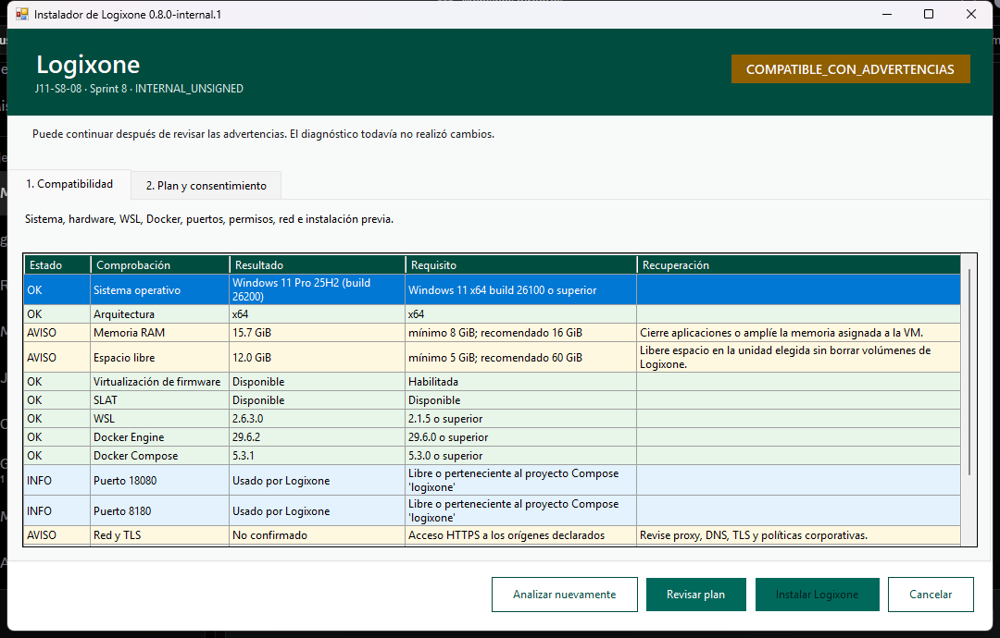
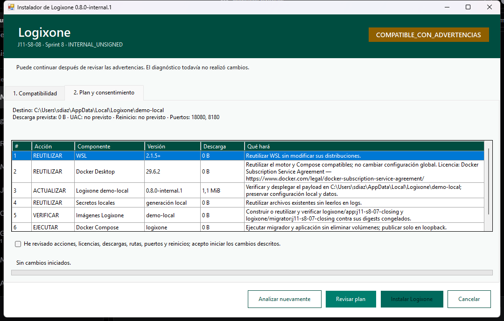

<article data-manual-version="1">
  
LogixOne · Instalador Windows y puesta en marcha · edición 2026-08-14 · página 

  <header class="cover">
    
Manual operativo, de usuario y soporte

    <h1>Instalador Windows y puesta en marcha completa de una empresa</h1>
    
Recorrido integrado para preparar una computadora Windows, instalar la edición interna, entrar de forma segura, configurar una empresa, habilitar todas las capacidades incluidas y agregar usuarios con sus accesos.

    
<strong>Producto:</strong> LogixOne Jakarta 11. <strong>Instalador documentado:</strong> <code>0.9.0-internal.1</code>, baseline <code>J11-S9-08</code>, perfil <code>with-purchasing-demo</code>. <strong>Fecha de edición:</strong> 14 de agosto de 2026. <strong>Audiencia:</strong> evaluadores, administradores de la instancia, responsables de seguridad y personal de soporte. <strong>Alcance:</strong> Windows 11 de 64 bits y uso local de demostración. <strong>Estado:</strong> edición interna sin firma digital; no aprobada para producción ni distribución externa.

  </header>

  <section class="concepts">
    <h2>Conceptos que necesita antes de comenzar</h2>
    
Lea estas definiciones una vez. Los términos se usan después en las instrucciones, pantallas y diagramas.

    <h3>Instalación y operación local</h3>
    <dl class="term-grid">
      <dt>Paquete del instalador</dt><dd>Carpeta que contiene el ejecutable y los siete archivos auxiliares que necesita esta edición. El archivo <code>.exe</code> aislado no constituye el paquete completo.</dd>
      <dt>Ejecutable</dt><dd>Archivo de Windows que inicia un programa; en este manual es <code>Logixone-Setup-0.9.0-internal.1.exe</code>.</dd>
      <dt>Manifiesto</dt><dd>Archivo que declara versión, requisitos, componentes, rutas, puertos y resultados posibles del instalador.</dd>
      <dt>Payload</dt><dd>Contenido comprimido que el instalador verifica y despliega. En esta edición se encuentra en <code>payload.zip</code>.</dd>
      <dt>Hash SHA-256</dt><dd>Huella de 64 caracteres usada para comprobar que un archivo no cambió. Una diferencia significa que no debe ejecutarse el paquete.</dd>
      <dt>Firma digital</dt><dd>Prueba criptográfica de la identidad del editor. Esta edición indica <code>NotSigned</code>; una advertencia de Windows no debe ignorarse sin autorización interna.</dd>
      <dt>SmartScreen</dt><dd>Protección de Windows que advierte o bloquea aplicaciones no reconocidas. No debe desactivarse para instalar LogixOne.</dd>
      <dt>Diagnóstico previo o preflight</dt><dd>Análisis de solo lectura que comprueba el equipo antes de proponer cambios.</dd>
      <dt>Compatible</dt><dd>Resultado que permite revisar el plan porque no se detectaron bloqueos.</dd>
      <dt>Compatible con advertencias</dt><dd>Resultado que permite continuar, pero exige comprender riesgos o acciones pendientes.</dd>
      <dt>Bloqueada</dt><dd>Resultado que impide instalar. El instalador no modifica una máquina bloqueada.</dd>
      <dt>Plan</dt><dd>Lista previa de fases, versiones, descargas, licencias, rutas, puertos, posibles reinicios y acciones.</dd>
      <dt>Consentimiento</dt><dd>Aceptación explícita del plan después de revisarlo. No sustituye el permiso de la organización ni una licencia.</dd>
      <dt>UAC</dt><dd>Control de cuentas de usuario de Windows. Solicita elevación únicamente cuando una acción necesita privilegios administrativos.</dd>
      <dt>WSL 2</dt><dd>Subsistema de Windows para Linux usado por Docker Desktop. El mínimo del manifiesto es 2.1.5.</dd>
      <dt>Docker Desktop</dt><dd>Aplicación que proporciona el motor local de contenedores y Docker Compose sobre Windows.</dd>
      <dt>Contenedor</dt><dd>Proceso aislado creado desde una imagen versionada.</dd>
      <dt>Imagen</dt><dd>Paquete inmutable desde el que se crea un contenedor. El instalador verifica los identificadores exactos de aplicación y migrador.</dd>
      <dt>Docker Compose</dt><dd>Herramienta que inicia y detiene coordinadamente la aplicación, la base de datos y el proveedor de identidad.</dd>
      <dt>Volumen</dt><dd>Almacenamiento persistente administrado por Docker. Detener contenedores no debe borrar sus volúmenes.</dd>
      <dt>Migración</dt><dd>Cambio versionado que prepara la estructura de la base de datos antes de arrancar la aplicación.</dd>
      <dt>Puerto</dt><dd>Número local por el que responde un servicio. Esta edición usa <code>18080</code> para LogixOne y <code>8180</code> para Keycloak.</dd>
      <dt>Loopback</dt><dd>Acceso limitado a la misma computadora mediante <code>localhost</code>. No convierte la demo en un servidor para otras personas.</dd>
      <dt>Liveness</dt><dd>Comprobación de que el proceso de la aplicación está vivo.</dd>
      <dt>Readiness</dt><dd>Comprobación de que la aplicación terminó de prepararse y puede atender solicitudes.</dd>
      <dt>Secreto</dt><dd>Valor confidencial, por ejemplo una contraseña. Se guarda en un archivo local y nunca se copia al manual, al chat, a un ticket ni a Git.</dd>
    </dl>
    <h3>Empresas, identidad y autorización</h3>
    <dl class="term-grid">
      <dt>Empresa</dt><dd>Frontera que separa configuración, usuarios y operaciones de una organización dentro de la instalación.</dd>
      <dt>Plugin</dt><dd>Módulo incorporado físicamente al construir la aplicación. Desde la interfaz solo se activa o desactiva por empresa.</dd>
      <dt>Plugin funcional</dt><dd>Módulo que aporta una capacidad de negocio, por ejemplo catálogo, inventario o compras.</dd>
      <dt>Personalización</dt><dd>Plugin físico exclusivo que adapta la composición para una empresa. Una personalización no puede pertenecer a dos empresas.</dd>
      <dt>Dependencia</dt><dd>Plugin que debe estar activo antes de que otro pueda operar.</dd>
      <dt>Estado deseado</dt><dd>Decisión guardada de habilitar o deshabilitar un plugin.</dd>
      <dt>Estado efectivo</dt><dd>Resultado real después de validar empresa, presencia física, tipo, versión y dependencias.</dd>
      <dt>Keycloak</dt><dd>Proveedor de identidad incluido en la composición local. Autentica cuentas y administra contraseñas.</dd>
      <dt>OIDC</dt><dd>OpenID Connect, protocolo mediante el que LogixOne recibe una identidad autenticada.</dd>
      <dt>Realm</dt><dd>Ámbito de Keycloak que agrupa usuarios y configuración. La demo usa <code>logixone</code>.</dd>
      <dt>Issuer o emisor</dt><dd>Dirección confiable que identifica el realm; en local es <code>http://keycloak.localhost:8180/realms/logixone</code>.</dd>
      <dt>Subject</dt><dd>Identificador estable de la cuenta dentro del issuer. Debe copiarse del identificador de usuario de Keycloak, no inventarse a partir del nombre.</dd>
      <dt>Usuario local</dt><dd>Representación en LogixOne de una cuenta externa. LogixOne no guarda su contraseña.</dd>
      <dt>Membresía</dt><dd>Vínculo que permite a un usuario participar en una empresa determinada.</dd>
      <dt>Rol empresarial</dt><dd>Agrupación de permisos válida dentro de una empresa.</dd>
      <dt>Rol global</dt><dd>Agrupación de permisos para administrar toda la instancia.</dd>
      <dt>Permiso</dt><dd>Código cerrado que representa una capacidad autorizable.</dd>
      <dt>Menor privilegio</dt><dd>Regla de conceder solamente los permisos necesarios para el trabajo asignado.</dd>
      <dt>Separación de funciones</dt><dd>Regla de repartir operaciones sensibles; por ejemplo, quien solicita una compra no debería aprobarla por sí solo.</dd>
      <dt>Auditoría</dt><dd>Historial técnico de operaciones y decisiones de acceso.</dd>
    </dl>
    <h3>Base de datos y leyenda de los diagramas</h3>
    <dl class="term-grid">
      <dt>Base de datos</dt><dd>Conjunto organizado donde la aplicación conserva información.</dd>
      <dt>Esquema</dt><dd>Espacio lógico que agrupa objetos de un propietario; el núcleo usa <code>core</code> y cada plugin conserva los suyos.</dd>
      <dt>Tabla</dt><dd>Estructura que guarda registros de un mismo tipo.</dd>
      <dt>Registro o fila</dt><dd>Conjunto de datos que representa una ocurrencia, como una empresa o un usuario.</dd>
      <dt>Columna o campo</dt><dd>Dato individual de una tabla.</dd>
      <dt>PK</dt><dd>Clave primaria que identifica de forma única una fila.</dd>
      <dt>FK</dt><dd>Clave foránea que relaciona una fila con otra.</dd>
      <dt>UK</dt><dd>Restricción única que impide duplicar un valor o combinación.</dd>
      <dt>Trigger</dt><dd>Rutina que la base ejecuta automáticamente ante un evento.</dd>
      <dt>C, R, U, D y EXT</dt><dd>Crear, leer, modificar, eliminar y obtener mediante una fuente externa. Esta es la leyenda de los diagramas.</dd>
    </dl>
    
<strong>Alcance de la comprobación de datos:</strong> el intento de revalidación local del 14 de agosto de 2026 no pudo ejecutarse porque Docker Engine no estaba disponible; no se inició ni modificó ningún servicio. La última inspección local documentada, del 11 de agosto de 2026 y de solo lectura, confirmó en <code>core</code> 13 tablas, 88 columnas, 34 índices, ninguna vista, vista materializada ni secuencia, y el trigger <code>audit_event_no_update_or_delete</code>, que llama a <code>core.reject_audit_event_mutation()</code>. Los detalles funcionales de los plugins provienen de sus migraciones, contratos, pruebas y manuales ya validados. No se presentan como una nueva inspección de datos productivos.

  </section>

  <section class="toc">
    <h2>Cómo está organizado este volumen</h2>
    
La primera parte contiene la instalación y un recorrido completo de puesta en marcha. Después se anexan los siete manuales funcionales, con las pantallas, ejemplos, permisos, bosquejos y diagramas de datos del baseline.

    <table class="coverage-table"><thead><tr><th>N.º</th><th>Parte</th><th>Resultado</th></tr></thead><tbody>
      <tr><td>1</td><td>Verificar el paquete</td><td>Ocho archivos juntos y hashes válidos.</td></tr>
      <tr><td>2</td><td>Diagnosticar compatibilidad</td><td>Equipo compatible o causa de bloqueo comprendida.</td></tr>
      <tr><td>3</td><td>Revisar plan y consentir</td><td>Siete fases conocidas antes de cualquier cambio.</td></tr>
      <tr><td>4</td><td>Instalar, abrir, detener y recuperar</td><td>Servicios saludables sin borrar volúmenes.</td></tr>
      <tr><td>5</td><td>Configurar empresa y todos los plugins</td><td>Composición efectiva en el orden correcto.</td></tr>
      <tr><td>6</td><td>Agregar usuarios, membresías, roles y permisos</td><td>Acceso mínimo probado en otra sesión.</td></tr>
      <tr><td>7</td><td>Cargar datos y recorrer funciones</td><td>Datos base, socios, catálogo, inventario y compras listos para prueba.</td></tr>
      <tr><td>8</td><td>Apéndices por módulo</td><td>Referencia de cada pantalla y tabla.</td></tr>
    </tbody></table>
    
<strong>Antes de entregar a otra persona:</strong> no envíe solamente el <code>.exe</code>. Comparta la carpeta completa sin alterar nombres ni contenido. Aun con los ocho archivos, esta edición sigue siendo interna, no firmada y no aprobada para entrega externa.

    <h3>Permisos globales de administración</h3>
    <table><thead><tr><th>Permiso</th><th>Uso</th></tr></thead><tbody>
      <tr><td><code>kernel.company.manage</code></td><td>Registrar, activar e inactivar empresas y administrar su personalización.</td></tr>
      <tr><td><code>kernel.plugin.manage</code></td><td>Configurar plugins funcionales por empresa.</td></tr>
      <tr><td><code>kernel.security.manage</code></td><td>Administrar usuarios locales, membresías, roles y permisos empresariales.</td></tr>
      <tr><td><code>kernel.system_administration.manage</code></td><td>Administrar roles y permisos globales de toda la instancia.</td></tr>
      <tr><td><code>kernel.audit.view</code></td><td>Consultar el historial técnico.</td></tr>
    </tbody></table>
  </section>

  <section class="screen" data-screen="package-verification">
    
<h2>1. Verificación del paquete</h2>Explorador de archivos y PowerShell

    
<strong>Objetivo:</strong> confirmar que se recibió el conjunto íntegro, que ningún archivo cambió y que se comprende la condición de edición interna sin firma.

    
<strong>Prerrequisito:</strong> copie la carpeta a una ruta local del equipo. No ejecute archivos desde un correo, una vista previa o una unidad temporal.

    <h3>Contenido obligatorio</h3>
    <table><thead><tr><th>Archivo</th><th>Función</th><th>Tamaño de esta edición</th></tr></thead><tbody>
      <tr><td><code>Logixone-Setup-0.9.0-internal.1.exe</code></td><td>Interfaz gráfica.</td><td>104.448 bytes</td></tr>
      <tr><td><code>Logixone-Installer.Cli.exe</code></td><td>Diagnóstico técnico por línea de comandos.</td><td>104.448 bytes</td></tr>
      <tr><td><code>installer-manifest.json</code></td><td>Versiones, requisitos y política de instalación.</td><td>2.583 bytes</td></tr>
      <tr><td><code>payload.zip</code></td><td>Aplicación y recursos a desplegar.</td><td>1.600.148 bytes</td></tr>
      <tr><td><code>THIRD-PARTY-NOTICES.txt</code></td><td>Avisos de componentes de terceros.</td><td>1.620 bytes</td></tr>
      <tr><td><code>INSTALLER-README.txt</code></td><td>Resumen de uso seguro.</td><td>657 bytes</td></tr>
      <tr><td><code>SHA256SUMS.txt</code></td><td>Huellas esperadas.</td><td>629 bytes</td></tr>
      <tr><td><code>BUILD-INFO.json</code></td><td>Baseline, fecha, imágenes y firma.</td><td>691 bytes</td></tr>
    </tbody></table>
    
El total esperado es 1.815.224 bytes. El ejecutable principal debe producir <code>E7E2036D130AE4D8A10E821C18B9558279E71E6E15CBA8A0323155A83E83509A</code> y <code>payload.zip</code>, <code>6AFB2C0F6F77A1908CC9FF23D776E01E0A5C157943EAD0B69536483D06FF1238</code>.

    <h3>Pasos</h3>
    <ol class="step-list">
      <li>Compruebe visualmente que están los ocho archivos y no fueron renombrados.</li>
      <li>Abra PowerShell dentro de la carpeta y ejecute <code>Get-FileHash -Algorithm SHA256 .\Logixone-Setup-0.9.0-internal.1.exe</code>.</li>
      <li>Compare la huella sin espacios y sin distinguir mayúsculas de minúsculas.</li>
      <li>Repita con <code>Get-FileHash -Algorithm SHA256 .\payload.zip</code>.</li>
      <li>Abra <code>BUILD-INFO.json</code> como texto y confirme <code>installerVersion</code>, <code>releaseChannel</code>, <code>signatureStatus</code> y <code>externalDistributionAllowed</code>.</li>
      <li>Si falta un archivo, un hash difiere o el paquete proviene de una fuente no autorizada, deténgase y solicite una copia nueva.</li>
    </ol>
    
<strong>Resultado esperado:</strong> ocho archivos juntos, hashes coincidentes, versión <code>0.9.0-internal.1</code>, canal <code>INTERNAL_UNSIGNED</code>, firma <code>NotSigned</code> y distribución externa en <code>false</code>.

    <h3>Bosquejo orientativo de la pantalla</h3>
La disposición cambia según la versión de Windows.

+ Carpeta del paquete ---------------------------------------------------+
| Nombre                                      Tipo             Estado  |
| Logixone-Setup-0.9.0-internal.1.exe         Aplicación        presente|
| Logixone-Installer.Cli.exe                  Aplicación        presente|
| installer-manifest.json                     JSON              presente|
| payload.zip                                 ZIP               presente|
| THIRD-PARTY-NOTICES.txt                     Texto             presente|
| INSTALLER-README.txt                        Texto             presente|
| SHA256SUMS.txt                              Texto             presente|
| BUILD-INFO.json                             JSON              presente|
+-----------------------------------------------------------------------+
PowerShell> Get-FileHash -Algorithm SHA256 .\Logixone-Setup-...

    <h3>Diagrama de datos y tablas afectadas</h3>

      
<h4>Paquete local [R]</h4><ul><li>8 archivos obligatorios</li><li>nombres exactos</li><li>tamaños observables</li></ul>
No se modifica durante la verificación.

      
<h4>SHA256SUMS.txt [R]</h4><ul><li>archivo</li><li>hash esperado</li></ul>

      
<h4>BUILD-INFO.json [R]</h4><ul><li>versión y baseline</li><li>estado de firma</li><li>distribución externa</li><li>digests de imágenes</li></ul>

      
<h4>Base de datos [sin acceso]</h4><ul><li>no inicia PostgreSQL</li><li>no consulta esquemas</li><li>no crea ni modifica filas</li></ul>

    
<ul class="relation-list"><li>El hash calculado de cada archivo debe ser igual al valor de <code>SHA256SUMS.txt</code>.</li><li><code>BUILD-INFO.json</code> y <code>installer-manifest.json</code> deben declarar la misma edición.</li><li>El <code>.exe</code> aislado no tiene relación suficiente con el payload: no es instalable por sí solo.</li></ul>

  </section>

  <section class="screen" data-screen="preflight">
    
<h2>2. Compatibilidad del equipo</h2>Pestaña 1 · Compatibilidad

    
<strong>Objetivo:</strong> analizar el equipo sin modificarlo y decidir si puede pasar a la revisión del plan.

    
<strong>Acceso:</strong> haga doble clic en <code>Logixone-Setup-0.9.0-internal.1.exe</code>. Si SmartScreen advierte sobre el archivo sin firma, no desactive la protección: continúe solamente con aprobación interna y después de verificar los hashes.

    <h3>Requisitos evaluados</h3>
    <table><thead><tr><th>Componente</th><th>Mínimo</th><th>Recomendado o regla</th></tr></thead><tbody>
      <tr><td>Sistema</td><td>Windows 11 x64, build 26100</td><td>Actualizaciones y reinicios pendientes resueltos.</td></tr>
      <tr><td>Memoria</td><td>8 GiB</td><td>16 GiB.</td></tr>
      <tr><td>Disco</td><td>30 GiB para instalación nueva; 5 GiB para reparar</td><td>60 GiB libres.</td></tr>
      <tr><td>Virtualización y WSL 2</td><td>Disponibles; WSL 2.1.5</td><td>No desactivar Secure Boot ni controles corporativos.</td></tr>
      <tr><td>Docker</td><td>Engine 29.6 y Compose 5.3</td><td>Reutilizar una instalación compatible; si falta, el plan propone Desktop 4.84.0.</td></tr>
      <tr><td>Red</td><td>Acceso TLS a orígenes aprobados cuando haya descargas</td><td>Proxy corporativo configurado, no evadido.</td></tr>
      <tr><td>Puertos</td><td><code>18080</code> y <code>8180</code> libres o pertenecientes a LogixOne</td><td>No detener procesos ajenos automáticamente.</td></tr>
      <tr><td>Instalación previa</td><td>Debe identificarse sin pisar datos</td><td>Elegir instalar, actualizar o reparar según el estado detectado.</td></tr>
    </tbody></table>
    <h3>Pasos y decisiones</h3>
    <ol class="step-list"><li>Lea el estado general y cada comprobación.</li><li>Abra los detalles de toda advertencia o bloqueo.</li><li>Si cambió una condición externa —por ejemplo liberó un puerto— pulse <strong>Analizar nuevamente</strong>.</li><li>Con <strong>BLOQUEADA</strong>, cierre sin intentar forzar la instalación.</li><li>Con <strong>COMPATIBLE</strong> o <strong>COMPATIBLE_CON_ADVERTENCIAS</strong>, pulse <strong>Revisar plan</strong>.</li><li>Para soporte técnico de solo lectura puede ejecutar <code>Logixone-Installer.Cli.exe --preflight --json</code>; no publique la salida sin revisar que no contenga información interna de la máquina.</li></ol>
    <figure class="screen-capture"><figcaption>Captura de evidencia del instalador. Los valores dependen del equipo analizado.</figcaption></figure>
    
<strong>Ejemplo real de soporte:</strong> durante el cierre del 14 de agosto de 2026 los puertos 18080 y 8180 estaban ocupados; el resultado correcto fue <code>BLOQUEADA</code>. No se solicitó UAC ni se escribió el destino.

    <h3>Bosquejo orientativo de la pantalla</h3>
Los textos exactos pueden evolucionar, pero el resultado y la acción segura se mantienen.

+ LogixOne · 1. Compatibilidad ------------------------------------------+
| Estado general: COMPATIBLE / CON ADVERTENCIAS / BLOQUEADA            |
| [Sistema] [CPU/RAM/disco] [WSL] [Docker/Compose] [red/proxy/TLS]     |
| [puerto 18080] [puerto 8180] [instalación previa] [reinicio]         |
| Detalle: causa, efecto y recuperación                                 |
|                                                                       |
| [Analizar nuevamente]                         [Revisar plan] [Cancelar]|
+------------------------------------------------------------------------+

    <h3>Diagrama de datos y tablas afectadas</h3>

      
<h4>Windows [R]</h4><ul><li>edición, build, arquitectura</li><li>CPU, RAM, disco</li><li>virtualización y reinicio</li><li>permisos observables</li></ul>

      
<h4>Docker/WSL [R]</h4><ul><li>presencia y versiones</li><li>estado del motor</li><li>Compose</li><li>instalación previa LogixOne</li></ul>

      
<h4>Red local [R]</h4><ul><li>proxy y TLS</li><li>puerto 18080</li><li>puerto 8180</li><li>propietario observable</li></ul>

      
<h4>Base de datos [sin acceso]</h4><ul><li>no ejecuta migraciones</li><li>no abre PostgreSQL</li><li>no lee ni modifica filas</li></ul>

    
<ul class="relation-list"><li>Las fuentes observadas producen comprobaciones con nivel informativo, advertencia o bloqueo.</li><li>Las comprobaciones se resumen en uno de los tres estados generales.</li><li>Un estado bloqueado corta el flujo antes de plan, consentimiento, UAC o escritura.</li></ul>

  </section>

  <section class="screen" data-screen="plan-consent">
    
<h2>3. Plan y consentimiento</h2>Pestaña 2 · Plan y consentimiento

    
<strong>Objetivo:</strong> conocer exactamente qué se instalará, reutilizará o cambiará antes de autorizar la primera acción.

    <h3>Las siete fases</h3>
    <table><thead><tr><th>Fase</th><th>Qué hace</th><th>Qué debe revisar</th></tr></thead><tbody>
      <tr><td>1. WSL</td><td>Reutiliza una versión compatible o propone instalar/actualizar.</td><td>Versión, privilegios y posible reinicio.</td></tr>
      <tr><td>2. Docker Desktop</td><td>Reutiliza Docker compatible o descarga Desktop 4.84.0, aproximadamente 643 MB.</td><td>Origen, hash, licencia, modo por usuario y backend WSL 2.</td></tr>
      <tr><td>3. Payload</td><td>Verifica y despliega el contenido en la ruta local.</td><td><code>%LOCALAPPDATA%\Logixone\demo-local</code> y preservación de configuración/datos.</td></tr>
      <tr><td>4. Secretos</td><td>Reutiliza, adopta o genera valores aleatorios locales.</td><td>Archivos, permisos y prohibición de compartirlos.</td></tr>
      <tr><td>5. Imágenes</td><td>Construye, reutiliza y verifica aplicación y migrador por digest.</td><td>Baseline exacto y espacio/tiempo de construcción.</td></tr>
      <tr><td>6. Compose</td><td>Ejecuta primero migraciones y después servicios con volúmenes preservados.</td><td>Proyecto <code>logixone</code>, puertos loopback y ausencia de <code>--volumes</code>.</td></tr>
      <tr><td>7. Salud</td><td>Comprueba liveness, readiness e interfaz.</td><td>Resultados y ubicación del log ante un fallo.</td></tr>
    </tbody></table>
    <h3>Pasos</h3>
    <ol class="step-list"><li>Revise todos los componentes y confirme si cada uno será instalado, reutilizado u omitido.</li><li>Lea los avisos de terceros y, si se propone Docker Desktop, la licencia enlazada por el plan.</li><li>Compruebe versiones, tamaño de descarga, rutas, puertos, posible reinicio y acciones con privilegios.</li><li>Confirme que la política sea preservar volúmenes y que ninguna operación destructiva figure en el flujo normal.</li><li>Marque la casilla de consentimiento solamente si dispone de autorización para el equipo y acepta las licencias aplicables.</li><li>Pulse <strong>Instalar LogixOne</strong>. Acepte UAC solamente cuando Windows lo solicite para la primera acción que realmente lo necesite.</li><li>Si cancela o rechaza UAC, lea el resultado seguro y la recuperación; no repita a ciegas.</li></ol>
    <figure class="screen-capture"><figcaption>El plan se habilita únicamente después de un diagnóstico que no esté bloqueado.</figcaption></figure>
    
<strong>Imágenes fijadas en esta edición:</strong> aplicación <code>sha256:60f5de23f43e13991da30ef95be698c64f91862e38b9e75269cf13fd6d58d49a</code> y migrador <code>sha256:5e1d1db7de7a03451e368f60c021f341054c2b8de093a3d0f0b1c382b8e8fb95</code>.

    <h3>Bosquejo orientativo de la pantalla</h3>
El plan muestra datos resueltos para la máquina analizada.

+ LogixOne · 2. Plan y consentimiento ----------------------------------+
| 1 WSL             reutilizar/instalar · versión · reinicio · UAC      |
| 2 Docker Desktop  versión · descarga · hash · licencia                |
| 3 Payload         ruta · preservar configuración y datos              |
| 4 Secretos        reutilizar/adoptar/generar                           |
| 5 Imágenes        app + migrador · digests exactos                    |
| 6 Compose         migrar · iniciar · puertos loopback · volúmenes     |
| 7 Salud           liveness · readiness · interfaz                     |
| [ ] Revisé y acepto acciones, licencias, rutas, puertos y reinicios   |
| [Volver]                                  [Instalar LogixOne] [Cancelar]|
+------------------------------------------------------------------------+

    <h3>Diagrama de datos y tablas afectadas</h3>

      
<h4>installer-manifest.json [R]</h4><ul><li>requisitos</li><li>versiones</li><li>rutas y puertos</li><li>salud y códigos de salida</li></ul>

      
<h4>Plan resuelto [R]</h4><ul><li>7 fases ordenadas</li><li>acción por componente</li><li>descargas/licencias</li><li>privilegios/reinicio</li></ul>

      
<h4>Consentimiento [entrada]</h4><ul><li>casilla explícita</li><li>autorización del equipo</li><li>aceptación de licencias</li></ul>
No se almacena como credencial.

      
<h4>Base de datos [sin acceso]</h4><ul><li>el plan no ejecuta SQL</li><li>la migración ocurre recién en fase 6</li><li>no modifica filas en esta pantalla</li></ul>

    
<ul class="relation-list"><li>El manifiesto y el diagnóstico producen un plan específico para el equipo.</li><li>Solo un plan válido más consentimiento habilitan la ejecución.</li><li>UAC es independiente del consentimiento y aparece únicamente si una acción lo requiere.</li></ul>

  </section>

  <section class="screen" data-screen="execution-result">
    
<h2>4. Progreso, resultado y operación diaria</h2>Instalador y %LOCALAPPDATA%\Logixone\demo-local

    
<strong>Objetivo:</strong> completar las fases, comprobar salud y operar la demo sin perder datos.

    <h3>Durante la ejecución</h3>
    <ol class="step-list"><li>No cierre Windows, Docker Desktop ni la red mientras una fase está en curso.</li><li>Lea el estado de cada fase: instalado, reutilizado, omitido o fallido.</li><li>Si se requiere reinicio, use el resultado indicado por el instalador y continúe solamente según su instrucción.</li><li>Ante un fallo, conserve fase, causa, efecto, recuperación y ruta del log; no copie secretos.</li><li>Cuando termine, confirme los tres resultados: liveness, readiness e interfaz.</li></ol>
    <h3>Archivos y direcciones resultantes</h3>
    <table><thead><tr><th>Elemento</th><th>Ubicación o dirección</th><th>Uso seguro</th></tr></thead><tbody>
      <tr><td>Abrir aplicación</td><td><code>Abrir-Logixone.url</code> o <code>http://localhost:18080/logixone/faces/app/index.xhtml</code></td><td>Solo desde la misma computadora.</td></tr>
      <tr><td>Iniciar</td><td><code>Start-Logixone.cmd</code></td><td>Inicia la composición preservando datos.</td></tr>
      <tr><td>Detener</td><td><code>Stop-Logixone.cmd</code></td><td>Equivale al apagado normal sin borrar volúmenes.</td></tr>
      <tr><td>Liveness</td><td><code>http://localhost:18080/logixone/health/live</code></td><td>Debe responder de forma saludable.</td></tr>
      <tr><td>Readiness</td><td><code>http://localhost:18080/logixone/health/ready</code></td><td>Debe responder de forma saludable antes de entrar.</td></tr>
      <tr><td>Administración de Keycloak</td><td><code>http://keycloak.localhost:8180/admin/</code></td><td>Solo para administración de identidades.</td></tr>
      <tr><td>Configuración</td><td><code>compose.env.local</code></td><td>No publicar; contiene referencias a secretos y topología local.</td></tr>
      <tr><td>Secretos</td><td>Subdirectorio local <code>state\secrets</code></td><td>Restringir al usuario local; nunca adjuntar el contenido.</td></tr>
    </tbody></table>
    
Los archivos de secretos esperados son <code>postgres-password.txt</code>, <code>keycloak-admin-password.txt</code>, <code>oidc-client-secret.txt</code> y <code>demo-user-password.txt</code>. El usuario administrativo de Keycloak es <code>logixone-admin</code>; su contraseña se lee únicamente desde el archivo local correspondiente.

    
<strong>No ejecute</strong> <code>docker compose down --volumes</code> durante una detención normal: elimina almacenamiento persistente. No borre la carpeta de instalación para “reparar” y no edite secretos mientras los servicios están activos.

    <h3>Bosquejo orientativo de la pantalla</h3>
La representación resume estados; los textos pueden variar según la acción requerida.

+ Instalación de LogixOne ------------------------------------------------+
| [OK] 1 WSL: reutilizado                                                |
| [OK] 2 Docker Desktop: reutilizado                                     |
| [OK] 3 Payload: verificado y desplegado                                |
| [OK] 4 Secretos: generados/reutilizados                                |
| [OK] 5 Imágenes: digests verificados                                  |
| [OK] 6 Compose: migración completada y servicios iniciados             |
| [OK] 7 Salud: live OK · ready OK · aplicación disponible               |
| Resultado y ruta del log                                               |
| [Abrir LogixOne]                                              [Cerrar] |
+------------------------------------------------------------------------+

    <h3>Diagrama de datos y tablas afectadas</h3>

      
<h4>Directorio local [C/R/U]</h4><ul><li>payload desplegado</li><li>compose.env.local</li><li>Start/Stop/Abrir</li><li>state/secrets</li><li>logs operativos</li></ul>

      
<h4>Docker [C/R/U]</h4><ul><li>imágenes por digest</li><li>proyecto compose logixone</li><li>contenedores</li><li>volúmenes persistentes</li><li>redes loopback</li></ul>

      
<h4>PostgreSQL [C/R/U]</h4><ul><li>migraciones versionadas</li><li>esquema core</li><li>esquemas privados de plugins</li><li>datos de demo y operación</li></ul>

      
<h4>Keycloak [C/R/U]</h4><ul><li>realm logixone</li><li>usuarios demo opcionales</li><li>cuentas y credenciales</li><li>issuer OIDC</li></ul>

      
<h4>Salud [R]</h4><ul><li>/health/live</li><li>/health/ready</li><li>interfaz web</li><li>resultado final</li></ul>

      
<h4>Auditoría core [C]</h4><ul><li>eventos de acceso</li><li>operaciones administrativas</li><li>correlación</li><li>protección contra U/D</li></ul>

    
<ul class="relation-list"><li>El migrador evoluciona los esquemas antes de que la aplicación se declare preparada.</li><li>La aplicación consulta PostgreSQL y delega autenticación en Keycloak mediante OIDC.</li><li>Compose une servicios sin exponer PostgreSQL; solo publica las direcciones loopback documentadas.</li><li>La detención normal elimina contenedores temporales, pero conserva volúmenes y datos.</li><li>No existen relaciones JPA entre entidades privadas de plugins diferentes; los cruces usan contratos e identificadores.</li></ul>

  </section>

  <section class="onboarding" data-section="onboarding">
    
<h2>5. Puesta en marcha de una empresa con todos los plugins</h2>/faces/admin/ y /faces/app/

    
<strong>Objetivo:</strong> dejar una empresa de prueba con composición efectiva, personas autorizadas y datos mínimos para recorrer todas las capacidades incluidas.

    
<strong>Límite actual de esta candidata:</strong> el perfil trae dos personalizaciones físicas, <code>reference-customization-a</code> y <code>reference-customization-b</code>, normalmente reservadas por las empresas ficticias A y B. Si el selector de personalización está vacío, no puede crear una tercera empresa desde la interfaz. No use SQL: el equipo de implementación debe crear otra personalización, reconstruir y redesplegar.

    <h3>5.1 Primer ingreso seguro</h3>
    <ol class="step-list"><li>Compruebe liveness y readiness.</li><li>Abra <code>Abrir-Logixone.url</code>.</li><li>Para recorrer dos empresas use la cuenta ficticia <code>demo.empresas.ab</code>.</li><li>Lea la contraseña de demostración localmente desde <code>state\secrets\demo-user-password.txt</code>; no la copie ni la deje visible.</li><li>Después de autenticar, confirme que el navegador regresa a <code>localhost:18080</code> y que puede seleccionar una empresa ficticia.</li><li>Para tareas administrativas abra <code>http://localhost:18080/logixone/faces/admin/index.xhtml</code> con una identidad ya autorizada.</li></ol>
    <h3>5.2 Crear o elegir la empresa</h3>
    <ol class="step-list"><li>Abra <strong>Administración → Empresas</strong>.</li><li>Para una prueba inmediata, seleccione Empresa A o Empresa B ya provisionada.</li><li>Si existe una personalización libre, selecciónela y pulse <strong>Registrar empresa</strong>. La empresa nace inactiva.</li><li>Guarde el UUID en la ficha de implementación.</li><li>No active todavía una empresa nueva: configure primero las capacidades.</li></ol>
    <h3>5.3 Habilitar todos los plugins físicos</h3>
    
Abra <strong>Configurar plugins</strong> para la empresa exacta y siga este orden:

    <table><thead><tr><th>Orden</th><th>Plugin</th><th>Dependencia requerida</th><th>Comprobación</th></tr></thead><tbody>
      <tr><td>1</td><td><code>reference_data</code></td><td>Ninguna.</td><td>Estado efectivo habilitado.</td></tr>
      <tr><td>2</td><td><code>reference_plugin</code></td><td>Ninguna; es el panel funcional de demostración.</td><td>Menú de referencia disponible.</td></tr>
      <tr><td>3</td><td><code>business_partners</code></td><td><code>reference_data</code>.</td><td>Socios comerciales efectivo.</td></tr>
      <tr><td>4</td><td><code>commercial_catalog</code></td><td><code>reference_data</code>.</td><td>Catálogo efectivo.</td></tr>
      <tr><td>5</td><td><code>inventory</code></td><td><code>commercial_catalog</code>.</td><td>Inventario efectivo.</td></tr>
      <tr><td>6</td><td><code>purchasing</code></td><td><code>business_partners</code> 1.1+, <code>commercial_catalog</code> 1.1+, <code>reference_data</code> e <code>inventory</code> 1.1+.</td><td>Compras efectivo y sin conflictos.</td></tr>
    </tbody></table>
    
La personalización se asigna a la empresa y no se habilita como un plugin funcional. Después de cada cambio compruebe estado deseado, estado efectivo, dependencia ausente, incompatibilidad o conflicto. Active la empresa solamente cuando todos los plugins necesarios estén efectivos.

    <h3>5.4 Agregar una persona</h3>
    <ol class="step-list"><li>Abra la consola de Keycloak en <code>http://keycloak.localhost:8180/admin/</code>.</li><li>Inicie sesión como <code>logixone-admin</code> usando la contraseña de <code>state\secrets\keycloak-admin-password.txt</code>.</li><li>Seleccione el realm <code>logixone</code>.</li><li>Cree una cuenta nominativa, déjela habilitada y configure una contraseña temporal según la política de prueba.</li><li>Abra el detalle de la cuenta y copie su <strong>User ID</strong> inmutable; ese valor es el subject OIDC.</li><li>Cierre la consola o bloquee la sesión administrativa cuando termine.</li><li>En LogixOne abra <strong>Administración → Seguridad</strong> para la empresa.</li><li>Registre el usuario local con el issuer mostrado por la pantalla, el subject copiado y un nombre visible; después actívelo.</li><li>Registre y active su membresía en la empresa.</li><li>Cree o elija un rol empresarial, conceda permisos mínimos, active el rol y asígnelo a la membresía.</li><li>Pruebe desde una ventana privada o un perfil separado. No pruebe permisos conservando la sesión administrativa.</li></ol>
    
La contraseña, el segundo factor y el ciclo de vida de la cuenta se administran en Keycloak. LogixOne administra la identidad local, la membresía y la autorización; no crea credenciales OIDC.

    <h3>5.5 Perfiles recomendados</h3>
    <table><thead><tr><th>Rol</th><th>Permisos sugeridos</th><th>Separación</th></tr></thead><tbody>
      <tr><td>Observador funcional</td><td><code>reference_data.view</code>, <code>reference.dashboard.view</code>, <code>business_partners.view</code>, <code>commercial_catalog.view</code>, <code>inventory.view</code>, <code>purchasing.view</code>.</td><td>No concede altas, movimientos ni aprobaciones.</td></tr>
      <tr><td>Operador de compras</td><td><code>purchasing.view</code>, <code>purchasing.requests.create</code>, <code>purchasing.requests.submit</code>, <code>purchasing.orders.create</code>, <code>purchasing.orders.issue</code>, <code>purchasing.receipts.create</code>, <code>purchasing.receipts.confirm</code>.</td><td>No conceda <code>purchasing.requests.approve</code> a quien solicita, salvo prueba explícita controlada.</td></tr>
      <tr><td>Administrador empresarial</td><td>Permisos <code>*.view</code> y de gestión requeridos por su empresa; se asignan en Seguridad.</td><td>No equivale a administrador global.</td></tr>
      <tr><td>Administrador global</td><td>Los cinco permisos <code>kernel.*</code> documentados.</td><td>Conserve una segunda cuenta global probada antes de retirar autoridad.</td></tr>
    </tbody></table>
    <h3>5.6 Catálogo completo de permisos funcionales</h3>
    <table><thead><tr><th>Plugin</th><th>Permisos</th></tr></thead><tbody>
      <tr><td>Datos de referencia</td><td><code>reference_data.view</code>, <code>reference_data.policy.manage</code>.</td></tr>
      <tr><td>Panel de demostración</td><td><code>reference.dashboard.view</code>.</td></tr>
      <tr><td>Socios comerciales</td><td><code>business_partners.view</code>, <code>business_partners.manage</code>, <code>business_partners.roles.manage</code>, <code>business_partners.lifecycle.manage</code>.</td></tr>
      <tr><td>Catálogo comercial</td><td><code>commercial_catalog.view</code>, <code>commercial_catalog.items.manage</code>, <code>commercial_catalog.prices.manage</code>, <code>commercial_catalog.definitions.manage</code>.</td></tr>
      <tr><td>Inventario</td><td><code>inventory.view</code>, <code>inventory.storage.manage</code>, <code>inventory.items.manage</code>, <code>inventory.movements.post</code>, <code>inventory.movements.purchase.post</code>, <code>inventory.reservations.manage</code>, <code>inventory.counts.manage</code>, <code>inventory.adjustments.post</code>.</td></tr>
      <tr><td>Compras</td><td><code>purchasing.view</code>, <code>purchasing.requests.create</code>, <code>purchasing.requests.submit</code>, <code>purchasing.requests.approve</code>, <code>purchasing.orders.create</code>, <code>purchasing.orders.issue</code>, <code>purchasing.orders.close</code>, <code>purchasing.receipts.create</code>, <code>purchasing.receipts.confirm</code>, <code>purchasing.returns.create</code>, <code>purchasing.returns.confirm</code>, <code>purchasing.imports.execute</code>.</td></tr>
    </tbody></table>
    <h3>5.7 Orden para cargar datos y probar el negocio</h3>
    <ol class="step-list"><li><strong>Datos de referencia:</strong> revise catálogos normativos y políticas; no cree códigos cerrados como texto libre.</li><li><strong>Socios comerciales:</strong> configure definiciones y registre un proveedor ficticio activo.</li><li><strong>Catálogo comercial:</strong> configure unidades, impuestos, un artículo y una lista de precios.</li><li><strong>Inventario:</strong> cree depósito y ubicación, habilite el artículo y registre el stock inicial mediante una operación autorizada.</li><li><strong>Compras:</strong> cree y envíe una solicitud, apruébela con otra función, emita una orden, confirme una recepción y revise seguimiento; pruebe devolución solamente si corresponde.</li><li><strong>Panel de demostración:</strong> confirme que el menú y la tarjeta de referencia responden para la empresa.</li><li><strong>Auditoría:</strong> revise que los cambios administrativos y accesos relevantes produzcan eventos sin exponer secretos.</li></ol>
    
<strong>Resultado esperado:</strong> empresa activa, seis plugins funcionales efectivos, usuario nominativo activo con membresía y rol, permisos mínimos probados y datos ficticios suficientes para recorrer los módulos.

  </section>

  <section>
    <h2>6. Lista de aceptación antes de entregar la demo</h2>
    <table><thead><tr><th>Control</th><th>Aceptación</th></tr></thead><tbody>
      <tr><td>Paquete</td><td>Ocho archivos, hashes válidos y procedencia autorizada.</td></tr>
      <tr><td>Estado de edición</td><td>El evaluador comprende que es interna, no firmada y no productiva.</td></tr>
      <tr><td>Compatibilidad</td><td>Sin bloqueos; advertencias aceptadas conscientemente.</td></tr>
      <tr><td>Salud</td><td>Liveness y readiness responden antes de ingresar.</td></tr>
      <tr><td>Persistencia</td><td>Detener e iniciar conserva empresa y datos de prueba.</td></tr>
      <tr><td>Empresa</td><td>Activa, personalización única y UUID registrado.</td></tr>
      <tr><td>Plugins</td><td>Todos los físicos requeridos muestran estado efectivo.</td></tr>
      <tr><td>Identidad</td><td>Cuenta nominativa habilitada en Keycloak; subject correcto.</td></tr>
      <tr><td>Autorización</td><td>Usuario, membresía, rol y permisos activos; prueba positiva y negativa.</td></tr>
      <tr><td>Funciones</td><td>Referencia, socios, catálogo, inventario y compras se abren según rol.</td></tr>
      <tr><td>Seguridad</td><td>Sin secretos en capturas, correos, documentos, logs compartidos o tickets.</td></tr>
      <tr><td>Recuperación</td><td>Operador conoce Start, Stop y la prohibición de <code>--volumes</code>.</td></tr>
    </tbody></table>
  </section>

  <section>
    <h2>7. Problemas frecuentes y recuperación</h2>
    <table><thead><tr><th>Situación</th><th>Causa probable</th><th>Acción segura</th></tr></thead><tbody>
      <tr><td>Falta <code>payload.zip</code> o un archivo auxiliar.</td><td>Se compartió solo el ejecutable o una copia incompleta.</td><td>Deténgase y obtenga la carpeta completa; no descargue archivos sueltos de otra edición.</td></tr>
      <tr><td>Hash distinto.</td><td>Archivo alterado, corrupto o de otra compilación.</td><td>No ejecute; vuelva a copiar el paquete desde la fuente aprobada.</td></tr>
      <tr><td>SmartScreen advierte.</td><td>Edición sin firma y no reconocida.</td><td>Verifique hashes y autorización. No desactive SmartScreen ni antivirus.</td></tr>
      <tr><td>Preflight bloqueado por 18080/8180.</td><td>Otro proceso usa el puerto.</td><td>Identifique al propietario. No lo detenga si no pertenece al alcance; libérelo con su responsable y analice de nuevo.</td></tr>
      <tr><td>Docker Engine no responde.</td><td>Docker Desktop no inició o está actualizando.</td><td>Abra Docker Desktop, espere estado operativo y repita el diagnóstico. No reutilice servicios del IDE.</td></tr>
      <tr><td>Se solicita reinicio.</td><td>WSL o un componente del sistema lo requiere.</td><td>Guarde trabajo, reinicie según el resultado y continúe con el paquete original.</td></tr>
      <tr><td>Liveness responde, readiness no.</td><td>Migración o dependencia aún no está lista.</td><td>Espere el plazo indicado y revise logs por fase; no edite la base manualmente.</td></tr>
      <tr><td>La aplicación no redirige bien a Keycloak.</td><td>URL o puerto OIDC inconsistente.</td><td>Use las direcciones generadas. No cambie un solo puerto sin mantener todas las URL OIDC coherentes.</td></tr>
      <tr><td>No aparece una empresa nueva.</td><td>No hay personalización física libre.</td><td>Use Empresa A/B para prueba o solicite una nueva personalización y reconstrucción; no use SQL.</td></tr>
      <tr><td>Plugin deseado pero no efectivo.</td><td>Dependencia ausente, versión incompatible, conflicto o empresa inactiva.</td><td>Lea el diagnóstico, habilite requeridos en orden y revalide antes de activar.</td></tr>
      <tr><td>Usuario puede autenticarse pero no ve la empresa.</td><td>Usuario local o membresía ausente/inactiva.</td><td>Revise issuer, subject, estado del usuario y membresía en Seguridad.</td></tr>
      <tr><td>Usuario entra pero no puede operar.</td><td>Rol, permiso o plugin no efectivo.</td><td>Revise toda la cadena; pruebe en otra sesión y consulte Auditoría.</td></tr>
      <tr><td>Se perdió la última autoridad global.</td><td>Asignación o permiso retirado sin segunda ruta.</td><td>No manipule tablas. Escale con evidencia; la interfaz intenta prevenir este autobloqueo.</td></tr>
      <tr><td>Se detuvieron los servicios.</td><td>Reinicio o cierre normal.</td><td>Ejecute <code>Start-Logixone.cmd</code> y espere readiness.</td></tr>
    </tbody></table>
    <h3>Datos que debe adjuntar a soporte</h3>
    
Incluya edición del instalador, fecha/hora con zona, resultado del preflight, fase fallida, código de salida, versión de Windows, versiones WSL/Docker/Compose, puerto afectado, URL de salud, ruta del log y correlación de auditoría cuando exista. Quite nombres personales, tokens y valores de archivos de secretos.

  </section>

  <section>
    <h2>8. Seguridad y límites operativos</h2>
    <ul>
      <li>Esta edición es una demostración interna local, sin Authenticode y sin validación completa en una máquina Windows limpia.</li>
      <li>No publique los puertos en la red ni use la composición como ambiente productivo.</li>
      <li>No comparta la carpeta <code>state\secrets</code>, <code>compose.env.local</code> ni capturas con credenciales.</li>
      <li>No desactive UAC, SmartScreen, antivirus, firewall, Secure Boot ni políticas corporativas.</li>
      <li>No elimine volúmenes, tablas, esquemas ni archivos para resolver un fallo sin respaldo y procedimiento aprobado.</li>
      <li>Use cuentas nominativas, menor privilegio, separación de funciones y una segunda autoridad global comprobada.</li>
      <li>Inactive usuarios, membresías, roles, empresas o plugins cuando dejen de usarse; no borre historia mediante SQL.</li>
      <li>Todo dato de ejemplo debe ser ficticio y no contener información real de clientes, empleados o proveedores.</li>
    </ul>
  </section>

  <section>
    <h2>9. Mapa de los manuales anexos</h2>
    
Las páginas siguientes forman parte del mismo PDF compilado. En la ayuda web se abren como manuales separados.

    <table><thead><tr><th>Apéndice</th><th>Manual</th><th>Qué encontrará</th><th>Ayuda web</th></tr></thead><tbody>
      <tr><td>A</td><td>Administración segura del kernel</td><td>Empresas, plugins, seguridad, autoridad global y auditoría.</td><td><a href="../modules/web/administracion-kernel.html">Abrir</a></td></tr>
      <tr><td>B</td><td>Datos de referencia</td><td>Políticas y catálogos normativos.</td><td><a href="../modules/web/datos-referencia.html">Abrir</a></td></tr>
      <tr><td>C</td><td>Socios comerciales</td><td>Definiciones, proveedores y ciclo de vida.</td><td><a href="../modules/web/socios-comerciales.html">Abrir</a></td></tr>
      <tr><td>D</td><td>Catálogo comercial</td><td>Ítems, precios, definiciones, variantes e impuestos.</td><td><a href="../modules/web/catalogo-comercial.html">Abrir</a></td></tr>
      <tr><td>E</td><td>Inventario</td><td>Depósitos, ubicaciones, conteos y movimientos.</td><td><a href="../modules/web/inventario.html">Abrir</a></td></tr>
      <tr><td>F</td><td>Compras</td><td>Solicitudes, órdenes, recepciones, devoluciones y seguimiento.</td><td><a href="../modules/web/compras.html">Abrir</a></td></tr>
      <tr><td>G</td><td>Panel de demostración</td><td>Lectura técnica de la composición activa.</td><td><a href="../modules/web/panel-demostracion.html">Abrir</a></td></tr>
    </tbody></table>
  </section>

  <section>
    <h2>10. Glosario rápido</h2>
    <table><thead><tr><th>Término</th><th>Recordatorio</th></tr></thead><tbody>
      <tr><td>Estado deseado / efectivo</td><td>Lo solicitado frente a lo realmente operativo.</td></tr>
      <tr><td>Issuer + subject</td><td>Par que identifica de forma estable una cuenta OIDC.</td></tr>
      <tr><td>Usuario + membresía + rol + permiso</td><td>Cadena completa de autorización empresarial.</td></tr>
      <tr><td>Rol global</td><td>Autoridad sobre la instancia, distinta del rol de una empresa.</td></tr>
      <tr><td>Digest</td><td>Identificador criptográfico de una imagen.</td></tr>
      <tr><td>Readiness</td><td>Señal para entrar; puede tardar más que liveness.</td></tr>
      <tr><td>Inactivar</td><td>Impedir uso nuevo conservando datos e historia.</td></tr>
      <tr><td>Correlación</td><td>Identificador que reúne eventos del mismo recorrido para soporte.</td></tr>
    </tbody></table>
  </section>
</article>
